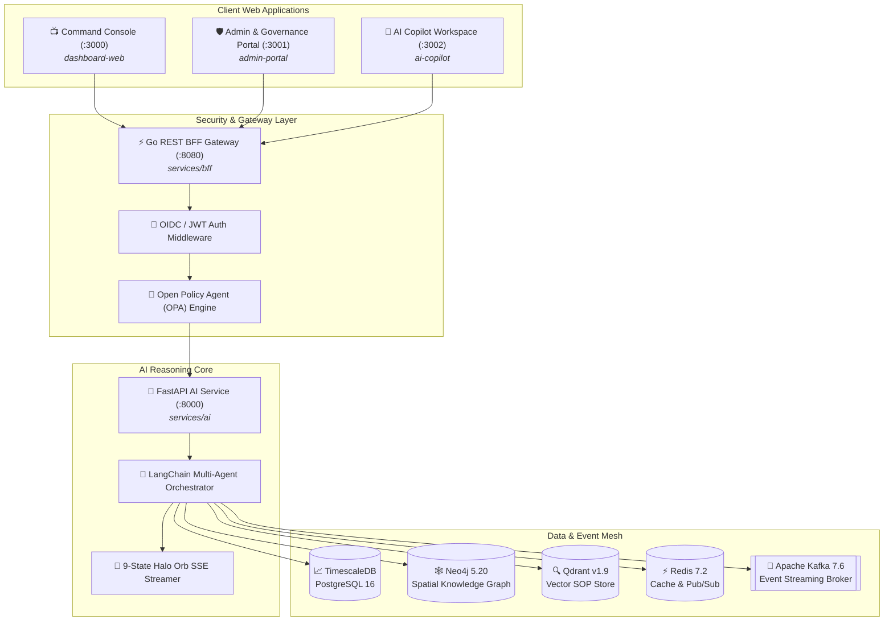

<div align="center">

```
┌───────────────────────────────────────────────────────────────────────────────────────────┐
│                                                                                           │
│     ███████╗ █████╗ ███████╗███████╗████████╗██╗   ██╗ ██████╗ ███████╗                   │
│     ██╔════╝██╔══██╗██╔════╝██╔════╝╚══██╔══╝╚██╗ ██╔╝██╔═══██╗██╔════╝                   │
│     ███████╗███████║█████╗  █████╗     ██║    ╚████╔╝ ██║   ██║███████╗                   │
│     ╚════██║██╔══██║██╔══╝  ██╔══╝     ██║     ╚██╔╝  ██║   ██║╚════██║                   │
│     ███████║██║  ██║██║     ███████╗   ██║      ██║   ╚██████╔╝███████║                   │
│     ╚══════╝╚═╝  ╚═╝╚═╝     ╚══════╝   ╚═╝      ╚═╝    ╚═════╝ ╚══════╝                   │
│                                                                                           │
│       ZERO-TRUST OPA  ·  MULTI-AGENT AI GRAPH RAG  ·  ISA-101 CONTROL ROOM DASHBOARD      │
└───────────────────────────────────────────────────────────────────────────────────────────┘
```

# SafetyOS (Codename: *Halo*)

### *Enterprise-Grade AI-Powered Industrial Safety Intelligence Platform*

[](https://turbo.build/)
[](https://pnpm.io/)
[](https://nextjs.org/)
[](https://react.dev/)
[](https://go.dev/)
[](https://python.org/)
[](https://www.timescale.com/)
[](https://neo4j.com/)
[](https://qdrant.tech/)
[](https://kafka.apache.org/)

[Executive Summary](#-executive-summary) • [Core Pillars](#-core-platform-pillars) • [Architecture](#-system-architecture) • [Directory Layout](#-monorepo-structure) • [Port Matrix](#-service--port-matrix) • [Quickstart](#-getting-started) • [Documentation Hub](#-documentation--specifications)

---

</div>

> [!IMPORTANT]
> **SafetyOS** unifies real-time Computer Vision surveillance streams, IoT telemetry, electronic Permit-to-Work (PTW) workflows, Lockout/Tagout (LOTO) energy isolation, and a multi-agent AI reasoning engine grounded in a **Neo4j Spatial Knowledge Graph** to guarantee **Zero-Harm Industrial Operations**.

---

## 🎯 Executive Summary

Industrial plants operate in high-hazard environments where uncoordinated maintenance, unverified equipment isolations, and desensitizing alarm floods cost lives and billions in unscheduled downtime. **SafetyOS** eliminates blind spots by replacing fragmented safety software with a zero-trust, edge-first intelligence matrix.

### Operational Benchmarks & Targets

| Benchmark Metric | Target Standard | Operational Value |
| :--- | :--- | :--- |
| **Incident Reduction** | **78% Decrease** | Prevents near-misses from escalating to reportable casualties. |
| **PTW Authorization Speed** | **6x Faster** | Cuts approval cycle time from 4.5 hours down to 45 minutes. |
| **Compound Risk Evaluation** | **< 50 ms Latency** | Evaluates edge CV feeds, telemetry & gas vectors in sub-frame time. |
| **Spatial Graph Traversal** | **< 4 ms Query Time** | Traces complex multi-hop LOTO equipment isolations in Neo4j. |
| **Control Room Compliance** | **ISA-101 / WCAG AAA** | Low-glare, high-contrast displays engineered for 24/7 operator readability. |

---

## 🛡️ Core Platform Pillars

```
                     ┌──────────────────────────────────────────────┐
                     │          SafetyOS Intelligence Matrix        │
                     └──────────────────────┬───────────────────────┘
                                            │
         ┌──────────────────┬───────────────┴───────────────┬──────────────────┐
         ▼                  ▼                               ▼                  ▼
┌─────────────────┐ ┌───────────────┐               ┌───────────────┐ ┌─────────────────┐
│ Zero-Trust PTW  │ │ Digital LOTO  │               │ Multi-Agent AI│ │ ISA-101 Console │
│ OPA Enforcement │ │ Graph Isolation│              │ Halo Orb Stream│ │ Dark Ergonomics │
└─────────────────┘ └───────────────┘               └───────────────┘ └─────────────────┘
```

1. ⚡ **Zero-Trust Permit-to-Work (PTW)**: Microsecond spatial conflict detection using Open Policy Agent (OPA) rules to prevent conflicting hot work, confined space entry, and high-voltage maintenance in overlapping work zones.
2. 🔒 **Digital Lockout/Tagout (LOTO)**: Knowledge Graph lineage tracing across physical valves, breakers, and piping to mandate zero-energy verification before site access is granted.
3. 👁️ **Edge Computer Vision & Telemetry**: Sub-50ms event detection for PPE non-compliance, hazardous gas excursions, and worker fall detection fed via high-throughput Apache Kafka pipelines.
4. 🤖 **Halo Multi-Agent AI Core**: Autonomous AI agents powered by FastAPI, Qdrant Vector RAG, and Neo4j Graph RAG. Provides real-time reasoning via a 9-state interactive **Halo Orb** Server-Sent Events (SSE) stream.
5. 📊 **ISA-101 Industrial Control Room Console**: Dark-mode, low-glare, grayscale-first UI built with React 19, Next.js 15, and TailwindCSS designed specifically for mission-critical industrial operators.
6. ⚡ **Multi-Database Data Mesh**: Hybrid persistence layer leveraging **TimescaleDB** (metrics & time-series), **Neo4j** (knowledge graph), **Qdrant** (vector SOP search), and **Redis** (caching & pub/sub).

---

## 🏗️ System Architecture



---

## 📂 Monorepo Structure

This repository is organized as a high-performance monorepo using **Turborepo** and **pnpm workspaces**:

```
SafetyOS/
├── 📁 apps/
│   ├── 📺 dashboard-web/        # Main Control Room Command Console (Next.js 15, React 19, Port 3000)
│   ├── 🛡️ admin-portal/          # Governance, User Roles & OPA Policy Admin (Next.js 15, Port 3001)
│   └── 🤖 ai-copilot/           # AI Copilot & Interactive Halo Orb Workspace (Next.js 15, Port 3002)
├── 📁 services/
│   ├── ⚡ bff/                   # Go (Gin) REST Gateway & BFF Service (Port 8080)
│   └── 🐍 ai/                    # Python 3.11 (FastAPI) Multi-Agent AI & RAG Engine (Port 8000)
├── 📁 packages/
│   ├── 🎨 design-tokens/        # Halo Design System Tokens (Colors, ISA-101 Grayscale, Statuses)
│   ├── 🧩 ui/                   # Shared React 19 UI Component Library (TailwindCSS, Framer Motion)
│   └── 📐 shared-types/         # TypeScript Domain Types (Digital Twins, PTW, Telemetry, LOTO)
├── 📁 kubernetes/               # Production Kubernetes Manifests (Deployments, HPAs, Ingress, RBAC, Data Stores)
├── 📁 documentations/            # Technical Architecture, API Specs, Database & Solution Reports
├── 📄 docker-compose.yml        # Local development infrastructure stack
├── 📄 turbo.json                # Turborepo Build Pipeline & Caching Config
├── 📄 package.json              # Monorepo Root Script Configuration
└── 📄 pnpm-workspace.yaml       # pnpm Monorepo Workspace Configuration
```

---

## 🔌 Service & Port Matrix

| Service / App | Type | Port | Technology | Purpose |
| :--- | :--- | :--- | :--- | :--- |
| **dashboard-web** | App | `:3000` | Next.js 15 / React 19 | Industrial Control Room Command Console |
| **admin-portal** | App | `:3001` | Next.js 15 / React 19 | System Governance, Audit & Role Management |
| **ai-copilot** | App | `:3002` | Next.js 15 / React 19 | AI Safety Assistant & Halo Orb Interface |
| **bff-gateway** | Service | `:8080` | Go 1.22 / Gin | API Gateway, Auth Validation, BFF Aggregation |
| **ai-service** | Service | `:8000` | Python 3.11 / FastAPI | Multi-Agent RAG Engine & SSE Telemetry Streamer |
| **TimescaleDB** | Database | `:5432` | PostgreSQL 16 + Timescale | Metrics, Telemetry & Time-Series Store |
| **Neo4j** | Database | `:7474` / `:7687` | Neo4j 5.20 Community | Equipment Dependency & Spatial Knowledge Graph |
| **Qdrant** | Database | `:6333` / `:6334` | Qdrant v1.9 Vector DB | Safety SOP Vector Search & RAG Embeddings |
| **Redis** | Cache | `:6379` | Redis 7.2 Alpine | Real-time Caching & Pub/Sub Message Broker |
| **Kafka** | Event Mesh | `:9092` | Confluent Kafka 7.6 | High-throughput telemetry & alert streaming |

---

## 🚀 Getting Started

### Prerequisites

Ensure you have the following installed on your machine:
- **Node.js**: `>= 20.0.0`
- **pnpm**: `>= 9.0.0` (`npm i -g pnpm`)
- **Docker & Docker Compose**: For local infrastructure databases
- **Kubectl & Kustomize**: *(Optional, for Kubernetes cluster deployment)*
- **Go**: `>= 1.22` *(for running `services/bff` natively)*
- **Python**: `>= 3.11` *(for running `services/ai` natively)*

---

### Step-by-Step Installation

#### 1. Clone Repository & Install Dependencies

```bash
git clone https://github.com/Shubham2786/SafetyOS.git
cd SafetyOS

# Install monorepo packages across all apps and services
pnpm install
```

#### 2. Spin Up Infrastructure Data Mesh

Start TimescaleDB, Neo4j, Qdrant, Redis, Kafka, and Zookeeper via Docker Compose:

```bash
docker compose up -d
```

Verify that all containers are healthy:
```bash
docker compose ps
```

#### 3. Run Development Stack

Launch all web applications (`dashboard-web`, `admin-portal`, `ai-copilot`) concurrently with Turborepo:

```bash
pnpm dev
```

#### 4. Run Backend Microservices (Optional Natively)

**Go Backend BFF Gateway (`services/bff`):**
```bash
cd services/bff
go run cmd/server/main.go
```

**Python AI Reasoning Core (`services/ai`):**
```bash
cd services/ai
python -m venv venv
# On Windows: venv\Scripts\activate | On Linux/macOS: source venv/bin/activate
pip install -r requirements.txt
uvicorn main:app --reload --port 8000
```

---

### ☸️ Deploying to Kubernetes

SafetyOS includes a production-ready Kubernetes setup under [`kubernetes/`](file:///c:/Users/HP/Downloads/COMPUTER/SafetyOS/kubernetes).

To deploy the entire platform (Namespace, RBAC, ConfigMaps, Secrets, Databases, Microservices, Web Apps, HPAs, and Ingress) to a Kubernetes cluster (EKS, GKE, AKS, or Minikube) with a single command:

```bash
# Apply all manifests using Kustomize
kubectl apply -k kubernetes/
```

To verify the status of deployed workloads:

```bash
# Check all pods, services, ingress and HPAs in the safetyos namespace
kubectl get all,hpa,ingress -n safetyos
```

---


## 🔒 Security & Compliance

- **Zero-Trust Access Control**: OPA Policy files enforce role-based and spatial-based access controls across all API routes.
- **ISA-101 Ergonomic Standard**: Designed to eliminate operator fatigue with low-contrast dark themes and high-visibility status indicators.
- **Data Privacy**: Telemetry streams are processed on-premise at the edge with zero external cloud dependencies for raw video feeds.

---

## 📜 License

Distributed under the **MIT License**. See `LICENSE` for more information.

---

<div align="center">

**SafetyOS** — *Engineering Zero-Harm Industrial Workplaces Through Intelligent Automation.*

</div>
