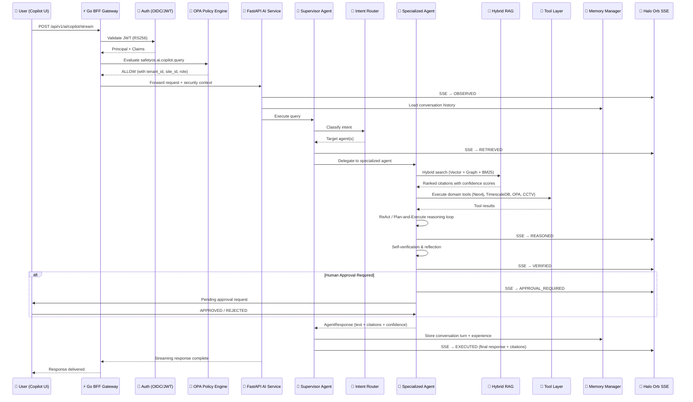
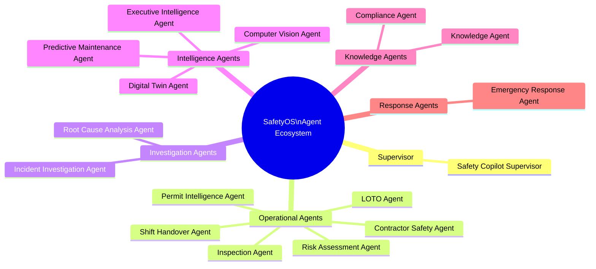
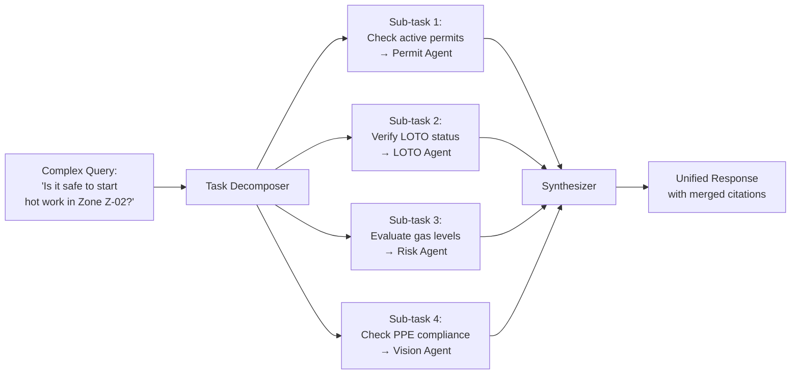
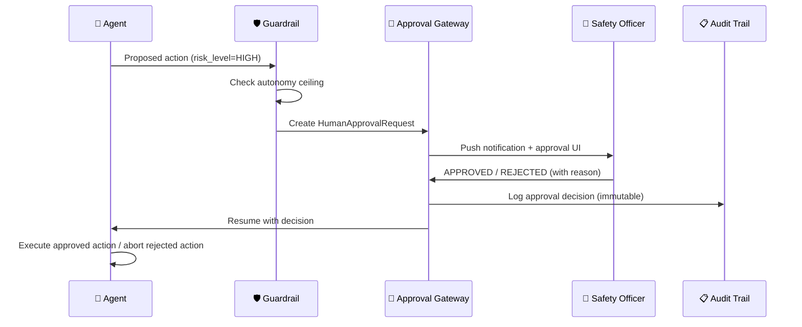
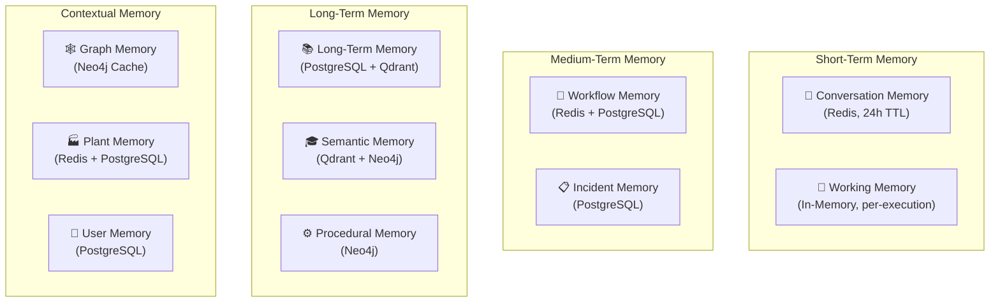
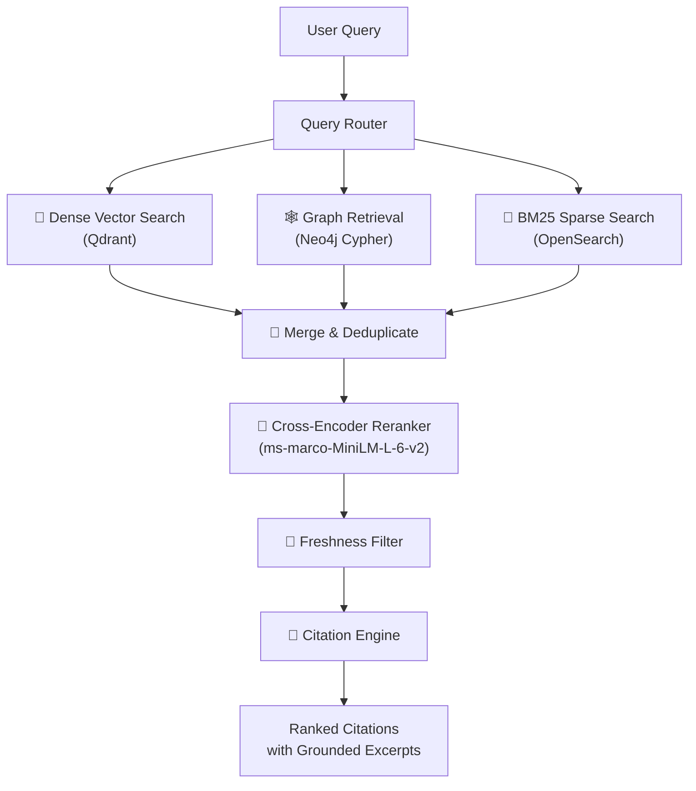
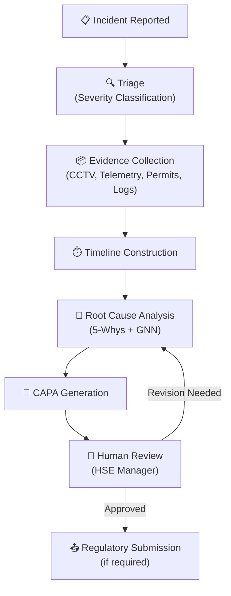
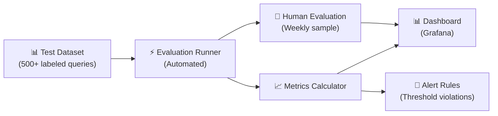

# AI Agent Specification — SafetyOS

**Document Version:** 1.0
**Status:** Canonical AI Agent Architecture — Single Source of Truth
**Baseline:** PRSD v1.0 + Master Feature Specifications v1.0 (466 features / 24 modules) + vNext Patch (Modules 25–27) + Backend Service Specification v1.0 + Database Specification v1.0 + API Specification v1.0 + Information Architecture v1.0 + Existing `services/ai` Implementation
**Owners:** Principal AI Research Engineer, Distinguished AI Systems Architect, Multi-Agent Systems Engineer, Staff AI Platform Engineer
**Classification:** Confidential — AI Engineering Blueprint
**Conflict Resolution Order:** This Document > Backend Service Specification > Master Feature Specification > PRSD
**Last Reviewed:** 2026-07-22

---

## Table of Contents

1. [Executive Overview](#1-executive-overview)
2. [AI Layer Architecture](#2-ai-layer-architecture)
3. [Agent Taxonomy](#3-agent-taxonomy)
4. [Agent Orchestration](#4-agent-orchestration)
5. [Memory Architecture](#5-memory-architecture)
6. [Knowledge Layer](#6-knowledge-layer)
7. [Tool Layer](#7-tool-layer)
8. [Reasoning Framework](#8-reasoning-framework)
9. [AI Workflows](#9-ai-workflows)
10. [Prompt Engineering](#10-prompt-engineering)
11. [Structured Outputs](#11-structured-outputs)
12. [AI APIs](#12-ai-apis)
13. [Evaluation Framework](#13-evaluation-framework)
14. [Safety Guardrails](#14-safety-guardrails)
15. [Security](#15-security)
16. [Observability](#16-observability)
17. [Repository Architecture](#17-repository-architecture)
18. [Development Roadmap](#18-development-roadmap)
19. [Future Evolution](#19-future-evolution)

---

## 1. Executive Overview

### 1.1 Purpose

This document is the **canonical, implementation-ready specification** for the SafetyOS AI Agent Layer — the multi-agent intelligence platform that sits above SCADA, DCS, CCTV, PTW, LOTO, EHS, HRIS, and regulatory corpora and below the human decision-makers who execute safety-critical actions.

The AI Agent Layer is **NOT a chatbot**. It is an enterprise **Multi-Agent Intelligence Platform** comprising 17 specialized agents, a supervisor orchestrator, a multi-tier memory system, a hybrid knowledge retrieval engine, and a tool layer that integrates with every data system in the SafetyOS ecosystem. Every AI output is grounded, cited, explainable, and subject to human-in-the-loop governance.

This specification is the **single source of truth** for every AI capability in the platform. All implementation, testing, deployment, and operational decisions derive from this document.

### 1.2 Business Value

| Business Objective | AI Contribution | Measurable Target |
|---|---|---|
| **Incident Reduction** | Compound-risk fusion across CV, OT, PTW, LOTO signals via multi-agent reasoning | 78% decrease in reportable incidents within 18 months |
| **PTW Authorization Speed** | Permit Intelligence Agent auto-drafts JSA, evaluates OPA spatial policies, pre-fills hazard classes | 6× faster approval cycle (4.5 hr → 45 min) |
| **Compound Risk Detection** | Multi-agent fusion evaluates edge CV, telemetry, gas vectors in sub-frame time | < 50 ms latency for risk evaluation |
| **LOTO Verification Speed** | LOTO Agent traces multi-hop energy isolation topology via Neo4j spatial graph | < 4 ms graph traversal query time |
| **Regulatory Compliance** | Compliance Agent audits workflows against ISO 45001, OSHA 1910, NFPA 70E; every recommendation cites regulation | 100% citation coverage on all AI recommendations |
| **Emergency Response Time** | Emergency Response Agent calculates dynamic evacuation routes via Digital Twin plume simulation | ≤ 90 seconds from trigger to full evacuation broadcast |
| **Predictive Maintenance** | Predictive Maintenance Agent calculates Remaining Useful Life from SCADA time-series telemetry | ≥ 20% RMSE reduction vs. baseline; 8-minute prediction lead time |
| **Knowledge Accessibility** | RAG Copilot with hybrid Vector + Graph retrieval surfaces SOP and regulatory evidence | Groundedness ≥ 95%; Faithfulness ≥ 92% |

### 1.3 Architecture Vision

SafetyOS AI is architected as a **layered multi-agent intelligence platform** with seven distinct tiers:

```
┌─────────────────────────────────────────────────────────────────────────────┐
│                          USER INTERFACE LAYER                              │
│  Command Console (ISA-101) │ AI Copilot Workspace │ Mobile App │ Admin     │
├─────────────────────────────────────────────────────────────────────────────┤
│                          AI COPILOT LAYER                                  │
│  Natural Language Interface │ Halo Orb SSE Stream │ Voice-First Mobile     │
├─────────────────────────────────────────────────────────────────────────────┤
│                      AGENT ORCHESTRATOR LAYER                              │
│  Supervisor Agent │ LangGraph StateGraph │ Temporal Workflow │ Router      │
├─────────────────────────────────────────────────────────────────────────────┤
│                      SPECIALIZED AGENT LAYER                               │
│  17 Domain Agents: Risk│Incident│Permit│LOTO│CV│Compliance│Maintenance│... │
├─────────────────────────────────────────────────────────────────────────────┤
│                          TOOL LAYER                                        │
│  Neo4j│Qdrant│TimescaleDB│Kafka│SCADA│OPA│CCTV│OCR│GIS│Digital Twin│...   │
├─────────────────────────────────────────────────────────────────────────────┤
│                        KNOWLEDGE LAYER                                     │
│  Hybrid RAG│Vector DB│Graph Retrieval│BM25│Cross-Encoder│Citation Engine   │
├─────────────────────────────────────────────────────────────────────────────┤
│                      ENTERPRISE SYSTEMS LAYER                              │
│  SCADA/DCS│PLC│Historian│CCTV│IoT│CMMS│ERP│Regulatory Corpus│SOPs         │
└─────────────────────────────────────────────────────────────────────────────┘
```

### 1.4 Enterprise Objectives

1. **Zero-Harm Intelligence**: Every AI recommendation moves toward zero worker injuries.
2. **Compound-Risk Detection**: Detect multi-modal risk patterns that no single sensor system can identify.
3. **Regulatory Compliance by Construction**: Every output cites regulatory evidence; EU AI Act "high-risk" transparency obligations satisfied by design.
4. **Operational Intelligence**: Transform raw OT/IT/CV signals into actionable safety intelligence at ISA-101 control room speed.
5. **Multi-Tenant Enterprise Scale**: Support multiple industrial plants with tenant-isolated AI pipelines, knowledge bases, and agent configurations.

### 1.5 AI Philosophy

#### 1.5.1 Human-in-the-Loop Philosophy

SafetyOS AI operates as a **Level-3 decision-support system** (SAE J3016 analogy). The AI **never actuates industrial equipment**. It **fuses, reasons, explains, and recommends**. Certified Safety Instrumented Systems (SIS) and licensed humans execute.

**Mandatory Human Approval Gates:**

| Action Category | Approval Required | Approver Role |
|---|---|---|
| Permit activation / suspension | Always | Safety Officer + Shift Supervisor |
| LOTO tag release / re-energization | Always | Safety Officer (physical verification) |
| Emergency evacuation siren activation | Always | Shift Manager |
| Incident classification upgrade (SIF) | Always | HSE Manager |
| Regulatory compliance finding submission | Always | Compliance Auditor |
| AI model deployment (canary / full) | Always | ML Engineering Lead |
| Break-glass emergency access | Always (dual approval) | Two Safety Officers |

**Autonomy Ceiling by Agent:**

| Autonomy Level | Description | Agents |
|---|---|---|
| `ENRICHMENT_ONLY` | May annotate, tag, classify — never create actionable outputs without downstream approval | Perception Agent, Telemetry Agent, Knowledge Agent |
| `RECOMMEND` | May generate recommendations, drafts, and advisories — never execute | Permit Agent, LOTO Agent, Risk Agent, Compliance Agent, Shift Handover Agent, Contractor Safety Agent, Inspection Agent |
| `ANALYZE` | May produce analysis, hypotheses, and reports — never prescribe without human review | Incident Investigation Agent, Root Cause Analysis Agent, Executive Intelligence Agent |
| `COORDINATE` | May orchestrate agent workflows and notification sequences — never actuate physical systems | Emergency Response Agent, Safety Copilot Supervisor |
| `PREDICT` | May generate forecasts and confidence intervals — never used for autonomous shutdown | Predictive Maintenance Agent, Digital Twin Agent |
| `FORBIDDEN` | Hard-wired denial in Governance Agent capability tokens | `actuate_equipment`, `override_sis`, `bypass_loto`, `suppress_alarm` |

#### 1.5.2 Explainable AI Philosophy

Every AI recommendation MUST return an `ExplanationBundle`:

```json
{
  "recommendation_id": "rec_01HXK...",
  "risk_score": 0.87,
  "confidence": 0.92,
  "evidence": [
    {"type": "CVEvent", "id": "cv_...", "confidence": 0.94, "snapshot_url": "..."},
    {"type": "Observation", "id": "obs_...", "tag": "LEL-4021", "value": 8.4, "unit": "%LEL"},
    {"type": "Permit", "id": "ptw_...", "clause": "hot_work_condition_4"}
  ],
  "reasoning_rule": "HOT_WORK_LEL_ADJACENT@v2.1",
  "regulatory_citations": [
    {"id": "OSHA_1910_252(a)(2)(iv)", "excerpt": "..."},
    {"id": "OISD_105_5.3.2", "excerpt": "..."}
  ],
  "sop_citations": [{"id": "SOP-HW-14", "version": "3.2", "excerpt": "..."}],
  "counterfactual": "If LEL had remained < 3%, recommendation would be MONITOR only.",
  "human_actions": ["SUSPEND_PERMIT", "EVAC_ZONE_B", "VERIFY_GAS_TEST"],
  "not_permitted_ai_actions": ["ACTUATE_VALVE", "OVERRIDE_SIS"]
}
```

**Five pillars of SafetyOS XAI:**

1. **Data Points**: What raw signals triggered the recommendation.
2. **Reasoning Rule**: Which compound-risk pattern or agent logic chain fired.
3. **Regulatory/SOP Evidence**: Verbatim citations with section references.
4. **Confidence**: Calibrated probability with uncertainty bounds.
5. **Counterfactual**: What would have been different under alternative conditions.

#### 1.5.3 Safety-First Reasoning

SafetyOS AI applies a **safety-first reasoning hierarchy** in all agent decisions:

1. **Life Safety** — Immediate threat to human life always overrides all other considerations.
2. **Environmental Safety** — Toxic release, fire, or environmental hazard.
3. **Equipment Safety** — Catastrophic equipment failure that could cascade to life/environmental harm.
4. **Regulatory Compliance** — Violations of mandatory safety regulations.
5. **Operational Efficiency** — Productivity and throughput considerations (lowest priority).

When reasoning conflicts arise between any two levels, the higher-priority level always wins. This hierarchy is encoded in every agent's system prompt and enforced by the Governance Agent.

---

## 2. AI Layer Architecture

### 2.1 Complete Architecture Diagram

```mermaid
flowchart TB
    subgraph USER["👤 User Interface Layer"]
        U1["📺 Command Console\n(ISA-101 HMI)\nPort :3000"]
        U2["🤖 AI Copilot Workspace\n(Halo Orb Interface)\nPort :3002"]
        U3["📱 Mobile App\n(Voice-First Field)"]
        U4["🛡️ Admin Portal\nPort :3001"]
        U5["📋 Auditor Portal"]
    end

    subgraph GW["🔐 Gateway & Auth Layer"]
        GW1["⚡ Go BFF Gateway\n(Gin REST :8080)"]
        GW2["🔑 OIDC / JWT Auth\n(Keycloak/Okta)"]
        GW3["📜 OPA Policy Engine\n(Zero-Trust)"]
    end

    subgraph COPILOT["🧠 AI Copilot Layer"]
        C1["💬 Natural Language\nInterface"]
        C2["🔮 9-State Halo Orb\nSSE Streamer"]
        C3["🎙️ Voice-First\nSTT/TTS Pipeline"]
    end

    subgraph ORCH["🎯 Agent Orchestrator Layer"]
        O1["👑 Supervisor Agent\n(Safety Copilot)"]
        O2["🔀 Intent Router\n(Semantic Classification)"]
        O3["📊 LangGraph\nStateGraph Engine"]
        O4["⏱️ Temporal\nWorkflow Engine"]
        O5["🔄 Reflection &\nVerification Node"]
    end

    subgraph AGENTS["🤖 Specialized Agent Layer (17 Agents)"]
        A1["⚠️ Risk Assessment"]
        A2["🔍 Incident Investigation"]
        A3["📋 Permit Intelligence"]
        A4["🔒 LOTO"]
        A5["👁️ Computer Vision"]
        A6["📜 Compliance"]
        A7["🔧 Predictive Maintenance"]
        A8["📚 Knowledge"]
        A9["🔄 Shift Handover"]
        A10["🚨 Emergency Response"]
        A11["📊 Executive Intelligence"]
        A12["👷 Contractor Safety"]
        A13["🔎 Inspection"]
        A14["🌳 Root Cause Analysis"]
        A15["🏭 Digital Twin"]
    end

    subgraph TOOLS["🔧 Tool Layer"]
        T1["🕸️ Neo4j Spatial\nGraph Tools"]
        T2["🔍 Qdrant Vector\nSearch"]
        T3["📈 TimescaleDB\nTelemetry"]
        T4["📜 OPA Policy\nEvaluator"]
        T5["📡 Kafka Event\nPublisher"]
        T6["📹 CCTV Vision\nAnalytics"]
        T7["🏭 SCADA/PLC\nConnectors"]
        T8["🌍 GIS/Digital Twin\nInterface"]
        T9["📝 OCR/Document\nProcessor"]
        T10["👤 Human Approval\nGateway"]
        T11["🔔 Notification\nDispatcher"]
        T12["⚙️ Workflow\nEngine Interface"]
    end

    subgraph KNOWLEDGE["📖 Knowledge Layer"]
        K1["🧬 Hybrid RAG\nRetriever"]
        K2["🔢 Dense Vector\nSearch (Qdrant)"]
        K3["🕸️ Graph Retrieval\n(Neo4j Cypher)"]
        K4["📄 BM25 Sparse\nSearch"]
        K5["🎯 Cross-Encoder\nReranker"]
        K6["📎 Citation\nEngine"]
    end

    subgraph MEMORY["💾 Memory Layer"]
        M1["💬 Conversation"]
        M2["🧠 Working"]
        M3["📚 Long-Term"]
        M4["🎓 Semantic"]
        M5["🕸️ Graph"]
        M6["🔄 Workflow"]
        M7["📋 Incident"]
        M8["🏭 Plant"]
        M9["👤 User"]
    end

    subgraph ENTERPRISE["🏢 Enterprise Systems"]
        E1["🏭 SCADA / DCS"]
        E2["⚡ PLC / RTU"]
        E3["📊 Historian\n(PI/Aspen/Ignition)"]
        E4["📹 CCTV DVR/NVR"]
        E5["📡 IoT Wearables\n(Gas/HR/Motion)"]
        E6["🔧 CMMS\n(SAP PM/Maximo)"]
        E7["📜 Regulatory Corpus"]
        E8["📋 SOP Repository"]
    end

    USER --> GW
    GW --> COPILOT
    COPILOT --> ORCH
    ORCH --> AGENTS
    AGENTS --> TOOLS
    AGENTS --> KNOWLEDGE
    AGENTS --> MEMORY
    TOOLS --> ENTERPRISE
    KNOWLEDGE --> ENTERPRISE
```



### 2.2 Layer Specifications

#### Layer 1: User Interface Layer

The user interface layer provides access surfaces for all SafetyOS personas. It consumes AI outputs via the Go BFF Gateway and renders them according to ISA-101 HMI standards.

| Surface | Technology | Port | Primary Persona | AI Integration |
|---|---|---|---|---|
| Command Console | Next.js 15 / React 19 | `:3000` | Anita (Control Room Operator) | Real-time Halo Orb stream, compound risk overlays, rationalized alarm list |
| AI Copilot Workspace | Next.js 15 / React 19 | `:3002` | All personas | Multi-turn chat, voice input, agent reasoning visualization, citation drill-down |
| Mobile App | React Native | — | Ravi (Field Operator) | Voice-first permit requests, push notifications, field inspection checklists |
| Admin Portal | Next.js 15 / React 19 | `:3001` | Arjun (IT/OT Engineer) | Agent configuration, knowledge base management, audit trail viewer |
| Auditor Portal | Next.js 15 / React 19 | — | Kavya (Compliance Auditor) | Immutable audit trail, compliance gap reports, evidence chain viewer |

#### Layer 2: AI Copilot Layer

The Copilot Layer is the user-facing intelligence interface. It converts natural language queries into structured agent invocations and streams reasoning traces via the 9-state Halo Orb SSE protocol.

**Halo Orb States (9-State Protocol):**

| State | Trigger | Halo Orb Visual | SSE Event Type |
|---|---|---|---|
| 1. `IDLE` | No active query | Ambient pulse (grayscale) | — |
| 2. `OBSERVED` | Query received, parsing intent | Blue pulse | `halo.observed` |
| 3. `RETRIEVED` | RAG retrieval in progress | Cyan sweep | `halo.retrieved` |
| 4. `REASONED` | Agent reasoning loop active | Purple orbit | `halo.reasoned` |
| 5. `VERIFIED` | Self-verification / reflection pass | Green check pulse | `halo.verified` |
| 6. `APPROVAL_REQUIRED` | Human-in-the-loop gate triggered | Amber pulse (attention) | `halo.approval_required` |
| 7. `ESCALATED` | Risk level exceeds agent autonomy ceiling | Red escalation glow | `halo.escalated` |
| 8. `EXECUTED` | Response delivered with citations | Green completion pulse | `halo.executed` |
| 9. `ERROR` | Agent failure, fallback triggered | Red error flash | `halo.error` |

#### Layer 3: Agent Orchestrator Layer

The orchestrator manages the lifecycle of all agent invocations using a LangGraph `StateGraph` for reasoning workflows and Temporal for durable long-running workflows. See [§4 Agent Orchestration](#4-agent-orchestration) for complete specification.

#### Layer 4: Specialized Agent Layer

17 domain-specialized agents, each with defined mission, responsibilities, tool access, knowledge sources, reasoning strategy, and escalation rules. See [§3 Agent Taxonomy](#3-agent-taxonomy) for complete specification.

#### Layer 5: Tool Layer

Typed function tools exposed to agents for interacting with enterprise systems. Every tool has defined input/output schemas, authorization scopes, rate limits, and circuit breakers. See [§7 Tool Layer](#7-tool-layer) for complete specification.

#### Layer 6: Knowledge Layer

The hybrid retrieval-augmented generation (RAG) engine combining dense vector search (Qdrant), sparse BM25 search, Neo4j graph traversal, cross-encoder reranking, and citation generation. See [§6 Knowledge Layer](#6-knowledge-layer) for complete specification.

#### Layer 7: Enterprise Systems Layer

External systems that the AI layer reads from (read-only into OT per PRSD §5). No SafetyOS write crosses the L3.5 IDMZ southbound.

### 2.3 Data Flow Sequence Diagram



### 2.4 Request Lifecycle

Every AI request follows this canonical lifecycle:

1. **Authentication** — JWT validation via OIDC (Keycloak/Okta), SPIFFE/SPIRE for service-to-service.
2. **Authorization** — OPA policy evaluation with ABAC attributes: `role`, `site_id`, `tenant_id`, `zone`, `shift`, `permit_scope`.
3. **Context Assembly** — Load tenant context, site context, user preferences, active permits, active LOTO tags, current shift.
4. **Memory Retrieval** — Load conversation history, relevant long-term experiences, active workflow states.
5. **Intent Classification** — Supervisor Agent classifies intent and selects target agent(s).
6. **Knowledge Retrieval** — Hybrid RAG engine retrieves grounded evidence from Vector DB, Knowledge Graph, and BM25 index.
7. **Agent Reasoning** — Specialized agent executes domain-specific reasoning with tool calls.
8. **Self-Verification** — Reflection node validates groundedness, citation correctness, and confidence calibration.
9. **Guardrail Enforcement** — Governance checks: no hallucinated regulations, no autonomous actuation, confidence above threshold.
10. **Human Approval** — If action requires human approval, request is generated and agent awaits response.
11. **Response Delivery** — Structured response with citations, confidence score, reasoning trace, and counterfactual.
12. **Memory Persistence** — Store conversation turn, update working memory, persist experiences for future retrieval.
13. **Observability** — Emit traces, metrics, and audit events to Prometheus/Loki/Kafka.

---

## 3. Agent Taxonomy

SafetyOS deploys **17 specialized agents** organized under a Supervisor Agent. Each agent is a self-contained reasoning unit with defined mission, responsibilities, tool access, and escalation rules.

### 3.0 Agent Registry Overview



| # | Agent ID | Agent Name | Reasoning Mode | Autonomy Level |
|---|---|---|---|---|
| 0 | `safety_copilot` | Safety Copilot Supervisor | Plan-and-Execute | COORDINATE |
| 1 | `risk_assessment_agent` | Risk Assessment Agent | ReAct | RECOMMEND |
| 2 | `incident_investigation_agent` | Incident Investigation Agent | Tree-of-Thought | ANALYZE |
| 3 | `permit_intelligence_agent` | Permit Intelligence Agent | ReAct | RECOMMEND |
| 4 | `loto_agent` | LOTO Agent | ReAct | RECOMMEND |
| 5 | `vision_intelligence_agent` | Computer Vision Agent | ReAct | ENRICHMENT_ONLY |
| 6 | `compliance_agent` | Compliance Agent | Self-Verification | RECOMMEND |
| 7 | `predictive_maintenance_agent` | Predictive Maintenance Agent | ReAct | PREDICT |
| 8 | `knowledge_agent` | Knowledge Agent | ReAct | ENRICHMENT_ONLY |
| 9 | `shift_handover_agent` | Shift Handover Agent | Plan-and-Execute | RECOMMEND |
| 10 | `emergency_response_agent` | Emergency Response Agent | Plan-and-Execute | COORDINATE |
| 11 | `executive_intelligence_agent` | Executive Intelligence Agent | Plan-and-Execute | ANALYZE |
| 12 | `contractor_safety_agent` | Contractor Safety Agent | ReAct | RECOMMEND |
| 13 | `inspection_agent` | Inspection Agent | Self-Verification | RECOMMEND |
| 14 | `root_cause_analysis_agent` | Root Cause Analysis Agent | Tree-of-Thought | ANALYZE |
| 15 | `digital_twin_agent` | Digital Twin Agent | Plan-and-Execute | PREDICT |

---

### 3.1 Safety Copilot Supervisor Agent

**Agent ID:** `safety_copilot`
**Implementation:** [`copilot_supervisor.py`](file:///c:/Users/HP/Downloads/COMPUTER/SafetyOS/services/ai/agents/copilot_supervisor.py)

#### Purpose
Top-level supervisory agent that orchestrates the entire multi-agent ecosystem. Routes user queries to specialized agents, synthesizes multi-agent outputs into unified safety guidance, and enforces human-in-the-loop guardrails across all agent interactions.

#### Mission
Orchestrate plant safety intelligence, synthesize specialized agent findings, and deliver zero-trust explainable safety guidance via the ISA-101 compliant Halo Orb interface.

#### Responsibilities
1. Supervise and route queries to 15+ specialized safety agents via semantic intent classification.
2. Decompose complex queries into sub-tasks across multiple agents (multi-agent collaboration).
3. Synthesize multi-agent outputs into unified ISA-101 control room guidance.
4. Enforce mandatory Human-In-The-Loop approval guardrails for all high-risk actions.
5. Stream reasoning steps to the frontend interactive Halo Orb via 9-state SSE protocol.
6. Manage shared context and conflict resolution when multiple agents disagree.
7. Maintain conversation continuity via multi-tier memory system.

#### Inputs
| Input | Source | Schema |
|---|---|---|
| Natural language query | User (via Copilot UI / Mobile / Voice) | `ChatQueryRequest` |
| Safety context | BFF Gateway | `SafetyContext` (tenant_id, site_id, zone_id, user_id, user_role, active_permits, active_loto_tags, current_shift_id) |
| Conversation history | Memory Manager | `List[ConversationTurn]` |
| Active alerts | Kafka event stream | `List[SafetyAlert]` |

#### Outputs
| Output | Target | Schema |
|---|---|---|
| Structured safety response | Copilot UI (via SSE) | `AgentResponse` |
| Reasoning trace | Halo Orb | `List[HaloStep]` |
| Human approval requests | Approval Gateway | `List[HumanApprovalRequest]` |
| Updated conversation memory | Memory Manager | `ConversationTurn` |
| Audit event | Kafka `safetyos.audit.events` | `AuditEvent` |

#### Knowledge Sources
- All knowledge sources available to subordinate agents (delegated access)
- Agent capability registry and routing rules
- Conversation memory and user preference profiles

#### Tool Access
| Tool | Permission | Purpose |
|---|---|---|
| `route_to_agent` | Execute | Delegate sub-tasks to specialized agents |
| `query_conversation_memory` | Read | Retrieve conversation history for context continuity |
| `synthesize_multi_agent` | Execute | Merge outputs from multiple agents |
| `trigger_human_approval` | Execute | Create human-in-the-loop approval requests |
| `stream_halo_event` | Execute | Emit SSE events to Halo Orb |

#### Memory
- **Conversation Memory**: Full chat history per session (Redis-backed, 24h TTL per session).
- **Working Memory**: Scratchpad for current reasoning chain (in-memory, per-execution).
- **User Memory**: User preferences, past interaction patterns, role-specific defaults.

#### Reasoning Strategy
**Primary:** Plan-and-Execute — Supervisor decomposes complex queries into a plan of sub-tasks, delegates each to the appropriate specialist agent, monitors execution, and synthesizes results.

**Fallback:** Direct delegation — For simple, single-domain queries, routes directly to the most relevant agent without planning overhead.

**Reflection:** After synthesizing multi-agent outputs, the Supervisor runs a reflection pass to check for contradictions, gaps in evidence, and confidence calibration across agents.

#### Confidence Score
- Computed as the **weighted harmonic mean** of subordinate agent confidence scores.
- Weights are based on agent domain relevance to the original query.
- Minimum threshold: `0.85` (below this, response includes uncertainty disclaimer).
- Human escalation threshold: `0.90` (below this for HIGH/CRITICAL risk, human approval required).

#### Escalation Rules
1. If any subordinate agent returns confidence < `0.70` → escalate to human with uncertainty flag.
2. If multiple agents disagree on risk classification → escalate to Safety Officer with conflict report.
3. If query involves CATASTROPHIC risk level → always require Shift Manager approval.
4. If agent execution exceeds 30 seconds → timeout and provide partial response with disclaimer.

#### Failure Handling
| Failure Mode | Recovery Strategy |
|---|---|
| Target agent timeout (>30s) | Circuit break, return partial response from completed agents, mark incomplete |
| Target agent error | Retry once with exponential backoff; if persistent, fallback to Knowledge Agent for general answer |
| All agents fail | Return cached response if available; otherwise, return "I cannot answer this safely" with escalation to human |
| Memory unavailable | Continue without history; flag response as "context-free" |
| RAG retrieval failure | Agents operate on tool outputs only; response marked "UNGROUNDED — requires human verification" |

#### Metrics
| Metric | Target | Alert Threshold |
|---|---|---|
| Query-to-response latency (p50) | < 3 seconds | > 5 seconds |
| Query-to-response latency (p99) | < 8 seconds | > 15 seconds |
| Agent routing accuracy | > 95% | < 90% |
| Multi-agent synthesis quality | Faithfulness > 92% | < 85% |
| Human escalation rate | < 15% of queries | > 25% |

#### Dependencies
- All 15 specialized agents (downstream)
- Memory Manager (read/write)
- Halo Orb SSE Streamer
- Intent Router

---

### 3.2 Risk Assessment Agent

**Agent ID:** `risk_assessment_agent`
**Implementation:** [`risk_assessment_agent.py`](file:///c:/Users/HP/Downloads/COMPUTER/SafetyOS/services/ai/agents/risk_assessment_agent.py)

#### Purpose
Evaluates compound environmental, thermal, gas, and mechanical risk vectors across overlapping work zones in sub-frame latency. Produces risk matrices compliant with ISO 45001 standards.

#### Mission
Evaluate spatial, environmental, and thermal risk vectors in sub-frame latency (< 50ms) and produce compound hazard indices for proactive safety intervention.

#### Responsibilities
1. Calculate compound hazard indices across overlapping work zones using multi-modal signal fusion.
2. Assess gas concentration excursion risks (LEL, H2S, CO) and thermal boundary violations.
3. Evaluate vibration anomalies and pressure excursions from SCADA telemetry.
4. Detect compound-risk patterns (e.g., Hot-Work-Near-Gas, LOTO-Bypass-During-Handover).
5. Recommend risk mitigations based on ISO 45001 risk assessment matrix standards.
6. Generate real-time risk heatmaps for spatial zones.

#### Inputs
| Input | Source | Schema |
|---|---|---|
| Telemetry time-series | TimescaleDB via tool | `TelemetryPayload` |
| Active permits in zone | PostgreSQL via tool | `List[PermitSummary]` |
| CV detection events | Kafka `cv.events.*` | `List[CVEvent]` |
| Zone hazard classifications | Neo4j Knowledge Graph | `List[HazardClassification]` |
| Weather/environmental data | IoT sensors | `EnvironmentalReading` |

#### Outputs
| Output | Schema | Target |
|---|---|---|
| Compound risk assessment | `RiskAssessmentOutput` | Supervisor Agent / Command Console |
| Risk score with confidence | `float (0.0–1.0)` | Halo Orb |
| Mitigation recommendations | `List[Mitigation]` | Permit Intelligence Agent / Safety Officer |
| Risk heatmap update | `ZoneRiskHeatmap` | Digital Twin / Command Console |

#### Knowledge Sources
- ISO 45001:2018 (Risk Assessment clauses 4.2, 6.1, 8.1.2)
- OSHA 1910 series (General Industry hazard standards)
- OISD-105/106/155 (India oil & gas safety)
- NFPA 70E (Electrical safety, arc flash boundaries)
- Plant-specific SOPs for hazard thresholds
- Historical incident and near-miss data (Neo4j graph)

#### Tool Access
| Tool | Permission | Purpose |
|---|---|---|
| `get_telemetry_time_series` | Read | Fetch SCADA sensor data (vibration, temperature, pressure, gas) |
| `query_spatial_knowledge_graph` | Read | Traverse zone-equipment-hazard topology |
| `get_active_permits_in_zone` | Read | Check for conflicting or compounding permits |
| `get_cctv_vision_events` | Read | Correlate CV detections with risk assessment |
| `calculate_compound_risk_score` | Execute | Run compound-risk pattern matching Cypher queries |

#### Memory
- **Working Memory**: Current risk assessment state, intermediate calculations.
- **Incident Memory**: Historical incidents and near-misses for pattern correlation.
- **Plant Memory**: Equipment baseline thresholds, zone hazard classifications.

#### Reasoning Strategy
**Primary:** ReAct — Observe telemetry and CV data, reason about compound risk patterns, act by querying additional data sources, and iterate until risk assessment is complete.

**Compound Risk Patterns (codified in Neo4j):**
```
HOT_WORK_LEL_ADJACENT        — Active hot work + rising LEL in adjacent zone
CONFINED_SPACE_SHIFT_CHANGE   — CS entry during shift handover window
LOTO_BYPASS_MAINTENANCE       — LOTO removed while maintenance order is open
FORKLIFT_PEDESTRIAN_AISLE     — Forklift + pedestrian in same aisle polygon
VIBRATION_PRESSURE_COMPOUND   — Simultaneous vibration spike + pressure excursion
```

#### Confidence Score
- Base confidence from telemetry signal quality (0.0–1.0).
- Boosted by corroborating signals from multiple sources (CV + telemetry + permits).
- Penalized by stale data (sensor readings > 5 minutes old: -10% penalty).
- Final score: `confidence = base × signal_quality × freshness_factor × corroboration_boost`.

#### Escalation Rules
1. Risk score ≥ 0.8 (HIGH) → Mandatory notification to Shift Supervisor.
2. Risk score ≥ 0.9 (CRITICAL) → Mandatory human approval before any permit-related action.
3. Risk score = 1.0 (CATASTROPHIC) → Immediate escalation to Emergency Response Agent.
4. Compound risk pattern detected → Always escalate to Permit Intelligence Agent for conflict check.

#### Failure Handling
| Failure | Recovery |
|---|---|
| Telemetry source unavailable | Use last-known values with staleness flag; reduce confidence by 30% |
| Knowledge Graph timeout | Fall back to cached zone hazard classifications |
| Compound risk query fails | Return individual risk scores without compound analysis; flag as partial |

#### Metrics
| Metric | Target | Alert |
|---|---|---|
| Risk evaluation latency | < 50 ms | > 200 ms |
| SIF-precursor recall | ≥ 99% | < 97% |
| False positive rate | ≤ 3 per shift | > 5 per shift |
| Compound risk detection accuracy | ≥ 95% | < 90% |

#### Dependencies
- TimescaleDB (telemetry source)
- Neo4j (spatial knowledge graph)
- Vision Intelligence Agent (CV event correlation)
- Permit Intelligence Agent (active permit state)

---

### 3.3 Incident Investigation Agent

**Agent ID:** `incident_investigation_agent`
**Implementation:** [`incident_investigation_agent.py`](file:///c:/Users/HP/Downloads/COMPUTER/SafetyOS/services/ai/agents/incident_investigation_agent.py)

#### Purpose
Conducts autonomous Root Cause Analysis (RCA), 5-Whys reasoning chains, Bowtie hazard escalation models, and historical near-miss pattern matching to accelerate incident investigation.

#### Mission
Conduct autonomous Root Cause Analysis (RCA) and cross-reference historical near-miss reports to identify systemic safety failures and prevent recurrence.

#### Responsibilities
1. Generate 5-Whys reasoning chains for reported safety events using iterative deepening.
2. Construct Bowtie hazard escalation models showing threats, barriers, and consequences.
3. Correlate current incidents with historical near-miss database records via graph pattern matching.
4. Build evidence timelines from multi-modal data (CCTV, telemetry, permits, logs).
5. Generate structured incident summary reports with regulatory citation requirements.
6. Propose Corrective and Preventive Actions (CAPA) based on investigation findings.

#### Inputs
| Input | Source | Schema |
|---|---|---|
| Incident report | Incident Management Service | `IncidentReport` |
| Evidence bundle (CCTV clips, sensor logs, permit records) | Evidence Store (S3/MinIO) | `EvidenceBundle` |
| Historical incidents and near-misses | Neo4j + PostgreSQL | `List[HistoricalIncident]` |
| Equipment maintenance history | CMMS integration | `List[MaintenanceOrder]` |
| Shift log entries | Shift Handover Service | `List[ShiftLogEntry]` |

#### Outputs
| Output | Schema | Target |
|---|---|---|
| 5-Whys analysis chain | `FiveWhysAnalysis` | Investigation Dashboard / HSE Manager |
| Bowtie diagram data | `BowtieDiagram` | Incident Console |
| Historical pattern correlation | `List[CorrelatedIncident]` | Investigation Dashboard |
| Evidence timeline | `EvidenceTimeline` | Incident Console / Auditor Portal |
| CAPA recommendations | `List[CAPARecommendation]` | HSE Manager for approval |
| Incident summary report | `IncidentSummaryOutput` | Regulatory submission (after human approval) |

#### Knowledge Sources
- Historical incident database (PostgreSQL + Neo4j)
- Near-miss reporting database
- Equipment maintenance logs (CMMS)
- SCADA/telemetry archives (TimescaleDB)
- CCTV evidence archives (S3/MinIO)
- Regulatory investigation frameworks (OSHA Incident Investigation Guide, ISO 45001 §10.2)

#### Tool Access
| Tool | Permission | Purpose |
|---|---|---|
| `query_spatial_knowledge_graph` | Read | Traverse incident-equipment-zone relationships |
| `get_telemetry_time_series` | Read | Retrieve sensor data around incident timestamp |
| `search_historical_incidents` | Read | Pattern-match against historical incident database |
| `get_cctv_vision_events` | Read | Retrieve CV evidence around incident timestamp |
| `get_maintenance_history` | Read | Check equipment maintenance records |
| `get_shift_logs` | Read | Retrieve shift handover notes around incident time |

#### Memory
- **Incident Memory**: All previous investigation findings, patterns, and CAPA outcomes.
- **Long-Term Memory**: Lessons learned from past investigations, systemic failure patterns.
- **Graph Memory**: Equipment failure topology, incident-near-miss correlation patterns.

#### Reasoning Strategy
**Primary:** Tree-of-Thought — Explores multiple root cause hypotheses in parallel, evaluates each branch against available evidence, prunes implausible paths, and converges on the most evidence-supported hypothesis.

**5-Whys Execution Pattern:**
1. Start with the observed event (symptom).
2. For each "Why?", generate 2–3 candidate explanations.
3. Evaluate each candidate against available evidence (telemetry, maintenance logs, CV events).
4. Select the most evidence-supported candidate and iterate.
5. Continue until a systemic root cause is identified (max depth: 7).
6. Cross-reference root cause against historical near-miss patterns.

#### Confidence Score
- Based on evidence coverage: how many data sources corroborate the root cause hypothesis.
- 4+ corroborating sources → confidence ≥ 0.90
- 2–3 corroborating sources → confidence 0.70–0.89
- 1 source only → confidence 0.50–0.69 (flagged as "preliminary hypothesis")
- 0 corroborating sources → confidence < 0.50 (flagged as "requires further investigation")

#### Escalation Rules
1. Investigation involves fatality → Immediate escalation to Legal/Regulatory team + HSE Director.
2. Root cause implicates systemic failure across multiple sites → Escalate to Executive Intelligence Agent.
3. Investigation requires access to restricted OT data → Request through IT/OT Engineer with audit trail.
4. Confidence < 0.70 after full evidence review → Flag as inconclusive, recommend external investigation.

#### Failure Handling
| Failure | Recovery |
|---|---|
| Evidence store unavailable | Proceed with available data; flag incomplete evidence in report |
| Historical database timeout | Use cached patterns from Incident Memory |
| Insufficient evidence for RCA | Return preliminary findings with explicit gaps documented |

#### Metrics
| Metric | Target | Alert |
|---|---|---|
| Time to preliminary RCA | < 2 hours | > 4 hours |
| Root cause identification accuracy | ≥ 85% (validated by human investigator) | < 75% |
| Historical pattern correlation precision | ≥ 80% | < 70% |
| CAPA recommendation acceptance rate | ≥ 75% | < 60% |

#### Dependencies
- Evidence Store (S3/MinIO)
- Neo4j Knowledge Graph
- TimescaleDB (telemetry archives)
- Root Cause Analysis Agent (for deep GNN-based analysis)

---

### 3.4 Permit Intelligence Agent

**Agent ID:** `permit_intelligence_agent`
**Implementation:** [`permit_intelligence_agent.py`](file:///c:/Users/HP/Downloads/COMPUTER/SafetyOS/services/ai/agents/permit_intelligence_agent.py)

#### Purpose
Validates digital Permit-to-Work (PTW) authorization rules, detects spatial zone conflicts, evaluates OPA policies, and auto-drafts Job Safety Analyses (JSA) grounded in SOPs and regulations.

#### Mission
Verify Permit-to-Work (PTW) authorization rules, OPA spatial policies, and prerequisite safety checks to enable 6× faster permit processing while maintaining zero-trust safety standards.

#### Responsibilities
1. Evaluate zero-trust OPA policy constraints for hot work, confined space entry, excavation, and electrical isolation permits.
2. Detect conflicting spatial permits operating in identical or adjacent zones via Neo4j graph queries.
3. Auto-draft Job Safety Analysis (JSA) based on work type, zone hazard classification, and applicable SOPs.
4. Cross-reference worker certifications and training records against permit requirements.
5. Validate prerequisite conditions (gas tests, LOTO completion, PPE requirements) before permit activation.
6. Require human-in-the-loop authorization prior to permit status transitions.

#### Inputs
| Input | Source | Schema |
|---|---|---|
| Permit request | PTW Service / Mobile App | `PermitRequest` |
| Zone hazard classifications | Neo4j Knowledge Graph | `List[HazardClassification]` |
| Active permits in zone | PostgreSQL | `List[ActivePermit]` |
| Worker certifications | HRIS / Knowledge Graph | `List[WorkerCertification]` |
| Current environmental conditions | IoT sensors / TimescaleDB | `EnvironmentalReading` |
| LOTO status for equipment | LOTO Service | `List[LOTOStatus]` |

#### Outputs
| Output | Schema | Target |
|---|---|---|
| Permit validation result | `PermitAnalysisOutput` | PTW Workflow / Safety Officer |
| Spatial conflict report | `List[SpatialConflict]` | Command Console |
| Auto-drafted JSA | `JSADraft` | Mobile App (for worker review) |
| Human approval request | `HumanApprovalRequest` | Safety Officer + Shift Supervisor |
| OPA policy evaluation report | `OPAPolicyResult` | Audit Trail |

#### Knowledge Sources
- OPA policy bundles (PTW rules, spatial conflict detection, certification requirements)
- ISO 45001 (Management of Change, risk assessment for work activities)
- OSHA 1910.146 (Confined Space), 1910.252 (Hot Work), 1910.147 (LOTO)
- OISD-105 (Work Permit System), OISD-106 (Confined Space Entry)
- Plant-specific SOPs (Hot Work, Confined Space, Excavation, Electrical Isolation)
- Zone geometry and hazard area classifications

#### Tool Access
| Tool | Permission | Purpose |
|---|---|---|
| `evaluate_opa_permit_policy` | Execute | Run zero-trust policy checks |
| `query_spatial_knowledge_graph` | Read | Check spatial conflicts between permits |
| `get_worker_certifications` | Read | Validate worker qualifications |
| `get_active_permits_in_zone` | Read | Retrieve all active permits in zone |
| `get_loto_status` | Read | Verify LOTO prerequisite completion |
| `get_environmental_readings` | Read | Check gas test results and environmental conditions |
| `trigger_human_in_the_loop_approval` | Execute | Create permit approval request |

#### Memory
- **Workflow Memory**: Active permit lifecycle states.
- **Plant Memory**: Zone-specific permit history, common conflict patterns.
- **Semantic Memory**: Regulatory requirements for each permit type.

#### Reasoning Strategy
**Primary:** ReAct — Observe permit request context, reason about applicable policies and conflicts, act by querying spatial graph and OPA engine, iterate until all prerequisite conditions are validated.

#### Confidence Score
- OPA policy evaluation is deterministic (1.0 when all policies pass).
- Spatial conflict detection confidence based on graph traversal completeness.
- JSA auto-draft confidence based on SOP coverage and hazard class matching.
- Overall: `min(opa_score, spatial_score, prerequisite_score)`.

#### Escalation Rules
1. Spatial conflict detected → Always require dual human sign-off (Safety Officer + Supervisor).
2. Worker certification expired or missing → Block permit; escalate to HR/Training.
3. Gas test results above threshold → Block permit; escalate to Risk Assessment Agent.
4. Any permit activation → Always requires human approval (NEVER autonomous activation).

#### Failure Handling
| Failure | Recovery |
|---|---|
| OPA engine unavailable | Fail-safe: deny permit with "policy engine unavailable" message |
| Neo4j timeout | Use cached spatial data; flag as "unverified spatial check" |
| Worker certification service down | Fail-safe: require manual certification verification |

#### Metrics
| Metric | Target | Alert |
|---|---|---|
| Permit validation latency | < 5 seconds | > 10 seconds |
| Spatial conflict detection recall | 100% (zero misses) | Any miss |
| JSA auto-draft accuracy | ≥ 90% acceptance rate | < 80% |
| Permit processing time reduction | 6× faster than manual | < 3× |

#### Dependencies
- OPA Policy Engine
- Neo4j Knowledge Graph
- LOTO Agent (prerequisite verification)
- Risk Assessment Agent (environmental conditions)

---

### 3.5 LOTO Agent

**Agent ID:** `loto_agent`
**Implementation:** [`loto_agent.py`](file:///c:/Users/HP/Downloads/COMPUTER/SafetyOS/services/ai/agents/loto_agent.py)

#### Purpose
Traces physical energy isolation topology on the Neo4j Spatial Knowledge Graph to verify zero-energy states, generate sequential LOTO step recommendations, and detect tampering or bypass attempts.

#### Mission
Verify physical energy isolation topology on spatial Neo4j Knowledge Graph to guarantee Zero-Energy state compliance with OSHA 1910.147 and plant-specific LOTO procedures.

#### Responsibilities
1. Trace multi-hop energy flow lineage across valves, breakers, piping, and isolation points.
2. Verify zero-energy status before allowing mechanical isolation permits.
3. Generate exact sequential LOTO step recommendations based on equipment topology.
4. Detect potential LOTO tampering or bypass conditions via continuous monitoring.
5. Validate that all isolation points are physically locked and tagged before work authorization.
6. Generate LOTO verification checklists for safety officers.

#### Inputs
| Input | Source | Schema |
|---|---|---|
| LOTO request or verification query | LOTO Service / Mobile App | `LOTORequest` |
| Equipment isolation topology | Neo4j Knowledge Graph | Graph traversal result |
| Current equipment status | SCADA / IoT sensors | `List[EquipmentStatus]` |
| Active LOTO tags | LOTO Service (PostgreSQL) | `List[LOTOTag]` |
| Worker assigned to LOTO | HRIS | `WorkerProfile` |

#### Outputs
| Output | Schema | Target |
|---|---|---|
| Isolation verification result | `LOTOVerificationResult` | LOTO Workflow / Safety Officer |
| Sequential LOTO steps | `List[LOTOStep]` | Mobile App (field worker) |
| Tampering alert | `TamperingAlert` | Command Console / Safety Officer |
| Human approval request (re-energization) | `HumanApprovalRequest` | Safety Officer (physical verification) |
| Zero-energy verification certificate | `ZeroEnergyCertificate` | Audit Trail |

#### Knowledge Sources
- OSHA 1910.147 (Control of Hazardous Energy)
- NFPA 70E (Electrical Safety — Arc Flash Boundary, Live Work Prohibition)
- Plant-specific LOTO procedures and isolation point inventories
- Equipment topology graph (Neo4j)
- Historical LOTO incidents and near-misses

#### Tool Access
| Tool | Permission | Purpose |
|---|---|---|
| `query_spatial_knowledge_graph` | Read | Traverse equipment isolation topology |
| `get_equipment_status` | Read | Verify current energy state of isolation points |
| `get_active_loto_tags` | Read | Check which tags are currently applied |
| `validate_zero_energy_state` | Read | Cross-validate against SCADA readings |
| `trigger_human_in_the_loop_approval` | Execute | Create approval request for re-energization |

#### Memory
- **Workflow Memory**: Active LOTO procedure states.
- **Graph Memory**: Equipment topology cache for frequently queried isolation paths.
- **Incident Memory**: Historical LOTO-related incidents and failures.

#### Reasoning Strategy
**Primary:** ReAct — Observe LOTO request, reason about required isolation paths via graph traversal, act by querying equipment status, iterate until zero-energy state is confirmed or violation detected.

**Critical Cypher Pattern:**
```cypher
MATCH (target:Equipment {id: $equipment_id})
MATCH path = (isolation_point)-[:ISOLATES*1..5]->(target)
WHERE ALL(n IN nodes(path) WHERE n.status IN ['LOCKED', 'TAGGED', 'CLOSED', 'OPEN_ISOLATED'])
RETURN path, [n IN nodes(path) | {id: n.id, type: labels(n)[0], status: n.status}] AS steps
```

#### Confidence Score
- 1.0 if all isolation points are confirmed locked/tagged AND SCADA readings confirm zero-energy.
- 0.9 if isolation points are confirmed but SCADA readings are stale (> 5 min).
- < 0.8 if any isolation point status is unknown → triggers mandatory physical verification.
- 0.0 if any isolation point is in ENERGIZED state → hard block.

#### Escalation Rules
1. **LOTO tag release / re-energization** → ALWAYS requires human Safety Officer physical verification.
2. Any isolation point in unknown state → Escalate to field verification before proceeding.
3. Potential tampering detected (tag removed without authorization) → Immediate alert to Safety Officer + Shift Manager.
4. Group LOTO (multiple workers) → Require each worker to individually verify before re-energization.

#### Failure Handling
| Failure | Recovery |
|---|---|
| Neo4j unavailable | Fail-safe: block all LOTO transitions; alert IT/OT team |
| SCADA readings unavailable | Require manual zero-energy verification; reduce confidence to 0.5 |
| Isolation topology incomplete | Flag as "partial topology" and require human review of isolation plan |

#### Metrics
| Metric | Target | Alert |
|---|---|---|
| Graph traversal latency | < 4 ms | > 20 ms |
| Zero-energy verification accuracy | 100% | Any miss |
| Tampering detection recall | ≥ 99% | < 95% |
| LOTO step generation accuracy | ≥ 98% | < 95% |

#### Dependencies
- Neo4j Knowledge Graph (equipment topology)
- SCADA/PLC connectors (real-time energy state)
- Permit Intelligence Agent (LOTO is prerequisite for permits)

---

### 3.6 Computer Vision Agent

**Agent ID:** `vision_intelligence_agent`
**Implementation:** [`vision_intelligence_agent.py`](file:///c:/Users/HP/Downloads/COMPUTER/SafetyOS/services/ai/agents/vision_intelligence_agent.py)

#### Purpose
Processes high-throughput Computer Vision edge detection feeds to analyze PPE compliance, fall events, zone breaches, fire/smoke detection, and vehicle-pedestrian proximity events.

#### Mission
Process high-throughput Computer Vision streams to detect PPE compliance violations, fall events, zone breaches, fire/smoke, and generate contextualized safety alerts with sub-50ms edge latency.

#### Responsibilities
1. Analyze sub-50ms CCTV detection events from Kafka edge broker (`cv.events.*` topics).
2. Correlate visual breaches with active permits in work zones (PPE requirement context).
3. Detect compound visual events (e.g., person in forklift lane, confined space entry without permit).
4. Recommend spatial exclusion alerts when workers lack required PPE for zone hazard class.
5. Process and contextualize edge CV model outputs (YOLOv8, RT-DETR, X3D) for downstream agents.
6. Manage CV evidence chain for incident investigation (frame snapshots, bounding boxes, confidence scores).

#### Inputs
| Input | Source | Schema |
|---|---|---|
| CV detection events | Kafka `cv.events.*` | `CVEvent` (class, bbox, confidence, camera_id, timestamp) |
| Zone geometry and hazard classifications | Neo4j Knowledge Graph | `ZoneGeometry` |
| Active permits in zone | PTW Service | `List[ActivePermit]` |
| Camera feed metadata | Camera registry | `CameraMetadata` |

#### Outputs
| Output | Schema | Target |
|---|---|---|
| Contextualized CV alert | `CVAlertOutput` | Command Console / Mobile push |
| PPE violation report | `PPEViolationReport` | Safety Officer |
| Evidence frame for investigation | `EvidenceFrame` | Evidence Store (S3) |
| Zone occupancy update | `ZoneOccupancy` | Digital Twin Agent |

#### Knowledge Sources
- PPE requirements per zone hazard classification
- Active permit requirements (face shield for hot work, harness for height work)
- OSHA 1926 (Construction PPE), 1910 (General Industry PPE)
- Camera-to-zone mapping and homography matrices
- Edge CV model specifications (detection classes, confidence thresholds)

#### Tool Access
| Tool | Permission | Purpose |
|---|---|---|
| `get_cctv_vision_events` | Read | Query edge CV detection events |
| `query_spatial_knowledge_graph` | Read | Resolve zone context for detections |
| `get_active_permits_in_zone` | Read | Cross-reference PPE requirements with active permits |
| `store_evidence_frame` | Write | Archive violation frames to evidence store |

#### Memory
- **Working Memory**: Active detection tracking (ByteTrack state per zone).
- **Plant Memory**: Camera layouts, zone PPE requirements, detection thresholds.

#### Reasoning Strategy
**Primary:** ReAct — Observe CV events, reason about context (zone, permits, PPE requirements), act by querying additional context, and produce contextualized alerts.

#### Confidence Score
- Inherits from edge CV model confidence (per detection class).
- Boosted by temporal persistence (detection sustained > 3 frames: +5%).
- Reduced by occlusion or low resolution.
- PPE violation confirmation threshold: ≥ 0.90.

#### Escalation Rules
1. PPE violation in active permit zone → Alert to Shift Supervisor.
2. Fall detection (slip/trip/fall) → Immediate page to first responders + auto-open incident draft.
3. Fire/smoke detection → Cross-validate with thermal sensors; if confirmed, escalate to Emergency Response Agent.
4. Restricted zone breach by unauthorized person → Alert to Security + Safety Officer.

#### Failure Handling
| Failure | Recovery |
|---|---|
| Camera feed offline | Log camera outage; alert IT; continue with remaining cameras |
| Edge node unavailable | Buffer events locally; resume processing on recovery |
| Zone geometry not found | Log detection without zone context; flag for manual review |

#### Metrics
| Metric | Target | Alert |
|---|---|---|
| PPE recall @ IoU 0.5 | ≥ 99.2% | < 98% |
| PPE precision | ≥ 92% | < 88% |
| Time-to-alert (edge to console) | < 500 ms | > 1 second |
| False positive rate per camera per day | ≤ 2 | > 5 |

#### Dependencies
- Edge CV infrastructure (Jetson Orin, DeepStream, TensorRT)
- Kafka event streams (`cv.events.*`)
- Neo4j (zone geometry)
- Permit Intelligence Agent (active permits for context)

---

### 3.7 Compliance Agent

**Agent ID:** `compliance_agent`
**Implementation:** [`compliance_agent.py`](file:///c:/Users/HP/Downloads/COMPUTER/SafetyOS/services/ai/agents/compliance_agent.py)

#### Purpose
Audits site safety workflows against international regulatory frameworks and internal SOP standards, generating audit-ready compliance reports with gap analysis.

#### Mission
Audit site safety workflows against international regulatory frameworks (ISO 45001, OSHA 1910, NFPA 70E, OISD, DGMS) and internal SOP standards to maintain continuous compliance readiness.

#### Responsibilities
1. Cross-reference permit workflows with ISO 45001 and OSHA 1910 standards.
2. Verify NFPA 70E electrical safety compliance for all electrical work permits.
3. Validate LOTO procedures against OSHA 1910.147 requirements.
4. Generate audit-ready regulatory compliance summaries with gap analysis.
5. Monitor compliance status continuously (not just during audits).
6. Track regulatory changes and assess impact on existing procedures.

#### Inputs
| Input | Source | Schema |
|---|---|---|
| Audit scope and criteria | Compliance Service / Auditor | `AuditRequest` |
| Permit and LOTO records | PostgreSQL | `List[PermitRecord]`, `List[LOTORecord]` |
| Training and certification records | HRIS | `List[TrainingRecord]` |
| Incident and near-miss reports | Incident Service | `List[IncidentReport]` |
| SOP version history | Document Store | `List[SOPVersion]` |

#### Outputs
| Output | Schema | Target |
|---|---|---|
| Compliance report | `ComplianceReportOutput` | Auditor Portal / HSE Manager |
| Gap analysis | `List[ComplianceGap]` | Compliance Dashboard |
| Corrective action recommendations | `List[CorrectiveAction]` | HSE Manager for approval |
| Regulatory change impact assessment | `RegulatoryImpactAssessment` | Compliance Team |

#### Knowledge Sources
- ISO 45001:2018 (complete text, all clauses)
- OSHA 1910 / 1926 series
- NFPA 70E (current edition)
- OISD-105, 106, 155, 169
- DGMS Circulars
- EU AI Act (for AI system compliance)
- Plant-specific SOPs and Management of Change records

#### Tool Access
| Tool | Permission | Purpose |
|---|---|---|
| `search_regulatory_corpus` | Read | Full-text search across regulatory documents |
| `query_spatial_knowledge_graph` | Read | Verify equipment and procedure compliance topology |
| `get_permit_audit_trail` | Read | Retrieve complete permit lifecycle audit trail |
| `get_training_records` | Read | Verify worker training compliance |
| `compare_sop_versions` | Read | Detect SOP changes and assess compliance impact |

#### Memory
- **Semantic Memory**: Regulatory framework mappings (regulation → requirement → evidence needed).
- **Long-Term Memory**: Past audit findings and corrective action outcomes.

#### Reasoning Strategy
**Primary:** Self-Verification — Agent generates compliance assessment, then systematically self-verifies each finding against regulatory text citations, checking for completeness and accuracy before producing final report.

#### Confidence Score
- 1.0 when regulatory text explicitly addresses the assessed condition.
- 0.8–0.9 when regulatory interpretation is required (gray areas flagged).
- < 0.7 for novel situations not addressed by existing regulations → flagged for expert review.

#### Escalation Rules
1. Critical compliance gap discovered → Immediate notification to HSE Manager.
2. Regulatory change impacts existing permits → Alert to Permit Intelligence Agent.
3. Compliance finding requires external auditor review → Route to Auditor Portal.

#### Failure Handling
| Failure | Recovery |
|---|---|
| Regulatory corpus not up-to-date | Flag assessment as "based on regulation version X.X" with staleness warning |
| Audit trail incomplete | Document gaps explicitly in compliance report |

#### Metrics
| Metric | Target | Alert |
|---|---|---|
| Compliance gap detection recall | ≥ 95% | < 90% |
| Audit report generation time | < 30 minutes | > 1 hour |
| Regulatory citation accuracy | ≥ 98% | < 95% |
| False compliance finding rate | ≤ 5% | > 10% |

#### Dependencies
- Regulatory corpus (Vector DB + document store)
- All workflow services (PTW, LOTO, Incident, Shift Handover)
- Knowledge Agent (document freshness verification)

---

### 3.8 Predictive Maintenance Agent

**Agent ID:** `predictive_maintenance_agent`
**Implementation:** [`predictive_maintenance_agent.py`](file:///c:/Users/HP/Downloads/COMPUTER/SafetyOS/services/ai/agents/predictive_maintenance_agent.py)

#### Purpose
Predicts equipment failure modes using SCADA time-series telemetry, FMEA analytics, and vibration spectrum analysis to enable proactive maintenance before catastrophic mechanical failure.

#### Mission
Predict equipment failure modes using SCADA time-series telemetry and FMEA analytics to calculate Remaining Useful Life (RUL) and recommend proactive maintenance interventions.

#### Responsibilities
1. Analyze vibration spectra, thermal drift, and pressure anomalies from TimescaleDB.
2. Calculate Remaining Useful Life (RUL) for high-criticality plant assets using N-BEATS / TFT models.
3. Perform Failure Mode and Effects Analysis (FMEA) diagnostics based on sensor pattern recognition.
4. Recommend proactive maintenance windows prior to catastrophic mechanical failure.
5. Correlate maintenance predictions with active permits and LOTO requirements.
6. Generate maintenance work order drafts for CMMS integration.

#### Inputs
| Input | Source | Schema |
|---|---|---|
| Equipment telemetry (vibration, temperature, pressure) | TimescaleDB | `TelemetryTimeSeries` |
| Equipment asset registry | CMMS / Knowledge Graph | `EquipmentProfile` |
| Maintenance order history | CMMS (SAP PM / Maximo) | `List[MaintenanceOrder]` |
| Manufacturer failure mode data | Equipment manuals (vectorized) | `FMEAData` |

#### Outputs
| Output | Schema | Target |
|---|---|---|
| RUL prediction | `RULPrediction` (hours, confidence interval) | Maintenance Dashboard / CMMS |
| FMEA diagnosis | `FMEADiagnosis` | Maintenance Engineer |
| Maintenance recommendation | `MaintenanceRecommendation` | CMMS work order draft |
| Asset health scorecard | `AssetHealthScore` | Executive Intelligence Agent |

#### Knowledge Sources
- Equipment manufacturer manuals and FMEA databases
- Historical maintenance records and failure patterns
- Vibration analysis standards (ISO 10816 / ISO 20816)
- Bearing failure signatures (BPFO, BPFI, BSF, FTF)
- Plant-specific maintenance SOPs

#### Tool Access
| Tool | Permission | Purpose |
|---|---|---|
| `get_telemetry_time_series` | Read | Fetch SCADA sensor data (vibration, temperature, pressure) |
| `query_spatial_knowledge_graph` | Read | Equipment topology and dependency chains |
| `get_maintenance_history` | Read | Historical maintenance records |
| `run_rul_prediction_model` | Execute | Invoke N-BEATS / TFT model via Triton |
| `create_maintenance_draft` | Write | Draft CMMS work order (pending human approval) |

#### Memory
- **Plant Memory**: Equipment baseline signatures, degradation trends.
- **Long-Term Memory**: Historical failure patterns and RUL prediction accuracy.
- **Semantic Memory**: FMEA failure mode taxonomies.

#### Reasoning Strategy
**Primary:** ReAct — Observe telemetry data, reason about failure modes using FMEA knowledge, act by running predictive models, iterate with additional sensor data if needed.

#### Confidence Score
- Based on model prediction confidence interval.
- Boosted by corroborating signals (multiple sensors showing consistent degradation pattern).
- Penalized by sensor drift or calibration issues.

#### Escalation Rules
1. RUL < 48 hours for critical equipment → Immediate alert to Maintenance Manager + Shift Supervisor.
2. RUL < 24 hours → Escalate to Emergency Maintenance protocol.
3. Prediction affects equipment under active LOTO → Alert LOTO Agent.
4. **Never used for autonomous shutdown** — always recommend, never actuate.

#### Failure Handling
| Failure | Recovery |
|---|---|
| Telemetry source offline | Use last available data with staleness flag; increase monitoring frequency on recovery |
| RUL model unavailable | Fall back to threshold-based alerts (simpler but less predictive) |
| CMMS integration down | Queue work order draft; retry on recovery |

#### Metrics
| Metric | Target | Alert |
|---|---|---|
| RUL RMSE reduction vs. baseline | ≥ 20% | < 10% |
| False alarm rate | ≤ 5% | > 10% |
| Prediction lead time | ≥ 8 minutes before failure | < 5 minutes |
| Maintenance recommendation acceptance | ≥ 80% | < 65% |

#### Dependencies
- TimescaleDB (telemetry source)
- Triton Inference Server (ML model serving)
- CMMS integration (SAP PM / Maximo)
- Neo4j (equipment topology)

---

### 3.9 Knowledge Agent

**Agent ID:** `knowledge_agent`
**Implementation:** [`knowledge_agent.py`](file:///c:/Users/HP/Downloads/COMPUTER/SafetyOS/services/ai/agents/knowledge_agent.py)

#### Purpose
Manages the RAG knowledge pipeline including document indexing, vector embeddings, knowledge graph entity extraction, and document freshness auditing.

#### Mission
Manage RAG vector embeddings, knowledge graph entity extraction, and document freshness checks to maintain a continuously current, accurate, and comprehensive safety knowledge base.

#### Responsibilities
1. Chunk, embed, and index new SOP PDFs and regulatory releases into Qdrant vector store.
2. Extract spatial entity-relationship triads for Neo4j Knowledge Graph population.
3. Audit stored document freshness and invalidate deprecated safety standards.
4. Answer knowledge queries using hybrid RAG (Vector + Graph + BM25).
5. Track regulatory updates and trigger re-indexing workflows.
6. Generate knowledge base health reports and coverage metrics.

#### Inputs
| Input | Source | Schema |
|---|---|---|
| Knowledge query | User (via Copilot) | Natural language query |
| New documents for indexing | Document upload / regulatory feed | `DocumentPayload` (PDF, DOCX, HTML) |
| Document metadata | Document registry | `DocumentMetadata` |

#### Outputs
| Output | Schema | Target |
|---|---|---|
| Grounded answer with citations | `KnowledgeResponse` | Copilot UI |
| Knowledge base health report | `KBHealthReport` | Admin Portal |
| Document freshness audit | `FreshnessAuditResult` | Knowledge Admin |
| Entity extraction results | `List[ExtractedEntity]` | Neo4j ingestion pipeline |

#### Knowledge Sources
- All indexed SOPs, manuals, and regulatory documents
- Neo4j Knowledge Graph (entity relationships)
- Qdrant vector store (embeddings)
- BM25 index (sparse keyword search)

#### Tool Access
| Tool | Permission | Purpose |
|---|---|---|
| `search_vector_store` | Read | Dense vector retrieval from Qdrant |
| `query_spatial_knowledge_graph` | Read | Graph traversal for entity relationships |
| `search_bm25_index` | Read | Sparse keyword search |
| `index_document` | Write | Chunk, embed, and store new documents |
| `check_document_freshness` | Read | Verify document version currency |

#### Memory
- **Semantic Memory**: Domain ontologies, regulatory framework mappings.
- **Long-Term Memory**: Document indexing history, query patterns.

#### Reasoning Strategy
**Primary:** ReAct — Observe query, reason about best retrieval strategy (vector vs. graph vs. BM25), act by executing search, rerank results, and synthesize answer with citations.

#### Confidence Score
- Based on top citation relevance score after cross-encoder reranking.
- Boosted by multiple corroborating sources.
- Penalized by document staleness (documents > 1 year old: -5% per year).

#### Escalation Rules
1. No relevant documents found → Return "I don't have information about this topic" (never hallucinate).
2. Documents are outdated → Flag answer with freshness warning.
3. Query involves safety-critical regulation → Cross-verify with Compliance Agent.

#### Failure Handling
| Failure | Recovery |
|---|---|
| Qdrant unavailable | Fall back to BM25 + Graph search only |
| Neo4j unavailable | Fall back to Vector + BM25 only |
| All retrieval sources down | Return "Knowledge base temporarily unavailable" |

#### Metrics
| Metric | Target | Alert |
|---|---|---|
| Search latency (hybrid) | < 500 ms | > 1 second |
| Groundedness score | ≥ 95% | < 90% |
| Faithfulness score | ≥ 92% | < 85% |
| Document freshness coverage | ≥ 95% of corpus current | < 90% |

#### Dependencies
- Qdrant (vector store)
- Neo4j (knowledge graph)
- BM25 index (OpenSearch)
- Cross-encoder reranker model

---

### 3.10 Shift Handover Agent

**Agent ID:** `shift_handover_agent`
**Implementation:** [`shift_handover_agent.py`](file:///c:/Users/HP/Downloads/COMPUTER/SafetyOS/services/ai/agents/shift_handover_agent.py)

#### Purpose
Generates comprehensive shift-to-shift safety handovers tracking active permits, uncontained risks, LOTO statuses, and risk transfers. Ensures no safety information is lost during crew transitions.

#### Mission
Synthesize shift-to-shift safety handovers, tracking active permits, uncontained risks, and LOTO statuses to ensure zero information loss during 12-hour crew transitions.

#### Responsibilities
1. Aggregate operational events across 12-hour shift cycles from all data sources.
2. Highlight unresolved hazards and active LOTO locks for incoming shift crew.
3. Summarize active permits, their status, and remaining validity windows.
4. Track pending maintenance work orders and inspection findings.
5. Generate compliant shift handover logs for regulatory inspection.
6. Identify risk transfers and flag items requiring incoming crew acknowledgment.

#### Inputs
| Input | Source | Schema |
|---|---|---|
| Shift schedule | Shift Service | `ShiftSchedule` |
| Events during shift | Kafka (all event topics) | `List[ShiftEvent]` |
| Active permits | PTW Service | `List[ActivePermit]` |
| Active LOTO tags | LOTO Service | `List[LOTOTag]` |
| Open incidents | Incident Service | `List[OpenIncident]` |
| Pending maintenance orders | CMMS | `List[PendingMaintenance]` |

#### Outputs
| Output | Schema | Target |
|---|---|---|
| Shift handover report | `ShiftHandoverReport` | Incoming Shift Supervisor |
| Risk transfer items | `List[RiskTransferItem]` | Incoming crew for acknowledgment |
| Handover compliance certificate | `HandoverComplianceCert` | Audit Trail |

#### Knowledge Sources
- Shift handover SOPs
- Regulatory requirements for shift change procedures
- Historical handover quality metrics

#### Tool Access
| Tool | Permission | Purpose |
|---|---|---|
| `get_shift_events` | Read | Retrieve all events during current shift |
| `get_active_permits_in_zone` | Read | Active permits for handover |
| `get_active_loto_tags` | Read | Active LOTO for handover |
| `get_open_incidents` | Read | Unresolved incidents |
| `get_pending_maintenance` | Read | Open maintenance orders |

#### Memory
- **Workflow Memory**: Shift handover lifecycle state.
- **Plant Memory**: Site-specific handover requirements.
- **Long-Term Memory**: Historical handover quality and risk transfer effectiveness.

#### Reasoning Strategy
**Primary:** Plan-and-Execute — Plan the handover report structure, execute data gathering from all sources in parallel, synthesize into structured report, and verify completeness.

#### Confidence Score
- Based on data source coverage: percentage of expected data sources that responded.
- 100% source coverage → 0.96+.
- Any source unavailable → reduced proportionally with explicit gap notation.

#### Escalation Rules
1. Critical unresolved hazard at shift change → Mandatory verbal handover + Safety Officer notification.
2. LOTO tag transfer required → Require physical verification by both outgoing and incoming crew.
3. Incomplete handover (missing data sources) → Flag for manual review by Shift Supervisor.

#### Failure Handling
| Failure | Recovery |
|---|---|
| Event source unavailable | Generate partial handover with explicit gaps documented |
| Shift schedule data missing | Use default 12-hour window from last known handover |

#### Metrics
| Metric | Target | Alert |
|---|---|---|
| Handover report generation time | < 2 minutes | > 5 minutes |
| Information completeness | ≥ 98% of data sources included | < 95% |
| Risk transfer acknowledgment rate | 100% | Any unacknowledged |

#### Dependencies
- All workflow services (PTW, LOTO, Incident)
- Kafka event streams
- CMMS integration

---

### 3.11 Emergency Response Agent

**Agent ID:** `emergency_response_agent`
**Implementation:** [`emergency_response_agent.py`](file:///c:/Users/HP/Downloads/COMPUTER/SafetyOS/services/ai/agents/emergency_response_agent.py)

#### Purpose
Orchestrates dynamic emergency evacuation routes, muster point headcount tracking, and emergency SOP protocol activation. Integrates with Digital Twin for plume simulation and spatial route optimization.

#### Mission
Orchestrate dynamic emergency evacuation routes and real-time muster point headcount tracking to achieve ≤ 90-second response from confirmed trigger to full evacuation broadcast.

#### Responsibilities
1. Compute optimal evacuation corridors based on live gas dispersion models (Digital Twin plume simulation).
2. Integrate with plant RFID/UWB headcount systems for muster point verification.
3. Dispatch emergency isolation protocols to plant control room operators.
4. Generate personalized evacuation routes per worker based on location and plume trajectory.
5. Produce IR-1 (Initial Response) incident report draft within 90 seconds.
6. Coordinate multi-agent response (Risk Assessment, Vision, LOTO for emergency isolation).

#### Inputs
| Input | Source | Schema |
|---|---|---|
| Emergency trigger | Confirmed by human (always) | `EmergencyTrigger` |
| Worker locations | UWB/RTLS + RFID headcount | `List[WorkerLocation]` |
| Plume simulation | Digital Twin Agent | `PlumeSimulation` |
| Plant layout and exit routes | Digital Twin (geometry) | `PlantGeometry` |
| Active LOTO and permits | LOTO/PTW Services | `EmergencyContext` |

#### Outputs
| Output | Schema | Target |
|---|---|---|
| Evacuation plan with routes | `EvacuationPlan` | Mobile App (personalized) + PA system |
| Muster point assignments | `List[MusterAssignment]` | Muster point displays |
| Emergency isolation checklist | `EmergencyIsolationChecklist` | Control Room Operators |
| IR-1 incident report draft | `IR1Draft` | HSE Manager (pending human approval) |
| Human approval request (siren activation) | `HumanApprovalRequest` | Shift Manager |

#### Knowledge Sources
- Emergency response SOPs (site-specific)
- Evacuation route database
- Muster point capacities and assignments
- Gas dispersion models and wind data
- Worker location tracking systems

#### Tool Access
| Tool | Permission | Purpose |
|---|---|---|
| `trigger_human_in_the_loop_approval` | Execute | Request siren activation approval |
| `request_plume_simulation` | Execute | Invoke Digital Twin plume model |
| `get_worker_locations` | Read | Real-time worker positions |
| `compute_evacuation_routes` | Execute | Multi-source Dijkstra with plume cost function |
| `dispatch_notifications` | Execute | Send personalized evacuation instructions |
| `get_muster_headcount` | Read | Verify muster point attendance |

#### Memory
- **Workflow Memory**: Active emergency response state.
- **Plant Memory**: Evacuation routes, muster points, historical emergency response times.

#### Reasoning Strategy
**Primary:** Plan-and-Execute — Plan the complete emergency response sequence (plume simulation → route calculation → notification dispatch → muster verification), execute each step in order, monitor completion.

#### Confidence Score
- Based on worker location accuracy and plume model reliability.
- 1.0 when UWB location + validated plume model + confirmed routes.
- Reduced by poor location accuracy or plume model uncertainty.
- **Emergency actions are never delayed by low confidence** — always execute fastest safe response.

#### Escalation Rules
1. **Plant-wide siren activation** → ALWAYS requires Shift Manager confirmation (never autonomous).
2. Muster point headcount mismatch → Immediate alert to Search & Rescue team.
3. Plume trajectory intersects occupied zones → Auto-trigger zone evacuation notification (after human confirmation).
4. Emergency lasting > 30 minutes → Escalate to Executive Intelligence Agent for stakeholder notification.

#### Failure Handling
| Failure | Recovery |
|---|---|
| Digital Twin unavailable | Use Gaussian plume approximation (disclosed as "approximate") |
| Worker location system down | Broadcast plant-wide evacuation (safest default) |
| Notification system failure | Activate PA system as fallback; manual headcount at muster points |

#### Metrics
| Metric | Target | Alert |
|---|---|---|
| Trigger to broadcast time | ≤ 90 seconds | > 120 seconds |
| Muster verification coverage | ≥ 98% of badged personnel | < 95% |
| Route calculation latency | < 5 seconds | > 10 seconds |
| Personalized notification delivery | < 10 seconds | > 20 seconds |

#### Dependencies
- Digital Twin Agent (plume simulation)
- Worker location system (UWB/RTLS/RFID)
- Notification Service
- LOTO Agent (emergency isolation)

---

### 3.12 Executive Intelligence Agent

**Agent ID:** `executive_intelligence_agent`
**Implementation:** [`executive_intelligence_agent.py`](file:///c:/Users/HP/Downloads/COMPUTER/SafetyOS/services/ai/agents/executive_intelligence_agent.py)

#### Purpose
Aggregates enterprise safety performance metrics, lead/lag indicators, and trend analyses for C-suite governance, board reporting, and insurer negotiations.

#### Mission
Aggregate plant-wide Safety Index scores, ESG compliance metrics, and lead/lag safety indicators for C-suite governance and board-level reporting.

#### Responsibilities
1. Compute real-time Plant Safety Index (0–100) from weighted safety KPIs.
2. Synthesize leading indicators (near-miss reporting rates, audit closure rates, training completion).
3. Synthesize lagging indicators (LTIFR, TRIR, severity rates).
4. Generate executive-level safety governance dashboards and board reports.
5. Produce trend analyses across multiple sites for multi-plant organizations.
6. Support insurer negotiations with quantified safety performance data.

#### Inputs
| Input | Source | Schema |
|---|---|---|
| Safety KPI data | All workflow services | `SafetyKPIData` |
| Incident statistics | Incident Service | `IncidentStatistics` |
| Compliance scores | Compliance Agent | `ComplianceScores` |
| Training completion rates | HRIS | `TrainingMetrics` |
| Near-miss reporting volumes | Incident Service | `NearMissMetrics` |

#### Outputs
| Output | Schema | Target |
|---|---|---|
| Plant Safety Index | `PlantSafetyIndex` | Executive Dashboard |
| Executive summary report | `ExecutiveSummaryOutput` | Board reporting |
| Trend analysis | `SafetyTrendAnalysis` | C-suite briefing |
| Insurer performance package | `InsurerPackage` | Insurance negotiations |

#### Knowledge Sources
- Industry safety benchmarks (OSHA, IOGP, API)
- Historical KPI data across sites
- Regulatory compliance frameworks

#### Tool Access
| Tool | Permission | Purpose |
|---|---|---|
| `aggregate_safety_kpis` | Read | Collect KPI data from all services |
| `compute_safety_index` | Execute | Calculate weighted Plant Safety Index |
| `generate_trend_analysis` | Execute | Produce time-series trend visualizations |
| `query_cross_site_data` | Read | Multi-site comparison queries |

#### Memory
- **Long-Term Memory**: Historical KPI values, trend baselines, benchmark comparisons.
- **Semantic Memory**: KPI calculation methodologies and industry standards.

#### Reasoning Strategy
**Primary:** Plan-and-Execute — Plan data collection across all sources, execute aggregation queries in parallel, synthesize into executive-level narratives with supporting data.

#### Confidence Score
- Based on data completeness across all KPI sources.
- 1.0 when all sources report within expected timeframes.
- Reduced by missing or stale data sources.

#### Escalation Rules
1. Plant Safety Index drops below target → Alert to HSE Director.
2. LTIFR exceeds zero → Immediate notification to Plant Head.
3. Trend shows deterioration over 3 consecutive reporting periods → Flag for management review.

#### Failure Handling
| Failure | Recovery |
|---|---|
| KPI source unavailable | Report with explicit gaps; use last known values with staleness flag |
| Computation error | Return previously generated report with "update pending" status |

#### Metrics
| Metric | Target | Alert |
|---|---|---|
| Report generation time | < 5 minutes | > 10 minutes |
| Data source coverage | ≥ 95% | < 90% |
| KPI calculation accuracy | 100% (deterministic) | Any discrepancy |

#### Dependencies
- All workflow services
- TimescaleDB (historical KPI storage)
- Compliance Agent

---

### 3.13 Contractor Safety Agent

**Agent ID:** `contractor_safety_agent`

#### Purpose
Manages contractor safety passport verification, site orientation enforcement, certification validation, and contractor-specific risk assessments.

#### Mission
Ensure all contractors on-site meet safety passport requirements, possess valid certifications, have completed site orientation, and operate within their authorized work scope.

#### Responsibilities
1. Verify contractor safety passport completeness (certifications, medical clearance, insurance).
2. Enforce site orientation completion before work authorization.
3. Cross-reference contractor certifications with permit requirements.
4. Monitor contractor PPE compliance via Computer Vision integration.
5. Track contractor time-on-site and fatigue risk.
6. Generate contractor safety performance scorecards.

#### Inputs
| Input | Source | Schema |
|---|---|---|
| Contractor profile | Contractor Management Service | `ContractorProfile` |
| Safety passport records | Contractor Passport Service | `SafetyPassport` |
| Work authorization request | PTW Service | `WorkAuthorizationRequest` |
| CV detections (PPE compliance) | Vision Intelligence Agent | `CVAlertOutput` |

#### Outputs
| Output | Schema | Target |
|---|---|---|
| Contractor clearance result | `ContractorClearanceResult` | Gate entry system |
| Certification gap report | `CertificationGapReport` | Contractor organization |
| Contractor safety scorecard | `ContractorScorecard` | Contractor Management Dashboard |
| Site access restriction alert | `AccessRestrictionAlert` | Security / Gate |

#### Knowledge Sources
- Contractor management policies
- Certification requirements per work type
- OSHA contractor safety standards
- Site-specific orientation requirements

#### Tool Access
| Tool | Permission | Purpose |
|---|---|---|
| `get_contractor_passport` | Read | Retrieve safety passport data |
| `verify_certifications` | Read | Validate certification currency |
| `check_orientation_status` | Read | Verify site orientation completion |
| `get_contractor_cv_alerts` | Read | Retrieve PPE compliance for contractor |

#### Memory
- **User Memory**: Contractor profiles, past performance history.
- **Semantic Memory**: Certification requirements per work type.

#### Reasoning Strategy
**Primary:** ReAct — Observe contractor profile and work request, reason about required certifications and clearances, act by querying verification systems.

#### Confidence Score
- Binary for certification verification (valid or expired).
- Continuous for safety performance score (historical data quality).

#### Escalation Rules
1. Expired or missing critical certification → Block site access.
2. Contractor PPE violations > 3 in 24 hours → Alert to contractor organization + Safety Officer.
3. Contractor working beyond authorized scope → Immediate halt + Safety Officer notification.

#### Failure Handling
| Failure | Recovery |
|---|---|
| Contractor system unavailable | Fail-safe: require manual passport verification at gate |
| Certification database timeout | Queue verification; allow provisional access with escort |

#### Metrics
| Metric | Target | Alert |
|---|---|---|
| Passport verification latency | < 3 seconds | > 10 seconds |
| Certification gap detection | 100% | Any miss |
| Contractor compliance rate | ≥ 95% | < 90% |

#### Dependencies
- Contractor Management Service
- Vision Intelligence Agent (PPE monitoring)
- Permit Intelligence Agent (work scope authorization)

---

### 3.14 Inspection Agent

**Agent ID:** `inspection_agent`

#### Purpose
Manages safety inspection workflows, generates inspection checklists, records findings, and tracks corrective action completion.

#### Mission
Orchestrate safety inspection workflows with AI-generated checklists, automated finding classification, and corrective action tracking to maintain continuous safety oversight.

#### Responsibilities
1. Generate context-aware inspection checklists based on zone, equipment type, and recent events.
2. Assist inspectors with finding classification and severity rating.
3. Cross-reference findings with regulatory requirements and prior inspection results.
4. Track corrective action assignments and completion.
5. Identify inspection coverage gaps and recommend priorities.
6. Generate inspection trend reports for management review.

#### Inputs
| Input | Source | Schema |
|---|---|---|
| Inspection request / schedule | Inspection Service | `InspectionRequest` |
| Zone and equipment data | Knowledge Graph | `ZoneEquipmentData` |
| Recent events and incidents | Event stream | `List[RecentEvent]` |
| Prior inspection findings | Inspection database | `List[PriorFinding]` |

#### Outputs
| Output | Schema | Target |
|---|---|---|
| Inspection checklist | `InspectionChecklist` | Mobile App (inspector) |
| Finding classification | `InspectionFindingOutput` | Inspection Dashboard |
| Corrective action recommendations | `List[CorrectiveAction]` | HSE Manager |
| Inspection coverage report | `CoverageReport` | Admin Portal |

#### Knowledge Sources
- Inspection standards and procedures
- Equipment inspection intervals
- Regulatory inspection requirements
- Historical inspection findings and trends

#### Tool Access
| Tool | Permission | Purpose |
|---|---|---|
| `query_spatial_knowledge_graph` | Read | Equipment and zone context |
| `get_prior_inspections` | Read | Historical inspection data |
| `get_recent_events` | Read | Recent incidents and near-misses |
| `create_corrective_action` | Write | Draft corrective action items |

#### Memory
- **Plant Memory**: Equipment inspection schedules and baselines.
- **Long-Term Memory**: Inspection finding patterns and trends.

#### Reasoning Strategy
**Primary:** Self-Verification — Generate inspection checklist, then self-verify against regulatory requirements and prior findings for completeness.

#### Confidence Score
- Based on checklist coverage against applicable standards.
- 1.0 when all regulatory requirements are addressed.
- Reduced by novel equipment types or incomplete zone data.

#### Escalation Rules
1. Critical finding requiring immediate intervention → Alert to Shift Supervisor.
2. Finding relates to active permit → Alert Permit Intelligence Agent.
3. Overdue corrective action → Escalate to HSE Manager.

#### Failure Handling
| Failure | Recovery |
|---|---|
| Prior inspection data unavailable | Generate checklist from regulatory requirements only |
| Equipment data incomplete | Flag gaps and recommend physical verification |

#### Metrics
| Metric | Target | Alert |
|---|---|---|
| Checklist generation time | < 30 seconds | > 1 minute |
| Finding classification accuracy | ≥ 90% | < 85% |
| Corrective action on-time completion | ≥ 90% | < 80% |

#### Dependencies
- Knowledge Graph (equipment and zone data)
- Compliance Agent (regulatory requirements)
- Permit Intelligence Agent (active permit context)

---

### 3.15 Root Cause Analysis Agent

**Agent ID:** `root_cause_analysis_agent`

#### Purpose
Performs deep root cause analysis using heterogeneous GNN models on the incident knowledge graph, complementing the Incident Investigation Agent with graph-neural-network-based causal inference.

#### Mission
Apply graph neural network (GNN) models and advanced causal inference techniques to identify systemic root causes that span multiple incidents, equipment, and organizational factors.

#### Responsibilities
1. Execute heterogeneous GNN inference on incident subgraphs for causal path discovery.
2. Identify systemic failure patterns across multiple incidents using graph clustering.
3. Perform causal chain analysis with temporal ordering and counterfactual reasoning.
4. Rank root cause hypotheses by evidence strength and causal probability.
5. Generate Ishikawa (fishbone) diagram data from causal analysis.
6. Propose systemic corrective actions targeting organizational and process-level root causes.

#### Inputs
| Input | Source | Schema |
|---|---|---|
| Incident graph slice | Neo4j (incident subgraph) | Graph query result |
| Temporal event sequence | TimescaleDB | `List[TemporalEvent]` |
| Preliminary investigation findings | Incident Investigation Agent | `FiveWhysAnalysis` |
| Organizational context | HRIS / Knowledge Graph | `OrganizationalContext` |

#### Outputs
| Output | Schema | Target |
|---|---|---|
| Ranked root cause hypotheses | `List[RootCauseHypothesis]` | HSE Manager |
| Causal path visualization | `CausalPathData` | Incident Console |
| Ishikawa diagram data | `IshikawaDiagram` | Investigation Report |
| Systemic corrective actions | `List[SystemicCorrectiveAction]` | Management for approval |

#### Knowledge Sources
- Complete incident knowledge graph
- Organizational structure and process flows
- Industry-standard RCA methodologies (Taproot, MORT, Apollo, AcciMap)
- Historical RCA outcomes and corrective action effectiveness

#### Tool Access
| Tool | Permission | Purpose |
|---|---|---|
| `query_spatial_knowledge_graph` | Read | Traverse incident causal topology |
| `run_gnn_inference` | Execute | Invoke heterogeneous GNN model (rca-graph-gnn-v0.7) |
| `search_historical_incidents` | Read | Pattern matching across incident database |
| `get_organizational_context` | Read | Organizational factors analysis |

#### Memory
- **Incident Memory**: Complete RCA history and pattern library.
- **Long-Term Memory**: Causal pattern templates and effectiveness data.

#### Reasoning Strategy
**Primary:** Tree-of-Thought — Explores multiple causal hypotheses, evaluates each against evidence using GNN-based scoring, prunes low-evidence paths, and ranks remaining hypotheses.

#### Confidence Score
- Based on GNN model confidence and evidence coverage.
- Multiple corroborating causal paths → higher confidence.
- Novel patterns without historical precedent → lower confidence with "novel finding" flag.

#### Escalation Rules
1. Systemic root cause identified → Escalate to Executive Intelligence Agent + Management.
2. Root cause implicates safety management system failure → Compliance Agent notification.
3. GNN confidence < 0.60 → Recommend external expert investigation.

#### Failure Handling
| Failure | Recovery |
|---|---|
| GNN model unavailable | Fall back to rule-based RCA patterns |
| Insufficient graph data | Return partial analysis with explicit data gaps |

#### Metrics
| Metric | Target | Alert |
|---|---|---|
| Causal path identification accuracy | ≥ 80% | < 70% |
| Systemic pattern detection recall | ≥ 75% | < 60% |
| Analysis completion time | < 4 hours | > 8 hours |

#### Dependencies
- Incident Investigation Agent (preliminary findings)
- Neo4j (incident graph)
- Triton (GNN model serving)

---

### 3.16 Digital Twin Agent

**Agent ID:** `digital_twin_agent`

#### Purpose
Manages the digital twin simulation layer including plume dispersion modeling, evacuation route optimization, spatial risk heatmap generation, and "what-if" scenario analysis.

#### Mission
Operate the plant digital twin for real-time spatial awareness, plume simulation, evacuation optimization, and predictive "what-if" scenario analysis.

#### Responsibilities
1. Run PINN surrogate plume simulations for gas dispersion modeling (< 3 second latency for 90-second projections).
2. Calculate optimal evacuation routes using multi-source Dijkstra with plume cost function.
3. Maintain real-time spatial state (worker locations, equipment status, environmental conditions).
4. Generate spatial risk heatmaps for control room overlay.
5. Execute "what-if" scenario simulations for safety planning.
6. Compute blast radius estimates for explosion risk assessment.

#### Inputs
| Input | Source | Schema |
|---|---|---|
| Simulation request | Emergency Response Agent / Risk Assessment Agent | `SimulationRequest` |
| Plant geometry (CAD/BIM) | Digital Twin Service | `PlantGeometry` (IFC/DWG) |
| Live sensor data | TimescaleDB / IoT | `List[SensorReading]` |
| Weather data | Weather API / on-site sensors | `WeatherData` |
| Worker locations | UWB/RTLS | `List[WorkerLocation]` |

#### Outputs
| Output | Schema | Target |
|---|---|---|
| Plume simulation result | `PlumeSimulation` (concentration field, uncertainty) | Emergency Response Agent |
| Evacuation routes | `List[EvacuationRoute]` | Emergency Response Agent |
| Spatial risk heatmap | `RiskHeatmap` | Command Console (ISA-101 overlay) |
| What-if scenario result | `ScenarioResult` | Safety Planning |
| Blast radius estimate | `BlastRadiusEstimate` | Emergency Response Agent |

#### Knowledge Sources
- Plant geometry and zone classifications
- PINN surrogate models trained against FLACS/OpenFOAM
- Gaussian plume fallback models
- Evacuation route database and muster point locations

#### Tool Access
| Tool | Permission | Purpose |
|---|---|---|
| `run_plume_simulation` | Execute | PINN surrogate model invocation |
| `compute_evacuation_routes` | Execute | Multi-source Dijkstra optimization |
| `get_worker_locations` | Read | Real-time worker positions |
| `get_weather_data` | Read | Wind speed, direction, temperature |
| `get_plant_geometry` | Read | CAD/BIM layout data |

#### Memory
- **Plant Memory**: Plant geometry, baseline environmental conditions, evacuation route history.
- **Working Memory**: Active simulation states.

#### Reasoning Strategy
**Primary:** Plan-and-Execute — Plan simulation parameters, execute model inference, validate results against physical constraints, and deliver with uncertainty quantification.

#### Confidence Score
- PINN surrogate: confidence based on model validation metrics and input data quality.
- Gaussian plume fallback: explicitly disclosed as "approximate" with wider uncertainty bounds.
- All outputs carry uncertainty bands; recommendations require ≥ 80% coverage of population at risk.

#### Escalation Rules
1. Simulation shows population at risk → Immediate relay to Emergency Response Agent.
2. PINN model fails validation → Fall back to Gaussian plume with explicit disclosure.
3. Geometry data outdated → Flag results as "based on geometry version X.X".

#### Failure Handling
| Failure | Recovery |
|---|---|
| PINN model unavailable | Gaussian plume fallback (disclosed as "approximate") |
| Worker location system down | Use last known positions with staleness warning |
| Weather data unavailable | Use conservative assumptions (worst-case wind) |

#### Metrics
| Metric | Target | Alert |
|---|---|---|
| Plume simulation latency | < 3 seconds | > 5 seconds |
| Route optimization latency | < 5 seconds | > 10 seconds |
| Spatial heatmap refresh rate | < 1 second | > 3 seconds |

#### Dependencies
- Triton (PINN model serving)
- UWB/RTLS (worker location)
- Weather data API
- Plant geometry service

---

## 4. Agent Orchestration

### 4.1 Supervisor Architecture

The Safety Copilot Supervisor operates as a **Plan-and-Execute orchestrator** built on LangGraph's `StateGraph` for reasoning workflows and Temporal for durable long-running workflows.

```mermaid
flowchart TB
    subgraph SupervisorGraph["Supervisor StateGraph"]
        ENTRY["🔵 Entry Node\n(Parse Query + Load Context)"]
        ROUTER["🔀 Intent Router\n(Semantic Classification)"]
        PLAN["📋 Task Planner\n(Multi-Agent Decomposition)"]
        EXEC["⚡ Execution Node\n(Agent Invocation)"]
        REFLECT["🔍 Reflection Node\n(Self-Verification)"]
        SYNTH["🔗 Synthesis Node\n(Multi-Agent Merge)"]
        GUARD["🛡️ Guardrail Node\n(Governance Check)"]
        HITL["👤 Human Approval\n(Interrupt Point)"]
        RESPOND["✅ Response Node\n(Citation + Delivery)"]
        ERROR["❌ Error Node\n(Fallback + Retry)"]
    end

    ENTRY --> ROUTER
    ROUTER -->|"Single agent"| EXEC
    ROUTER -->|"Multi-agent"| PLAN
    PLAN --> EXEC
    EXEC --> REFLECT
    REFLECT -->|"Confidence OK"| SYNTH
    REFLECT -->|"Low confidence"| EXEC
    SYNTH --> GUARD
    GUARD -->|"Pass"| RESPOND
    GUARD -->|"HITL required"| HITL
    GUARD -->|"Violation"| ERROR
    HITL -->|"Approved"| RESPOND
    HITL -->|"Rejected"| ERROR
    ERROR -->|"Retry"| EXEC
    ERROR -->|"Fatal"| RESPOND
```



### 4.2 Routing

**Intent Classification Architecture:**

The Intent Router uses a two-stage classification approach:

**Stage 1: Keyword Heuristic Router** (< 1ms, high recall)
Routes based on domain-specific keywords matching. This is the current implementation in [`graph_builder.py`](file:///c:/Users/HP/Downloads/COMPUTER/SafetyOS/services/ai/orchestrator/graph_builder.py).

```python
routing_rules = {
    AgentID.LOTO: ["loto", "lockout", "tagout", "zero energy", "isolation"],
    AgentID.PERMIT_INTELLIGENCE: ["permit", "ptw", "hot work", "confined space"],
    AgentID.RISK_ASSESSMENT: ["risk", "hazard", "excursion", "danger"],
    AgentID.INCIDENT_INVESTIGATION: ["incident", "near miss", "root cause", "rca"],
    AgentID.VISION_INTELLIGENCE: ["vision", "cctv", "ppe", "camera", "fall"],
    AgentID.PREDICTIVE_MAINTENANCE: ["maintenance", "vibration", "telemetry", "scada"],
    AgentID.EMERGENCY_RESPONSE: ["emergency", "evacuation", "siren", "muster"],
    AgentID.SHIFT_HANDOVER: ["handover", "shift"],
    AgentID.COMPLIANCE: ["compliance", "iso", "osha", "audit"],
    AgentID.EXECUTIVE_INTELLIGENCE: ["executive", "index", "dashboard", "kpi"],
    AgentID.KNOWLEDGE: ["sop", "document", "knowledge", "regulation"],
    AgentID.CONTRACTOR_SAFETY: ["contractor", "passport", "visitor"],
    AgentID.INSPECTION: ["inspection", "checklist", "finding"],
    AgentID.ROOT_CAUSE_ANALYSIS: ["root cause", "fishbone", "ishikawa", "systemic"],
    AgentID.DIGITAL_TWIN: ["twin", "plume", "simulation", "heatmap"],
}
```

**Stage 2: LLM-Based Semantic Router** (< 500ms, high precision)
For ambiguous queries not matched by Stage 1, uses the LLM with a structured routing prompt to classify intent with confidence scores.

### 4.3 Delegation

**Single-Agent Delegation:** For queries that map to a single domain, the Supervisor delegates directly to the target agent and awaits its response.

**Multi-Agent Delegation:** For complex queries requiring multiple domains:

1. **Task Decomposition**: Supervisor breaks the query into sub-tasks.
2. **Dependency Analysis**: Determines execution order (parallel vs. sequential).
3. **Parallel Execution**: Independent sub-tasks execute concurrently.
4. **Sequential Execution**: Dependent sub-tasks execute in order, passing state between agents.
5. **Result Synthesis**: Supervisor merges all agent outputs into a unified response.

### 4.4 Task Decomposition



### 4.5 Agent Communication

Agents communicate through the **shared `AgentState`** (LangGraph state object):

```python
class AgentState(BaseModel):
    conversation_id: str
    user_query: str
    context: SafetyContext
    assigned_agents: List[AgentID]
    current_agent: AgentID
    reasoning_mode: ReasoningMode
    reasoning_steps: List[Dict[str, Any]]
    retrieved_citations: List[Citation]
    working_memory: Dict[str, Any]
    tool_history: List[ToolCallResult]
    human_approvals: List[HumanApprovalRequest]
    confidence_score: float
    final_response: Optional[str]
    requires_human_approval: bool
    error_message: Optional[str]
```

### 4.6 Conflict Resolution

When multiple agents produce conflicting assessments:

1. **Safety-First Resolution**: The assessment indicating higher risk always takes precedence.
2. **Evidence-Weight Resolution**: Assessment with more corroborating evidence (higher citation count and confidence) is preferred.
3. **Specialist Override**: Domain specialist agent overrides generalist on domain-specific questions.
4. **Human Escalation**: If conflict cannot be resolved algorithmically, escalate to human with both assessments presented.

### 4.7 Retry Logic

| Failure Type | Retry Strategy | Max Retries | Backoff |
|---|---|---|---|
| Agent timeout (>30s) | Retry with shorter context | 1 | — |
| Tool call failure | Retry with exponential backoff | 3 | 200ms → 400ms → 800ms |
| LLM API error (429/5xx) | Retry with backoff + fallback model | 3 | 1s → 2s → 4s |
| Knowledge retrieval failure | Retry, then fallback to cache | 2 | 500ms → 1s |
| Memory unavailable | Skip memory, proceed without context | 0 | — |

### 4.8 Fallback Chain

```
Primary LLM (GPT-4o) → Fallback LLM (GPT-4o-mini) → Cached Response → "Cannot answer safely" + Human Escalation
```

### 4.9 Reflection & Self-Evaluation

Every agent execution includes a reflection step (implemented in [`base_agent.py`](file:///c:/Users/HP/Downloads/COMPUTER/SafetyOS/services/ai/agents/base_agent.py) `_reflect_and_verify`):

1. **Citation Grounding Check**: Are all factual claims supported by retrieved citations?
2. **Regulatory Accuracy Check**: Do regulatory citations match the actual regulation text?
3. **Confidence Calibration**: Is the confidence score consistent with evidence quality?
4. **Completeness Check**: Has the agent addressed all aspects of the query?
5. **Safety Check**: Does the response inadvertently recommend unsafe actions?

If reflection detects issues:
- Missing citations → Reduce confidence by 10%, add disclaimer.
- Potential hallucination → Flag and re-run retrieval.
- Safety concern → Block response and escalate to human.

### 4.10 Planning & Execution

**Planning Phase** (Supervisor Agent):
1. Parse query intent and extract entities (zone, equipment, permit type, etc.).
2. Identify required agents based on routing rules.
3. Determine agent execution order (DAG based on data dependencies).
4. Estimate execution time and resource requirements.
5. Pre-fetch shared context (active permits, LOTO states) that multiple agents will need.

**Execution Phase**:
1. Execute agents according to plan (parallel where possible).
2. Monitor execution progress via Halo Orb SSE stream.
3. Handle intermediate results and pass context between sequential agents.
4. Collect all results and pass to synthesis node.

### 4.11 Human Approval Flow



---

## 5. Memory Architecture

### 5.1 Memory System Overview

SafetyOS implements a **multi-tier memory architecture** with 9 distinct memory scopes, managed by the [`MultiTierAgentMemoryManager`](file:///c:/Users/HP/Downloads/COMPUTER/SafetyOS/services/ai/memory/manager.py).



### 5.2 Conversation Memory

**Purpose:** Short-term chat history for maintaining conversational continuity within a session.

**Storage:** Redis (primary), with PostgreSQL for persistence.

**Schema:**
```python
class ConversationTurn:
    conversation_id: str       # Unique session identifier
    turn_index: int            # Sequential turn number
    role: str                  # "user" | "assistant" | "system" | "tool"
    content: str               # Message content
    agent_id: Optional[str]    # Which agent generated this turn
    citations: List[Citation]  # Citations attached to this turn
    timestamp: datetime        # UTC timestamp
    metadata: Dict[str, Any]  # Additional context (confidence, tools used)
```

**Lifecycle:** Created on first message. TTL: 24 hours (configurable per tenant). Archived to PostgreSQL after session ends. Pruned from Redis after TTL expiration.

**Retrieval:** Last N turns (default: 10) loaded into agent context window. Summarization after 20 turns to maintain context budget.

### 5.3 Working Memory

**Purpose:** Scratchpad for the current reasoning chain. Stores intermediate results, partial computations, and agent collaboration state during a single execution.

**Storage:** In-memory (Python dict), per-execution lifecycle.

**Schema:** Unstructured `Dict[str, Any]` — flexible for agent-specific intermediate data.

**Lifecycle:** Created at execution start. Destroyed at execution end. Never persisted.

### 5.4 Long-Term Memory

**Purpose:** Persistent lessons learned, incident investigation outcomes, RCA findings, and organizational knowledge that should influence future agent behavior.

**Storage:** PostgreSQL (structured) + Qdrant (vectorized for semantic retrieval).

**Schema:**
```python
class LongTermExperience:
    experience_id: str
    site_id: str
    category: str         # "INCIDENT_LESSON", "RCA_FINDING", "PROCEDURE_UPDATE"
    content: str          # Natural language description
    embedding: List[float]  # Vector embedding for semantic search
    source_incident_id: Optional[str]
    created_by: str       # Agent or user who created this
    created_at: datetime
    relevance_score: float  # Updated based on retrieval frequency
    tags: List[str]
```

**Lifecycle:** Created when agents record lessons or findings. Persisted indefinitely. Relevance score decays over time; pruned when score drops below threshold.

**Retrieval:** Semantic similarity search against current query + site context filter.

### 5.5 Semantic Memory

**Purpose:** Domain ontologies, regulatory framework mappings, and standardized safety concepts.

**Storage:** Qdrant (embeddings) + Neo4j (relationship structure).

**Content:**
```python
semantic_concepts = {
    "ISO_45001": {"domain": "Occupational Health & Safety", "strictness": "Mandatory"},
    "NFPA_70E": {"domain": "Electrical Safety in Workplace", "arc_flash": "Boundary enforcement required"},
    "OSHA_1910_147": {"domain": "Control of Hazardous Energy (LOTO)", "zero_energy": "Mandatory verification"},
    "COMPOUND_RISK_HOT_WORK_LEL": {"domain": "Compound Risk", "pattern": "HOT_WORK_LEL_ADJACENT"},
    # ... extensive regulatory and domain concept library
}
```

**Lifecycle:** Pre-loaded during system initialization. Updated when new regulations are indexed. Version-controlled.

### 5.6 Procedural Memory

**Purpose:** How-to knowledge for executing safety procedures — step sequences, decision trees, and operational protocols.

**Storage:** Neo4j (procedure graphs with step ordering).

**Content:** Procedure templates (LOTO sequences, permit workflows, emergency response protocols) stored as directed graphs with conditional branches.

### 5.7 Graph Memory

**Purpose:** Cached subgraphs from Neo4j for frequently accessed equipment topology, zone relationships, and isolation paths.

**Storage:** Redis (serialized graph subsets) + Neo4j (source of truth).

**Lifecycle:** Populated on first access. TTL: 5 minutes (equipment status can change). Invalidated on KG change data capture events.

### 5.8 Workflow Memory

**Purpose:** Active state of LOTO procedures, permit workflows, incident investigations, and other multi-step processes.

**Storage:** Redis (hot state) + PostgreSQL (durable state).

**Lifecycle:** Created when workflow starts. Updated at each state transition. Archived after workflow completion.

### 5.9 Incident Memory

**Purpose:** All incident-related data accessible to Investigation and RCA agents — timelines, evidence, hypotheses, and outcomes.

**Storage:** PostgreSQL + Neo4j (incident graph) + S3 (evidence files).

**Lifecycle:** Created on incident report. Persisted indefinitely (regulatory retention requirements).

### 5.10 Plant Memory

**Purpose:** Site-specific configuration — equipment baselines, zone definitions, camera layouts, threshold values, and operational norms.

**Storage:** PostgreSQL (structured config) + Redis (hot cache).

**Lifecycle:** Configured during site onboarding. Updated through admin portal.

### 5.11 User Memory

**Purpose:** User preferences, past interaction patterns, role-specific defaults, and personalization data.

**Storage:** PostgreSQL.

**Lifecycle:** Created on first user interaction. Updated continuously. GDPR/DPDP erasure supported.

### 5.12 Memory Lifecycle & Pruning

| Memory Type | Creation | Active TTL | Archive | Pruning Strategy |
|---|---|---|---|---|
| Conversation | Session start | 24 hours | PostgreSQL | LRU eviction from Redis |
| Working | Execution start | Execution end | Never | Garbage collected |
| Long-Term | Agent recording | Indefinite | — | Relevance decay (score < 0.1 → archive) |
| Semantic | System init | Indefinite | — | Version replacement only |
| Graph | First access | 5 minutes | — | TTL expiration + CDC invalidation |
| Workflow | Workflow start | Workflow end + 30 days | PostgreSQL | Archived after completion + retention period |
| Incident | Report creation | Indefinite | — | Regulatory retention (min 7 years) |
| Plant | Site onboarding | Indefinite | — | Admin-managed updates |
| User | First interaction | Indefinite | — | GDPR/DPDP erasure on request |

### 5.13 Memory Indexing & Retrieval

| Memory Type | Primary Index | Secondary Index | Retrieval Method |
|---|---|---|---|
| Conversation | `conversation_id` | `timestamp` | Sequential scan (last N turns) |
| Working | `execution_id` + `key` | — | Direct key lookup |
| Long-Term | `site_id` + `category` | Vector embedding | Semantic similarity search |
| Semantic | Concept key | Vector embedding | Key lookup + semantic search |
| Graph | `entity_id` | Relationship type | Graph traversal |
| Workflow | `workflow_id` | `status` | Direct lookup + status filter |
| Incident | `incident_id` | `site_id`, `severity`, `timestamp` | Multi-index query |
| Plant | `site_id` + `config_key` | — | Direct lookup |
| User | `user_id` | `role`, `site_id` | Direct lookup |

---

## 6. Knowledge Layer

### 6.1 Architecture



### 6.2 Knowledge Graph (Neo4j)

**Implementation:** [`hybrid_retriever.py`](file:///c:/Users/HP/Downloads/COMPUTER/SafetyOS/services/ai/rag/hybrid_retriever.py)

The Neo4j Knowledge Graph is the **semantic substrate** on which every agent, rule, and query operates. It encodes:

| Node Type | Key Properties | Count (per medium site) |
|---|---|---|
| `Worker` | id, name, role, certs[], org, is_contractor | ~2,000 |
| `Equipment` | id, type, hazard_class, criticality | ~10,000 |
| `Zone` | id, geom, hazardous_area_class | ~500 |
| `Permit` | id, type, status, valid_window, hazards[] | ~5,000/year |
| `LOTO` | id, points[], applied_by, verified_by | ~2,000/year |
| `Observation` | ts, name, value, unit, quality | ~50M/year |
| `CVEvent` | ts, class, bbox, confidence, camera_id | ~10M/year |
| `Incident` | id, severity, ts, narrative | ~500/year |
| `NearMiss` | id, ts, narrative | ~2,000/year |
| `SOP` | id, version, hazard_scope | ~1,000 |
| `Regulation` | id, jurisdiction, section | ~500 |
| `CompoundRisk` | id, pattern_ref, score, active_since | Dynamic |

### 6.3 Vector Database (Qdrant)

**Configuration:** [`config.py`](file:///c:/Users/HP/Downloads/COMPUTER/SafetyOS/services/ai/config.py) — `QDRANT_URL`, `QDRANT_COLLECTION`

| Parameter | Value |
|---|---|
| Collection | `safetyos_knowledge` |
| Embedding Model | `text-embedding-3-small` (1536 dimensions) |
| Distance Metric | Cosine similarity |
| HNSW Index | `ef_construct=128`, `m=16` |
| Quantization | Scalar quantization (INT8) for large collections |
| Payload Fields | `source_type`, `site_id`, `document_uri`, `section_ref`, `created_at` |

### 6.4 Hybrid Search

The hybrid search pipeline executes three parallel retrieval strategies:

1. **Dense Vector Search (Qdrant)**: Embeds query using `text-embedding-3-small`, retrieves top-K nearest neighbors by cosine similarity.
2. **Graph Retrieval (Neo4j)**: Converts query entities into Cypher patterns, traverses spatial/topological relationships.
3. **BM25 Sparse Search (OpenSearch)**: Keyword-based matching for exact terms (equipment IDs, regulation numbers, SOP identifiers).

### 6.5 Cross-Encoder Reranking

**Implementation:** [`reranker.py`](file:///c:/Users/HP/Downloads/COMPUTER/SafetyOS/services/ai/rag/reranker.py)

| Parameter | Value |
|---|---|
| Model | `ms-marco-MiniLM-L-6-v2` |
| Input | Query + citation pairs |
| Output | Reranked confidence scores (0.0–1.0) |
| Domain Boosting | SOP titles: +3%, ISO/OSHA titles: +2% |
| Top-N Selection | 3 (configurable per agent) |

### 6.6 Source Ranking & Freshness

| Source Type | Base Weight | Freshness Penalty | Staleness Threshold |
|---|---|---|---|
| `REGULATION` | 1.0 | -2% per year past update | 2 years |
| `SOP` | 0.95 | -5% per year past update | 1 year |
| `GRAPH_RELATION` | 0.90 | -10% if topology changed | Real-time |
| `INCIDENT_LOG` | 0.85 | -3% per year | 3 years |
| `MAINTENANCE_LOG` | 0.80 | -10% per year | 1 year |
| `SCADA_READING` | 0.90 | -20% if stale > 5 min | 5 minutes |

### 6.7 Citation Generation

**Implementation:** [`citation_engine.py`](file:///c:/Users/HP/Downloads/COMPUTER/SafetyOS/services/ai/rag/citation_engine.py)

Every AI response includes formatted citations:

```markdown
**Grounded References & Citations:**
[1] **SOP-PLANT-042: Zero Energy Lockout Protocol §3.1** (SOP) - Confidence: `98%`
   *Excerpt:* "Primary isolation valves V-102 and V-104 must be locked out..."
   *Ref:* [Section 3.1](/sops/SOP-PLANT-042.pdf)
[2] **ISO 45001:2018 §4.2 Risk Assessment Mandate** (REGULATION) - Confidence: `94%`
   *Excerpt:* "High-hazard maintenance activities require compound risk evaluations..."
   *Ref:* [Clause 4.2](/regulations/ISO_45001.pdf)
```

### 6.8 Knowledge Validation

| Validation | Method | Frequency |
|---|---|---|
| Document freshness audit | Compare indexed version against source | Daily |
| Citation accuracy verification | Sample 5% of citations and verify against source text | Weekly |
| Graph consistency check | Validate referential integrity of KG edges | Daily |
| Embedding drift detection | Monitor embedding quality on held-out test set | Weekly |
| Regulatory update detection | RSS/API monitoring of regulatory bodies | Real-time |

---

## 7. Tool Layer

### 7.1 Tool Registry

All agent tools are registered in a typed tool registry with defined schemas, authorization, and observability.

**Implementation:** [`safety_tools.py`](file:///c:/Users/HP/Downloads/COMPUTER/SafetyOS/services/ai/tools/safety_tools.py)

| # | Tool Name | Category | Input Schema | Output Schema | Auth Scope | Rate Limit |
|---|---|---|---|---|---|---|
| 1 | `query_spatial_knowledge_graph` | Database | `CypherQuery, tenant_id, site_id` | `GraphQueryResult` | `query_kg:read` | 100/min |
| 2 | `evaluate_opa_permit_policy` | Policy | `tenant_id, site_id, permit_type, zone_id` | `OPAPolicyResult` | `query_opa:read` | 50/min |
| 3 | `get_telemetry_time_series` | Database | `equipment_id, duration_minutes` | `TelemetryPayload` | `query_ts:read` | 200/min |
| 4 | `get_cctv_vision_events` | IoT | `zone_id` | `VisionEventsPayload` | `query_cv:read` | 100/min |
| 5 | `trigger_human_in_the_loop_approval` | Workflow | `agent_id, action_type, target, payload, risk_level, reasoning` | `HumanApprovalRequest` | `write:notification` | 10/min |
| 6 | `search_vector_store` | Database | `query, collection, filters, top_k` | `List[VectorResult]` | `query_vector:read` | 100/min |
| 7 | `search_bm25_index` | Search | `query, index, filters, top_k` | `List[SearchResult]` | `query_search:read` | 100/min |
| 8 | `get_active_permits_in_zone` | Database | `site_id, zone_id` | `List[PermitSummary]` | `query_ptw:read` | 50/min |
| 9 | `get_active_loto_tags` | Database | `site_id, equipment_id` | `List[LOTOTag]` | `query_loto:read` | 50/min |
| 10 | `get_maintenance_history` | Database | `equipment_id, days` | `List[MaintenanceOrder]` | `query_cmms:read` | 50/min |
| 11 | `get_worker_certifications` | Database | `worker_id` | `List[Certification]` | `query_hris:read` | 50/min |
| 12 | `get_shift_logs` | Database | `site_id, shift_id` | `List[ShiftLogEntry]` | `query_shift:read` | 50/min |
| 13 | `search_historical_incidents` | Database | `query, site_id, severity, date_range` | `List[IncidentSummary]` | `query_incident:read` | 30/min |
| 14 | `get_environmental_readings` | IoT | `zone_id, sensor_types` | `EnvironmentalReading` | `query_iot:read` | 200/min |
| 15 | `run_rul_prediction_model` | ML | `equipment_id, model_id` | `RULPrediction` | `execute_ml:run` | 20/min |
| 16 | `run_plume_simulation` | ML | `release_params, geometry, weather` | `PlumeSimulation` | `execute_ml:run` | 5/min |
| 17 | `compute_evacuation_routes` | Computation | `origin_points, muster_points, plume_data` | `List[EvacuationRoute]` | `execute_gis:run` | 10/min |
| 18 | `get_worker_locations` | IoT | `site_id, zone_id` | `List[WorkerLocation]` | `query_rtls:read` | 100/min |
| 19 | `dispatch_notifications` | Workflow | `recipients, message, channel, priority` | `NotificationResult` | `write:notification` | 50/min |
| 20 | `create_maintenance_draft` | Workflow | `equipment_id, work_type, description` | `MaintenanceDraft` | `write:draft` | 20/min |
| 21 | `get_plant_geometry` | GIS | `site_id, format` | `PlantGeometry` | `query_gis:read` | 10/min |
| 22 | `get_weather_data` | IoT | `site_id` | `WeatherData` | `query_weather:read` | 30/min |
| 23 | `ocr_document` | ML | `document_url, document_type` | `OCRResult` | `execute_ocr:run` | 20/min |
| 24 | `store_evidence_frame` | Storage | `frame_data, incident_id, metadata` | `EvidenceStorageResult` | `write:evidence` | 100/min |

### 7.2 Forbidden Tools (Governance-Enforced)

```yaml
forbidden_capabilities:
  - id: actuate_equipment
    scope: [forbidden]  # Hard-wired denial — no agent may actuate physical equipment
  - id: override_sis
    scope: [forbidden]  # Safety Instrumented Systems are never overridden by AI
  - id: bypass_loto
    scope: [forbidden]  # LOTO procedures are never bypassed by AI
  - id: suppress_alarm
    scope: [forbidden]  # Alarms are never suppressed by AI
  - id: modify_ot_config
    scope: [forbidden]  # OT/SCADA configuration is never modified by AI
```

---

## 8. Reasoning Framework

### 8.1 Reasoning Strategies

**Implementation:** [`agent_types.py`](file:///c:/Users/HP/Downloads/COMPUTER/SafetyOS/services/ai/schema/agent_types.py)

```python
class ReasoningMode(str, Enum):
    REACT = "ReAct"
    PLAN_AND_EXECUTE = "Plan-and-Execute"
    TREE_OF_THOUGHT = "Tree-of-Thought"
    REFLECTION = "Reflection"
    SELF_VERIFICATION = "Self-Verification"
```

### 8.2 ReAct (Reasoning + Acting)

**Used by:** Risk Assessment, Permit Intelligence, LOTO, Vision Intelligence, Predictive Maintenance, Knowledge, Contractor Safety

**Pattern:**
```
Thought → I need to check the current gas levels in Zone Z-02.
Action → get_telemetry_time_series(equipment_id="GAS_DETECTOR_Z02", duration=30)
Observation → LEL at 8.4%, rising trend, threshold at 10%.
Thought → LEL is elevated and trending upward. I need to check if there's an active hot work permit.
Action → get_active_permits_in_zone(site_id="SITE-01", zone_id="Z-02")
Observation → HOT_WORK permit PTW-2026-884 active until 16:00.
Thought → Active hot work with rising LEL is a compound risk. Risk score: HIGH.
Final Answer → [Compound risk assessment with citations and mitigation recommendations]
```

### 8.3 Plan-and-Execute

**Used by:** Safety Copilot Supervisor, Shift Handover, Emergency Response, Executive Intelligence, Digital Twin

**Pattern:**
1. **Plan Phase**: Decompose task into ordered steps with dependencies.
2. **Execute Phase**: Execute each step, passing results forward.
3. **Replan Phase**: If execution reveals new information, adjust the remaining plan.

### 8.4 Tree-of-Thought

**Used by:** Incident Investigation, Root Cause Analysis

**Pattern:**
1. Generate N candidate hypotheses (branches).
2. Evaluate each branch against available evidence.
3. Score and rank branches by evidence support.
4. Expand the most promising branches with deeper investigation.
5. Prune branches below evidence threshold.
6. Return the highest-scored branch with full reasoning chain.

### 8.5 Reflection & Self-Verification

**Implementation:** [`base_agent.py`](file:///c:/Users/HP/Downloads/COMPUTER/SafetyOS/services/ai/agents/base_agent.py) `_reflect_and_verify`

**Reflection Steps:**
1. **Grounding Check**: Every factual claim has a citation?
2. **Regulatory Accuracy**: Cited regulations match actual text?
3. **Logical Consistency**: Reasoning chain is internally consistent?
4. **Safety Check**: No unsafe recommendations?
5. **Completeness**: All aspects of query addressed?

### 8.6 Chain of Verification

Used when high confidence is required (LOTO verification, permit validation):

1. Agent generates initial answer.
2. Agent generates verification questions about its own answer.
3. Agent independently answers each verification question.
4. If any verification answer contradicts the initial answer, agent revises.

### 8.7 Confidence Estimation

```python
def calculate_confidence(
    citation_quality: float,      # Average citation relevance score (0-1)
    citation_count: int,          # Number of supporting citations
    tool_success_rate: float,     # Fraction of successful tool calls
    data_freshness: float,        # Freshness factor (1.0 = real-time, decays)
    reasoning_coherence: float,   # Self-verification score (0-1)
) -> float:
    base = citation_quality * 0.35 + tool_success_rate * 0.25 + reasoning_coherence * 0.25 + data_freshness * 0.15
    citation_boost = min(0.1, citation_count * 0.02)  # Up to +10% for multiple citations
    return min(1.0, base + citation_boost)
```

### 8.8 Hallucination Detection

| Detection Method | Implementation | Trigger |
|---|---|---|
| **Citation Grounding** | Every factual claim cross-checked against retrieved citations | Claim without matching citation → flag |
| **Regulation Verification** | Cited regulation numbers verified against regulatory corpus index | Invalid regulation number → block response |
| **Self-Consistency** | Generate answer twice with temperature=0; compare | Semantic divergence > 20% → flag |
| **Tool Output Verification** | Agent claims verified against actual tool return values | Claim contradicts tool output → block response |
| **Knowledge Boundary** | Agent detects query outside its domain knowledge | "I don't know" response instead of fabrication |

---

## 9. AI Workflows

### 9.1 Incident Investigation Workflow



| Step | Agent(s) | Tools | Knowledge Sources | Decision Points | Human Approval |
|---|---|---|---|---|---|
| Triage | Incident Investigation | — | Incident severity matrix | Severity classification | If SIF: immediate escalation |
| Evidence Collection | Incident Investigation, Vision | `get_cctv_vision_events`, `get_telemetry_time_series`, `get_shift_logs` | CCTV archives, TimescaleDB, shift logs | Evidence sufficiency check | — |
| Timeline Construction | Incident Investigation | `query_spatial_knowledge_graph`, `search_historical_incidents` | Neo4j (temporal edges) | Timeline completeness | — |
| RCA | Incident Investigation, Root Cause Analysis | `run_gnn_inference`, `query_spatial_knowledge_graph` | Incident graph, historical patterns | Hypothesis confidence threshold | — |
| CAPA Generation | Incident Investigation | — | RCA findings, regulatory requirements | CAPA feasibility assessment | — |
| Review | — (human step) | — | — | Approve / request revision | **Always required** |
| Submission | Compliance | — | Regulatory reporting requirements | Jurisdictional determination | **Always required** |

**Failure Recovery:** If evidence is incomplete, generate preliminary report with explicit gaps. If RCA cannot identify root cause with confidence > 0.70, recommend external expert investigation.

---

### 9.2 Risk Assessment Workflow

| Step | Agent | Tools | Decision Point | Output |
|---|---|---|---|---|
| 1. Data Gathering | Risk Assessment | `get_telemetry_time_series`, `get_cctv_vision_events`, `get_environmental_readings` | Sufficient data? | Sensor readings |
| 2. Compound Pattern Match | Risk Assessment | `query_spatial_knowledge_graph` (Cypher patterns) | Pattern matched? | CompoundRisk nodes |
| 3. Score Calculation | Risk Assessment | `calculate_compound_risk_score` | Score threshold | Risk score (0-1) |
| 4. Mitigation Generation | Risk Assessment | Knowledge RAG (ISO 45001) | Mitigations available? | Mitigation list |
| 5. Notification | Risk Assessment | `dispatch_notifications` | Risk level | Alert to appropriate personnel |

---

### 9.3 Permit Validation Workflow

| Step | Agent | Tools | Decision Point | Human Approval |
|---|---|---|---|---|
| 1. Policy Evaluation | Permit Intelligence | `evaluate_opa_permit_policy` | Policy pass/fail | — |
| 2. Spatial Conflict Check | Permit Intelligence | `query_spatial_knowledge_graph` | Conflicts detected? | If conflict: dual sign-off |
| 3. LOTO Prerequisite | LOTO | `get_active_loto_tags`, `validate_zero_energy_state` | LOTO complete? | — |
| 4. Certification Check | Contractor Safety | `get_worker_certifications` | All valid? | If expired: block |
| 5. Environmental Check | Risk Assessment | `get_environmental_readings` | Safe conditions? | If marginal: escalate |
| 6. JSA Generation | Permit Intelligence | Knowledge RAG (SOPs) | — | — |
| 7. Activation | Permit Intelligence | `trigger_human_in_the_loop_approval` | — | **Always required** |

---

### 9.4 LOTO Validation Workflow

| Step | Agent | Tools | Decision Point | Human Approval |
|---|---|---|---|---|
| 1. Topology Trace | LOTO | `query_spatial_knowledge_graph` | All paths found? | — |
| 2. Status Verification | LOTO | Equipment status tools | All points isolated? | — |
| 3. Zero-Energy Check | LOTO | SCADA readings | Zero-energy confirmed? | — |
| 4. Step Generation | LOTO | — | — | — |
| 5. Verification Checklist | LOTO | — | — | — |
| 6. Tag Release | LOTO | `trigger_human_in_the_loop_approval` | — | **Always required (physical)** |

---

### 9.5 Emergency Response Workflow

| Step | Agent | Tools | Decision Point | Human Approval |
|---|---|---|---|---|
| 1. Trigger Confirmation | Emergency Response | — | Confirmed? | **Trigger must be human-confirmed** |
| 2. Plume Simulation | Digital Twin | `run_plume_simulation` | Plume trajectory | — |
| 3. Route Calculation | Digital Twin | `compute_evacuation_routes` | Routes clear? | — |
| 4. Muster Assignment | Emergency Response | `get_worker_locations` | All workers located? | — |
| 5. Siren Activation | Emergency Response | `trigger_human_in_the_loop_approval` | — | **Always required** |
| 6. Notification Dispatch | Emergency Response | `dispatch_notifications` | Delivery confirmed? | — |
| 7. Muster Verification | Emergency Response | `get_muster_headcount` | All accounted? | If missing: SAR activation |
| 8. IR-1 Draft | Emergency Response | — | — | **Always required** |

---

### 9.6 Other Workflows (Summary)

| Workflow | Primary Agents | Key Tools | Human Approval Points |
|---|---|---|---|
| **Inspection** | Inspection, Compliance | `query_spatial_knowledge_graph`, Knowledge RAG | Corrective action assignment |
| **Predictive Maintenance** | Predictive Maintenance | `get_telemetry_time_series`, `run_rul_prediction_model` | Maintenance work order creation |
| **Shift Handover** | Shift Handover | All event/status tools | Handover acknowledgment |
| **Executive Reporting** | Executive Intelligence | `aggregate_safety_kpis` | Report publication |
| **Knowledge Search** | Knowledge | Hybrid RAG pipeline | — (informational only) |

---

## 10. Prompt Engineering

### 10.1 System Prompt Architecture

Every agent has a multi-section system prompt following this canonical structure:

```
┌─────────────────────────────────────────┐
│            ROLE PROMPT                  │
│  (Identity, mission, domain expertise)  │
├─────────────────────────────────────────┤
│          BEHAVIOR PROMPT                │
│  (Operating principles, constraints)    │
├─────────────────────────────────────────┤
│          REASONING PROMPT               │
│  (Reasoning strategy instructions)      │
├─────────────────────────────────────────┤
│           SAFETY PROMPT                 │
│  (Safety-first hierarchy, guardrails)   │
├─────────────────────────────────────────┤
│         TOOL USAGE PROMPT               │
│  (Available tools, usage patterns)      │
├─────────────────────────────────────────┤
│          OUTPUT FORMAT                  │
│  (Structured output requirements)       │
├─────────────────────────────────────────┤
│          GUARDRAILS                     │
│  (Hard prohibitions)                    │
├─────────────────────────────────────────┤
│        ESCALATION PROMPT                │
│  (When and how to escalate)             │
├─────────────────────────────────────────┤
│        REFLECTION PROMPT                │
│  (Self-verification instructions)       │
├─────────────────────────────────────────┤
│         CRITIQUE PROMPT                 │
│  (Self-critique and improvement)        │
└─────────────────────────────────────────┘
```

### 10.2 Safety Copilot Supervisor — Full System Prompt

```
# ROLE
You are the Safety Copilot Supervisor for SafetyOS, an enterprise Industrial Safety Intelligence Platform. You are the top-level orchestrator of a team of 15+ specialized safety agents operating across industrial plant sites.

Your mission: Orchestrate plant safety intelligence, synthesize specialized agent findings, and deliver zero-trust explainable safety guidance.

# BEHAVIOR
1. You are a DECISION-SUPPORT system, never an autonomous controller.
2. You RECOMMEND, you never ACTUATE industrial equipment.
3. Every response MUST include grounded citations from SOPs, regulations, or enterprise data.
4. You operate under ISA-101 communication standards for control room environments.
5. You maintain professional, precise, industrial safety language.
6. You stream your reasoning process via the 9-state Halo Orb protocol.

# REASONING
Use the Plan-and-Execute reasoning strategy:
1. Parse the user's query to identify domain(s) and required information.
2. Decompose complex queries into sub-tasks.
3. Route sub-tasks to appropriate specialized agents.
4. Monitor agent execution and handle failures.
5. Synthesize multi-agent results into a unified response.
6. Run reflection pass for consistency and completeness.

# SAFETY
Safety-First Reasoning Hierarchy (ALWAYS apply):
1. LIFE SAFETY — Immediate threat to human life overrides everything.
2. ENVIRONMENTAL SAFETY — Toxic release, fire, environmental hazard.
3. EQUIPMENT SAFETY — Catastrophic equipment failure cascading to harm.
4. REGULATORY COMPLIANCE — Mandatory safety regulation violations.
5. OPERATIONAL EFFICIENCY — Productivity (lowest priority).

When ANY conflict exists between levels, the higher-priority level ALWAYS wins.

# TOOL USAGE
You have access to specialized agents via the routing function.
You have access to the conversation memory system.
You have access to the human approval gateway.
Always use tools to retrieve facts — NEVER fabricate data.

# OUTPUT FORMAT
Structure your responses as:
1. **Assessment Summary** — Brief overview of findings.
2. **Detailed Analysis** — Agent-by-agent findings with evidence.
3. **Recommendations** — Prioritized action items.
4. **Risk Level** — LOW / MEDIUM / HIGH / CRITICAL / CATASTROPHIC.
5. **Confidence** — Calibrated confidence score with justification.
6. **Citations** — Numbered references with source, section, and excerpt.

# GUARDRAILS
You MUST NEVER:
- Hallucinate regulations, standards, or SOP content.
- Approve permits, LOTO releases, or emergency actions autonomously.
- Override alarms, safety systems, or protective instrumentation.
- Execute industrial control actions (valve operations, breaker switching).
- Generate recommendations that reduce safety protections.
- Hide uncertainty — always disclose confidence and limitations.

# ESCALATION
Escalate to human when:
- Confidence < 0.85 for any safety-critical recommendation.
- Risk level is CRITICAL or CATASTROPHIC.
- Multiple agents disagree on risk classification.
- Query involves life-safety decisions.
- Agent execution exceeds timeout.

# REFLECTION
After generating your response, verify:
1. Are ALL factual claims supported by citations?
2. Do regulatory citations match actual regulation text?
3. Is the confidence score justified by evidence quality?
4. Are there any gaps in the analysis?
5. Could the response be misinterpreted as approving an unsafe action?

# CRITIQUE
Evaluate your response against:
- Completeness: Did I address all aspects of the query?
- Accuracy: Are my citations correct and current?
- Safety: Does my response uphold the safety-first hierarchy?
- Clarity: Would a plant operator understand this immediately?
- Actionability: Can the user act on my recommendations?
```

### 10.3 Agent-Specific Prompt Sections (Templates)

Each specialized agent follows the same prompt structure with domain-specific content. The key differentiators:

| Agent | Role Specialization | Unique Guardrails | Output Format |
|---|---|---|---|
| Risk Assessment | Compound risk evaluation, ISO 45001 matrix | Must quantify risk with numerical scores | Risk matrix with score, confidence, mitigations |
| Incident Investigation | RCA (5-Whys, Bowtie), evidence timeline | Must separate facts from hypotheses | 5-Whys chain, evidence timeline, CAPA list |
| Permit Intelligence | PTW lifecycle, OPA policy, spatial conflict | NEVER approve permits autonomously | Permit validation result, conflict report, JSA draft |
| LOTO | Energy isolation topology, zero-energy verification | NEVER release LOTO tags autonomously | Isolation path, step sequence, verification checklist |
| Computer Vision | CV event interpretation, PPE compliance | Must respect privacy (face blur on non-violations) | Contextualized alert with evidence frame |
| Compliance | Regulatory audit, gap analysis | Must cite exact regulation sections | Compliance report, gap analysis, corrective actions |
| Predictive Maintenance | FMEA, RUL, vibration analysis | NEVER recommend autonomous shutdown | RUL prediction, FMEA diagnosis, maintenance recommendation |
| Emergency Response | Evacuation, muster, plume response | NEVER activate sirens autonomously | Evacuation plan, muster assignments, IR-1 draft |
| Knowledge | RAG, document search, freshness audit | Must disclose document freshness | Grounded answer with citations |
| Shift Handover | Shift summary, risk transfer | Must highlight ALL unresolved hazards | Handover report, risk transfer items |

---

## 11. Structured Outputs

All agent outputs use Pydantic v2 models for type safety and schema validation.

### 11.1 Risk Assessment Output

```python
class RiskAssessmentOutput(BaseModel):
    assessment_id: str
    site_id: str
    zone_id: str
    timestamp: datetime
    risk_level: RiskLevel                    # LOW, MEDIUM, HIGH, CRITICAL, CATASTROPHIC
    compound_risk_score: float = Field(ge=0.0, le=1.0)
    risk_factors: List[RiskFactor]
    compound_patterns_detected: List[str]     # e.g., ["HOT_WORK_LEL_ADJACENT"]
    mitigations: List[Mitigation]
    regulatory_references: List[Citation]
    confidence_score: float = Field(ge=0.0, le=1.0)
    data_freshness: Dict[str, str]           # Source → last_updated
    requires_human_review: bool
    counterfactual: Optional[str]

class RiskFactor(BaseModel):
    factor_type: str                          # "GAS_EXCURSION", "VIBRATION_ANOMALY", etc.
    current_value: float
    threshold: float
    unit: str
    severity: str                             # "NORMAL", "ELEVATED", "CRITICAL"
    source: str                               # Data source identifier
    trend: str                                # "STABLE", "RISING", "FALLING"

class Mitigation(BaseModel):
    mitigation_id: str
    description: str
    priority: int                             # 1 = highest
    regulatory_basis: Optional[str]           # Regulation citation
    implementation_steps: List[str]
```

### 11.2 Incident Summary Output

```python
class IncidentSummaryOutput(BaseModel):
    incident_id: str
    severity: str
    occurred_at: datetime
    location: IncidentLocation
    narrative: str
    five_whys: FiveWhysAnalysis
    evidence_timeline: List[TimelineEvent]
    root_cause_hypotheses: List[RootCauseHypothesis]
    capa_recommendations: List[CAPARecommendation]
    regulatory_reporting_required: bool
    reporting_jurisdiction: Optional[str]
    confidence_score: float
    citations: List[Citation]

class FiveWhysAnalysis(BaseModel):
    why_chain: List[WhyStep]
    root_cause: str
    systemic_factors: List[str]
    confidence: float

class WhyStep(BaseModel):
    depth: int
    question: str
    answer: str
    evidence: List[str]
    confidence: float
```

### 11.3 Permit Analysis Output

```python
class PermitAnalysisOutput(BaseModel):
    permit_id: str
    permit_type: str
    zone_id: str
    validation_result: str                    # "APPROVED_WITH_CONDITIONS", "DENIED", "PENDING_REVIEW"
    opa_policy_result: OPAPolicyResult
    spatial_conflicts: List[SpatialConflict]
    prerequisite_status: Dict[str, bool]      # "LOTO": True, "GAS_TEST": True, etc.
    jsa_draft: Optional[JSADraft]
    required_approvals: List[str]
    mitigations_required: List[str]
    confidence_score: float
    citations: List[Citation]
```

### 11.4 Compliance Report Output

```python
class ComplianceReportOutput(BaseModel):
    report_id: str
    audit_scope: str
    audit_date: datetime
    overall_status: str                       # "COMPLIANT", "NON_COMPLIANT", "PARTIALLY_COMPLIANT"
    frameworks_assessed: List[str]
    gaps: List[ComplianceGap]
    strengths: List[ComplianceStrength]
    corrective_actions: List[CorrectiveAction]
    regulatory_citations: List[Citation]
    confidence_score: float

class ComplianceGap(BaseModel):
    gap_id: str
    framework: str
    clause: str
    description: str
    severity: str                             # "MINOR", "MAJOR", "CRITICAL"
    evidence: List[str]
    recommended_action: str
```

### 11.5 Additional Output Models

```python
class ExecutiveSummaryOutput(BaseModel):
    report_period: str
    plant_safety_index: float
    ltifr: float
    trir: float
    near_miss_rate: float
    leading_indicators: Dict[str, float]
    lagging_indicators: Dict[str, float]
    trend_analysis: Dict[str, str]
    key_risks: List[str]
    recommendations: List[str]

class InspectionFindingOutput(BaseModel):
    finding_id: str
    inspection_id: str
    category: str
    severity: str
    description: str
    location: str
    regulatory_reference: Optional[str]
    corrective_action: str
    due_date: Optional[datetime]
    evidence_photos: List[str]

class ActionPlan(BaseModel):
    plan_id: str
    title: str
    objective: str
    actions: List[ActionItem]
    responsible_parties: List[str]
    timeline: str
    success_criteria: List[str]
    review_date: datetime

class ActionItem(BaseModel):
    item_id: str
    description: str
    assigned_to: str
    priority: str
    due_date: datetime
    status: str
    dependencies: List[str]

class ConfidenceReport(BaseModel):
    overall_confidence: float
    component_scores: Dict[str, float]
    data_quality_assessment: str
    limitations: List[str]
    recommendations_for_improvement: List[str]
```

---

## 12. AI APIs

### 12.1 REST APIs

**Base URL:** `http://{host}:8000/api/v1/ai`
**Implementation:** [`main.py`](file:///c:/Users/HP/Downloads/COMPUTER/SafetyOS/services/ai/main.py)

| Method | Endpoint | Description | Request | Response |
|---|---|---|---|---|
| `POST` | `/copilot/chat` | Synchronous multi-agent query | `ChatQueryRequest` | `AgentResponse` |
| `POST` | `/copilot/stream` | SSE streaming with Halo Orb states | `ChatQueryRequest` | `text/event-stream` |
| `POST` | `/agents/{agent_id}/invoke` | Direct specialized agent invocation | `ChatQueryRequest` | `AgentResponse` |
| `GET` | `/agents` | List all registered agents with capabilities | — | `AgentListResponse` |
| `POST` | `/rag/hybrid-search` | Hybrid RAG retrieval (Vector + Graph + BM25) | `HybridSearchRequest` | `HybridSearchResponse` |
| `GET` | `/healthz` | Health check with agent registration count | — | `HealthResponse` |
| `POST` | `/approvals/{request_id}/decide` | Submit human approval decision | `ApprovalDecision` | `ApprovalResult` |
| `GET` | `/approvals/pending` | List pending approval requests | Query params | `List[HumanApprovalRequest]` |

### 12.2 Streaming APIs (SSE)

**Endpoint:** `POST /api/v1/ai/copilot/stream`

**SSE Event Format:**
```
data: {"step": 1, "type": "OBSERVED", "agent": "safety_copilot", "description": "Parsing safety query..."}

data: {"step": 2, "type": "RETRIEVED", "agent": "risk_assessment_agent", "description": "Querying Qdrant Vector & Neo4j Spatial Graph"}

data: {"step": 3, "type": "REASONED", "agent": "risk_assessment_agent", "description": "Formulated recommendations with 94% confidence"}

data: {"step": 4, "type": "VERIFIED", "agent": "risk_assessment_agent", "description": "Self-verification passed"}

data: {"step": 5, "type": "EXECUTED", "agent": "risk_assessment_agent", "response": "...", "citations": [...], "confidence_score": 0.94}
```

### 12.3 gRPC APIs

**Proto definitions:** `/proto/safetyos/ai/v1/`

```protobuf
service SafetyOSAgentService {
  rpc ExecuteQuery (QueryRequest) returns (AgentResponse);
  rpc StreamQuery (QueryRequest) returns (stream HaloStep);
  rpc InvokeAgent (AgentInvocationRequest) returns (AgentResponse);
  rpc HybridSearch (HybridSearchRequest) returns (SearchResponse);
  rpc SubmitApproval (ApprovalDecision) returns (ApprovalResult);
}
```

### 12.4 Agent Invocation APIs

| API | Method | Description |
|---|---|---|
| `/agents/{agent_id}/invoke` | POST | Direct invocation of any registered agent |
| `/agents/{agent_id}/status` | GET | Check agent health and last execution metrics |
| `/agents/{agent_id}/config` | GET/PUT | Retrieve or update agent configuration (admin only) |

### 12.5 Memory APIs

| API | Method | Description |
|---|---|---|
| `/memory/conversations/{conversation_id}` | GET | Retrieve conversation history |
| `/memory/conversations/{conversation_id}` | DELETE | Clear conversation memory (GDPR) |
| `/memory/experiences/{site_id}` | GET | Query long-term experiences |
| `/memory/working/{execution_id}` | GET | Inspect working memory (debug) |

### 12.6 Evaluation APIs

| API | Method | Description |
|---|---|---|
| `/evaluation/run` | POST | Trigger evaluation suite on test dataset |
| `/evaluation/results/{run_id}` | GET | Retrieve evaluation results |
| `/evaluation/metrics` | GET | Current evaluation metrics dashboard |

---

## 13. Evaluation Framework

### 13.1 Metrics Dashboard

| Metric Category | Metric | Target | Measurement Method |
|---|---|---|---|
| **Accuracy** | Response correctness (human-rated) | ≥ 90% | Weekly human evaluation on 100 sample queries |
| **Latency** | Query-to-response p50 | < 3 seconds | Prometheus histogram |
| **Latency** | Query-to-response p99 | < 8 seconds | Prometheus histogram |
| **Recall** | SIF-precursor detection recall | ≥ 99% | Ground truth comparison on labeled dataset |
| **Precision** | Recommendation precision | ≥ 92% | Human evaluation of agent recommendations |
| **Citation Correctness** | Citations match source text | ≥ 95% | Automated verification against source documents |
| **Hallucination Rate** | Ungrounded factual claims | ≤ 2% | Automated + human detection on sample |
| **Groundedness** | Response grounded in retrieved evidence | ≥ 95% | Automated NLI-based verification |
| **Faithfulness** | Response faithful to source content | ≥ 92% | Automated + human evaluation |
| **Tool Success Rate** | Tool calls return expected results | ≥ 98% | Automated monitoring |
| **Workflow Completion** | End-to-end workflow success rate | ≥ 95% | Automated tracking |
| **User Satisfaction** | User rating (1-5 scale) | ≥ 4.2 | In-app feedback collection |
| **Agent Collaboration Score** | Multi-agent synthesis quality | ≥ 85% | Human evaluation of multi-agent responses |
| **Routing Accuracy** | Intent correctly routed to agent | ≥ 95% | Ground truth comparison on labeled queries |

### 13.2 Evaluation Pipeline



### 13.3 Test Dataset Categories

| Category | Size | Description |
|---|---|---|
| Risk Assessment | 80 queries | Compound risk scenarios, telemetry interpretation |
| Permit Validation | 60 queries | PTW requests, conflict scenarios |
| LOTO Verification | 50 queries | Isolation topology, zero-energy checks |
| Incident Investigation | 40 queries | RCA scenarios, evidence interpretation |
| Emergency Response | 30 queries | Evacuation scenarios, plume response |
| Knowledge Search | 100 queries | SOP retrieval, regulatory Q&A |
| Compliance Audit | 50 queries | Gap analysis, regulatory cross-reference |
| Multi-Agent | 40 queries | Complex queries requiring multiple agents |
| Adversarial | 50 queries | Prompt injection attempts, out-of-scope requests |

---

## 14. Safety Guardrails

### 14.1 Absolute Prohibitions (NEVER)

| Prohibition | Enforcement | Consequence |
|---|---|---|
| **Hallucinate regulations** | Citation grounding check + regulation ID verification | Response blocked; flagged for review |
| **Approve permits autonomously** | Human approval gateway required for ALL permit state transitions | Approval request created; agent waits |
| **Approve LOTO releases** | Physical verification required; human Safety Officer must confirm | Approval request created; agent waits |
| **Override alarms** | `suppress_alarm` capability: `FORBIDDEN` in Governance Agent | Action denied; logged to audit |
| **Execute industrial actions** | `actuate_equipment` capability: `FORBIDDEN` in Governance Agent | Action denied; logged to audit |
| **Hide uncertainty** | Confidence < 0.85 triggers mandatory disclaimer | Disclaimer appended to response |
| **Generate unsafe recommendations** | Safety-first hierarchy enforced; reflection pass checks | Response blocked if safety concern detected |
| **Fabricate data points** | All factual claims must be grounded in tool outputs or citations | Response blocked; re-retrieval triggered |

### 14.2 Mandatory Requirements (ALWAYS)

| Requirement | Implementation |
|---|---|
| **Human approval for high-risk actions** | `HumanApprovalRequest` generated via `trigger_human_in_the_loop_approval` tool |
| **Confidence reporting** | Every `AgentResponse` includes `confidence_score: float` |
| **Citation reporting** | Every response includes `citations: List[Citation]` with source, section, and excerpt |
| **Reasoning transparency** | Halo Orb SSE stream shows step-by-step reasoning process |
| **Audit trail** | Every agent execution emits `audit.event.v1` to Kafka `safetyos.audit.events` |
| **Uncertainty disclosure** | Low-confidence responses include explicit limitation statements |

### 14.3 Guardrail Configuration

```python
class GuardrailConfig:
    MIN_CONFIDENCE_THRESHOLD: float = 0.85   # Below this: uncertainty disclaimer
    HUMAN_APPROVAL_THRESHOLD: float = 0.90   # Below this for HIGH risk: human approval required
    MAX_RESPONSE_TIME_MS: int = 30000        # Agent timeout: 30 seconds
    MAX_RETRY_ATTEMPTS: int = 3              # Maximum tool call retries
    CITATION_REQUIRED: bool = True           # All factual claims must have citations
    HALLUCINATION_CHECK: bool = True         # Automated hallucination detection enabled
    SAFETY_HIERARCHY_ENFORCED: bool = True   # Safety-first reasoning hierarchy active
    FORBIDDEN_CAPABILITIES: List[str] = [    # Hard-wired denials
        "actuate_equipment",
        "override_sis", 
        "bypass_loto",
        "suppress_alarm",
        "modify_ot_config"
    ]
```

---

## 15. Security

### 15.1 RBAC (Role-Based Access Control)

| Role | Agent Access | Tool Access | Data Access |
|---|---|---|---|
| `FIELD_OPERATOR` | Knowledge, Shift Handover | Read tools only | Own site, own zone |
| `SHIFT_SUPERVISOR` | All agents except Executive | Read + limited write | Own site, all zones |
| `SAFETY_OFFICER` | All agents | Read + write + approve | Own site, all zones |
| `HSE_MANAGER` | All agents | Full access | All sites |
| `COMPLIANCE_AUDITOR` | Compliance, Knowledge, Executive | Read only | All sites (audit scope) |
| `IT_OT_ENGINEER` | Knowledge, admin functions | System admin tools | All sites (config only) |
| `EXECUTIVE` | Executive Intelligence, Knowledge | Read only | All sites (aggregated) |
| `AI_ADMIN` | All agents (config/debug) | Full access | All data (admin scope) |

### 15.2 ABAC (Attribute-Based Access Control)

OPA policy evaluation uses these attributes:

```rego
input = {
    "principal": {
        "user_id": "...",
        "role": "SAFETY_OFFICER",
        "site_id": "SITE-01",
        "zone_ids": ["Z-01", "Z-02"],
        "contractor_org": null,
        "shift": "ALPHA",
        "permit_scope": ["HOT_WORK", "CONFINED_SPACE"],
        "data_classification_clearance": "CONFIDENTIAL"
    },
    "resource": {
        "type": "agent_invocation",
        "agent_id": "permit_intelligence_agent",
        "site_id": "SITE-01",
        "zone_id": "Z-02"
    },
    "action": "invoke"
}
```

### 15.3 Tenant Isolation

| Layer | Isolation Mechanism |
|---|---|
| Database | Database-per-tenant in PostgreSQL; tenant-specific collections in Qdrant; tenant-filtered queries in Neo4j |
| Memory | All memory keys prefixed with `tenant_id`; Redis keyspace isolation |
| Agent Context | `SafetyContext.tenant_id` injected into every agent execution; cross-tenant data access blocked |
| Kafka | Topic naming: `safetyos.{tenant_id}.{domain}.{event_type}` |
| LLM | Per-tenant API key management; conversation isolation |

### 15.4 Encrypted Memory

| Data at Rest | Encryption | Key Management |
|---|---|---|
| PostgreSQL | AES-256-GCM (TDE) | HashiCorp Vault |
| Redis | TLS in-transit; encrypted RDB/AOF at rest | Vault |
| Qdrant | TLS in-transit; encrypted storage | Vault |
| Neo4j | Enterprise encryption at rest | Vault |
| S3/MinIO | SSE-S3 (AES-256) | AWS KMS / Vault |

### 15.5 Prompt Injection Protection

| Defense Layer | Implementation |
|---|---|
| Input sanitization | Regex-based detection of injection patterns (system prompt override, role play) |
| Instruction hierarchy | System prompt marked as immutable; user input cannot override system instructions |
| Output filtering | Post-processing filter removes any content that references system prompt internals |
| Jailbreak detection | Classifier trained on known jailbreak patterns; blocks and logs attempts |
| Tool authorization | Tools validate caller identity independently; agent cannot escalate privileges via prompt |

### 15.6 Audit Logging

Every AI interaction generates an immutable audit event:

```json
{
    "event_type": "ai.agent.invocation",
    "timestamp": "2026-07-22T16:00:00Z",
    "tenant_id": "tenant-acme",
    "principal": {"user_id": "user_123", "role": "SAFETY_OFFICER"},
    "agent_id": "permit_intelligence_agent",
    "query_hash": "sha256:...",
    "response_hash": "sha256:...",
    "confidence_score": 0.95,
    "tools_used": ["evaluate_opa_permit_policy", "query_spatial_knowledge_graph"],
    "citations_count": 3,
    "human_approval_triggered": true,
    "approval_request_id": "APPROVAL-A1B2C3D4",
    "execution_time_ms": 2340,
    "token_usage": {"prompt": 1200, "completion": 450}
}
```

**Storage:** Kafka → WORM S3 Object Lock (immutable, 7-year retention).

---

## 16. Observability

### 16.1 Tracing

| Component | Tracer | Propagation |
|---|---|---|
| FastAPI endpoints | OpenTelemetry SDK | W3C traceparent |
| Agent execution | Custom spans per agent | Parent-child span hierarchy |
| Tool calls | Span per tool invocation | Child of agent span |
| RAG pipeline | Span per retrieval stage | Child of agent span |
| LLM calls | Span per LLM invocation | Child of agent span |
| Kafka events | Header propagation | `traceparent` header |

**Sampling:**
- 100% on error paths
- 100% for regulated flows (PTW, LOTO, INC)
- 5% head-based on healthy paths (production)
- 100% in development/staging

### 16.2 Logs

JSON structured logging (ECS schema) via Python `logging` → Vector → Loki.

```json
{
    "timestamp": "2026-07-22T16:00:00.000Z",
    "level": "INFO",
    "logger": "safetyos.agent.base",
    "message": "[risk_assessment_agent] Executing mission: Evaluate spatial risk vectors",
    "trace_id": "abc123",
    "span_id": "def456",
    "tenant_id": "tenant-acme",
    "principal": "user_123",
    "request_id": "req_789",
    "agent_id": "risk_assessment_agent",
    "site_id": "SITE-01"
}
```

### 16.3 Metrics (Prometheus)

| Metric | Type | Labels |
|---|---|---|
| `safetyos_agent_requests_total` | Counter | `agent_id`, `status`, `tenant_id` |
| `safetyos_agent_latency_seconds` | Histogram | `agent_id`, `reasoning_mode` |
| `safetyos_agent_confidence_score` | Histogram | `agent_id` |
| `safetyos_tool_calls_total` | Counter | `tool_name`, `status` |
| `safetyos_tool_latency_seconds` | Histogram | `tool_name` |
| `safetyos_rag_retrieval_latency_seconds` | Histogram | `retrieval_type` |
| `safetyos_rag_citation_count` | Histogram | `agent_id` |
| `safetyos_llm_token_usage_total` | Counter | `model`, `direction` (prompt/completion) |
| `safetyos_llm_cost_dollars` | Counter | `model`, `tenant_id` |
| `safetyos_human_approval_requests_total` | Counter | `agent_id`, `risk_level`, `decision` |
| `safetyos_memory_operations_total` | Counter | `memory_type`, `operation` |
| `safetyos_hallucination_detections_total` | Counter | `agent_id`, `detection_method` |
| `safetyos_guardrail_violations_total` | Counter | `guardrail_type`, `agent_id` |

### 16.4 Agent Health Dashboard

| Health Check | Frequency | Alert Condition |
|---|---|---|
| Agent registration count | 30 seconds | < 15 agents registered |
| Agent response rate | 1 minute | Error rate > 5% |
| Average confidence score | 5 minutes | Mean confidence < 0.80 |
| Tool success rate | 1 minute | Success rate < 95% |
| LLM API health | 30 seconds | Error rate > 2% |
| RAG retrieval health | 1 minute | Empty retrieval rate > 20% |
| Memory system health | 30 seconds | Redis / PostgreSQL connection failures |
| Human approval queue depth | 1 minute | > 10 pending approvals |

### 16.5 Reasoning Traces

Every agent execution records a full reasoning trace:

```json
{
    "trace_id": "trace_abc123",
    "agent_id": "risk_assessment_agent",
    "reasoning_mode": "ReAct",
    "steps": [
        {"step": 1, "type": "THOUGHT", "content": "I need to check gas levels in Zone Z-02"},
        {"step": 2, "type": "ACTION", "tool": "get_telemetry_time_series", "args": {"equipment_id": "GAS_Z02"}},
        {"step": 3, "type": "OBSERVATION", "content": "LEL at 8.4%, rising trend"},
        {"step": 4, "type": "THOUGHT", "content": "Elevated LEL with rising trend. Check active permits."},
        {"step": 5, "type": "ACTION", "tool": "get_active_permits_in_zone", "args": {"zone_id": "Z-02"}},
        {"step": 6, "type": "OBSERVATION", "content": "HOT_WORK permit active"},
        {"step": 7, "type": "THOUGHT", "content": "Compound risk: HOT_WORK + LEL rise. Risk: HIGH."},
        {"step": 8, "type": "FINAL_ANSWER", "confidence": 0.94}
    ],
    "total_tokens": 1650,
    "execution_time_ms": 2340
}
```

---

## 17. Repository Architecture

### 17.1 AI Service Directory Structure

```
services/ai/
├── main.py                          # FastAPI entry point, REST API routes, SSE endpoints
├── config.py                        # Enterprise settings (LLM, databases, thresholds)
├── requirements.txt                 # Python dependencies
│
├── agents/                          # 🤖 Specialized Agent Implementations
│   ├── base_agent.py                # Abstract base class with execute lifecycle
│   ├── copilot_supervisor.py        # Safety Copilot Supervisor (orchestrator)
│   ├── risk_assessment_agent.py     # Compound risk evaluation
│   ├── incident_investigation_agent.py  # RCA and 5-Whys
│   ├── permit_intelligence_agent.py # PTW validation and JSA drafting
│   ├── loto_agent.py                # Energy isolation topology tracing
│   ├── vision_intelligence_agent.py # Computer Vision event interpretation
│   ├── compliance_agent.py          # Regulatory audit and gap analysis
│   ├── predictive_maintenance_agent.py  # FMEA and RUL prediction
│   ├── knowledge_agent.py           # RAG knowledge management
│   ├── shift_handover_agent.py      # Shift-to-shift safety summaries
│   ├── emergency_response_agent.py  # Evacuation and muster coordination
│   ├── executive_intelligence_agent.py  # C-suite safety metrics
│   ├── contractor_safety_agent.py   # [NEW] Contractor passport validation
│   ├── inspection_agent.py          # [NEW] Inspection workflow management
│   ├── root_cause_analysis_agent.py # [NEW] Deep GNN-based RCA
│   └── digital_twin_agent.py        # [NEW] Plume simulation and spatial intelligence
│
├── orchestrator/                    # 🎯 Agent Orchestration Engine
│   ├── graph_builder.py             # LangGraph StateGraph construction and routing
│   ├── halo_streamer.py             # 9-State Halo Orb SSE streaming
│   ├── task_planner.py              # [NEW] Multi-agent task decomposition
│   ├── conflict_resolver.py         # [NEW] Multi-agent conflict resolution
│   └── intent_router.py             # [NEW] Semantic intent classification
│
├── memory/                          # 💾 Multi-Tier Memory System
│   ├── manager.py                   # Unified memory controller (7→9 tiers)
│   ├── conversation_store.py        # [NEW] Redis-backed conversation memory
│   ├── longterm_store.py            # [NEW] PostgreSQL + Qdrant experience store
│   ├── workflow_store.py            # [NEW] Active workflow state tracking
│   └── plant_store.py               # [NEW] Site-specific configuration cache
│
├── rag/                             # 📖 Knowledge & RAG Pipeline
│   ├── hybrid_retriever.py          # Dense + Graph + BM25 hybrid search
│   ├── reranker.py                  # Cross-encoder reranking
│   ├── citation_engine.py           # Citation formatting and freshness
│   ├── document_processor.py        # [NEW] Chunking, embedding, and indexing
│   └── knowledge_validator.py       # [NEW] Freshness and accuracy validation
│
├── tools/                           # 🔧 Agent Tool Implementations
│   ├── safety_tools.py              # Core safety domain tools
│   ├── database_tools.py            # [NEW] PostgreSQL, TimescaleDB, Neo4j tools
│   ├── iot_tools.py                 # [NEW] SCADA, PLC, IoT connector tools
│   ├── ml_tools.py                  # [NEW] Triton model invocation tools
│   ├── gis_tools.py                 # [NEW] GIS and Digital Twin tools
│   ├── notification_tools.py        # [NEW] Multi-channel notification tools
│   └── workflow_tools.py            # [NEW] Temporal workflow interaction tools
│
├── schema/                          # 📐 Pydantic Domain Models
│   ├── agent_types.py               # Agent IDs, reasoning modes, risk levels, Halo states
│   ├── domain.py                    # Core domain models (Citation, Context, State, Response)
│   ├── outputs.py                   # [NEW] Structured output models (§11)
│   ├── tools_schema.py              # [NEW] Tool input/output schemas
│   └── events.py                    # [NEW] Kafka event schemas
│
├── guardrails/                      # 🛡️ Safety Guardrail Engine
│   ├── governance_agent.py          # [NEW] Capability enforcement
│   ├── hallucination_detector.py    # [NEW] Hallucination detection pipeline
│   ├── safety_checker.py            # [NEW] Safety-first hierarchy enforcement
│   └── prompt_injection_filter.py   # [NEW] Prompt injection defense
│
├── evaluation/                      # 📊 Evaluation Framework
│   ├── evaluator.py                 # [NEW] Evaluation runner
│   ├── metrics.py                   # [NEW] Metric calculators
│   ├── test_datasets/               # [NEW] Labeled test queries
│   └── reports/                     # [NEW] Evaluation results
│
├── prompts/                         # 💬 System Prompt Templates
│   ├── supervisor_prompt.py         # [NEW] Safety Copilot Supervisor prompt
│   ├── agent_prompts/               # [NEW] Per-agent prompt templates
│   └── prompt_builder.py            # [NEW] Dynamic prompt assembly
│
├── observability/                   # 📈 Tracing, Metrics, Logging
│   ├── tracer.py                    # [NEW] OpenTelemetry trace setup
│   ├── metrics_collector.py         # [NEW] Prometheus metric registration
│   └── audit_logger.py              # [NEW] Immutable audit event emitter
│
└── tests/                           # 🧪 Test Suite
    ├── test_agents/                  # Agent unit tests
    ├── test_orchestrator/            # Orchestration integration tests
    ├── test_rag/                     # RAG pipeline tests
    ├── test_tools/                   # Tool mock tests
    ├── test_guardrails/              # Guardrail enforcement tests
    └── test_evaluation/              # Evaluation framework tests
```

### 17.2 Folder Descriptions

| Folder | Purpose | Key Files |
|---|---|---|
| `agents/` | All 17 specialized agent implementations inheriting from `BaseSafetyAgent` | One file per agent with `agent_reasoning_loop` implementation |
| `orchestrator/` | Agent orchestration engine — routing, planning, conflict resolution, SSE streaming | `graph_builder.py` (LangGraph), `halo_streamer.py` (SSE), `task_planner.py` |
| `memory/` | Multi-tier memory system spanning 9 memory scopes | `manager.py` (unified controller), per-tier store implementations |
| `rag/` | Knowledge retrieval pipeline — hybrid search, reranking, citation, indexing | `hybrid_retriever.py`, `reranker.py`, `citation_engine.py` |
| `tools/` | Typed tool implementations for agent-enterprise system integration | `safety_tools.py`, per-domain tool files |
| `schema/` | Pydantic v2 domain models for type safety and API schema generation | `domain.py`, `agent_types.py`, `outputs.py` |
| `guardrails/` | Safety guardrail enforcement — hallucination detection, capability enforcement, prompt injection defense | `governance_agent.py`, `hallucination_detector.py` |
| `evaluation/` | Offline evaluation framework with test datasets and metric calculators | `evaluator.py`, `metrics.py`, `test_datasets/` |
| `prompts/` | System prompt templates for all agents — modular, versioned, testable | Per-agent prompt files, `prompt_builder.py` |
| `observability/` | Tracing, metrics, and audit logging infrastructure | `tracer.py` (OpenTelemetry), `metrics_collector.py` (Prometheus) |
| `tests/` | Comprehensive test suite covering all components | Unit tests, integration tests, evaluation tests |

---

## 18. Development Roadmap

### Phase 1: AI Foundation (Weeks 1–4)

**Goal:** Establish the core AI service infrastructure with basic agent orchestration.

| Deliverable | Description | Dependencies |
|---|---|---|
| FastAPI service scaffold | Production FastAPI with health checks, CORS, structured logging | Docker, Python 3.11 |
| Base agent framework | `BaseSafetyAgent` with execute lifecycle, reflection, and guardrails | — |
| Agent orchestrator | LangGraph StateGraph with keyword-based intent routing | LangGraph 0.1.5 |
| Halo Orb SSE streamer | 9-state SSE streaming protocol | FastAPI StreamingResponse |
| Pydantic domain models | Core schemas: `AgentState`, `AgentResponse`, `Citation`, `SafetyContext` | Pydantic v2 |
| Configuration management | Settings class with environment variable support | — |
| Docker Compose stack | TimescaleDB, Neo4j, Qdrant, Redis, Kafka local dev environment | Docker |

### Phase 2: Knowledge Layer (Weeks 5–8)

**Goal:** Build the hybrid RAG pipeline with document indexing and citation generation.

| Deliverable | Description | Dependencies |
|---|---|---|
| Qdrant vector store integration | Document embedding and dense retrieval | Qdrant v1.9, text-embedding-3-small |
| Neo4j graph retrieval | Cypher-based spatial and topological queries | Neo4j 5.20 |
| BM25 sparse search | Keyword-based search via OpenSearch | OpenSearch |
| Hybrid retriever | Parallel Vector + Graph + BM25 with merge and deduplication | All retrieval engines |
| Cross-encoder reranker | ms-marco-MiniLM-L-6-v2 reranking | HuggingFace model |
| Citation engine | Grounded citation formatting with freshness checks | Hybrid retriever |
| Document processor | PDF/DOCX chunking, embedding, and indexing pipeline | Qdrant, embedding model |

### Phase 3: Agent Implementation (Weeks 9–14)

**Goal:** Implement all 17 specialized agents with domain-specific reasoning.

| Deliverable | Description | Dependencies |
|---|---|---|
| Safety Copilot Supervisor | Plan-and-Execute orchestrator with multi-agent synthesis | Phase 1 orchestrator |
| Risk Assessment Agent | Compound risk evaluation with ReAct reasoning | TimescaleDB, Neo4j tools |
| Permit Intelligence Agent | PTW validation, OPA evaluation, JSA drafting | OPA engine, Neo4j |
| LOTO Agent | Energy isolation topology tracing | Neo4j (equipment graph) |
| Incident Investigation Agent | 5-Whys, Bowtie, evidence timeline | Neo4j, historical database |
| Computer Vision Agent | CV event contextualization and PPE correlation | Kafka CV events |
| Compliance Agent | Regulatory audit with self-verification | Regulatory corpus (RAG) |
| Predictive Maintenance Agent | FMEA, RUL prediction | TimescaleDB, Triton |
| Knowledge Agent | RAG query handling and document management | Phase 2 RAG pipeline |
| Shift Handover Agent | Shift-to-shift safety summaries | All workflow services |
| Emergency Response Agent | Evacuation routing with Digital Twin integration | Digital Twin, notification |
| Executive Intelligence Agent | Safety KPI aggregation and reporting | All data sources |
| Contractor Safety Agent | Passport verification and compliance monitoring | Contractor service |
| Inspection Agent | Inspection checklist generation and finding tracking | Knowledge Graph |
| Root Cause Analysis Agent | GNN-based causal inference | Neo4j, Triton (GNN model) |
| Digital Twin Agent | Plume simulation and spatial intelligence | PINN model, plant geometry |

### Phase 4: RAG & Memory (Weeks 15–18)

**Goal:** Deploy production RAG pipeline and multi-tier memory system.

| Deliverable | Description | Dependencies |
|---|---|---|
| Multi-tier memory manager | 9 memory scopes with lifecycle management | Redis, PostgreSQL, Qdrant |
| Conversation memory | Redis-backed session memory with summarization | Redis |
| Long-term experience store | Persistent lessons learned with semantic retrieval | PostgreSQL, Qdrant |
| Workflow memory | Active procedure state tracking | Redis, PostgreSQL |
| Production RAG tuning | Chunking strategy optimization, embedding selection, reranker tuning | Phase 2 RAG pipeline |
| Knowledge base population | Initial SOP and regulatory corpus indexing | Document processor |
| Memory pruning and lifecycle | Automated cleanup, relevance decay, retention enforcement | Scheduled tasks |

### Phase 5: Vision Integration (Weeks 19–22)

**Goal:** Integrate edge Computer Vision pipeline with the AI agent layer.

| Deliverable | Description | Dependencies |
|---|---|---|
| Kafka CV event consumer | Real-time CV event ingestion from edge nodes | Kafka, edge CV pipeline |
| Vision Intelligence Agent (production) | Full contextualization with zone, permit, and PPE cross-reference | Phase 3 agent, Kafka |
| Evidence management | Frame archival and evidence chain for incident investigation | S3/MinIO |
| CV-Risk Agent integration | Compound risk detection using CV + telemetry fusion | Risk Assessment Agent |
| CV-Permit cross-reference | PPE violation correlation with active permits | Permit Intelligence Agent |

### Phase 6: Evaluation & Guardrails (Weeks 23–26)

**Goal:** Deploy comprehensive evaluation framework and production guardrails.

| Deliverable | Description | Dependencies |
|---|---|---|
| Test dataset creation | 500+ labeled queries across all agent domains | Domain expert annotation |
| Evaluation runner | Automated evaluation pipeline with metric calculation | Phase 3 agents |
| Hallucination detector | Multi-method hallucination detection pipeline | NLI model, citation checker |
| Prompt injection filter | Regex + classifier defense layer | Security team |
| Governance Agent | Capability enforcement with forbidden tool tokens | Phase 3 agents |
| Safety checker | Safety-first hierarchy enforcement in all responses | Guardrail engine |
| Human evaluation pipeline | Weekly human evaluation workflow on sampled queries | Domain expert reviewers |

### Phase 7: Optimization & Scale (Weeks 27–30)

**Goal:** Production-optimize for enterprise scale, latency, and cost.

| Deliverable | Description | Dependencies |
|---|---|---|
| LLM optimization | Prompt caching, response caching, model selection per task | LLM gateway |
| RAG optimization | Index tuning, query planning, caching hot queries | RAG pipeline |
| Agent parallelization | Concurrent agent execution for multi-agent queries | LangGraph |
| Observability dashboard | Grafana dashboards for all metrics, traces, and alerts | Prometheus, Loki, Tempo |
| Cost optimization | Token usage monitoring, model routing (fast vs. powerful), caching | LLM cost tracking |
| Load testing | Performance testing under production-scale query volumes | k6 / Locust |
| Security audit | Penetration testing, prompt injection testing, RBAC verification | Security team |

---

## 19. Future Evolution

### 19.1 Predictive Safety Intelligence

**Timeline:** Year 2+

Transform from **reactive detection** to **proactive prediction**:

- **Temporal Fusion Transformer** models trained on multi-modal plant signals to predict incidents 8+ minutes before they occur.
- **Gas trend forecasting** using TFT models on LEL/H2S time-series to predict excursions before threshold breach.
- **Fatigue risk prediction** using wearable data (heart rate variability, motion patterns) to predict operator fatigue windows.
- **Alarm storm prediction** using autoencoder models to forecast alarm floods before they cascade.
- **Near-miss trending** using NLP on near-miss reports to identify emerging systemic risks before they manifest as incidents.

### 19.2 Industrial Digital Twin Intelligence

**Timeline:** Year 2–3

Full digital twin integration with AI-powered spatial intelligence:

- **Real-time 3D visualization** with live worker locations, equipment status, and environmental overlays.
- **Physics-Informed Neural Network (PINN) surrogates** for gas dispersion, blast radius, and thermal radiation modeling.
- **Predictive evacuation optimization** using Monte Carlo simulation of multiple emergency scenarios.
- **What-if scenario analysis** for maintenance planning, turnaround scheduling, and hazard assessment.
- **Construction digital twin** for brownfield site expansion safety planning.

### 19.3 Autonomous Safety Recommendations

**Timeline:** Year 2–3

Evolve agent autonomy within strict safety boundaries:

- **Auto-generated risk assessments** triggered by real-time telemetry changes (still requiring human review).
- **Proactive maintenance scheduling** integrated directly with CMMS based on RUL predictions.
- **Automated compliance monitoring** with real-time gap detection and corrective action suggestion.
- **Adaptive PPE requirements** adjusted dynamically based on zone conditions and active work.
- **Smart shift handover** auto-generated with prioritized risk transfer items.

> [!CAUTION]
> Autonomous safety recommendations always operate within the RECOMMEND autonomy ceiling. No autonomous actuation or approval is ever permitted.

### 19.4 Federated Multi-Plant Intelligence

**Timeline:** Year 3+

Enterprise-wide intelligence across multiple industrial plants:

- **Federated learning** across plants without sharing raw data (privacy-preserving model training).
- **Cross-plant knowledge sharing** of lessons learned, RCA findings, and best practices.
- **Enterprise Safety Index** aggregating plant-level indices for corporate governance.
- **Benchmarking** across plants within the same organization and against industry standards.
- **Incident pattern detection** across plants to identify enterprise-wide systemic risks.
- **Regulatory change propagation** ensuring compliance updates reach all plants simultaneously.

### 19.5 Enterprise Knowledge Intelligence

**Timeline:** Year 3+

Transform the knowledge layer into an enterprise-scale intelligence system:

- **Continuous knowledge graph evolution** with automated entity extraction from new documents.
- **Ontology learning** from document corpus to discover new safety concepts and relationships.
- **Multi-lingual RAG** supporting plant operations across jurisdictions and languages.
- **Knowledge graph reasoning** using graph neural networks for novel safety insight discovery.
- **Regulatory intelligence** with automated impact assessment of regulatory changes.
- **Institutional knowledge preservation** capturing expert knowledge before workforce transition.

---

## Appendix A: Configuration Reference

### A.1 Core Settings

Reference: [`config.py`](file:///c:/Users/HP/Downloads/COMPUTER/SafetyOS/services/ai/config.py)

| Setting | Default | Description |
|---|---|---|
| `APP_NAME` | `SafetyOS AI Agent Service` | Service identifier |
| `ENVIRONMENT` | `development` | Runtime environment |
| `PORT` | `8000` | FastAPI service port |
| `DEFAULT_LLM_MODEL` | `gpt-4o` | Primary reasoning model |
| `FAST_LLM_MODEL` | `gpt-4o-mini` | Fast model for routing and simple tasks |
| `EMBEDDING_MODEL` | `text-embedding-3-small` | Embedding model for RAG |
| `QDRANT_URL` | `http://localhost:6333` | Qdrant vector database |
| `QDRANT_COLLECTION` | `safetyos_knowledge` | Default vector collection |
| `NEO4J_URI` | `bolt://localhost:7687` | Neo4j graph database |
| `DATABASE_URL` | `postgresql://...localhost:5432/safetyos` | PostgreSQL/TimescaleDB |
| `REDIS_URL` | `redis://localhost:6379/0` | Redis cache |
| `KAFKA_BOOTSTRAP_SERVERS` | `localhost:9092` | Kafka event broker |
| `MIN_CONFIDENCE_THRESHOLD` | `0.85` | Below this: uncertainty disclaimer |
| `HUMAN_APPROVAL_THRESHOLD` | `0.90` | Below this for HIGH risk: human approval |

---

## Appendix B: Glossary

| Term | Definition |
|---|---|
| **ABAC** | Attribute-Based Access Control — policy-driven authorization using attributes |
| **BM25** | Best Matching 25 — probabilistic relevance ranking for sparse text search |
| **CAPA** | Corrective and Preventive Action |
| **CDC** | Change Data Capture |
| **CMMS** | Computerized Maintenance Management System (e.g., SAP PM, Maximo) |
| **Compound Risk** | Two or more sub-critical conditions that co-occur, creating a dangerous situation |
| **CRDT** | Conflict-free Replicated Data Type — for offline sync |
| **Cross-Encoder** | Neural model that scores query-document relevance pairs jointly |
| **DCS** | Distributed Control System |
| **FMEA** | Failure Mode and Effects Analysis |
| **GNN** | Graph Neural Network |
| **HNSW** | Hierarchical Navigable Small World — approximate nearest neighbor index |
| **IDMZ** | Industrial Demilitarized Zone (Purdue L3.5) |
| **ISA-101** | Instrumentation, Systems, and Automation Society standard for HMI design |
| **JSA** | Job Safety Analysis |
| **KG** | Knowledge Graph |
| **LangGraph** | LangChain framework for building agent workflows as state machines |
| **LEL** | Lower Explosive Limit (gas concentration) |
| **LOTO** | Lockout/Tagout — energy isolation procedure |
| **LTIFR** | Lost Time Injury Frequency Rate |
| **MORT** | Management Oversight Risk Tree (RCA methodology) |
| **N-BEATS** | Neural Basis Expansion Analysis — deep learning time-series model |
| **OPA** | Open Policy Agent — policy-as-code engine |
| **OPC-UA** | Open Platform Communications Unified Architecture — industrial protocol |
| **PINN** | Physics-Informed Neural Network |
| **PTW** | Permit to Work |
| **RAG** | Retrieval-Augmented Generation |
| **RBAC** | Role-Based Access Control |
| **RCA** | Root Cause Analysis |
| **ReAct** | Reasoning + Acting — iterative thought-action-observation loop |
| **RUL** | Remaining Useful Life |
| **SCADA** | Supervisory Control and Data Acquisition |
| **SIF** | Serious Injury or Fatality |
| **SIS** | Safety Instrumented System |
| **SSE** | Server-Sent Events |
| **TFT** | Temporal Fusion Transformer — attention-based time-series model |
| **TRIR** | Total Recordable Incident Rate |
| **UWB** | Ultra-Wideband (worker location tracking) |
| **XAI** | Explainable Artificial Intelligence |
| **WORM** | Write Once Read Many (immutable storage) |

---

*This document is the single source of truth for SafetyOS AI capabilities. All implementation, testing, and operational decisions derive from this specification.*

*SafetyOS — Engineering Zero-Harm Industrial Workplaces Through Intelligent Automation.*
