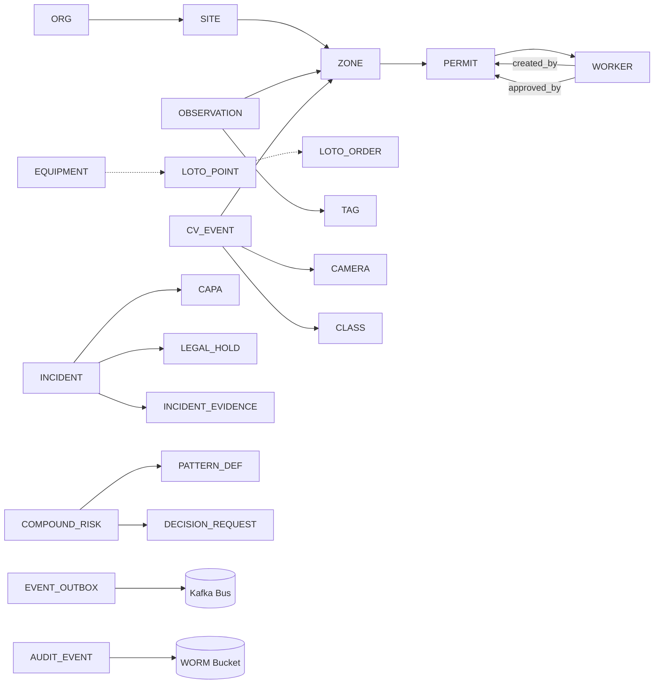

# SafetyOS — Database & Knowledge Graph Specification

**Document Version:** 1.0
**Status:** Engineering Blueprint — Companion to Master Feature Specification v1.1 + PRSD v1.0
**Scope:** Complete persistence, query, retrieval, versioning, audit, eventing, and caching substrate for all 27 modules of SafetyOS.
**Audience:** Data Platform Squad, Backend Engineers, SRE, Security, Compliance, ML Engineering, Applied AI.

---

## Table of Contents

1. Architecture Overview & Storage Tiering
2. ER Diagram — Core Domain
3. Entities (Canonical Catalog)
4. Relationships & Cardinality
5. Constraints (Domain, Referential, Security)
6. Indexes (B-tree, GIN, BRIN, Vector, Graph)
7. Time-Series Schema (TimescaleDB / Hypertables)
8. Graph Schema (Neo4j — Knowledge Graph)
9. PostgreSQL Schema (DDL)
10. Redis Usage (Cache, Locks, Sessions, Feature Flags, Pub/Sub)
11. Blob Storage (S3 / MinIO / Lakehouse Bronze-Silver-Gold)
12. Versioning (Pattern DSL, Policy, Documents, Models, Permit Revisions)
13. Audit Tables (WORM, Chain-of-Custody, Tamper-Evidence)
14. Soft Delete (deleted_at, row-level visibility, GDPR/DPDP Right-to-Erasure)
15. Event Store (Canonical Event Bus, Kafka, Outbox, Replay)
16. Database_per_Tenant Strategy & Federation
17. Backup, DR, RPO/RTO
18. Appendix — Module-to-Table Map

---

## 1. Architecture Overview & Storage Tiering

SafetyOS uses **polyglot persistence**. Each tier is the system-of-record for one class of data and is **not** used as a fallback for another.

| Tier | Engine | Owner-of | Used By |
|---|---|---|---|
| Relational | PostgreSQL 16 (primary) | Workflows, identity, permits, LOTO, incidents, CAPA, audit, config, feature flags, soft-deletes, versioned docs | All modules |
| Time-series | TimescaleDB (PostgreSQL extension) | OT observations, environmental, CGM dispatch, alarm streams, drift metrics, AI cost | OT-*, CV-*, AG-*, OBS-*, Module 25 DP-* |
| Graph | Neo4j Enterprise (Causal Cluster) | Worker↔Equipment↔Zone↔Permit↔CompoundRisk reasoning substrate | Module 3 (KG-*), Module 4 (CR-*), Module 12 agents, CR-* patterns |
| Vector | pgvector + Qdrant | Embeddings (SOP, regulation, manual, incident, model card) | RAG (RAG-*), RCA, Copilot |
| Search | OpenSearch | Full-text logs, audit-trail search, evidence bundles | INC-017, Auditor portal |
| Object / Lakehouse | S3-compatible (AWS S3 / Azure ADLS / MinIO on-prem) + Delta/Iceberg tables | Evidence blobs, frames, JSA PDFs, model bundles, twin snapshots, meeting recordings | DP-001 (lakehouse), INC-003 (evidence bundle), CV-029 retention |
| Cache & Lock | Redis 7 (cluster) | Sessions, idempotency keys, distributed locks, feature flag hot-path, HOT miss, geospatial HITL inbox | WFP-008, AG-019, NOT-*, OT-* dedup, CV-* HOT buffer |
| Event Store | Kafka (Kafka 3.7, Schema Registry, Tiered Storage) | Canonical cross-module event bus + event-sourced operational view (outbox) | Every module (WFP-002) |

Purdue-level rule (PRSD §6.3): **no SafetyOS write crosses the L3.5 IDMZ southbound**. Read-only ingest from L0–L3 is the only path in. All control-plane writes stay in L4–L5.

---

## 2. ER Diagram — Core Domain

```mermaid
erDiagram
    ORG ||--o{ SITE : owns
    ORG ||--o{ TENANT_POLICY : defines
    SITE ||--o{ ZONE : contains
    SITE ||--o{ EQUIPMENT : hosts
    SITE ||--o{ CAMERA : installs
    SITE ||--o{ SENSOR : deploys
    ORG ||--o{ WORKER : employs
    ORG ||--o{ CONTRACTOR : contracts
    CONTRACTOR ||--o{ WORKER : "employs (is_a)"
    WORKER ||--o{ CERTIFICATION : holds
    WORKER ||--o{ SHIFT_ASSIGNMENT : assigned
    WORKER ||--o{ WORKER_EMBEDDING : "soft-reID"
    WORKER ||--o{ SAFETY_PASSPORT : "carries"
    ZONE ||--o{ HAZARD_CLASSIFICATION : "classified_as"
    EQUIPMENT ||--o{ TAG : "instrumented_by"
    EQUIPMENT ||--o{ LOTO_POINT : "has_isolation"
    EQUIPMENT ||--o{ MAINTENANCE_ORDER : "subject_of"
    EQUIPMENT ||--o{ EQUIPMENT_FLUID : "carries"
    ZONE ||--o{ PERMIT : "located_in"
    WORKER ||--o{ PERMIT : "created_by"
    WORKER ||--o{ PERMIT : "approved_by"
    PERMIT ||--o{ PERMIT_REVISION : "versioned_as"
    PERMIT ||--o{ JSA : "has"
    PERMIT }o--o{ SOP : "references"
    PERMIT }o--o{ HAZARD_CLASSIFICATION : "addresses"
    PERMIT ||--o{ PERMIT_EVIDENCE : "stores"
    LOTO_ORDER ||--|{ LOTO_POINT : "secures"
    LOTO_ORDER ||--o{ LOTO_VERIFICATION : "verified_by"
    WORKER ||--o{ LOTO_ORDER : "applied_by"
    WORKER ||--o{ LOTO_VERIFICATION : "verified_by"
    OBSERVATION }o--|| TAG : "measures"
    OBSERVATION }o--|| ZONE : "occurred_in"
    OBSERVATION }o--|| EQUIPMENT : "about"
    CV_EVENT }o--|| CAMERA : "captured_by"
    CV_EVENT }o--|| ZONE : "detected_in"
    CV_EVENT }o--o{ CV_BBOX : "produces"
    CV_EVENT }o--|| CLASS : "labels"
    CV_EVENT ||--o{ CV_FRAME : "evidence"
    INCIDENT ||--o{ INCIDENT_EVIDENCE : "evidenced_by"
    INCIDENT ||--o{ INCIDENT_OBSERVATION : "evidenced_by"
    INCIDENT ||--o{ INCIDENT_PERMIT : "involves"
    INCIDENT ||--o{ INCIDENT_NOTIFICATION : "notifies"
    INCIDENT ||--o{ CAPA : "triggers"
    INCIDENT ||--o{ INCIDENT_TASK : "workstreams"
    INCIDENT ||--o{ LEGAL_HOLD : "may be under"
    NEAR_MISS ||--o{ NEAR_MISS_EVIDENCE : "evidenced_by"
    SOP ||--o{ SOP_VERSION : "versioned_as"
    SOP }o--o{ REGULATION : "derived_from"
    REGULATION ||--o{ REG_CITATION : "cites"
    REGULATION ||--o{ REG_SECTION : "structured_as"
    HAZARD_CLASSIFICATION ||--o{ REG_SECTION : "governed_by"
    COMPOUND_RISK ||--o{ COMPOUND_RISK_EVIDENCE : "composed_of"
    COMPOUND_RISK }o--|| PATTERN_DEF : "instance_of"
    PATTERN_DEF ||--o{ PATTERN_VERSION : "versioned_as"
    PATTERN_DEF ||--o{ PATTERN_TEST_CASE : "validated_by"
    COMPOUND_RISK }o--o| DECISION_REQUEST : "gated_by"
    DECISION_REQUEST ||--o{ DECISION_RESPONSE : "answered_by"
    DECISION_REQUEST ||--o{ DECISION_ESCALATION : "escalates"
    COMPOUND_RISK ||--o{ RECOMMENDED_ACTION : "yields"
    RECOMMENDED_ACTION }o--|| CAPABILITY_TOKEN : "scoped_by"
    FEATURE_FLAG ||--o{ FLAG_OVERRIDE : "per_tenant_or_user"
    EVENT_OUTBOX ||--o{ EVENT_PUBLISH : "yields"
    AUDIT_EVENT ||--o{ AUDIT_DETAIL : "structured_as"
    LEGAL_HOLD ||--o{ HOLD_SUBJECT : "covers"
```

The diagram encodes every cardinality rule listed in §4. **One entity in ER = at least one table in §9.**

---

## 3. Entities (Canonical Catalog)

Each entity is owned by at least one module per the Feature Spec §1.1. The "Owner" column maps to the responsible squad.

| Entity | Owner | Purpose |
|---|---|---|
| `Org` | Platform (PLT) | Tenant, billing root, policy root |
| `Site` | Platform (PLT) | Physical plant; root of edge fleet & KG partition |
| `Zone` | KG | 2D/3D polygon; hazardous-area class (Zone 0/1/2) |
| `HazardClassification` | KG | Taxonomy node (H2S, LEL, pyrophoric, kinetic, thermal, fall, electrical) |
| `Equipment` | KG / OT | Pump, vessel, line, valve, breaker (P&ID node) |
| `EquipmentFluid` | KG | Pyrophoric / water-reactive flag (used by CR-026) |
| `Tag` | OT | OPC-UA tag → equipment mapping |
| `Sensor` | OT | Gas, IR, RTLS, UWB, BLE, environmental sensor |
| `Camera` | CV | ONVIF-managed camera, hardening status (CV-035) |
| `Worker` | Workforce | Person, with `worker_type ∈ {employee, contractor}` |
| `Contractor` | Workforce | Sub-org owning contractor workers |
| `Certification` | Workforce | Confined-space, hot-work, LOTO, H2S, etc. |
| `ShiftAssignment` | Workforce | Worker ↔ shift ↔ area |
| `SafetyPassport` | Workforce (MOB) | Cross-site signed attestation |
| `WorkerEmbedding` | CV (transient) | ByteTrack soft re-ID; non-biometric per AG-004 |
| `Permit` | PTW | Hot-work, CS, work-at-height, line-break, excavation |
| `PermitRevision` | PTW | Immutable revision per change |
| `JSA` | PTW | Job safety analysis attached to a permit revision |
| `PermitEvidence` | PTW | Photos, gas tests, sign-offs |
| `LotoOrder` | LOTO | Group of isolation points |
| `LotoPoint` | LOTO | Single physical isolation point |
| `LotoVerification` | LOTO | Verifier, lock confirm, OT zero-energy check |
| `MaintenanceOrder` | OT/CMMS | Backed by MAXIMO/SAP PM |
| `Observation` | Time-series | Read of a tag, IR, gas, thermal (hypertable) |
| `Class` | CV | Detection class taxonomy |
| `CvFrame` | CV / Blob | Original frame (WORM evidence) |
| `CvBbox` | CV | Single detection within an event |
| `CvEvent` | CV | Vision output event (one per camera policy) |
| `Incident` | INC | Ground-truth incident record |
| `IncidentEvidence` | INC | Bundle of frame clip, JSA, KGR slice |
| `IncidentObservation` | INC | TS slice referenced |
| `IncidentPermit` | INC | Permit referenced |
| `IncidentNotification` | INC | HR/legislator/insurer/regulator touchpoint |
| `IncidentTask` | INC | Field task tied to incident |
| `NearMiss` | INC | Anonymous or attributed near-miss |
| `LegalHold` | SEC | Chain-of-custody lock (INC-017) |
| `HoldaSubject` | SEC | M:N hold ↔ entity |
| `Capa` | INC (ISO 45001 §10.2, INC-021) | Corrective & preventive action lifecycle |
| `PatternDef` | CR | Reusable compound-risk pattern |
| `PatternVersion` | CR | Cypher + Rego + rule metadata, SemVer |
| `PatternTestCase` | CR | Backtest corp. (CR-019 shadow) |
| `CompoundRisk` | CR | Live materialized risk — KG node + RD row |
| `CompoundRiskEvidence` | CR | Links to source observations/cv-events/permits |
| `RecommendedAction` | CR | AI-suggested action, capability-scoped |
| `DecisionRequest` | AG-019 (WFP-012) | Pending human approval |
| `DecisionResponse` | AG-019 | Approve / reject / escalate |
| `DecisionEscalation` | AG-019 | Escalation ladder trail |
| `CapabilityToken` | AG-004 | Static, signed grants per agent invocation |
| `Model` | DP-004 (MLflow) | Registry entry per model version |
| `ModelVersion` | DP-004 | Immutable version |
| `ModelCard` | DP-015 | EU AI Act Annex IV docs |
| `FeatureFlag` | PLT-004 (WFP-*) | Per-tenant / per-camera / per-zone / per-zone-class override |
| `FlagOverride` | PLT-004 | Override row |
| `SloDefinition` | OBS-002 | Catalog entry |
| `SloBudget` | OBS-002 | Burn-rate alert state |
| `SlaBreach` | OBS-002 | Recorded breach |
| `EventOutbox` | WFP-002 | Transactional outbox for at-least-once event publish |
| `EventPublish` | WFP-002 | One row per outbox delivery |
| `AuditEvent` | SEC-011 | WORM audit entry (every state-changing action) |
| `AuditDetail` | SEC-011 | Structured diff payload |
| `DataContract` | DP-011 | Producer-declared schema + semantic for every event |
| `SOP` | KB | Procedure corpus |
| `SopVersion` | KB | Versioned SOP |
| `Regulation` | KB | External law/standard corpus |
| `RegSection` | KB | Cite-addressable |
| `RegCitation` | RAG | Citation edge into doc chunks |
| `TenantPolicy` | AG-017 / SEC | Residency, capability caps, kill scope |
| `EdgeNode` | CV / OBS-005 | Jetson-Orin fleet member |
| `DocChunk` | RAG | Embedding row (pgvector) |
| `ApprovalRequest` | WFP-005 / WFP-006 | n-role / dual-sign approval |
| `Notification` | NOT-* | Multi-channel log |
| `ShiftHandover` | SH | Outgoing→incoming packet |
| `TwinSnapshot` | DT-016 / INC-022 | Twin frozen at incident time |

---

## 4. Relationships & Cardinality

| Parent | Relationship | Child | Cardinality | Notes |
|---|---|---|---|---|
| ORG | owns | SITE | 1..* | One org may own many sites |
| ORG | defines | TENANT_POLICY | 1..* | Policy versioning explicit |
| SITE | contains | ZONE | 1..* | Zone polygons do not cross sites |
| SITE | hosts | EQUIPMENT | 1..* | Each equipment has exactly one site |
| SITE | installs | CAMERA | 1..* | Cameras have lifecycle here |
| SITE | deploys | SENSOR | 1..* | Sensors tagged w/ site for OT-* |
| ORG | employs | WORKER | 1..* | Worker`org_id` required |
| CONTRACTOR | employs | WORKER | 1..* | When worker.is_contractor=true |
| WORKER | holds | CERTIFICATION | 0..* | Validity window required |
| WORKER | assigned | SHIFT_ASSIGNMENT | 0..* | Date-bounded |
| WORKER | carries | SAFETY_PASSPORT | 0..1 | Optional, signed |
| ZONE | classified_as | HAZARD_CLASSIFICATION | 1..* | n:m, with primary zone flag |
| EQUIPMENT | instrumented_by | TAG | 1..* | OPC-UA tag binds to equipment |
| EQUIPMENT | has_isolation | LOTO_POINT | 1..* | Pre-mapped isolation topology |
| EQUIPMENT | subject_of | MAINTENANCE_ORDER | 0..* | Optional |
| EQUIPMENT | carries | EQUIPMENT_FLUID | 0..* | For CR-026 (pyrophoric) |
| ZONE | locates | PERMIT | 1..* | Permit must have a zone |
| WORKER | created_by | PERMIT | 1..* | Author of permit |
| WORKER | approved_by | PERMIT | 0..* | Supervisor |
| PERMIT | versioned_as | PERMIT_REVISION | 1..* | Append-only |
| PERMIT | has | JSA | 1..* | JSA is per-revision |
| PERMIT | references | SOP | 0..* | n:m via junction |
| PERMIT | addresses | HAZARD_CLASSIFICATION | 0..* | n:m |
| PERMIT | stores | PERMIT_EVIDENCE | 0..* | Photos, gas tests, signatures |
| LOTO_ORDER | secures | LOTO_POINT | 1..* | Group composition |
| LOTO_ORDER | verified_by | LOTO_VERIFICATION | 0..* | Each point has at least one verify |
| WORKER | applied_by | LOTO_ORDER | 1..* | Authorized employee |
| WORKER | verified_by | LOTO_VERIFICATION | 1..* | Same or different person |
| OBSERVATION | measures | TAG | n:1 | One tag per row |
| OBSERVATION | occurred_in | ZONE | n:1 | Spatial |
| OBSERVATION | about | EQUIPMENT | n:0..1 | Optional |
| CV_EVENT | captured_by | CAMERA | n:1 | One camera per event |
| CV_EVENT | detected_in | ZONE | n:1 | Resolved via homography |
| CV_EVENT | produces | CV_BBOX | 1..* | One or many detections |
| CV_EVENT | labels | CLASS | n:1 | Taxonomy |
| CV_EVENT | evidence | CV_FRAME | 1..1 | One frame (edge-stamped) |
| INCIDENT | evidenced_by | INCIDENT_EVIDENCE | 0..* | Bundle pointers |
| INCIDENT | evidenced_by_ts | INCIDENT_OBSERVATION | 0..* | TS slice |
| INCIDENT | involves | INCIDENT_PERMIT | 0..* | Permit link |
| INCIDENT | notifies | INCIDENT_NOTIFICATION | 0..* | HR, insurer, regulator |
| INCIDENT | triggers | CAPA | 0..* | ISO 45001 §10.2 |
| INCIDENT | workstreams | INCIDENT_TASK | 0..* | Operational remediation |
| INCIDENT | under | LEGAL_HOLD | 0..1 | At most one active hold |
| NEAR_MISS | evidenced_by | NEAR_MISS_EVIDENCE | 0..* | Even anonymous NM retains WORM-safe corpus |
| SOP | versioned_as | SOP_VERSION | 1..* | SemVer |
| SOP | derived_from | REGULATION | 0..* | RAG citation chain |
| REGULATION | structured_as | REG_SECTION | 1..* | Section anchors |
| REG_SECTION | cites | REG_CITATION | 0..* | Reverse pointer from doc chunks |
| COMPOUND_RISK | composed_of | COMPOUND_RISK_EVIDENCE | 1..* | Materialized evidence |
| COMPOUND_RISK | instance_of | PATTERN_DEF | n:1 | FK + version |
| PATTERN_DEF | versioned_as | PATTERN_VERSION | 1..* | SemVer; Canary vs GA |
| PATTERN_DEF | validated_by | PATTERN_TEST_CASE | 1..* | CR-019 shadow suite |
| COMPOUND_RISK | gated_by | DECISION_REQUEST | 0..1 | Optional for HIGH/CRITICAL |
| DECISION_REQUEST | answered_by | DECISION_RESPONSE | 0..* | 1 final + n intermediate |
| DECISION_REQUEST | escalates | DECISION_ESCALATION | 0..* | SLA-driven |
| RECOMMENDED_ACTION | scoped_by | CAPABILITY_TOKEN | n:1 | Hard-wired prohibition enforced |
| FEATURE_FLAG | per_tenant_or_user | FLAG_OVERRIDE | 0..* | Specific override record |
| EVENT_OUTBOX | yields | EVENT_PUBLISH | 1..* | Once per delivery attempt |
| AUDIT_EVENT | structured_as | AUDIT_DETAIL | 0..* | Diff payload |
| LEGAL_HOLD | covers | HOLD_SUBJECT | 1..* | Whom/what is held |

**Mermaid summary:**


---

## 5. Constraints

### 5.1 Domain / Format Constraints

| Field | Type | Rule |
|---|---|---|
| `permits.status` | enum | `Draft \| RiskAssessed \| ConflictCheck \| RequiresChange \| Approved \| Active \| Suspended \| Closed \| Cancelled` |
| `permits.valid_until > valid_from` | check | Temporal sanity |
| `certifications.valid_until >= valid_from` | check | Cannot be issued expired |
| `incidents.severity` | enum | `SIF \| LTI \| MTC \| FA \| NM` |
| `incidents.reported_at >= occurred_at` | check | Slack for ingestion tolerance (≤ 5min) |
| `cv_event.confidence IN [0,1]` | check | Calibrated (AG-018) |
| `compound_risk.severity IN (critical,high,medium,low)` | enum | Maps to UX color tokens |
| `observation.quality IN (OPC-UA StatusCode)` | enum | 0x00000000 = Good; 0x80000000 = Bad |
| `loto_order.cleared_at >= applied_at OR cleared_at IS NULL` | check | Sequencing |
| `camera.hardening_status` | enum | `unsigned \| signed \| q_profile \| rejected` |
| `edge_node.health_state` | enum | `healthy \| degraded \| silent_failure \| dead` |
| `permit_revision.rev_no` | monotonic | Per permit, monotonically increasing, no gaps |
| `model_version.semver` | regex | `^\d+\.\d+\.\d+(-[a-zA-Z0-9\.]+)?$` |
| `pattern_version.dsl_hash` | SHA-256 | Immutable, content-addressed |
| `geo.zone.geom` | geometry | PostGIS `POLYGON` or `MULTIPOLYGON` with SRID 4326 |

### 5.2 Referential Constraints

- **Strict referential integrity** (`FOREIGN KEY ... REFERENCES ...`) is enforced for every parent-child listed in §4.
- **Cascade rules** are deliberate and minimal:
  - `permits.zone_id` → `ON DELETE RESTRICT` (cannot delete a zone with active permits).
  - `permits.created_by` → `ON DELETE RESTRICT` (workers are soft-deleted via §14, never hard).
  - `permits.approved_by` → nullable; `ON DELETE SET NULL`.
  - `observations.tag_id` → `ON DELETE RESTRICT` (TS retention ≠ deletion; tags are immutable in OT).
  - `cv_event.camera_id` → `ON DELETE RESTRICT`.
  - `cv_event.zone_id` → `ON DELETE RESTRICT`.
  - `loto_order.applied_by` → `ON DELETE RESTRICT`.
  - `compound_risk.pattern_version_id` → `ON DELETE RESTRICT` (pattern versions are immutable).
  - `audit_event.actor_id` → `ON DELETE SET NULL` (audit retains even after worker soft-deletion).
- **Soft FK** (referenced but soft-deleted upstream allowed) is implemented via `IS_DELETED_FALSE()` predicate on lookup path. See §14.

### 5.3 Security / Multi-Tenant Constraints

| Constraint | Definition |
|---|---|
| Tenant isolation | Every row has `org_id`; Row-Level Security (RLS) enforces `current_setting('app.tenant_id')::uuid = org_id` for every table |
| Site scoping | `current_setting('app.site_ids')::uuid[]` filters rows where row has `site_id` |
| Worker self-access | `worker_id = current_setting('app.worker_id')::uuid` for self-service endpoints |
| Cross-tenant | Forbidden at the SQL layer; service mesh (Istio) mTLS adds network-layer enforcement |
| Read-on-OT | Proxies only; nothing in PG mutates OT |

### 5.4 Check Constraints (defensive)

```sql
CHECK (cv_event.confidence BETWEEN 0.0 AND 1.0)
CHECK (compound_risk.severity IN ('critical','high','medium','low'))
CHECK (incidents.severity IN ('SIF','LTI','MTC','FA','NM'))
CHECK (permits.valid_until > permits.valid_from)
CHECK (certifications.valid_until >= certifications.valid_from)
CHECK (permits.status IN ('Draft','RiskAssessed','ConflictCheck','RequiresChange','Approved','Active','Suspended','Closed','Cancelled'))
CHECK (observation.quality BETWEEN 0 AND 255)
CHECK (loto_order.cleared_at >= loto_order.applied_at OR loto_order.cleared_at IS NULL)
CHECK (pattern_version.dsl_hash ~ '^[0-9a-f]{64}$')
CHECK (sla_breach.duration_seconds >= 0)
```

---

## 6. Indexes

### 6.1 Naming Convention
`idx_<table>_<col1>[_<col2>][_<suffix>]` where suffix is `_unique`, `_gist`, `_gin`, `_brin`, `_partial`, `_expr`.

### 6.2 B-tree (default)

| Table | Columns | Reason |
|---|---|---|
| `permits` | `(site_id, status) WHERE status='ACTIVE' AND deleted_at IS NULL` | Partial hot-path for CR/PTW agents |
| `permits` | `(zone_id, valid_from)` | Overlap detection |
| `permits` | `(created_by)` + `(approved_by)` | Common lookups |
| `loto_order` | `(equipment_id, status)` | Active LOTO by equipment |
| `loto_order` | `(applied_by, applied_at DESC)` | Recent activity lookup |
| `workers` | `(org_id, external_id) UNIQUE WHERE deleted_at IS NULL` | Idempotent identity |
| `certifications` | `(worker_id, valid_until DESC)` | "Expiring soon" notifications |
| `incidents` | `(site_id, occurred_at DESC)` | Incident console feed |
| `incidents` | `(severity) WHERE severity IN ('SIF','LTI')` | Triage filter |
| `compound_risk` | `(pattern_id, started_at DESC)` | Pattern frequency reporting |
| `compound_risk` | `(severity) WHERE severity='critical' AND status='OPEN'` | Partial index for ER triggers |
| `decision_request` | `(requested_to, status, sla_due_at) WHERE status='pending'` | AG-019 inbox |
| `notification` | `(channel, recipient_id, created_at DESC)` | Delivery inbox |
| `event_outbox` | `(status, next_attempt_at) WHERE status='pending'` | Dispatcher sweep |
| `audit_event` | `(org_id, occurred_at DESC)` | Auditor portal feed |
| `model_version` | `(model_id, semver) UNIQUE` | Registry uniqueness |
| `feature_flag` | `(key) UNIQUE` | Flag registry key |

### 6.3 GIN

| Table | Column | Operator | Reason |
|---|---|---|---|
| `permits` | `compound_risk_flags JSONB` | `jsonb_path_ops` | Risk flags search |
| `incidents` | `narrative_tags TEXT[]` | array | Audit-style tag search |
| `audit_detail` | `before JSONB`, `after JSONB` | `jsonb_path_ops` | Diff search |
| `tenant_policy` | `capabilities JSONB` | `jsonb_path_ops` | Capability lookup |

### 6.4 BRIN (high-volume ordered data)

| Table | Column | Reason |
|---|---|---|
| `observations` | `(ts)` | TS already partitioned; BRIN on ts for cross-chunk scans |
| `feature_skew_metric` | `(ts)` | Monitoring time-series |
| `llm_cost_event` | `(ts)` | AI cost observability (OBS-010) |
| `audit_event` | `(occurred_at)` | Bulk audit scans |

### 6.5 GiST / PostGIS

| Table | Column | Op | Reason |
|---|---|---|---|
| `zones` | `geom` | GiST | Polygon overlap, adjacency (CR-002 etc.) |
| `equipment` | `geom` | GiST | Spatial joins |
| `worker_presence_history` | `geom` | GiST | Lone-worker (CV-015) radius checks |

### 6.6 Vector (pgvector / Qdrant)

| Table | Column | Index Type | Reason |
|---|---|---|---|
| `doc_chunk` | `embedding VECTOR(1024)` | ivfflat (`lists=200`) cosine | RAG |
| `cv_event_signature` | `embedding VECTOR(256)` | hnsw | Near-duplicate event clustering |
| `incident_signature` | `embedding VECTOR(1024)` | hnsw | Similar-incident retrieval (INC-009) |

### 6.7 Partial / Functional

```sql
CREATE INDEX idx_permits_active_zone
  ON permits (zone_id) WHERE status='ACTIVE' AND deleted_at IS NULL;
CREATE INDEX idx_compound_risk_open
  ON compound_risk (severity, started_at DESC)
  WHERE status='OPEN';
CREATE INDEX idx_observations_lel_recent
  ON observations (tag_id, ts DESC)
  WHERE tag_id IN (SELECT tag_id FROM tag WHERE measurement_class='LEL');
CREATE INDEX idx_incidents_sif_lt
  ON incidents (occurred_at DESC)
  WHERE severity IN ('SIF','LTI');
```

### 6.8 Graph (Neo4j)

| Node / Relationship | Index / Constraint |
|---|---|
| `(Worker)` | `CREATE CONSTRAINT ON (w:Worker) ASSERT w.id IS UNIQUE` |
| `(Equipment)` | unique on `id` |
| `(Zone)` | unique on `id` + GiST on `geom` |
| `(Permit)` | unique on `id` + index on `(status)` |
| `(Observation)` | composite on `(tag_id, ts DESC)` |
| `(CvEvent)` | composite on `(camera_id, ts DESC)` |
| `(CompoundRisk)` | composite on `(pattern_id, opened_at DESC)` |
| `(Loto)` | unique on `id` + index on `(equipment_id)` |
| `[:LOCATED_IN]` | index on `(since)` |
| `[:COMPOSES]` | index on `(ts)` |
| `[:PRECEDED]` | index on `(ts)` for RCA time-traversal |

---

## 7. Time-Series Schema (TimescaleDB)

### 7.1 Hypertables

```sql
CREATE EXTENSION IF NOT EXISTS timescaledb;

CREATE TABLE ts_observations (
  ts              TIMESTAMPTZ NOT NULL,
  tag_id          UUID NOT NULL,
  site_id         UUID NOT NULL,
  org_id          UUID NOT NULL,
  value           DOUBLE PRECISION,
  quality         SMALLINT NOT NULL,
  unit            TEXT NOT NULL,
  source          TEXT NOT NULL,
  trace_id        UUID,
  sensor_id       UUID,
  geom            GEOMETRY(Point, 4326),
  metadata        JSONB
);
SELECT create_hypertable('ts_observations', 'ts',
  chunk_time_interval => INTERVAL '1 day',
  if_not_exists => TRUE);
ALTER TABLE ts_observations SET (
  timescaledb.compress,
  timescaledb.compress_segmentby = 'tag_id,site_id',
  timescaledb.compress_orderby = 'ts DESC'
);
SELECT add_compression_policy('ts_observations', INTERVAL '7 days');
SELECT add_retention_policy('ts_observations', INTERVAL '2 years');
CREATE INDEX idx_ts_obs_tag_ts ON ts_observations (tag_id, ts DESC);
CREATE INDEX idx_ts_obs_site_ts ON ts_observations (site_id, ts DESC);
CREATE INDEX idx_ts_obs_quality ON ts_observations (quality) WHERE quality >= 0x80000000;
CREATE INDEX idx_ts_obs_lel ON ts_observations (tag_id, ts DESC)
  WHERE EXISTS (SELECT 1 FROM tag t WHERE t.tag_id = ts_observations.tag_id AND t.measurement_class='LEL');
```

#### Continuous aggregates
```sql
CREATE MATERIALIZED VIEW cagg_observations_5min
WITH (timescaledb.continuous, timescaledb.manual_only=false) AS
SELECT
  time_bucket('5 minutes', ts) AS bucket,
  tag_id,
  site_id,
  avg(value) AS avg_v, min(value) AS min_v, max(value) AS max_v,
  count(*) FILTER (WHERE quality < 0x80000000) AS good_n,
  count(*) FILTER (WHERE quality >= 0x80000000) AS bad_n
FROM ts_observations
GROUP BY bucket, tag_id, site_id;
SELECT add_continuous_aggregate_policy('cagg_observations_5min',
  start_offset => INTERVAL '30 days', end_offset => INTERVAL '5 minutes',
  schedule_interval => INTERVAL '5 minutes');
```

#### Downsample chain
- `5min` agg → `1h` agg → `1d` agg. Compression kicks in at 7d, 90d, 365d respectively.

### 7.2 Alert Streams

```sql
CREATE TABLE ts_alarm_stream (
  ts              TIMESTAMPTZ NOT NULL,
  site_id         UUID NOT NULL,
  org_id          UUID NOT NULL,
  tag_id          UUID,
  source          TEXT NOT NULL,         -- 'ISA18.2','ISA101','custom'
  severity        SMALLINT NOT NULL,      -- 0..3 mirrors priority
  is_acknowledged BOOLEAN NOT NULL DEFAULT FALSE,
  ack_by          UUID,
  ack_at          TIMESTAMPTZ,
  cluster_id      UUID,                    -- rationalization cluster
  is_suppressed   BOOLEAN NOT NULL DEFAULT FALSE,
  rationale       TEXT,
  payload         JSONB
);
SELECT create_hypertable('ts_alarm_stream', 'ts',
  chunk_time_interval => INTERVAL '6 hours');
CREATE INDEX idx_ts_alarm_site_ts ON ts_alarm_stream (site_id, ts DESC);
CREATE INDEX idx_ts_alarm_unack   ON ts_alarm_stream (ts DESC) WHERE NOT is_acknowledged;
```

### 7.3 Edge Telemetry (CV-036 / OBS-005)

```sql
CREATE TABLE ts_edge_telemetry (
  ts                TIMESTAMPTZ NOT NULL,
  edge_node_id      UUID NOT NULL,
  site_id           UUID NOT NULL,
  org_id            UUID NOT NULL,
  cpu_pct           REAL,
  gpu_pct           REAL,
  gpu_temp_c        REAL,
  mem_pct           REAL,
  inference_p99_ms  REAL,
  inference_count   BIGINT,
  dropped_frames    BIGINT,
  thermal_throttle  BOOLEAN,
  driver_stall      BOOLEAN,
  network_lost      BOOLEAN,
  payload           JSONB
);
SELECT create_hypertable('ts_edge_telemetry', 'ts',
  chunk_time_interval => INTERVAL '1 day');
CREATE INDEX idx_ts_edge_node_ts ON ts_edge_telemetry (edge_node_id, ts DESC);
```

### 7.4 LLM Cost / Token Telemetry (AG-017, OBS-010)

```sql
CREATE TABLE ts_llm_cost (
  ts             TIMESTAMPTZ NOT NULL,
  org_id         UUID NOT NULL,
  site_id        UUID NOT NULL,
  worker_id      UUID,
  agent_id       TEXT NOT NULL,
  model_id       UUID NOT NULL,
  prompt_tokens  INT NOT NULL,
  output_tokens  INT NOT NULL,
  cache_hit      BOOLEAN,
  residency      TEXT NOT NULL,
  cost_usd_cents INT NOT NULL,
  groundedness   REAL,
  refused        BOOLEAN,
  latency_ms     INT
);
SELECT create_hypertable('ts_llm_cost', 'ts', chunk_time_interval => INTERVAL '1 day');
CREATE INDEX idx_ts_llm_cost_org_ts ON ts_llm_cost (org_id, ts DESC);
```

### 7.5 Drift / Fairness Metrics (DP-007, CV-030)

```sql
CREATE TABLE ts_drift_metric (
  ts           TIMESTAMPTZ NOT NULL,
  model_id     UUID NOT NULL,
  metric       TEXT NOT NULL,
  slice_key    TEXT,
  slice_value  TEXT,
  value        DOUBLE PRECISION,
  threshold    DOUBLE PRECISION,
  breached     BOOLEAN
);
SELECT create_hypertable('ts_drift_metric', 'ts', chunk_time_interval => INTERVAL '7 days');
```

### 7.6 Retention & Compression Policy Summary

| Hypertable | Compression Starts | Retention |
|---|---|---|
| `ts_observations` | 7 days | 2 years |
| `ts_alarm_stream` | 3 days | 3 years |
| `ts_edge_telemetry` | 3 days | 1 year |
| `ts_llm_cost` | 30 days | 5 years (legal) |
| `ts_drift_metric` | 30 days | 5 years (EU AI Act) |

---

## 8. Graph Schema (Neo4j)

### 8.1 Node Constraints

```cypher
CREATE CONSTRAINT worker_id        IF NOT EXISTS FOR (w:Worker)         REQUIRE w.id IS UNIQUE;
CREATE CONSTRAINT contractor_id    IF NOT EXISTS FOR (c:Contractor)     REQUIRE c.id IS UNIQUE;
CREATE CONSTRAINT certification_id IF NOT EXISTS FOR (c:Certification)  REQUIRE c.id IS UNIQUE;
CREATE CONSTRAINT equipment_id     IF NOT EXISTS FOR (e:Equipment)      REQUIRE e.id IS UNIQUE;
CREATE CONSTRAINT zone_id          IF NOT EXISTS FOR (z:Zone)           REQUIRE z.id IS UNIQUE;
CREATE CONSTRAINT hazard_id        IF NOT EXISTS FOR (h:HazardClass)    REQUIRE (h.code, h.taxonomy) IS UNIQUE;
CREATE CONSTRAINT tag_id           IF NOT EXISTS FOR (t:Tag)            REQUIRE t.id IS UNIQUE;
CREATE CONSTRAINT sensor_id        IF NOT EXISTS FOR (s:Sensor)         REQUIRE s.id IS UNIQUE;
CREATE CONSTRAINT camera_id        IF NOT EXISTS FOR (c:Camera)         REQUIRE c.id IS UNIQUE;
CREATE CONSTRAINT permit_id        IF NOT EXISTS FOR (p:Permit)         REQUIRE p.id IS UNIQUE;
CREATE CONSTRAINT permit_rev_id    IF NOT EXISTS FOR (p:PermitRevision) REQUIRE p.id IS UNIQUE;
CREATE CONSTRAINT loto_id          IF NOT EXISTS FOR (l:Loto)           REQUIRE l.id IS UNIQUE;
CREATE CONSTRAINT loto_point_id    IF NOT EXISTS FOR (lp:LotoPoint)     REQUIRE lp.id IS UNIQUE;
CREATE CONSTRAINT obs_id           IF NOT EXISTS FOR (o:Observation)    REQUIRE o.id IS UNIQUE;
CREATE CONSTRAINT cv_event_id      IF NOT EXISTS FOR (c:CvEvent)        REQUIRE c.id IS UNIQUE;
CREATE CONSTRAINT cv_frame_id      IF NOT EXISTS FOR (f:CvFrame)        REQUIRE f.id IS UNIQUE;
CREATE CONSTRAINT incident_id      IF NOT EXISTS FOR (i:Incident)       REQUIRE i.id IS UNIQUE;
CREATE CONSTRAINT nearmiss_id      IF NOT EXISTS FOR (n:NearMiss)       REQUIRE n.id IS UNIQUE;
CREATE CONSTRAINT sop_id           IF NOT EXISTS FOR (s:SOP)            REQUIRE s.id IS UNIQUE;
CREATE CONSTRAINT sop_version_id   IF NOT EXISTS FOR (sv:SopVersion)    REQUIRE sv.id IS UNIQUE;
CREATE CONSTRAINT reg_id           IF NOT EXISTS FOR (r:Regulation)     REQUIRE r.id IS UNIQUE;
CREATE CONSTRAINT compound_risk_id IF NOT EXISTS FOR (c:CompoundRisk)   REQUIRE c.id IS UNIQUE;
CREATE CONSTRAINT pattern_id       IF NOT EXISTS FOR (p:PatternDef)     REQUIRE p.id IS UNIQUE;
CREATE CONSTRAINT pattern_version_id IF NOT EXISTS FOR (pv:PatternVersion) REQUIRE pv.id IS UNIQUE;
CREATE CONSTRAINT decision_req_id  IF NOT EXISTS FOR (d:DecisionRequest) REQUIRE d.id IS UNIQUE;
CREATE CONSTRAINT capa_id          IF NOT EXISTS FOR (c:CAPA)           REQUIRE c.id IS UNIQUE;
CREATE CONSTRAINT flag_id          IF NOT EXISTS FOR (f:FeatureFlag)    REQUIRE f.key IS UNIQUE;
CREATE CONSTRAINT edge_node_id     IF NOT EXISTS FOR (e:EdgeNode)       REQUIRE e.id IS UNIQUE;
```

### 8.2 Core Node Schema (sample)

```cypher
CREATE CONSTRAINT observation_ts IF NOT EXISTS FOR (o:Observation) REQUIRE (o.tag_id, o.ts) IS UNIQUE;

-- example: hot-work + LEL compound pattern (CR-002)
CREATE (h:HazardClass { code:'LEL', taxonomy:'combustible_gas', name:'Lower Explosive Limit' });
CREATE CONSTRAINT hazard_taxonomy_unique IF NOT EXISTS FOR (h:HazardClass) REQUIRE (h.code, h.taxonomy) IS UNIQUE;
```

### 8.3 Relationship Cardinality (Neo4j)

| Relationship | From | To | Direction | Cardinality |
|---|---|---|---|---|
| `LOCATED_IN` | Worker / Equipment | Zone | out | n:1 |
| `EMPLOYED_BY` | Worker | Org / Contractor | out | n:1 |
| `HOLDS` | Worker | Certification | out | 1:n |
| `INSTRUMENTED_BY` | Equipment | Tag | out | 1:n |
| `MEASURES` | Observation | Tag | in | n:1 |
| `OCCURRED_IN` | Observation / CvEvent | Zone | out | n:1 |
| `DETECTED_IN` | CvEvent | Zone | out | n:1 |
| `CAPTURED_BY` | CvEvent | Camera | out | n:1 |
| `PRODUCED` | CvEvent | CvBBox | out | 1:n |
| `EVIDENCED_BY` | Incident | CvEvent / Observation | out | n:n |
| `AUTHORIZES` | Permit | HazardClass | out | n:n |
| `LOCATED_IN` | Permit | Zone | out | n:1 |
| `LISTED_ON` | Worker | Permit | out | n:n |
| `ISOLATES` | Loto | Equipment | out | 1:n |
| `COMPOSES` | CompoundRisk | Observation / CvEvent / Permit | out | n:n |
| `INSTANCE_OF` | CompoundRisk | PatternVersion | out | n:1 |
| `GOVERNED_BY` | HazardClass | Regulation | out | n:n |
| `DERIVED_FROM` | SOP | Regulation | out | n:n |
| `CITES` | DocChunk | Regulation | out | n:n |
| `PRECEDED` | Observation | Incident | out | n:1 (temporal predicate) |
| `NEIGHBOUR_OF` | Zone | Zone | out | n:n (1-hop adjacency for CR-002) |
| `CARRIES` | Equipment | EquipmentFluid | out | 1:n |
| `TRIGGERED_BY` | CompoundRisk | Observation / CvEvent | in | n:n |

### 8.4 Example Query - CR-002 Pattern (canonical)

```cypher
// Hot-Work permit + LEL rising in adjacent zone within 10m
MATCH (p:Permit { status:'ACTIVE' })-[:LOCATED_IN]->(z:Zone)
MATCH (p)-[:AUTHORIZES]->(h:HazardClass { code:'HOT_WORK'})
MATCH (z)-[:NEIGHBOUR_OF]-(z2:Zone)
MATCH (o:Observation { measurement:'LEL_pct'})-[:OCCURRED_IN]->(z2)
WHERE o.ts >= datetime() - duration({minutes:10})
WITH p, z2,
     avg(o.value) AS lel_avg,
     max(o.value) AS lel_max
WHERE lel_max >= 10 OR (lel_avg >= 5)
MERGE (cr:CompoundRisk {
  id: 'cr_' + coalesce(p.id,'p_anon') + '_' + z2.id + '_' + toString(datetime()),
  pattern_id: 'CR-002',
  pattern_version: '1.4.0',
  status: 'OPEN',
  severity: 'high',
  started_at: datetime()
})
MERGE (cr)-[:INSTANCE_OF]->(:PatternVersion { id:'CR-002@1.4.0' })
MERGE (cr)-[:COMPOSES]->(p)
MERGE (cr)-[:COMPOSES]->(z2)
MERGE (cr)-[:COMPOSED_EVIDENCE]->(o)
RETURN cr;
```

### 8.5 CDC Out of KG into PostgreSQL/RDBMS View

`compound_risk` (PG table) is a **materialized view** of the KG `CompoundRisk` node drained via CDC events. PG is the query layer for reporters and exports; KG is the live inference substrate. See §15.

### 8.6 Notes

- All KG write paths go through Neo4j Hooks that publish `kg.upsert.v1` events to the bus; PostgreSQL mirror is maintained via EventOutbox consumer.
- Every PG row that has a corresponding KG node carries `kg_node_id UUID` so the dual systems reconcile.
- Tenant isolation at the KG level uses `Databases per tenant` (see §16).

---

## 9. PostgreSQL Schema (DDL)

Below is the canonical DDL. Rows are illustrative; all entities in §3 map here.

```sql
-- ============================================================
-- 0. Extensions
-- ============================================================
CREATE EXTENSION IF NOT EXISTS "uuid-ossp";
CREATE EXTENSION IF NOT EXISTS pgcrypto;
CREATE EXTENSION IF NOT EXISTS citext;
CREATE EXTENSION IF NOT EXISTS btree_gist;
CREATE EXTENSION IF NOT EXISTS timescaledb;
CREATE EXTENSION IF NOT EXISTS postgis;
CREATE EXTENSION IF NOT EXISTS vector;          -- pgvector

-- ============================================================
-- 1. Tenant / Site / Org
-- ============================================================
CREATE TABLE orgs (
  org_id            UUID PRIMARY KEY DEFAULT gen_random_uuid(),
  external_id       TEXT UNIQUE NOT NULL,
  name              TEXT NOT NULL,
  country_code      CHAR(2),
  is_active         BOOLEAN NOT NULL DEFAULT TRUE,
  residency_zone    TEXT NOT NULL DEFAULT 'in',  -- 'eu','in','us','onprem'
  data_domicile     TEXT,
  created_at        TIMESTAMPTZ NOT NULL DEFAULT now(),
  updated_at        TIMESTAMPTZ NOT NULL DEFAULT now(),
  deleted_at        TIMESTAMPTZ
);

CREATE TABLE sites (
  site_id           UUID PRIMARY KEY DEFAULT gen_random_uuid(),
  org_id            UUID NOT NULL REFERENCES orgs(org_id) ON DELETE RESTRICT,
  external_id       TEXT NOT NULL,
  name              TEXT NOT NULL,
  geom              GEOMETRY(MultiPolygon, 4326),
  timezone          TEXT NOT NULL,
  is_active         BOOLEAN NOT NULL DEFAULT TRUE,
  created_at        TIMESTAMPTZ NOT NULL DEFAULT now(),
  updated_at        TIMESTAMPTZ NOT NULL DEFAULT now(),
  deleted_at        TIMESTAMPTZ,
  UNIQUE (org_id, external_id)
);

CREATE TABLE tenant_policies (
  tenant_policy_id  UUID PRIMARY KEY DEFAULT gen_random_uuid(),
  org_id            UUID NOT NULL REFERENCES orgs(org_id) ON DELETE CASCADE,
  version           INT NOT NULL DEFAULT 1,
  capabilities      JSONB NOT NULL,
  residency         JSONB NOT NULL,
  kill_scopes       JSONB NOT NULL DEFAULT '{}',
  max_llm_cost_usd  NUMERIC(12,2),
  approved_by       UUID NOT NULL,
  approved_at       TIMESTAMPTZ NOT NULL DEFAULT now(),
  effective_from    TIMESTAMPTZ NOT NULL DEFAULT now(),
  effective_until   TIMESTAMPTZ,
  deleted_at        TIMESTAMPTZ,
  UNIQUE (org_id, version)
);

-- ============================================================
-- 2. Identity & Workforce
-- ============================================================
CREATE TABLE contractors (
  contractor_id     UUID PRIMARY KEY DEFAULT gen_random_uuid(),
  org_id            UUID NOT NULL REFERENCES orgs(org_id) ON DELETE RESTRICT,
  name              TEXT NOT NULL,
  country_code      CHAR(2),
  is_active         BOOLEAN NOT NULL DEFAULT TRUE,
  created_at        TIMESTAMPTZ NOT NULL DEFAULT now(),
  deleted_at        TIMESTAMPTZ,
  UNIQUE (org_id, name)
);

CREATE TABLE workers (
  worker_id         UUID PRIMARY KEY DEFAULT gen_random_uuid(),
  org_id            UUID NOT NULL REFERENCES orgs(org_id) ON DELETE RESTRICT,
  site_id           UUID NOT NULL REFERENCES sites(site_id) ON DELETE RESTRICT,
  contractor_id     UUID REFERENCES contractors(contractor_id),
  external_id       TEXT NOT NULL,
  full_name         TEXT NOT NULL,
  role              TEXT NOT NULL,
  is_contractor     BOOLEAN NOT NULL DEFAULT FALSE,
  hire_date         DATE,
  termination_date  DATE,
  created_at        TIMESTAMPTZ NOT NULL DEFAULT now(),
  updated_at        TIMESTAMPTZ NOT NULL DEFAULT now(),
  deleted_at        TIMESTAMPTZ,
  UNIQUE (org_id, external_id)
);

CREATE INDEX idx_workers_active ON workers (site_id) WHERE deleted_at IS NULL AND termination_date IS NULL;

CREATE TABLE certifications (
  cert_id           UUID PRIMARY KEY DEFAULT gen_random_uuid(),
  worker_id         UUID NOT NULL REFERENCES workers(worker_id) ON DELETE RESTRICT,
  cert_type         TEXT NOT NULL,                -- 'CONFINED_SPACE','HOT_WORK','LOTO','H2S'
  issued_by         TEXT NOT NULL,
  valid_from        DATE NOT NULL,
  valid_until       DATE NOT NULL,
  evidence_url      TEXT,
  revoked_at        TIMESTAMPTZ,
  revoked_reason    TEXT,
  created_at        TIMESTAMPTZ NOT NULL DEFAULT now(),
  deleted_at        TIMESTAMPTZ,
  CHECK (valid_until >= valid_from),
  CHECK (revoked_at IS NULL OR revoked_at >= created_at)
);

CREATE INDEX idx_certs_worker_valid ON certifications (worker_id, valid_until DESC);

CREATE TABLE shift_assignments (
  shift_assignment_id UUID PRIMARY KEY DEFAULT gen_random_uuid(),
  worker_id         UUID NOT NULL REFERENCES workers(worker_id) ON DELETE RESTRICT,
  site_id           UUID NOT NULL REFERENCES sites(site_id) ON DELETE RESTRICT,
  shift_id          UUID NOT NULL,
  valid_from        TIMESTAMPTZ NOT NULL,
  valid_until       TIMESTAMPTZ NOT NULL,
  role              TEXT NOT NULL,
  created_at        TIMESTAMPTZ NOT NULL DEFAULT now(),
  deleted_at        TIMESTAMPTZ,
  CHECK (valid_until > valid_from)
);

CREATE TABLE safety_passports (
  passport_id       UUID PRIMARY KEY DEFAULT gen_random_uuid(),
  worker_id         UUID NOT NULL REFERENCES workers(worker_id) ON DELETE RESTRICT,
  signed_artifact   TEXT NOT NULL,                -- signed JSON-LD
  trust_root        TEXT NOT NULL,
  issued_at         TIMESTAMPTZ NOT NULL DEFAULT now(),
  expires_at        TIMESTAMPTZ,
  revoked_at        TIMESTAMPTZ,
  deleted_at        TIMESTAMPTZ
);

CREATE TABLE worker_embeddings (
  embedding_id      UUID PRIMARY KEY DEFAULT gen_random_uuid(),
  worker_id         UUID NOT NULL REFERENCES workers(worker_id) ON DELETE CASCADE,
  site_id           UUID NOT NULL REFERENCES sites(site_id) ON DELETE RESTRICT,
  embedding         BYTEA NOT NULL,               -- hashed re-ID (CV-023)
  encoding_version  TEXT NOT NULL,
  generated_at      TIMESTAMPTZ NOT NULL DEFAULT now(),
  expires_at        TIMESTAMPTZ NOT NULL,         -- TTL 60min unless INC-017 hold
  consent_legal_basis TEXT NOT NULL,              -- GDPR Art.6 basis
  deleted_at        TIMESTAMPTZ
);
CREATE INDEX idx_worker_embeddings_exp ON worker_embeddings (expires_at);

-- ============================================================
-- 3. Knowledge Graph Domain Tables (mirror v. §8)
-- ============================================================
CREATE TABLE zones (
  zone_id           UUID PRIMARY KEY DEFAULT gen_random_uuid(),
  org_id            UUID NOT NULL REFERENCES orgs(org_id) ON DELETE RESTRICT,
  site_id           UUID NOT NULL REFERENCES sites(site_id) ON DELETE RESTRICT,
  external_id       TEXT NOT NULL,
  name              TEXT NOT NULL,
  geom              GEOMETRY(MultiPolygon, 4326) NOT NULL,
  hazardous_class   TEXT,                          -- 'Zone0','Zone1','Zone2','NON_HAZ'
  primary_hazard    TEXT,
  kg_node_id        UUID,
  created_at        TIMESTAMPTZ NOT NULL DEFAULT now(),
  deleted_at        TIMESTAMPTZ,
  UNIQUE (site_id, external_id)
);
CREATE INDEX idx_zones_geom ON zones USING GIST (geom);

CREATE TABLE hazard_classifications (
  hazard_class_id   UUID PRIMARY KEY DEFAULT gen_random_uuid(),
  code              TEXT NOT NULL,
  taxonomy          TEXT NOT NULL,
  name              TEXT NOT NULL,
  cfr_ohs_class     TEXT,                          -- OSHA/OISD etc.
  is_pyrophoric     BOOLEAN DEFAULT FALSE,
  is_water_reactive BOOLEAN DEFAULT FALSE,
  is_toxic          BOOLEAN DEFAULT FALSE,
  is_radiation      BOOLEAN DEFAULT FALSE,
  created_at        TIMESTAMPTZ NOT NULL DEFAULT now(),
  deleted_at        TIMESTAMPTZ,
  UNIQUE (code, taxonomy)
);

CREATE TABLE zone_hazard_junction (
  zone_id           UUID NOT NULL REFERENCES zones(zone_id) ON DELETE CASCADE,
  hazard_class_id   UUID NOT NULL REFERENCES hazard_classifications(hazard_class_id) ON DELETE RESTRICT,
  is_primary        BOOLEAN NOT NULL DEFAULT FALSE,
  source            TEXT NOT NULL,                 -- 'manual','auto_inferred'
  created_at        TIMESTAMPTZ NOT NULL DEFAULT now(),
  PRIMARY KEY (zone_id, hazard_class_id)
);

CREATE TABLE equipment (
  equipment_id      UUID PRIMARY KEY DEFAULT gen_random_uuid,
  org_id            UUID NOT NULL REFERENCES orgs(org_id) ON DELETE RESTRICT,
  site_id           UUID NOT NULL REFERENCES sites(site_id) ON DELETE RESTRICT,
  external_id       TEXT NOT NULL,
  name              TEXT NOT NULL,
  type              TEXT NOT NULL,                  -- 'pump','vessel','line','valve','breaker'
  pid_ref           TEXT,                            -- P&ID reference
  criticality       TEXT NOT NULL DEFAULT 'normal', -- 'normal','high','safety_critical'
  geom              GEOMETRY(Point, 4326),
  kg_node_id        UUID,
  created_at        TIMESTAMPTZ NOT NULL DEFAULT now(),
  updated_at        TIMESTAMPTZ NOT NULL DEFAULT now(),
  deleted_at        TIMESTAMPTZ,
  UNIQUE (site_id, external_id)
);
CREATE INDEX idx_equipment_geom ON equipment USING GIST (geom);

CREATE TABLE equipment_fluids (
  equipment_fluid_id UUID PRIMARY KEY DEFAULT gen_random_uuid(),
  equipment_id       UUID NOT NULL REFERENCES equipment(equipment_id) ON DELETE CASCADE,
  fluid_code         TEXT NOT NULL,
  fluid_name         TEXT NOT NULL,
  is_pyrophoric      BOOLEAN NOT NULL DEFAULT FALSE,
  is_water_reactive  BOOLEAN NOT NULL DEFAULT FALSE,
  source             TEXT NOT NULL,
  created_at         TIMESTAMPTZ NOT NULL DEFAULT now(),
  deleted_at         TIMESTAMPTZ
);

CREATE TABLE tags (
  tag_id            UUID PRIMARY KEY DEFAULT gen_random_uuid(),
  org_id            UUID NOT NULL REFERENCES orgs(org_id) ON DELETE RESTRICT,
  site_id           UUID NOT NULL REFERENCES sites(site_id) ON DELETE RESTRICT,
  external_id       TEXT NOT NULL,
  equipment_id      UUID REFERENCES equipment(equipment_id),
  measurement_class TEXT NOT NULL,                  -- 'LEL_pct','H2S_ppm','pressure','temperature'
  unit              TEXT NOT NULL,
  source            TEXT NOT NULL,                  -- 'opcua','modbus','mqtt'
  is_critical       BOOLEAN NOT NULL DEFAULT FALSE,
  last_calibration  TIMESTAMPTZ,
  next_calibration  TIMESTAMPTZ,
  created_at        TIMESTAMPTZ NOT NULL DEFAULT now(),
  updated_at        TIMESTAMPTZ NOT NULL DEFAULT now(),
  deleted_at        TIMESTAMPTZ,
  UNIQUE (site_id, external_id)
);

CREATE TABLE sensors (
  sensor_id         UUID PRIMARY KEY DEFAULT gen_random_uuid(),
  org_id            UUID NOT NULL REFERENCES orgs(org_id) ON DELETE RESTRICT,
  site_id           UUID NOT NULL REFERENCES sites(site_id) ON DELETE RESTRICT,
  external_id       TEXT NOT NULL,
  type              TEXT NOT NULL,                  -- 'gas','ir','thermal','gas_detector'
  vendor            TEXT,
  model             TEXT,
  hardening_status  TEXT NOT NULL DEFAULT 'unsigned',
  last_seen_at      TIMESTAMPTZ,
  created_at        TIMESTAMPTZ NOT NULL DEFAULT now(),
  updated_at        TIMESTAMPTZ NOT NULL DEFAULT now(),
  deleted_at        TIMESTAMPTZ,
  UNIQUE (site_id, external_id),
  CHECK (hardening_status IN ('unsigned','signed','q_profile','rejected'))
);

CREATE TABLE cameras (
  camera_id         UUID PRIMARY KEY DEFAULT gen_random_uuid,
  org_id            UUID NOT NULL REFERENCES orgs(org_id) ON DELETE RESTRICT,
  site_id           UUID NOT NULL REFERENCES sites(site_id) ON DELETE RESTRICT,
  external_id       TEXT NOT NULL,
  rtsp_url          TEXT NOT NULL,
  vendor            TEXT,
  model             TEXT,
  hardening_status  TEXT NOT NULL DEFAULT 'unsigned',  -- CV-035
  firmware_version  TEXT NOT NULL,
  firmware_signed   BOOLEAN NOT NULL DEFAULT FALSE,
  is_safety_critical BOOLEAN NOT NULL DEFAULT FALSE,
  installed_at      TIMESTAMPTZ NOT NULL,
  last_calibration  TIMESTAMPTZ,
  created_at        TIMESTAMPTZ NOT NULL DEFAULT now(),
  updated_at        TIMESTAMPTZ NOT NULL DEFAULT now(),
  deleted_at        TIMESTAMPTZ,
  UNIQUE (site_id, external_id),
  CHECK (hardening_status IN ('unsigned','signed','q_profile','rejected'))
);

CREATE TABLE edge_nodes (
  edge_node_id      UUID PRIMARY KEY DEFAULT gen_random_uuid(),
  org_id            UUID NOT NULL REFERENCES orgs(org_id) ON DELETE RESTRICT,
  site_id           UUID NOT NULL REFERENCES sites(site_id) ON DELETE RESTRICT,
  external_id       TEXT NOT NULL,
  hostname          TEXT NOT NULL,
  hardware_model    TEXT NOT NULL,                  -- 'jetson_agx_orin_64gb'
  os_version        TEXT NOT NULL,
  inference_runtime TEXT NOT NULL,
  health_state      TEXT NOT NULL DEFAULT 'healthy',
  last_heartbeat    TIMESTAMPTZ,
  signed_bundle_sha TEXT,
  created_at        TIMESTAMPTZ NOT NULL DEFAULT now(),
  updated_at        TIMESTAMPTZ NOT NULL DEFAULT now(),
  deleted_at        TIMESTAMPTZ,
  CHECK (health_state IN ('healthy','degraded','silent_failure','dead'))
);

-- ============================================================
-- 4. Permits (PTW) — Versioned, Soft-Delete
-- ============================================================
CREATE TABLE permit_revision_seq (
  permit_id         UUID PRIMARY KEY,
  next_rev_no       INT NOT NULL DEFAULT 1
);

CREATE TABLE permits (
  permit_id         UUID PRIMARY KEY DEFAULT gen_random_uuid(),
  org_id            UUID NOT NULL REFERENCES orgs(org_id) ON DELETE RESTRICT,
  site_id           UUID NOT NULL REFERENCES sites(site_id) ON DELETE RESTRICT,
  external_id       TEXT NOT NULL,
  type              TEXT NOT NULL,                  -- 'HOT_WORK','CS','WAH','LINE_BREAK','EXCAVATION','COLD_WORK'
  status            TEXT NOT NULL DEFAULT 'Draft',
  zone_id           UUID NOT NULL REFERENCES zones(zone_id) ON DELETE RESTRICT,
  created_by        UUID NOT NULL REFERENCES workers(worker_id) ON DELETE RESTRICT,
  approved_by       UUID REFERENCES workers(worker_id) ON DELETE SET NULL,
  valid_from        TIMESTAMPTZ NOT NULL,
  valid_until       TIMESTAMPTZ NOT NULL,
  jsa_id            UUID REFERENCES jsa(jsa_id) ON DELETE SET NULL,
  compound_risk_flags JSONB NOT NULL DEFAULT '[]',
  ai_draft_meta     JSONB,
  current_rev_no    INT NOT NULL DEFAULT 1,
  kg_node_id        UUID,
  created_at        TIMESTAMPTZ NOT NULL DEFAULT now(),
  updated_at        TIMESTAMPTZ NOT NULL DEFAULT now(),
  deleted_at        TIMESTAMPTZ,
  UNIQUE (site_id, external_id),
  CHECK (status IN ('Draft','RiskAssessed','ConflictCheck','RequiresChange','Approved','Active','Suspended','Closed','Cancelled')),
  CHECK (valid_until > valid_from)
);

CREATE INDEX idx_permits_active ON permits (site_id, zone_id) WHERE status='ACTIVE' AND deleted_at IS NULL;
CREATE INDEX idx_permits_compound_flags ON permits USING GIN (compound_risk_flags jsonb_path_ops);
CREATE INDEX idx_permits_extid ON permits (site_id, external_id) WHERE deleted_at IS NULL;

CREATE TABLE permit_revisions (
  permit_revision_id UUID PRIMARY KEY DEFAULT gen_random_uuid(),
  permit_id         UUID NOT NULL REFERENCES permits(permit_id) ON DELETE RESTRICT,
  rev_no            INT NOT NULL,
  payload           JSONB NOT NULL,                 -- snapshot
  diff              JSONB NOT NULL,
  editor_id         UUID NOT NULL REFERENCES workers(worker_id) ON DELETE RESTRICT,
  created_at        TIMESTAMPTZ NOT NULL DEFAULT now(),
  signed_artifact   TEXT,                          -- SEC-007 signature
  deleted_at        TIMESTAMPTZ,
  UNIQUE (permit_id, rev_no)
);

CREATE TABLE jsa (
  jsa_id            UUID PRIMARY KEY DEFAULT gen_random_uuid(),
  permit_id         UUID NOT NULL REFERENCES permits(permit_id) ON DELETE CASCADE,
  permit_revision_id UUID REFERENCES permit_revisions(permit_revision_id),
  steps             JSONB NOT NULL,
  associated_hazards JSONB NOT NULL DEFAULT '[]',
  controls          JSONB NOT NULL DEFAULT '[]',
  ai_generated      BOOLEAN NOT NULL DEFAULT FALSE,
  ai_meta           JSONB,
  reviewed_by       UUID REFERENCES workers(worker_id),
  approved_by       UUID REFERENCES workers(worker_id),
  created_at        TIMESTAMPTZ NOT NULL DEFAULT now(),
  updated_at        TIMESTAMPTZ NOT NULL DEFAULT now(),
  deleted_at        TIMESTAMPTZ
);

CREATE TABLE permit_hazard_junction (
  permit_id         UUID NOT NULL REFERENCES permits(permit_id) ON DELETE CASCADE,
  hazard_class_id   UUID NOT NULL REFERENCES hazard_classifications(hazard_class_id) ON DELETE RESTRICT,
  created_at        TIMESTAMPTZ NOT NULL DEFAULT now(),
  PRIMARY KEY (permit_id, hazard_class_id)
);

CREATE TABLE permit_evidence (
  permit_evidence_id UUID PRIMARY KEY DEFAULT gen_random_uuid(),
  permit_id         UUID NOT NULL REFERENCES permits(permit_id) ON DELETE CASCADE,
  evidence_type     TEXT NOT NULL,                 -- 'gas_test','photo','signature','jsa_pdf'
  blob_uri          TEXT NOT NULL,                 -- S3/MinIO URI
  sha256            TEXT NOT NULL,
  uploaded_by       UUID NOT NULL REFERENCES workers(worker_id),
  uploaded_at       TIMESTAMPTZ NOT NULL DEFAULT now(),
  signed_artifact   TEXT,
  retention_class   TEXT NOT NULL DEFAULT 'T365',
  deleted_at        TIMESTAMPTZ
);

-- ============================================================
-- 5. LOTO
-- ============================================================
CREATE TABLE loto_points (
  loto_point_id     UUID PRIMARY KEY DEFAULT gen_random_uuid(),
  equipment_id      UUID NOT NULL REFERENCES equipment(equipment_id) ON DELETE RESTRICT,
  label             TEXT NOT NULL,
  energy_source     TEXT NOT NULL,                  -- 'electrical','hydraulic','mechanical','thermal','chemical'
  isolation_method  TEXT NOT NULL,
  expected_state    JSONB NOT NULL,                 -- expected zero-energy readings
  created_at        TIMESTAMPTZ NOT NULL DEFAULT now(),
  updated_at        TIMESTAMPTZ NOT NULL DEFAULT now(),
  deleted_at        TIMESTAMPTZ
);

CREATE TABLE loto_orders (
  loto_id           UUID PRIMARY KEY DEFAULT gen_random_uuid(),
  org_id            UUID NOT NULL REFERENCES orgs(org_id) ON DELETE RESTRICT,
  site_id           UUID NOT NULL REFERENCES sites(site_id) ON DELETE RESTRICT,
  permit_id         UUID REFERENCES permits(permit_id) ON DELETE SET NULL,
  external_id       TEXT NOT NULL,
  status            TEXT NOT NULL DEFAULT 'planned',
  applied_by        UUID NOT NULL REFERENCES workers(worker_id) ON DELETE RESTRICT,
  verified_by       UUID REFERENCES workers(worker_id),
  applied_at        TIMESTAMPTZ NOT NULL,
  cleared_at        TIMESTAMPTZ,
  reason            TEXT,
  kg_node_id        UUID,
  created_at        TIMESTAMPTZ NOT NULL DEFAULT now(),
  updated_at        TIMESTAMPTZ NOT NULL DEFAULT now(),
  deleted_at        TIMESTAMPTZ,
  UNIQUE (site_id, external_id),
  CHECK (status IN ('planned','applied','verified','cleared','aborted','violated')),
  CHECK (cleared_at >= applied_at OR cleared_at IS NULL)
);

CREATE TABLE loto_order_points (
  loto_id           UUID NOT NULL REFERENCES loto_orders(loto_id) ON DELETE CASCADE,
  loto_point_id     UUID NOT NULL REFERENCES loto_points(loto_point_id) ON DELETE RESTRICT,
  applied_at        TIMESTAMPTZ NOT NULL,
  verified_at       TIMESTAMPTZ,
  PRIMARY KEY (loto_id, loto_point_id)
);

CREATE TABLE loto_verifications (
  verification_id   UUID PRIMARY KEY DEFAULT gen_random_uuid(),
  loto_id           UUID NOT NULL REFERENCES loto_orders(loto_id) ON DELETE CASCADE,
  loto_point_id     UUID NOT NULL REFERENCES loto_points(loto_point_id) ON DELETE RESTRICT,
  verified_by       UUID NOT NULL REFERENCES workers(worker_id) ON DELETE RESTRICT,
  zero_energy_ok    BOOLEAN NOT NULL,
  observed_values   JSONB NOT NULL,
  ai_assist_meta    JSONB,
  verified_at       TIMESTAMPTZ NOT NULL DEFAULT now(),
  deleted_at        TIMESTAMPTZ
);

-- ============================================================
-- 6. CV / Sensor Class Taxonomy
-- ============================================================
CREATE TABLE cv_classes (
  class_id          UUID PRIMARY KEY DEFAULT gen_random_uuid(),
  code              TEXT UNIQUE NOT NULL,           -- 'missing_hardhat','fire','fire_smoke','lone_worker'
  description       TEXT NOT NULL,
  is_safety_critical BOOLEAN NOT NULL DEFAULT FALSE,
  severity          TEXT NOT NULL DEFAULT 'low',
  created_at        TIMESTAMPTZ NOT NULL DEFAULT now(),
  deleted_at        TIMESTAMPTZ,
  CHECK (severity IN ('critical','high','medium','low'))
);

CREATE TABLE cv_events (
  cv_event_id       UUID PRIMARY KEY DEFAULT gen_random_uuid(),
  org_id            UUID NOT NULL REFERENCES orgs(org_id) ON DELETE RESTRICT,
  site_id           UUID NOT NULL REFERENCES sites(site_id) ON DELETE RESTRICT,
  camera_id         UUID NOT NULL REFERENCES cameras(camera_id) ON DELETE RESTRICT,
  zone_id           UUID NOT NULL REFERENCES zones(zone_id) ON DELETE RESTRICT,
  class_id          UUID NOT NULL REFERENCES cv_classes(class_id) ON DELETE RESTRICT,
  ts_observed       TIMESTAMPTZ NOT NULL,
  ts_received       TIMESTAMPTZ NOT NULL DEFAULT now(),
  confidence        DOUBLE PRECISION NOT NULL,
  epistemic_unc     DOUBLE PRECISION,
  aleatoric_unc     DOUBLE PRECISION,
  calibration_set   TEXT,
  bbox              JSONB NOT NULL,
  frame_id          UUID NOT NULL REFERENCES cv_frames(frame_id) ON DELETE RESTRICT,
  worker_ref_id     UUID REFERENCES workers(worker_id) ON DELETE SET NULL,
  grace_state       TEXT,
  payload           JSONB,
  evidence_signed   BOOLEAN NOT NULL DEFAULT FALSE,
  retention_class   TEXT NOT NULL DEFAULT 'T90',
  kg_node_id        UUID,
  created_at        TIMESTAMPTZ NOT NULL DEFAULT now(),
  deleted_at        TIMESTAMPTZ,
  CHECK (confidence BETWEEN 0.0 AND 1.0)
);

CREATE INDEX idx_cv_events_site_ts ON cv_events (site_id, ts_observed DESC);
CREATE INDEX idx_cv_events_zone_ts ON cv_events (zone_id, ts_observed DESC);
CREATE INDEX idx_cv_events_crit    ON cv_events (ts_observed DESC) WHERE confidence >= 0.95;

CREATE TABLE cv_frames (
  frame_id          UUID PRIMARY KEY DEFAULT gen_random_uuid(),
  org_id            UUID NOT NULL REFERENCES orgs(org_id) ON DELETE RESTRICT,
  site_id           UUID NOT NULL REFERENCES sites(site_id) ON DELETE RESTRICT,
  camera_id         UUID NOT NULL REFERENCES cameras(camera_id) ON DELETE RESTRICT,
  ts_captured       TIMESTAMPTZ NOT NULL,
  blob_uri          TEXT NOT NULL,                 -- S3/MinIO
  face_blurred      BOOLEAN NOT NULL DEFAULT TRUE,
  width_px          INT NOT NULL,
  height_px         INT NOT NULL,
  sha256            TEXT NOT NULL,
  storage_worm      BOOLEAN NOT NULL DEFAULT TRUE, -- CV-029 retention
  retention_until   TIMESTAMPTZ NOT NULL,
  created_at        TIMESTAMPTZ NOT NULL DEFAULT now(),
  deleted_at        TIMESTAMPTZ
);
CREATE INDEX idx_cv_frames_cam_ts ON cv_frames (camera_id, ts_captured DESC);

CREATE TABLE cv_event_signatures (
  signature_id      UUID PRIMARY KEY DEFAULT gen_random_uuid(),
  cv_event_id       UUID NOT NULL REFERENCES cv_events(cv_event_id) ON DELETE CASCADE,
  embedding         VECTOR(256) NOT NULL,
  updated_at        TIMESTAMPTZ NOT NULL DEFAULT now()
);
CREATE INDEX idx_cv_event_sig_hnsw ON cv_event_signatures USING hnsw (embedding vector_cosine_ops);

-- ============================================================
-- 7. Compound Risk (mirror of KG)
-- ============================================================
CREATE TABLE pattern_def (
  pattern_id        TEXT PRIMARY KEY,              -- 'CR-002'
  name              TEXT NOT NULL,
  description       TEXT NOT NULL,
  pattern_kind      TEXT NOT NULL,                  -- 'safety','workflow','compliance'
  severity_max      TEXT NOT NULL DEFAULT 'critical',
  is_active         BOOLEAN NOT NULL DEFAULT TRUE,
  created_at        TIMESTAMPTZ NOT NULL DEFAULT now(),
  deleted_at        TIMESTAMPTZ
);

CREATE TABLE pattern_version (
  pattern_version_id UUID PRIMARY KEY DEFAULT gen_random_uuid(),
  pattern_id        TEXT NOT NULL REFERENCES pattern_def(pattern_id) ON DELETE RESTRICT,
  semver            TEXT NOT NULL,
  dsl_hash          CHAR(64) NOT NULL,              -- sha256 content-addressed
  cypher            TEXT NOT NULL,
  rego_policy       TEXT,
  rule_meta         JSONB NOT NULL DEFAULT '{}',
  test_corp_hash    CHAR(64),
  citations         JSONB NOT NULL DEFAULT '[]',
  shadow_run_id     UUID,
  shadow_passed     BOOLEAN,
  promoted_at       TIMESTAMPTZ,
  promoted_by       UUID,
  is_canary         BOOLEAN NOT NULL DEFAULT TRUE,
  is_ga             BOOLEAN NOT NULL DEFAULT FALSE,
  created_at        TIMESTAMPTZ NOT NULL DEFAULT now(),
  UNIQUE (pattern_id, semver),
  CHECK (dsl_hash ~ '^[0-9a-f]{64}$'),
  CHECK (semver ~ '^\d+\.\d+\.\d+(-[a-zA-Z0-9\.]+)?$')
);

CREATE TABLE pattern_test_case (
  test_case_id      UUID PRIMARY KEY DEFAULT gen_random_uuid(),
  pattern_id        TEXT NOT NULL REFERENCES pattern_def(pattern_id) ON DELETE CASCADE,
  title             TEXT NOT NULL,
  fixture           JSONB NOT NULL,
  expected_match    BOOLEAN NOT NULL,
  expected_severity TEXT,
  last_run_at       TIMESTAMPTZ,
  last_passed       BOOLEAN
);

CREATE TABLE compound_risk (
  compound_risk_id  UUID PRIMARY KEY DEFAULT gen_random_uuid(),
  org_id            UUID NOT NULL REFERENCES orgs(org_id) ON DELETE RESTRICT,
  site_id           UUID NOT NULL REFERENCES sites(site_id) ON DELETE RESTRICT,
  pattern_id        TEXT NOT NULL REFERENCES pattern_def(pattern_id) ON DELETE RESTRICT,
  pattern_version_id UUID NOT NULL REFERENCES pattern_version(pattern_version_id) ON DELETE RESTRICT,
  status            TEXT NOT NULL DEFAULT 'OPEN',
  severity          TEXT NOT NULL,
  confidence        DOUBLE PRECISION NOT NULL,
  epistemic_unc     DOUBLE PRECISION,
  aleatoric_unc     DOUBLE PRECISION,
  counterfactual    TEXT,
  zone_id           UUID REFERENCES zones(zone_id),
  started_at        TIMESTAMPTZ NOT NULL DEFAULT now(),
  ended_at          TIMESTAMPTZ,
  recommended_actions JSONB NOT NULL DEFAULT '[]',
  citations         JSONB NOT NULL DEFAULT '[]',
  kg_node_id        UUID,
  created_at        TIMESTAMPTZ NOT NULL DEFAULT now(),
  deleted_at        TIMESTAMPTZ,
  CHECK (severity IN ('critical','high','medium','low')),
  CHECK (status IN ('OPEN','CLEARED','SUPPRESSED','ESCALATED','EXPIRED')),
  CHECK (confidence BETWEEN 0.0 AND 1.0)
);

CREATE INDEX idx_cr_open ON compound_risk (severity, started_at DESC) WHERE status='OPEN';
CREATE INDEX idx_cr_pattern ON compound_risk (pattern_id, started_at DESC);

CREATE TABLE compound_risk_evidence (
  evidence_id       UUID PRIMARY KEY DEFAULT gen_random_uuid(),
  compound_risk_id  UUID NOT NULL REFERENCES compound_risk(compound_risk_id) ON DELETE CASCADE,
  evidence_type     TEXT NOT NULL,                  -- 'Observation','CvEvent','Permit','Loto'
  ref_table         TEXT NOT NULL,                  -- 'ts_observations','cv_events','permits','loto_orders'
  ref_id            UUID NOT NULL,
  chain_of_custody  TEXT NOT NULL,                  -- SEC-007 signature
  ts_observed       TIMESTAMPTZ NOT NULL,
  created_at        TIMESTAMPTZ NOT NULL DEFAULT now(),
  deleted_at        TIMESTAMPTZ
);
CREATE INDEX idx_cr_ev ON compound_risk_evidence (compound_risk_id);

-- ============================================================
-- 8. Decision Broker (AG-019)
-- ============================================================
CREATE TABLE decision_request (
  decision_request_id UUID PRIMARY KEY DEFAULT gen_random_uuid(),
  org_id            UUID NOT NULL REFERENCES orgs(org_id) ON DELETE RESTRICT,
  site_id           UUID NOT NULL REFERENCES sites(site_id) ON DELETE RESTRICT,
  source            TEXT NOT NULL,                  -- 'compound_risk','permit','loto','kill_switch','capa'
  source_id         UUID,
  recommended_action TEXT NOT NULL,
  rationale         TEXT NOT NULL,
  uncertainty       JSONB,                          -- AG-018
  requested_to      UUID NOT NULL REFERENCES workers(worker_id),
  escalation_ladder JSONB NOT NULL DEFAULT '[]',
  sla_due_at        TIMESTAMPTZ NOT NULL,
  status            TEXT NOT NULL DEFAULT 'pending',
  payload           JSONB,
  created_at        TIMESTAMPTZ NOT NULL DEFAULT now(),
  updated_at        TIMESTAMPTZ NOT NULL DEFAULT now(),
  deleted_at        TIMESTAMPTZ,
  CHECK (status IN ('pending','approved','rejected','escalated','timed_out','cancelled'))
);

CREATE INDEX idx_decision_inbox ON decision_request (requested_to, sla_due_at) WHERE status='pending';

CREATE TABLE decision_response (
  decision_response_id UUID PRIMARY KEY DEFAULT gen_random_uuid(),
  decision_request_id UUID NOT NULL REFERENCES decision_request(decision_request_id) ON DELETE CASCADE,
  response          TEXT NOT NULL,                  -- 'approve','reject','escalate'
  responder         UUID NOT NULL REFERENCES workers(worker_id),
  signed_artifact   TEXT,
  rationale         TEXT,
  biometric_verified BOOLEAN NOT NULL DEFAULT FALSE,
  responded_at      TIMESTAMPTZ NOT NULL DEFAULT now(),
  deleted_at        TIMESTAMPTZ,
  CHECK (response IN ('approve','reject','escalate','timeout'))
);

CREATE TABLE decision_escalation (
  escalation_id     UUID PRIMARY KEY DEFAULT gen_random_uuid(),
  decision_request_id UUID NOT NULL REFERENCES decision_request(decision_request_id) ON DELETE CASCADE,
  escalated_from    UUID NOT NULL REFERENCES workers(worker_id),
  escalated_to      UUID NOT NULL REFERENCES workers(worker_id),
  reason            TEXT NOT NULL,
  escalated_at      TIMESTAMPTZ NOT NULL DEFAULT now(),
  deleted_at        TIMESTAMPTZ
);

-- ============================================================
-- 9. CAPA (ISO 45001 §10.2) — INC-021
-- ============================================================
CREATE TABLE capa (
  capa_id           UUID PRIMARY KEY DEFAULT gen_random_uuid(),
  org_id            UUID NOT NULL REFERENCES orgs(org_id) ON DELETE RESTRICT,
  site_id           UUID NOT NULL REFERENCES sites(site_id) ON DELETE RESTRICT,
  incident_id       UUID REFERENCES incidents(incident_id) ON DELETE SET NULL,
  status            TEXT NOT NULL DEFAULT 'open',   -- open|in_progress|pending_verification|verified|closed|overdue
  corrective        TEXT NOT NULL,
  preventive        TEXT,
  effectiveness_kpi TEXT,
  effectiveness_threshold NUMERIC,
  due_at            TIMESTAMPTZ NOT NULL,
  verified_at       TIMESTAMPTZ,
  pattern_candidate_id UUID REFERENCES pattern_version(pattern_version_id),
  owner             UUID NOT NULL REFERENCES workers(worker_id),
  approved_by       UUID REFERENCES workers(worker_id),
  created_at        TIMESTAMPTZ NOT NULL DEFAULT now(),
  closed_at         TIMESTAMPTZ,
  deleted_at        TIMESTAMPTZ,
  CHECK (status IN ('open','in_progress','pending_verification','verified','closed','overdue'))
);

-- ============================================================
-- 10. Incidents & Near-miss
-- ============================================================
CREATE TABLE incidents (
  incident_id       UUID PRIMARY KEY DEFAULT gen_random_uuid(),
  org_id            UUID NOT NULL REFERENCES orgs(org_id) ON DELETE RESTRICT,
  site_id           UUID NOT NULL REFERENCES sites(site_id) ON DELETE RESTRICT,
  external_id       TEXT NOT NULL,
  severity          TEXT NOT NULL,
  occurred_at       TIMESTAMPTZ NOT NULL,
  reported_at       TIMESTAMPTZ NOT NULL DEFAULT now(),
  narrative         TEXT,
  regulator_case_id TEXT,
  evidence_bundle_uri TEXT,
  twin_snapshot_uri TEXT,
  status            TEXT NOT NULL DEFAULT 'open',
  cfr_report_id     TEXT,
  created_at        TIMESTAMPTZ NOT NULL DEFAULT now(),
  updated_at        TIMESTAMPTZ NOT NULL DEFAULT now(),
  deleted_at        TIMESTAMPTZ,
  UNIQUE (site_id, external_id),
  CHECK (severity IN ('SIF','LTI','MTC','FA','NM')),
  CHECK (reported_at >= occurred_at - INTERVAL '5 minutes')
);

CREATE INDEX idx_incidents_open ON incidents (site_id, severity, occurred_at DESC) WHERE status='open';

CREATE TABLE incident_evidence (
  incident_evidence_id UUID PRIMARY KEY DEFAULT gen_random_uuid(),
  incident_id       UUID NOT NULL REFERENCES incidents(incident_id) ON DELETE CASCADE,
  evidence_kind     TEXT NOT NULL,                  -- 'frame_clip','jsa','kgr_slice','permit','cv_event'
  ref_table         TEXT,
  ref_id            UUID,
  blob_uri          TEXT,
  sha256            TEXT,
  signed_artifact   TEXT,
  created_at        TIMESTAMPTZ NOT NULL DEFAULT now(),
  deleted_at        TIMESTAMPTZ
);

CREATE TABLE incident_notification (
  incident_notification_id UUID PRIMARY KEY DEFAULT gen_random_uuid(),
  incident_id       UUID NOT NULL REFERENCES incidents(incident_id) ON DELETE CASCADE,
  recipient_kind    TEXT NOT NULL,                   -- 'hr','regulator','insurer','family','legal'
  recipient_id      UUID,
  channel           TEXT NOT NULL,
  delivered_at      TIMESTAMPTZ,
  acknowledged_at   TIMESTAMPTZ,
  template_id       TEXT,
  payload_signed    TEXT,
  created_at        TIMESTAMPTZ NOT NULL DEFAULT now(),
  deleted_at        TIMESTAMPTZ
);

CREATE TABLE near_miss (
  near_miss_id      UUID PRIMARY KEY DEFAULT gen_random_uuid(),
  org_id            UUID NOT NULL REFERENCES orgs(org_id) ON DELETE RESTRICT,
  site_id           UUID NOT NULL REFERENCES sites(site_id) ON DELETE RESTRICT,
  reported_at       TIMESTAMPTZ NOT NULL DEFAULT now(),
  category          TEXT NOT NULL,
  severity          TEXT NOT NULL DEFAULT 'low',
  narrative         TEXT,
  is_anonymous      BOOLEAN NOT NULL DEFAULT FALSE,
  payload           JSONB,
  reporter_id       UUID REFERENCES workers(worker_id),  -- encrypted if is_anonymous
  deleted_at        TIMESTAMPTZ
);

-- ============================================================
-- 11. Legal Hold
-- ============================================================
CREATE TABLE legal_holds (
  legal_hold_id     UUID PRIMARY KEY DEFAULT gen_random_uuid(),
  org_id            UUID NOT NULL REFERENCES orgs(org_id) ON DELETE RESTRICT,
  case_id           TEXT NOT NULL,
  reason            TEXT NOT NULL,
  scope             TEXT NOT NULL,                  -- 'incident','permit','worker','compound_risk','cv_reid'
  put_by            UUID NOT NULL REFERENCES workers(worker_id),
  put_at            TIMESTAMPTZ NOT NULL DEFAULT now(),
  release_at        TIMESTAMPTZ,
  released_by       UUID REFERENCES workers(worker_id),
  signed_artifact   TEXT,
  deleted_at        TIMESTAMPTZ
);

CREATE TABLE hold_subject (
  legal_hold_id     UUID NOT NULL REFERENCES legal_holds(legal_hold_id) ON DELETE CASCADE,
  subject_table     TEXT NOT NULL,
  subject_id        UUID NOT NULL,
  added_at          TIMESTAMPTZ NOT NULL DEFAULT now(),
  PRIMARY KEY (legal_hold_id, subject_table, subject_id)
);

-- ============================================================
-- 12. SOP / Regulations / KB
-- ============================================================
CREATE TABLE regulations (
  regulation_id     UUID PRIMARY KEY DEFAULT gen_random_uuid(),
  jurisdiction      TEXT NOT NULL,
  name              TEXT NOT NULL,
  source            TEXT NOT NULL,
  retrieved_at      TIMESTAMPTZ NOT NULL DEFAULT now(),
  deleted_at        TIMESTAMPTZ
);

CREATE TABLE reg_sections (
  reg_section_id    UUID PRIMARY KEY DEFAULT gen_random_uuid(),
  regulation_id     UUID NOT NULL REFERENCES regulations(regulation_id) ON DELETE CASCADE,
  section_ref       TEXT NOT NULL,
  title             TEXT,
  body              TEXT,
  effective_from    TIMESTAMPTZ,
  effective_until   TIMESTAMPTZ,
  deleted_at        TIMESTAMPTZ,
  UNIQUE (regulation_id, section_ref)
);

CREATE TABLE sops (
  sop_id            UUID PRIMARY KEY DEFAULT gen_random_uuid(),
  org_id            UUID NOT NULL REFERENCES orgs(org_id) ON DELETE RESTRICT,
  external_id       TEXT NOT NULL,
  title             TEXT NOT NULL,
  hazard_scope      JSONB,
  created_at        TIMESTAMPTZ NOT NULL DEFAULT now(),
  deleted_at        TIMESTAMPTZ,
  UNIQUE (org_id, external_id)
);

CREATE TABLE sop_versions (
  sop_version_id    UUID PRIMARY KEY DEFAULT gen_random_uuid(),
  sop_id            UUID NOT NULL REFERENCES sops(sop_id) ON DELETE CASCADE,
  semver            TEXT NOT NULL,
  body              TEXT NOT NULL,
  reg_section_ids   UUID[] NOT NULL DEFAULT '{}',
  approved_by       UUID REFERENCES workers(worker_id),
  approved_at       TIMESTAMPTZ,
  effective_from    TIMESTAMPTZ,
  effective_until   TIMESTAMPTZ,
  created_at        TIMESTAMPTZ NOT NULL DEFAULT now(),
  deleted_at        TIMESTAMPTZ,
  UNIQUE (sop_id, semver)
);

CREATE TABLE doc_chunks (
  chunk_id          UUID PRIMARY KEY DEFAULT gen_random_uuid(),
  org_id            UUID REFERENCES orgs(org_id) ON DELETE CASCADE,
  source_table      TEXT NOT NULL,                  -- 'reg_sections','sop_versions','neat_miss','incident'
  source_id         UUID NOT NULL,
  section_ref       TEXT,
  content           TEXT NOT NULL,
  tokens            INT NOT NULL,
  embedding         VECTOR(1024) NOT NULL,
  embedding_model   TEXT NOT NULL,
  jurisdiction      TEXT,
  effective_from    TIMESTAMPTZ,
  effective_until   TIMESTAMPTZ,
  updated_at        TIMESTAMPTZ NOT NULL DEFAULT now(),
  deleted_at        TIMESTAMPTZ
);
CREATE INDEX idx_doc_chunks_ivf ON doc_chunks USING ivfflat (embedding vector_cosine_ops) WITH (lists=200);

-- ============================================================
-- 13. Models, Feature Flags, SLOs
-- ============================================================
CREATE TABLE models (
  model_id          UUID PRIMARY KEY DEFAULT gen_random_uuid(),
  org_id            UUID REFERENCES orgs(org_id) ON DELETE RESTRICT,
  name              TEXT NOT NULL,
  task              TEXT NOT NULL,                  -- 'ppe_detection','llm_rag','rca_gnn','phm_nbeats'
  runtime           TEXT NOT NULL,                  -- 'edge_tensorrt','cloud_vllm'
  is_high_risk      BOOLEAN NOT NULL DEFAULT FALSE, -- EU AI Act
  created_at        TIMESTAMPTZ NOT NULL DEFAULT now(),
  deleted_at        TIMESTAMPTZ,
  UNIQUE (org_id, name)
);

CREATE TABLE model_versions (
  model_version_id  UUID PRIMARY KEY DEFAULT gen_random_uuid(),
  model_id          UUID NOT NULL REFERENCES models(model_id) ON DELETE RESTRICT,
  semver            TEXT NOT NULL,
  training_data_hash CHAR(64) NOT NULL,
  eval_metrics      JSONB NOT NULL DEFAULT '{}',
  fairness_report   JSONB,
  calibration_report JSONB,
  sbom              JSONB,
  signature         TEXT,
  promoted_at       TIMESTAMPTZ,
  promoted_by       UUID,
  killed_at         TIMESTAMPTZ,
  killed_by         UUID,
  kill_reason       TEXT,
  created_at        TIMESTAMPTZ NOT NULL DEFAULT now(),
  deleted_at        TIMESTAMPTZ,
  UNIQUE (model_id, semver),
  CHECK (training_data_hash ~ '^[0-9a-f]{64}$')
);

CREATE TABLE feature_flags (
  flag_id           UUID PRIMARY KEY DEFAULT gen_random_uuid(),
  org_id            UUID NOT NULL REFERENCES orgs(org_id) ON DELETE RESTRICT,
  key               TEXT NOT NULL,
  description       TEXT,
  default_value     TEXT NOT NULL,
  value_type        TEXT NOT NULL,                  -- 'bool','string','json','list'
  is_canary_default BOOLEAN NOT NULL DEFAULT FALSE,
  created_at        TIMESTAMPTZ NOT NULL DEFAULT now(),
  updated_at        TIMESTAMPTZ NOT NULL DEFAULT now(),
  deleted_at        TIMESTAMPTZ,
  UNIQUE (org_id, key)
);

CREATE TABLE flag_overrides (
  flag_id           UUID NOT NULL REFERENCES feature_flags(flag_id) ON DELETE CASCADE,
  scope             TEXT NOT NULL,                  -- 'tenant','site','role','camera','zone','worker','edge_node'
  scope_id          UUID NOT NULL,
  value             TEXT NOT NULL,
  reason            TEXT,
  effective_from    TIMESTAMPTZ NOT NULL DEFAULT now(),
  effective_until   TIMESTAMPTZ,
  approved_by       UUID NOT NULL REFERENCES workers(worker_id),
  approved_at       TIMESTAMPTZ NOT NULL DEFAULT now(),
  PRIMARY KEY (flag_id, scope, scope_id, effective_from)
);

CREATE TABLE slo_definitions (
  slo_id            UUID PRIMARY KEY DEFAULT gen_random_uuid(),
  org_id            UUID NOT NULL REFERENCES orgs(org_id) ON DELETE RESTRICT,
  scope             TEXT NOT NULL,                  -- 'service','feature','edge_node'
  target_ref        UUID NOT NULL,                  -- service/feature reference
  indicator         TEXT NOT NULL,                  -- 'availability','latency_p99','correctness','freshness'
  target            NUMERIC NOT NULL,
  window            TEXT NOT NULL DEFAULT '30d',
  alerting_burn_rate NUMERIC NOT NULL DEFAULT 2,
  created_at        TIMESTAMPTZ NOT NULL DEFAULT now(),
  deleted_at        TIMESTAMPTZ,
  UNIQUE (org_id, scope, target_ref, indicator)
);

CREATE TABLE sla_breaches (
  sla_breach_id     UUID PRIMARY KEY DEFAULT gen_random_uuid(),
  slo_id            UUID NOT NULL REFERENCES slo_definitions(slo_id) ON DELETE RESTRICT,
  detected_at       TIMESTAMPTZ NOT NULL,
  duration_seconds  INT NOT NULL,
  breach_value      NUMERIC NOT NULL,
  resolved_at       TIMESTAMPTZ,
  root_cause        TEXT,
  deleted_at        TIMESTAMPTZ,
  CHECK (duration_seconds >= 0)
);

CREATE TABLE capability_tokens (
  capability_token_id UUID PRIMARY KEY DEFAULT gen_random_uuid(),
  org_id            UUID NOT NULL REFERENCES orgs(org_id) ON DELETE RESTRICT,
  agent_id          TEXT NOT NULL,
  capability_id     TEXT NOT NULL,                  -- 'query_kg','actuate_equipment','deliver_family_notification'
  scope             TEXT NOT NULL,                  -- 'allow','forbid'
  signed_artifact   TEXT NOT NULL,
  effective_from    TIMESTAMPTZ NOT NULL DEFAULT now(),
  effective_until   TIMESTAMPTZ,
  reason            TEXT NOT NULL,
  granted_by        UUID NOT NULL REFERENCES workers(worker_id),
  deleted_at        TIMESTAMPTZ,
  CHECK (capability_id IN ('query_kg','query_ts','notify_human','draft_document','actuate_equipment','override_sis','biometric_identify_face','deliver_family_notification','modify_billing','trigger_emergency_auto','kill_global_model'))
);

-- ============================================================
-- 14. Notifications & Approvals
-- ============================================================
CREATE TABLE notifications (
  notification_id   UUID PRIMARY KEY DEFAULT gen_random_uuid(),
  org_id            UUID NOT NULL REFERENCES orgs(org_id) ON DELETE RESTRICT,
  recipient_id      UUID NOT NULL,
  channel           TEXT NOT NULL,                  -- 'mobile_push','sms','email','pa','cabin'
  payload           JSONB NOT NULL,
  trace_id          UUID,
  delivered_at      TIMESTAMPTZ,
  ack_at            TIMESTAMPTZ,
  escalation_ladder JSONB NOT NULL DEFAULT '[]',
  created_at        TIMESTAMPTZ NOT NULL DEFAULT now(),
  deleted_at        TIMESTAMPTZ
);
CREATE INDEX idx_notifications_inbox ON notifications (recipient_id, created_at DESC);

CREATE TABLE approvals (
  approval_id       UUID PRIMARY KEY DEFAULT gen_random_uuid(),
  org_id            UUID NOT NULL REFERENCES orgs(org_id) ON DELETE RESTRICT,
  context           TEXT NOT NULL,                  -- 'capa','kill_switch','policy_release','permit_amendment'
  context_id        UUID NOT NULL,
  required_roles    TEXT[] NOT NULL,
  signatures        JSONB NOT NULL DEFAULT '[]',
  state             TEXT NOT NULL DEFAULT 'pending',
  due_at            TIMESTAMPTZ,
  closed_at         TIMESTAMPTZ,
  created_at        TIMESTAMPTZ NOT NULL DEFAULT now(),
  deleted_at        TIMESTAMPTZ,
  CHECK (state IN ('pending','approved','rejected','expired','cancelled'))
);

-- ============================================================
-- 15. Twin / Shift Handover
-- ============================================================
CREATE TABLE twin_snapshots (
  twin_snapshot_id  UUID PRIMARY KEY DEFAULT gen_random_uuid(),
  org_id            UUID NOT NULL REFERENCES orgs(org_id) ON DELETE RESTRICT,
  site_id           UUID NOT NULL REFERENCES sites(site_id) ON DELETE RESTRICT,
  trigger_kind      TEXT NOT NULL,                  -- 'incident','periodic','manual'
  trigger_ref       UUID,
  blob_uri          TEXT NOT NULL,
  sha256            TEXT NOT NULL,
  taken_at          TIMESTAMPTZ NOT NULL DEFAULT now(),
  retention_until   TIMESTAMPTZ,
  signed_artifact   TEXT,
  deleted_at        TIMESTAMPTZ
);

CREATE TABLE shift_handovers (
  shift_handover_id UUID PRIMARY KEY DEFAULT gen_random_uuid(),
  org_id            UUID NOT NULL REFERENCES orgs(org_id) ON DELETE RESTRICT,
  site_id           UUID NOT NULL REFERENCES sites(site_id) ON DELETE RESTRICT,
  shift_id          UUID NOT NULL,
  outgoing_lead     UUID NOT NULL REFERENCES workers(worker_id),
  incoming_lead     UUID NOT NULL REFERENCES workers(worker_id),
  status            TEXT NOT NULL DEFAULT 'open',  -- 'open','acknowledged','closed'
  open_compound_risk_ids UUID[] NOT NULL DEFAULT '{}',
  open_alarm_count  INT,
  packet            JSONB NOT NULL,
  acknowledged_at   TIMESTAMPTZ,
  closed_at         TIMESTAMPTZ,
  created_at        TIMESTAMPTZ NOT NULL DEFAULT now(),
  deleted_at        TIMESTAMPTZ
);

CREATE INDEX idx_handover_open ON shift_handovers (shift_id) WHERE status='open';

-- ============================================================
-- 16. Event Outbox + Audit (canonical)
-- ============================================================
CREATE TABLE event_outbox (
  outbox_id         UUID PRIMARY KEY DEFAULT gen_random_uuid(),
  org_id            UUID NOT NULL,
  aggregate_kind    TEXT NOT NULL,                  -- 'permit','loto','incident','compound_risk','cv_event'
  aggregate_id      UUID NOT NULL,
  event_type        TEXT NOT NULL,                  -- canonical event type per WFP-002
  event_schema_version TEXT NOT NULL,
  payload           JSONB NOT NULL,
  headers           JSONB NOT NULL DEFAULT '{}',
  trace_id          UUID,
  causation_id      UUID,
  status            TEXT NOT NULL DEFAULT 'pending',  -- 'pending','published','failed','poison'
  attempts          INT NOT NULL DEFAULT 0,
  next_attempt_at   TIMESTAMPTZ NOT NULL DEFAULT now(),
  last_attempt_at   TIMESTAMPTZ,
  created_at        TIMESTAMPTZ NOT NULL DEFAULT now(),
  published_at      TIMESTAMPTZ,
  deleted_at        TIMESTAMPTZ,
  CHECK (status IN ('pending','published','failed','poison'))
);
CREATE INDEX idx_outbox_dispatch ON event_outbox (status, next_attempt_at) WHERE status='pending';
CREATE INDEX idx_outbox_aggregate ON event_outbox (aggregate_kind, aggregate_id, created_at DESC);

CREATE TABLE event_publish (
  publish_id        UUID PRIMARY KEY DEFAULT gen_random_uuid(),
  outbox_id         UUID NOT NULL REFERENCES event_outbox(outbox_id) ON DELETE CASCADE,
  topic             TEXT NOT NULL,                  -- 'cv.events.v2','ptw.state.v1','compound_risk.v2'
  partition_key     TEXT,
  kafka_offset      BIGINT,
  produced_at       TIMESTAMPTZ NOT NULL DEFAULT now(),
  delivery_ack      TEXT,
  trace_id          UUID
);

CREATE TABLE audit_event (
  audit_id          UUID PRIMARY KEY DEFAULT gen_random_uuid(),
  org_id            UUID NOT NULL,
  actor_id          UUID,                            -- null = system
  actor_kind        TEXT NOT NULL,                  -- 'worker','agent','system','external'
  action            TEXT NOT NULL,                  -- 'permit.approve','kill.switch.activate'
  resource_kind     TEXT NOT NULL,
  resource_id       UUID,
  occurred_at       TIMESTAMPTZ NOT NULL DEFAULT now(),
  trace_id          UUID,
  ip_addr           INET,
  user_agent        TEXT,
  payload           JSONB,                          -- signed hash, signed digest
  prev_hash         CHAR(64),
  hash_chain        CHAR(64) NOT NULL,              -- hash of this entry + prev_hash
  signed_artifact   TEXT,                           -- WORM signature
  worm_locked       BOOLEAN NOT NULL DEFAULT TRUE,
  retention_until   TIMESTAMPTZ NOT NULL,
  deleted_at        TIMESTAMPTZ
);
CREATE INDEX idx_audit_actor_ts ON audit_event (actor_id, occurred_at DESC);
CREATE INDEX idx_audit_resource ON audit_event (resource_kind, resource_id, occurred_at DESC);
CREATE INDEX idx_audit_brin_ts ON audit_event USING BRIN (occurred_at);

CREATE TABLE audit_detail (
  audit_detail_id   UUID PRIMARY KEY DEFAULT gen_random_uuid(),
  audit_id          UUID NOT NULL REFERENCES audit_event(audit_id) ON DELETE CASCADE,
  field_name        TEXT NOT NULL,
  before_value      JSONB,
  after_value       JSONB,
  diff_kind         TEXT,                           -- 'added','removed','changed'
  created_at        TIMESTAMPTZ NOT NULL DEFAULT now()
);
CREATE INDEX idx_audit_detail_diff ON audit_detail USING GIN (before_value jsonb_path_ops);

-- ============================================================
-- 17. Data Contracts (DP-011)
-- ============================================================
CREATE TABLE data_contracts (
  contract_id       UUID PRIMARY KEY DEFAULT gen_random_uuid(),
  org_id            UUID REFERENCES orgs(org_id) ON DELETE RESTRICT,
  event_type        TEXT NOT NULL,
  schema_version    TEXT NOT NULL,
  schema_definition JSONB NOT NULL,                 -- JSON Schema or Avro
  semantic_ref      TEXT,                           -- link to KG ontology
  producer          TEXT NOT NULL,                  -- module/service
  deprecation_at    TIMESTAMPTZ,
  retired_at        TIMESTAMPTZ,
  owner             UUID NOT NULL REFERENCES workers(worker_id),
  approved_by       UUID REFERENCES workers(worker_id),
  created_at        TIMESTAMPTZ NOT NULL DEFAULT now(),
  UNIQUE (event_type, schema_version)
);

-- ============================================================
-- 18. Row-Level Security
-- ============================================================
ALTER TABLE permits ENABLE ROW LEVEL SECURITY;
CREATE POLICY permits_tenant ON permits
  USING (org_id = current_setting('app.tenant_id')::uuid);
ALTER TABLE compound_risk ENABLE ROW LEVEL SECURITY;
CREATE POLICY cr_tenant ON compound_risk
  USING (org_id = current_setting('app.tenant_id')::uuid);
ALTER TABLE incidents ENABLE ROW LEVEL SECURITY;
CREATE POLICY incidents_tenant ON incidents
  USING (org_id = current_setting('app.tenant_id')::uuid);
-- …similar for all workflow tables.

-- ============================================================
-- 19. Views (illustrative)
-- ============================================================
CREATE VIEW v_permits_active AS
SELECT *
FROM permits
WHERE status='ACTIVE'
  AND deleted_at IS NULL
  AND now() BETWEEN valid_from AND valid_until;

CREATE VIEW v_compound_risk_open AS
SELECT cr.compound_risk_id, cr.severity, cr.confidence, cr.started_at,
       pv.semver AS pattern_semver, pd.name AS pattern_name,
       cr.zone_id
FROM compound_risk cr
JOIN pattern_version pv ON pv.pattern_version_id = cr.pattern_version_id
JOIN pattern_def pd ON pd.pattern_id = cr.pattern_id
WHERE cr.status='OPEN' AND cr.deleted_at IS NULL;

CREATE MATERIALIZED VIEW mv_ai_cost_daily AS
SELECT date_trunc('day', ts) AS day, org_id, model_id,
       sum(prompt_tokens) AS sum_prompt, sum(output_tokens) AS sum_output,
       sum(cost_usd_cents) AS sum_cents
FROM ts_llm_cost
GROUP BY 1,2,3;
CREATE UNIQUE INDEX ON mv_ai_cost_daily (day, org_id, model_id);
```

---

## 10. Redis Usage

### 10.1 Roles

| Role | Pattern | TTL | Use |
|---|---|---|---|
| Session token | `sess:{session_id}` | 30m sliding | Per-worker bearer session; carries tenant + roles |
| Idempotency | `idem:{endpoint}:{idempotency_key}` | 24h | Exactly-once API + workflow (WFP-008) |
| Distributed lock | `lock:{resource_kind}:{resource_id}` (Redlock) | 30s + watchdog | LOTO verification (single verifier), critical permit transitions |
| Feature flag HOT | `flag:{org}:{flag_key}:{scope}` | 60s | Sub-50ms flag reads (PLT-004) |
| HOT buffer | `cv:hot:{camera_id}:zset` | 5m | Recent CV frame metadata for sub-second CV-009 pedestrian-in-lane |
| Notification inbox | `inbox:{worker_id}:zset` | 7d | In-app inbox (cap to N=1000) |
| Decision deadline | `deadline:{decision_request_id}:zset` | until SLA | AG-019 escalation timer |
| Rate-limit token bucket | `rl:{worker_id}:{action}` | 1h | Push notifications, command console writes |
| Geospatial | `GEOADD worker:pos:{site_id}` | 60s, 60m TTL on member | Lone-worker, mustering (DT) |
| Pub/Sub fan-out | `channel:cv.violation.v2` | n/a | Edge → OBS-005 fan-out without Kafka |
| Time-bucketed alarm clusters | `alarm:cluster:{cluster_id}` | 30m | AI-clustered root-cause preview |
| KV cache for LLM router | `router:perf:{model_id}` | 24h | AG-017 model perf window |
| Consent/legal-hold flag | `legal_hold:{table}:{id}` | until release | Hot-path RED cache for holds |
| Twin playback snapshot | `twin:snap:{snapshot_id}` | 30d | Recent twin for INC playback |

### 10.2 Idempotency Pattern (WFP-008)

```
POST /v2/permits/{id}/approve
Headers: Idempotency-Key: <uuid>
Server: 
  SET idem:permits.approve:{idempotency_key} {request_hash} NX EX 86400
  if returns OK → process; else GET stored response and return
```

### 10.3 Distributed Lock (Redlock)

```
SET lock:permit:{permit_id}:approve <worker_id> NX PX 30000
  if NXOK → run transition; on completion Lua DEL
  else → busy response
```

### 10.4 Geospatial

```
GEOADD worker:pos:site-vzp-01 <lng> <lat> <worker_id> [EX 3600]
ZRANGEBYSCORE worker:pos:site-vzp-01 (lon-w) (lon+e) ...
```

### 10.5 Pub/Sub Fan-out

```
PUBLISH cv.violation.v2 '{"event_id":"...","site":"...","severity":"critical"}'
  → consumed by OBS-005, NOT-*, and edge sibling fleets (cross-edge warm cache)
```

### 10.6 Failure Mode

Redis cluster is best-effort: PG writes never depend on Redis. Cache miss ⇒ slower path (PG). Never allow Redis as a system-of-record; it is hot-path only.

---

## 11. Blob Storage (S3 / MinIO / Lakehouse)

### 11.1 Bucket Layout

| Bucket / Lake | Purpose | Lifecycle |
|---|---|---|
| `s3://safetyos-{env}-raw/` | Edge RTSP frames (face-blurred), CV evidence clips | T7d for non-violation, T365 for violation (CV-029) |
| `s3://safetyos-{env}-evidence/` | INC-003 evidence bundles | T7y (legal) |
| `s3://safetyos-{env}-permits/` | JSA PDFs, signatures | T7y |
| `s3://safetyos-{env}-policies/` | Policy-as-code, OPA bundles | immutable + versioned, WORM |
| `s3://safetyos-{env}-models/{model_id}/{semver}/` | Model bundle (weights, tokenizer, SBOM) | immutable + signed (cosign) |
| `s3://safetyos-{env}-audit-worm/` | Audit exports (COMP-002) | WORM forever |
| `s3://safetyos-{env}-twin-snap/` | DT-016 / INC-022 snapshot blobs | T7y retention-class `TWIN_INC` |
| `s3://safetyos-{env}-lakehouse/bronze/` | Delta/Iceberg bronze raw events | time-travel 90d, T2y |
| `s3://safetyos-{env}-lakehouse/silver/` | Refined conformed tables | retention per DP-016 |
| `s3://safetyos-{env}-lakehouse/gold/` | Aggregated business tables (materialized) | retention per DP-016 |

### 11.2 Lakehouse Schema (Delta on S3)

```sql
-- logical table for OT observations top-level (Timescale still hot; Lake is cold/ML)
CREATE TABLE lake_observations (
  ts              TIMESTAMP,
  tag_id          STRING,
  site_id         STRING,
  value           DOUBLE,
  quality         INT,
  unit            STRING,
  source          STRING,
  opc_status      STRING,
  metadata_json   STRING
) USING DELTA
PARTITIONED BY (site_id, days(ts))
LOCATION 's3://safetyos-prod-lakehouse/bronze/ot/observations/';

-- Gold-layer compound risk view
CREATE TABLE gold_compound_risk_daily (
  day             DATE,
  org_id          STRING,
  site_id         STRING,
  pattern_id      STRING,
  pattern_semver  STRING,
  open_count      INT,
  cleared_count   INT,
  mean_severity   STRING,
  p95_confidence  DOUBLE
) USING DELTA
LOCATION 's3://safetyos-prod-lakehouse/gold/safety/compound_risk_daily/';
```

### 11.3 WORM Bucket Configuration

```json
{
  "Version": "2012-10-17",
  "Statement": [
    { "Effect": "Deny", "Principal": "*", "Action": "s3:Delete*",
      "Resource": ["arn:aws:s3:::safetyos-prod-audit-worm/*"] },
    { "Effect": "Deny", "Principal": "*", "Action": "s3:PutObjectAcl",
      "Resource": ["arn:aws:s3:::safetyos-prod-audit-worm/*"] }
  ]
}
```

### 11.4 Evidence Bundle Layout (INC-003 / INC-022)

```
evidence/{incident_id}/bundle.json                 # signed envelope
evidence/{incident_id}/manifest.json               # file list + sha256
evidence/{incident_id}/frames/{frame_id}.jpg
evidence/{incident_id}/cv_events/{cv_event_id}.json
evidence/{incident_id}/twin_snapshot.json
evidence/{incident_id}/permit/{permit_id}.pdf
evidence/{incident_id}/kgr_slice.cypher.json
evidence/{incident_id}/chain_of_custody.txt        # WORM
```

### 11.5 Retention Class Catalog (CV-029)

| Class | TTL | WORM |
|---|---|---|
| `T7` (non-violation frames) | 7d | false |
| `T30` (raw OT archival summary) | 30d | false |
| `T90` (standard incidents) | 90d | false |
| `T365` (PPE evidence clips) | 365d | true |
| `T7Y` (SIF/LTI incidents, evidence bundles, audit) | 7y | true |
| `TWIN_INC` (incident twin) | 7y | true |
| `WOR` (worker biometric embedding, hashed) | until expiry or 24h default | false |
| `PERM` | until release | true |
| `POLICY` | forever after sign | true |
| `AUD-WORM` | forever | true |

---

## 12. Versioning

### 12.1 Versioned Artifacts Catalog

| Artifact | Identity | Versioning | Immutability |
|---|---|---|---|
| Pattern DSL (CR) | `pattern_id+semver` | SemVer | New version immutable; old kept |
| Compound Risk pattern metadata | `pattern_version_id` | SemVer | Frozen on promote |
| OPA/Rego policy (WFP-006) | git tag + sha256 | git | Frozen on signed tag |
| Temporal workflow (WFP-001) | service build SHA | semver+sha | Frozen on build |
| SOP | `sop_id+semver` | SemVer | Old versions retained |
| Models (DP-004) | `model_id+semver` | SemVer | Immortal registry |
| Model bundle artifact | `sha256` | content-addressed | Immutable |
| Permit revision | `permit_id+rev_no` | monotonic integer | Append-only |
| Tenant policy | `org_id+version` | integer | Old version retained |
| SOP → Reg citations | `reg_section_id` | effective window | Versioned |
| IPLD/CV taxonomy | `class_id` | code freeze | Frozen at GA |

### 12.2 Pattern Versioning Example (CR-002 hot-work + LEL)

```sql
INSERT INTO pattern_version
(pattern_id, semver, dsl_hash, cypher, rego_policy, rule_meta,
 citations, is_canary, is_ga)
VALUES ('CR-002', '1.4.0',
  'a3b1...e9', $CYPHER$, ... $CYPHER$,
  $REGO$,   -- deny if lel>=10 OR (lel>=5 AND stdev > 1.5) AND permit.hotwork
  $JSON$ {"severity_max":"high","shadows":["s1","s2"]} $JSON$,
  $JSON$ [{"doc":"OISD-105","clause":"9.2.3"}] $JSON$,
  false, true);

INSERT INTO compound_risk (..., pattern_id, pattern_version_id, ...)
SELECT ..., 'CR-002',
       (SELECT pattern_version_id FROM pattern_version
        WHERE pattern_id='CR-002' AND is_ga=true
        ORDER BY semver DESC LIMIT 1), ...;
```

Promotion flow (WFP-005 + WFP-006):
1. **canary** — `is_canary=true, is_ga=false` — shadow traffic only.
2. **shadow** — CR-019: replay 30d of events; check false-neg/positive.
3. **approval** — WFP-005 (2 roles, 1 SRE + 1 Applied AI Lead).
4. **GA** — flip `is_canary=false, is_ga=true`; previous GA becomes `is_ga=false` but kept for re-simulation.

### 12.3 Permit Revisions

- Revision is monotonic, append-only.
- Each revision stores payload diff + full snapshot.
- Each permit always exposes `current_rev_no`.
- Closing a permit creates a `rev_no = N+1` whose state is `{status:'Closed',closed_by,...}`. No subsequent revisions allowed.

### 12.4 SOP Versioning

Each SOP has multiple `sop_version` records; only the current effective version is editable. Old versions referenced from citations remain queryable.

### 12.5 Tenant Policy Versioning

Old versions are retained; user-facing reads consider `effective_from <= now() < effective_until`.

### 12.6 Temporal Versioning

Temporal workflow runs are content-addressed; reproducing a workflow requires the same `build_id`. Old workflows remain replayable.

---

## 13. Audit Tables

### 13.1 Audit Surface (SEC-011)

Every state-changing operation emits one audit row within the same transaction (outbox + audit atomic via 2-phase commit pattern; if a downstream system is eventually consistent, audit leads).

`audit_event` and `audit_detail` (see §9 §16) hold:

- `actor_id`, `actor_kind` (worker/agent/system/external).
- `action` (canonical action class).
- `resource_kind`, `resource_id`.
- `occurred_at` (monotonic clock, locked via Postgres `tstzrange`).
- `trace_id` (from OpenTelemetry).
- `payload` (signed digest of before/after).
- `prev_hash` and `hash_chain` for tamper evidence.
- WORM lock — S3 archive + Postgres signed log.
- `retention_until` — minimum 7y; longer for SIF/LTI.

### 13.2 Hash Chain

```
hash_n = sha256( audit_id_n || actor_id_n || action_n || resource_id_n ||
                 ts_n || json(payload_signed_n) || prev_hash_n-1 )
```

A Merkle root per day is published to the public ledger (e.g., Polygon, Jul-21 18:00 UTC). Any discrepancy between Postgres and the Merkle root triggers a security incident.

### 13.3 WORM Bundle Daily

```bash
# daily export
pg_dump --table=audit_event --where='occurred_at::date = $DAY' \
        --file=audit-$DAY.sql
gpg --sign --local-user safetyos-audit@… audit-$DAY.sql
aws s3 cp audit-$DAY.sql.gpg s3://safetyos-prod-audit-worm/ --no-overwrite
sha256sum audit-$DAY.sql.gpg > audit-$DAY.sha256
```

### 13.4 Sensitive Actions Tracked

- Permit state transition (`permit.transition.v*`)
- LOTO application / removal / violation detected
- AG-020 kill-switch activation (audit per activation, dual-sign)
- Capa open / close / effectiveness verified
- Decision approve / reject / escalate (HITL broker)
- Worker biometric embedding generate / expire
- Legal hold placement / release
- Sensitive notification dispatch (HR, family — no content, just template/length)
- Pattern promotion to GA
- Policy release / signed tag push
- Tier-1 evidence blob upload / signed

### 13.5 Auditor Portal Read Path

```
SELECT a.*, ad.* FROM audit_event a JOIN audit_detail ad ON ad.audit_id=a.audit_id
WHERE a.org_id = $ORG AND a.occurred_at BETWEEN $FROM AND $TO
ORDER BY a.occurred_at DESC;
```

`MerkleAnchor` is included as a column from a published day root — auditors can independently verify against the public ledger.

---

## 14. Soft Delete

### 14.1 Convention

Every workflow / domain table has:

- `deleted_at TIMESTAMPTZ` (nullable)
- An index `idx_<table>_alive` with column list and `WHERE deleted_at IS NULL`
- All application queries use `WHERE deleted_at IS NULL` OR explicit `include_deleted` toggle (admin only)
- RLS exempts soft-deleted records from non-admin roles

### 14.2 Worker Soft-Delete (GDPR / DPDP)

A worker is never `DELETE`d. Procedure:

1. Set `workers.deleted_at = now()` — terminal state.
2. Cascade-soft-delete: certifications, shift_assignments, embeddings all get `deleted_at`.
3. Their author/approver FKs on permits/LOTO elsewhere `ON DELETE SET NULL` keep the workflow valid.
4. Reference rows on `permits.created_by` etc. are switched to an immutable `*_archive` table that stores the original `worker_id` and redacted PII.
5. Right-to-erasure (DP-016) is a separate request-driven purge job that also overwrites PII fields (`full_name` → `REDACTED-<hash>`, etc.) and triggers blob WORM rewrite of PII-affected evidence within 30 days.

### 14.3 Permit/LOTO/Incident Soft-Delete

- Soft-deleted records are hidden from operational UIs.
- Audit linkage remains intact (`audit_event.resource_id` still resolves).
- Hard delete is impossible for any record that:
  - Has any non-terminal state in `decision_request`
  - Has any `legal_hold` covering it
  - Has `severity IN ('SIF','LTI')`
  - Is referenced via `evidence_bundle_uri`

### 14.4 Right-to-Erasure (DP-016, GDPR Art. 17 / DPDP §13)

```
worker.erasure.requested → worker.erasure.approved
  1. worker_pii_overwrite()
  2. embeddings_purge()  -- delete re-ID rows where no INC-017 hold
  3. cv_frame_scanner()  -- re-blur faces where present
  4. consent_log_append()
  5. notify_worker()
```

If worker is on active `legal_hold`, erasure is **delayed** but not denied — PII fields are pseudonymized, evidence stays WORM. This is logged in `audit_event` with `compliance_blocked_until_release`.

### 14.5 Soft-Delete Audit Visibility

`audit_event.deleted_at` is **never set** — audit is permanent. Soft-deletes ARE audited (`action='soft.delete'`) before the row mutation.

---

## 15. Event Store

### 15.1 Canonical Event Catalog (WFP-002)

Every cross-module event has:

- `event_id` — UUIDv7 (time-ordered)
- `event_type` — `<domain>.<aggregate>.<verb>[.<sub>].v<major>`
- `schema_version` — SemVer of contract (DP-011)
- `producer` — `{service, gateway_id}`
- `ts_produced`, `ts_observed`
- `payload` — JSON conforming to `data_contracts.row`
- `trace_id`, `causation_id`
- `sensitivity` — `public | internal | restricted | pii_special`
- `tenant_context` — `{org_id, site_id}`

### 15.2 Topic Naming (Kafka)

```
{domain}.{aggregate}.v{major}
```

Examples:

| Topic | Producers | Consumers |
|---|---|---|
| `cv.event.v2` | edge CV | CR-*, OBS-*, NOT-*, RAG-*, INC-* |
| `cv.violation.v2` | edge CV | NOT-*, INC-*, RAG-* |
| `ts.observation.v1` | OT normalizer | KG-*, CR-*, PRED-* |
| `ts.alarm.v1` | alarm engine | AG-*, OT-*, NOT-* |
| `ptw.state.v1` | PTW | WG, KG, CR, NOT |
| `loto.state.v1` | LOTO | KG, CR |
| `compound_risk.v2` | CR engine | NOT-*, INC-*, UI |
| `incident.v1` | INC | RAG, INC, COMP |
| `decision.v1` | AG-019 | audit, NOT |
| `emergency.trigger.v1` | CV-033 fusion | ER agent, NOT, INC |
| `model.lifecycle.v1` | DP-004 | AG-020 |
| `policy.release.v1` | WFP-006 | every OPA consumer |
| `audit.v1` | SEC-011 | OPA, COMP |
| `hr.notification.task.v1` | INC-023 | HR |
| `capa.v1` | INC-021 | INC, COMPL, KG |

### 15.3 Outbox Pattern (WFP-008)

Every state change writes to `event_outbox` in the same DB transaction as the domain table. A separate `event-publisher` consumer drains pending rows atomically:

```sql
-- inside a service transaction
INSERT INTO event_outbox (org_id, aggregate_kind, aggregate_id, event_type,
                          event_schema_version, payload, headers, trace_id)
VALUES (…);
```

The publisher:

```
SELECT * FROM event_outbox WHERE status='pending' AND next_attempt_at <= now()
  FOR UPDATE SKIP LOCKED LIMIT 100
… produce to Kafka … 
UPDATE event_outbox SET status='published', published_at=now(), attempts=attempts+1 WHERE outbox_id=…
INSERT INTO event_publish (outbox_id, topic, partition_key, kafka_offset, produced_at, trace_id)
```

After 5 failures, status flips to `poison`. A separate `poison-queue-tail` process retries with backoff + alerting.

### 15.4 Event-Driven Read Model

For some read paths, an append-only **event store table** mirrors Kafka topics in PG (`event_store.cv.event`, `event_store.compound_risk`, …) providing cursor-based replay for backfill jobs. Tables are append-only with `event_id` as PK and BRIN on `ts_produced`.

### 15.5 Schema Registry (DP-011)

Every canonical event type has:

- Registry entry in `data_contracts` with `event_type`, `schema_version`, `schema_definition`, `owner`, `semantic_ref` to KG ontology.
- CI blocks breaking changes.
- Producer compatibility tested in `@compatibility:backward` & `@compatibility:forward` matrices on PR.
- Deprecation = setting `deprecation_at`; 12-month deprecation window before `retired_at`.

### 15.6 Replay Procedure

Replay from `kafka.offset` to recreate KG/PGTimescale state:

```
./bin/replay --topic compound_risk.v2 --from 2025-12-01T00:00Z \
             --to 2025-12-15T00:00Z --target=pg --dry-run
```

Replay is idempotent (every event carries its `event_id`; applying twice is a no-op).

### 15.7 Poison-Pill Handling

- `poison` rows are inspected manually; root cause documented in `audit_event` (`action='event.poison_handled'`).
- Optional "force republish" only with dual-sign approval.

### 15.8 CDC from PG into KG

`pgoutput` logical replication slot feeds Neo4j change-data-capture engine; KG `Observation`, `CvEvent`, `Permit`, `Loto` nodes stay in sync. Reverse is via `kg.upsert.v1` events to pipeline.

### 15.9 PII in Events

`sensitivity='pii_special'` events are encrypted by Kafka producer with a per-tenant KMS key. Only authorized consumers (RBAC + capability token) may decrypt.

---

## 16. Database-per-Tenant Strategy & Federation

### 16.1 Strategy

- **One PostgreSQL database per tenant** (`safetyos_{org_id}_main`).
- A **shared catalog database** (`safetyos_catalog`) holds: `data_contracts`, `pattern_def`, `pattern_version`, `regulation`, `reg_sections`, `feature_flags` (defaults), `models`, `model_versions`, `data_contract_registry`.
- **TimescaleDB** is per-tenant; `safetyos_{org_id}_ts` holds time-series data.
- **Neo4j** is multi-tenant by `Databases` (Causal Cluster) — one DB per tenant; shared `pattern_def` is in a read-only shared DB mirrored via cross-DB APOC.
- **Redis** cluster key namespace per tenant: `safetyos:{org_id}:*`.
- **OpenSearch** indexes per tenant: `safetyos-{org_id}-{kind}-*`.
- **MinIO** bucket prefix per tenant: `s3://safetyos-{env}-tenants/{org_id}/...`.

### 16.2 Isolation Guarantees

| Risk | Mitigation |
|---|---|
| Cross-tenant query | RLS + DB-per-tenant + service mesh PolicyAttachment |
| Cross-tenant event | Kafka topic ACL `safetyos.{org_id}.*` scoped per principal |
| Cross-tenant cache key | Key prefixing + Redis ACL; cluster-namespaces |
| Cross-tenant model bundle | Object keying under tenant prefix; signature verification |
| Cross-tenant KG node | Neo4j multi-database + APOC `USE` scoping; query must include `USE safetyos_{org_id}` |

### 16.3 Schema Migration

- All migrations go through `safetyos-migrate` tool; reversible.
- Each tenant DB schema version is tracked in `safetyos_catalog.tenant_db_schema (tenant_db_id, schema_version, last_migrated_at)`.
- New feature gating via `feature_flags.default_value`.

### 16.4 Promotion Across Tenants

A pattern promoted in one tenant's CR-002 GA automatically GA'd across tenants (per `pattern_version.is_ga`), but each tenant keeps its own shadow state through 7d before live deployment.

---

## 17. Backup, DR, RPO/RTO

| Tier | Strategy | RPO | RTO |
|---|---|---|---|
| PostgreSQL (per-tenant) | Streaming replication + PITR (pg_basebackup + WAL-G) + daily full | 60s | 15 min |
| TimescaleDB | Same as PG; hypertables decompress on backup | 60s | 15 min |
| Neo4j | Causal Cluster (3 cores) + nightly backup + WAL streaming | 60s | 30 min |
| Redis | AOF + per-day RDB | 24h | 5 min (warm rebuild) |
| MinIO / S3 | Cross-region replication + versioning + Object Lock | 0 (Object Lock) | 5 min |
| Kafka | Tiered Storage + MirrorMaker 2 | 5 min | 15 min (consumer replay) |
| Audit WORM | Object Lock infinite + ledger anchoring | 0 | n/a (no-impact downtime) |

DR drill (OBS-008) runs quarterly; output is signed RPO/RTO evidence artefact.

---

## 18. Appendix — Module-to-Table Map

| Module (Spec) | Primary Tables |
|---|---|
| 1 — Computer Vision & Edge Perception | `cv_events`, `cv_frames`, `cv_event_signatures`, `cameras`, `edge_nodes`, `worker_embeddings`, `ts_edge_telemetry` |
| 2 — OT/SCADA Integration | `tags`, `sensors`, `equipment`, `equipment_fluids`, `ts_observations` |
| 3 — Knowledge Graph | `zones`, `equipment`, `hazard_classifications`, `permit_hazard_junction`, zone polygon geometry; Neo4j mirror |
| 4 — Compound Risk | `pattern_def`, `pattern_version`, `pattern_test_case`, `compound_risk`, `compound_risk_evidence`, `recommended_action` (JSON), `decision_request` |
| 5 — Permit-to-Work | `permits`, `permit_revisions`, `jsa`, `permit_hazard_junction`, `permit_evidence` |
| 6 — LOTO | `loto_orders`, `loto_points`, `loto_order_points`, `loto_verifications` |
| 7 — Shift Handover | `shift_handovers` |
| 8 — Incident | `incidents`, `incident_evidence`, `incident_notification`, `near_miss`, `capa`, `legal_holds`, `hold_subject`, `twin_snapshots` |
| 9 — Emergency Response | uses INC + DT + permission tables; emergencies orchestrated via WFP-001; compounds produced via CR + CV-033 |
| 10 — Digital Twin | `twin_snapshots`, `zones`, `equipment` (geom), GeoSpatial Redis |
| 11 — RAG Copilot | `doc_chunks`, `regulations`, `reg_sections`, `sops`, `sop_versions`, `data_contracts` |
| 12 — Multi-Agent Reasoning | `decision_request`, `decision_response`, `decision_escalation`, `capability_tokens`, `ts_llm_cost`, model/banner tables |
| 13 — Predictive / PHM | `ts_observations`, `ts_drift_metric`, `pattern_version` (predictive portion), `model_versions` |
| 14 — Notifications | `notifications`, `approvals` |
| 15 — Compliance / Audit | `audit_event`, `audit_detail`, `legal_holds`, `data_contracts` |
| 16 — Mobile / Field | mirrors PG; uses Autonomous CRUD on `permits`, `jsa`, `loto`, `near_miss`, `notifications` |
| 17 — Asset / CMMS | `equipment`, `maintenance_order` |
| 18 — Workforce & Training | `workers`, `contractors`, `certifications`, `shift_assignments`, `safety_passports` |
| 19 — Reporting / Analytics | materialized views over `ts_llm_cost`, `compound_risk`, `incidents`, `permits`; Lakehouse gold tables |
| 20 — Integrations | `data_contracts`, `tenant_policies` |
| 21 — Data/MLOps (v1) | `models`, `model_versions`, `doc_chunks`, Lakehouse bronze/silver/gold |
| 22 — Security | `audit_event`, `capability_tokens`, encryption + RLS + KMS |
| 23 — External Integrations | data connectors register in `data_contracts` |
| 24 — Platform / Admin | `feature_flags`, `flag_overrides`, `event_publish`, `tenant_policies`, `slo_definitions`, `sla_breaches`, `approvals` |
| 25 — Data Platform, Lakehouse & MLOps (NEW) | Lakehouse Delta/Iceberg, `models`, `model_versions`, `data_contracts`, `feature_store` (Feast) → `feature_skew_metric` (TS) |
| 26 — Workflow, Rule & Policy (NEW) | `event_outbox`, `approvals`, `capability_tokens`, `data_contracts`, OPA bundles in `safetyos-{env}-policies/` |
| 27 — Observability & SRE (NEW) | `slo_definitions`, `sla_breaches`, `ts_alarm_stream`, `ts_edge_telemetry`, `ts_llm_cost`, `ts_drift_metric`, audit-of-record |

---

## End of Database & Knowledge Graph Specification v1.0

*This document, combined with the PRSD v1.0 and the Master Feature Specification v1.1, defines the complete persistence, retrieval, reasoning, eventing, audit, and caching substrate for SafetyOS. Every feature in the 27 modules maps to a row class, a Postgres table, a Kafka topic, and an audit trail. Every audit row anchors to a public ledger Merkle root. No data travels across L3.5 southbound. The Knowledge Graph is the reasoning substrate; PostgreSQL is the system of record; Redis is hot-path; Lakehouse is the long-term ML substrate; MinIO is the WORM vault.*
