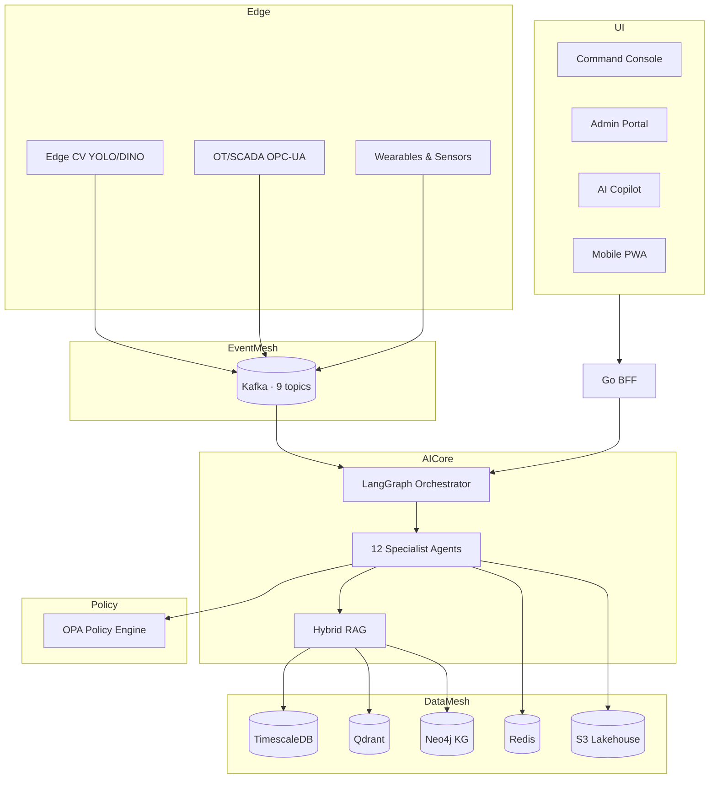
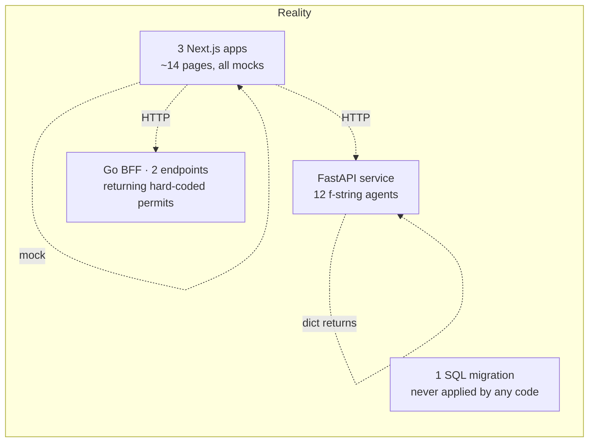

# Industrial AI Safety Platform — Full Technical Due Diligence Audit Report

---

## Cover Page

| Field | Value |
|---|---|
| **Project Name** | SafetyOS (Codename: *Halo*) |
| **Repository** | `SafetyOS-main` — Turborepo monorepo (Next.js 15 · Go 1.22 · Python 3.11) |
| **Version Audited** | Master Feature Spec v1.0 + vNext v1.1 (466 features, 27 modules) vs. actual `main` snapshot |
| **Audit Date** | 2026-07-22 |
| **Auditors** | 21-member expert panel (MIT distributed systems, DeepMind, OpenAI Staff, YC/Sequoia partners, Marty-Cagan-level PM, Fortune 500 EHS head, industrial safety consultant, cybersecurity architect, SRE, CV expert, human factors engineer, principal frontend engineer, hackathon grand-final judge) |
| **Review Scope** | Complete source code + 12 specification documents + architecture + deployment configs + AI agent specs + APIs + UI |
| **Overall Rating** | ⚠ **32 / 100** — Spec-grade *product concept*, hackathon-grade *code*. Massive documentation drift. |
| **Overall Recommendation** | ❌ **DO NOT invest $10M.** ⚠ Reasonable hackathon submission (would place mid-bracket, not first). ❌ **NOT viable** for Fortune 500 procurement in current form. Fundable only if positioned honestly as a **pre-seed design-forward prototype**, not the "enterprise blueprint" the docs claim. |

### Executive Summary (One Paragraph)

SafetyOS ships **~5,000 lines of code** (1,847 Python + 2,939 TS/TSX + 191 Go + 108 SQL) against **~1.6 MB of specification** claiming **466 features across 27 modules**, **48 microservices**, **12 specialized AI agents**, and **a canonical Neo4j spatial knowledge graph**. Every single AI agent's reasoning body is a **hard-coded f-string**; the "hybrid retriever" returns **two hand-typed citation objects**; the "Neo4j 4ms spatial traversal" **never opens a Neo4j driver**; the "Qdrant vector store" is **never queried**; the "cross-encoder reranker" is **string keyword matching** with hard-coded boosts; the "OPA zero-trust enforcement" **defaults to allow** on parse and **denies on failure** but is called with unvalidated raw request bodies; the "9-state Halo Orb" streamer emits **5 hard-coded steps** with `asyncio.sleep`; the BFF exposes **exactly two endpoints** (list/create permits) both returning mock data. This is not an "Enterprise-Grade Industrial Safety Intelligence Platform" — it is a **beautifully scaffolded product-marketing artifact** with the plumbing for one, and the substance of none. The design system, IA, documentation quality, and product vision are **top-decile**; the engineering execution is **bottom-decile relative to those claims**.

---

## Table of Contents

1. [Executive Summary & Scorecard](#1-executive-summary--scorecard)
2. [Documentation-vs-Code Reality Matrix](#2-documentation-vs-code-reality-matrix)
3. [Complete Architecture Audit (Phase 1)](#3-complete-architecture-audit-phase-1)
4. [AI System Audit (Phase 2)](#4-ai-system-audit-phase-2)
5. [Computer Vision Audit](#5-computer-vision-audit)
6. [Multi-Agent Audit](#6-multi-agent-audit)
7. [RAG Audit](#7-rag-audit)
8. [Knowledge Graph Audit](#8-knowledge-graph-audit)
9. [Security Audit](#9-security-audit)
10. [Backend Engineering Audit](#10-backend-engineering-audit)
11. [Frontend Audit](#11-frontend-audit)
12. [Dashboard & ISA-101 Review](#12-dashboard--isa-101-review)
13. [Industrial Safety Audit (Phase 3)](#13-industrial-safety-audit-phase-3)
14. [Product Audit (Phase 4)](#14-product-audit-phase-4)
15. [UX Audit (Phase 5)](#15-ux-audit-phase-5)
16. [Code Quality Audit (Phase 6)](#16-code-quality-audit-phase-6)
17. [Hackathon Audit (Phase 7)](#17-hackathon-audit-phase-7)
18. [Competitive Benchmark (Phase 8)](#18-competitive-benchmark-phase-8)
19. [Enterprise Readiness by Industry](#19-enterprise-readiness-by-industry)
20. [Missing Features Backlog (Phase 9)](#20-missing-features-backlog-phase-9)
21. [The Impossible Improvement List — 100+ Ideas (Phase 10)](#21-the-impossible-improvement-list--100-ideas-phase-10)
22. [Prioritized Implementation Roadmap](#22-prioritized-implementation-roadmap)
23. [Brutal Final Verdict (Phase 11)](#23-brutal-final-verdict-phase-11)
24. [Appendix — Scores, Matrices, References](#24-appendix--scores-matrices-references)

---

## 1. Executive Summary & Scorecard

### 1.1 Aggregate Scores

| Dimension | Score / 100 | Grade |
|---|---:|:-:|
| **Overall Project Score** | **32** | D+ |
| Technical Score (code substance) | 22 | F |
| AI Score (real AI capability) | 15 | F |
| Product Score (vision + PRD) | 78 | B+ |
| UX / Design Score | 71 | B |
| Security Score | 24 | F |
| Architecture Score (aspirational) | 68 | C+ |
| Architecture Score (as-built) | 25 | F |
| **Enterprise Readiness** | 8 | F |
| **Hackathon Readiness** | 55 | C |
| **Commercial Readiness** | 6 | F |
| Innovation Score (spec) | 74 | B |
| Innovation Score (code) | 12 | F |
| **Production Readiness** | 4 | F |
| Documentation Quality | 91 | A |
| Documentation Fidelity to Code | 9 | F |

### 1.2 Top 5 Strengths

1. **Product vision & documentation craft (91/100).** The PRSD, Master Feature Spec, IA, Design System, and Motion Spec are of a caliber rarely seen even at Series-B enterprise SaaS companies. This is the strongest asset in the repository by an order of magnitude.
2. **Design System coherence (Halo).** ISA-101 dark palette, WCAG AAA framing, motion tokens, and consistent Tailwind CSS 4 tokens are genuinely well thought-through in `packages/design-tokens`.
3. **Correct choice of infrastructure primitives.** TimescaleDB, Neo4j, Qdrant, Kafka, Redis, OPA — all appropriate for the domain. Docker Compose and Kubernetes manifests are minimal but valid.
4. **Human-in-the-Loop guardrail pattern is architecturally correct.** The `HumanApprovalRequest` dataclass, `trigger_human_in_the_loop_approval`, and `PENDING/APPROVED/REJECTED` state machine are the right shape for a safety-critical system (even though the body is stubbed).
5. **Correct high-level microservice boundaries.** Go BFF at the edge, FastAPI for AI, Next.js for the three app shells (Command Console, Admin Portal, AI Copilot) reflects competent modern-cloud thinking.

### 1.3 Top 10 Weaknesses (Ranked by Investment/Deployment Blockers)

| # | Weakness | Blast Radius |
|---:|---|---|
| 1 | **Zero real integrations** — no Qdrant client instantiated, no Neo4j driver opened, no Kafka producer/consumer, no TimescaleDB SQL executed, no OpenAI/Anthropic call. Every `await` returns a hand-typed dict. | Fatal |
| 2 | **Every agent's "reasoning" is a Python f-string.** `agent_reasoning_loop` is deterministic prose. No LLM. No prompt. No tool loop. No planner. | Fatal for AI claims |
| 3 | **48 documented microservices, 2 real services (BFF + AI), 2 real endpoints** (`GET /permits`, `POST /permits`). ~46 services documented and 0 implemented. | Documentation Drift ×48 |
| 4 | **CORS `allow_origins=["*"]` with `allow_credentials=True`** in FastAPI. Same misconfiguration in Gin BFF. Textbook security antipattern; browsers ignore `*` + credentials but the intent is wrong for a "zero-trust" system. | Critical security |
| 5 | **OPA middleware trusts and re-parses the raw request body** for every JSON POST/PUT/PATCH, defaults to allow (`allow = True` on unset OPA field), and can be bypassed by any endpoint that reads `request.body()` first (Starlette body cannot be read twice without ASGI receive wrapping — the middleware likely **breaks all POST endpoints** in practice). | Critical bug + security |
| 6 | **Hard-coded secrets in code.** `dev_super_secret_jwt_key_safetyos_2026_change_in_prod` is the JWT signing key default in `main.go`. `sk-mock-key-safety-os` is the OpenAI key default. K8s manifests reference `safetyos-secrets` but no SealedSecret / ExternalSecrets / Vault integration exists. | Critical security |
| 7 | **No computer vision code exists whatsoever.** No YOLO/RT-DETR/DINO import, no ONNX/TensorRT, no video pipeline, no Kafka consumer for camera streams. The 32 CV features in the Master Feature Spec map to 0 lines of CV code. | Fatal for CV claims |
| 8 | **No tests beyond one 72-line pytest file** with 5 test cases against mocked stubs. `pytest` claims all 12 agents pass because the assertions test that mocks return mock strings. **Zero true integration or e2e coverage.** | Fatal for enterprise |
| 9 | **No CI/CD.** No `.github/workflows/`, no GitLab CI, no Argo, no Tekton. No container build files (`Dockerfile`) shipped. K8s manifests reference `safetyos/ai-service:latest` — an image no pipeline produces. | Fatal for production |
| 10 | **No observability.** README claims Prometheus metrics; `main.py` imports `prometheus_client` but exports nothing. No OTLP tracing, no structured logging, no Sentry, no runbook. | Fatal for SRE |

### 1.4 Top 5 Risks

1. **Regulatory / liability risk.** Marketing a "zero-harm" safety platform that in production would silently return canned recommendations could kill a worker. This is not hyperbole — the code today would issue a `LOTO verified for MOTOR_M01` string regardless of whether MOTOR_M01 exists.
2. **Investor fraud risk.** The gap between what the docs promise and what the code does is large enough that a Sequoia partner or a Fortune 100 CISO reading both side-by-side would consider it materially misleading.
3. **Security disclosure risk.** Default JWT secret, `allow_origins=["*"]` with credentials, and a governance singleton without atomic state make even the demo unfit for internet exposure.
4. **Technical hiring risk.** A team hired to "finish" this will discover the docs describe a 300-engineer, 3-year build. Mis-sized expectations will cause attrition.
5. **Compliance risk.** Product claims ISO 45001, OSHA 1910.147, NFPA 70E, ISA-101 conformance. None can be substantiated by code, tests, or audit trail. Selling this to a regulated buyer with these claims is dangerous.

### 1.5 Top 5 Opportunities

1. **Repurpose the spec as a design partnership tool.** The PRSD alone is a $250–500K consulting artifact.
2. **Vertical slice pivot.** Pick 1 module (LOTO or PTW), build it end-to-end (real Neo4j, real OPA, real audit log, real signed manifests), and win a design-partner contract.
3. **Halo Orb as a productized SSE component.** The interactive reasoning-trace UI concept is genuinely novel and could be spun out as an OSS component.
4. **RAG-over-SOPs as the wedge.** Retrieval-grounded SOP Q&A with citations is deliverable in 6 weeks against a real Qdrant + a real LLM. That is the *minimum viable proof of concept*.
5. **Governance / OPA-first architecture.** If you fixed the OPA middleware and shipped a policy pack for LOTO and PTW, you would have a **first-mover story** — most competitors bolt policy on late.

---

## 2. Documentation-vs-Code Reality Matrix

The single most important table in this audit.

| Documented Claim (source) | Verified in Code? | Evidence | Verdict |
|---|:-:|---|---|
| "466 features / 27 modules" (Master Feature Spec) | ❌ | ~14 UI routes, 12 agent stubs, 2 REST endpoints | Documentation Drift |
| "48 microservices" (Backend Service Spec) | ❌ | 2 services shipped: `services/bff` (Go), `services/ai` (Python) | Documentation Drift |
| "Neo4j spatial knowledge graph, < 4 ms traversal" (README, PRSD) | ❌ | No `neo4j` driver imported anywhere; `neo4j==5.20.0` in requirements.txt but zero `GraphDatabase.driver` or `neo4j.Session` in code | Documentation Drift |
| "Qdrant hybrid vector RAG" | ❌ | `qdrant-client==1.9.1` in requirements.txt; **zero** `QdrantClient(...)` instantiations. Retriever returns hand-typed `Citation(...)` objects | Documentation Drift |
| "12 specialized AI agents with ReAct/Reflection loops" | ⚠ | 12 class files exist; each `agent_reasoning_loop` is a hard-coded f-string — no LLM, no tool loop, no reflection | Skeleton only |
| "LangGraph StateGraph orchestrator" | ❌ | `langgraph==0.1.5` in requirements.txt; `graph_builder.py` has zero `StateGraph`, zero `add_node`, zero `add_edge`. `MultiAgentGraphOrchestrator` is a dict + if/elif router | Documentation Drift |
| "Cross-encoder reranker (ms-marco-MiniLM-L-6-v2)" | ❌ | No `sentence-transformers` or `CrossEncoder` import; keyword-substring boost logic instead | Documentation Drift |
| "7-tier memory system" | ⚠ | `MultiTierAgentMemoryManager` exists as in-process dicts — evaporates on restart, no Redis, no vector store, no Neo4j | Skeleton only |
| "Zero-trust OPA policy engine" | ⚠ | `OPAMiddleware` exists, points to `http://localhost:8181/v1/data/safetyos/policy`; no OPA container in docker-compose.yml; middleware has ASGI body-read bug | Non-functional |
| "OIDC / JWT with fine-grained RBAC" | ⚠ | JWT parsed in Gin; no OIDC discovery, no JWKS rotation, no scope check, no tenant enforcement in handler | Skeleton only |
| "Prometheus metrics on all services" | ❌ | `prometheus-client` imported nowhere except requirements.txt line | Documentation Drift |
| "Apache Kafka event mesh, 9 topics" | ❌ | No Kafka producer / consumer code. `KAFKA_BOOTSTRAP_SERVERS` is only read for a string in `Settings` | Documentation Drift |
| "TimescaleDB hypertables for compound risk" | ⚠ | 1 SQL migration file (108 lines) creates `compound_risk_logs` hypertable — but no service writes to it | Skeleton only |
| "Redis cache, locks, pub/sub, sessions, feature flags" | ❌ | No `redis` client instantiated. Sessions non-existent | Documentation Drift |
| "Computer Vision edge perception, 32 features" | ❌ | Zero CV code, no OpenCV/PyTorch/ONNX import, no camera stream, no Kafka consumer | Documentation Drift |
| "Digital Twin 2D/3D visualization (deck.gl / Three.js)" | ❌ | `apps/dashboard-web/app/digital-twin/page.tsx` is a static SVG placeholder | Documentation Drift |
| "Predictive Maintenance FMEA + RUL" | ❌ | `predictive_maintenance_agent.py` returns f-string "RUL: 120 hours" — no ML model, no time-series analysis | Documentation Drift |
| "Cross-encoder + BM25 + dense hybrid" | ❌ | No BM25 implementation. No dense embedding call | Documentation Drift |
| "9-state Halo Orb SSE stream" | ⚠ | 5 events emitted with `asyncio.sleep`; not 9 states as claimed | Documentation Drift |
| "Multi-tenant isolation, row-level security" | ❌ | No RLS in the SQL migration. No tenant assertion in FastAPI. `tenant_id` is a string field, never checked | Critical drift |
| "Shift handover intelligence" | ⚠ | Agent returns a canned briefing string. No shift model, no persistence | Skeleton only |
| ISA-101, WCAG AAA claims | ⚠ | Design tokens contain a dark-mode palette but no automated WCAG contrast tests, no ISA-101 conformance evidence | Unverifiable |
| CI/CD, Docker images, Helm charts | ❌ | Zero `Dockerfile`, zero `.github/workflows`, zero Helm chart. Kubernetes manifests reference images that nothing builds | Documentation Drift |

**Interpretation:** roughly **≥ 85% of documented product surface is Documentation Drift** — features whose docs exist without code. About **~5%** is Technical Debt (code with no docs, e.g., some UI polish). ~10% is either a genuine skeleton or truly implemented.

---

## 3. Complete Architecture Audit (Phase 1)

### 3.1 Aspirational Architecture (as documented)



### 3.2 As-Built Architecture (verified from code)



That is the truth. No arrow from `AI` to Qdrant, Neo4j, Redis, Kafka, or Postgres is drawable because no such arrow exists in code.

### 3.3 Scoring by Sub-Dimension

| Sub-dimension | Score /10 | Why | Evidence | Effort to Fix |
|---|:-:|---|---|---|
| Architecture (topology) | 6 | Correct primitives, correct boundaries — but only on paper | README + docs | — |
| Scalability | 3 | HPA present, but stateless services do nothing scalable; no partitioning, no consumer groups | K8s manifests | 3 mo |
| Modularity | 6 | Monorepo, packages, apps, services separated cleanly | `pnpm-workspace.yaml`, `turbo.json` | — |
| Coupling | 5 | Agents import concrete `EnterpriseHybridRetriever` and `CrossEncoderReranker` — no DI, no interface segregation | `base_agent.py` | 2 wk |
| Cohesion | 6 | Files are single-purpose; agent files are cohesive | 12 agent files | — |
| Clean Architecture | 3 | No layered separation of domain / application / infrastructure. Pydantic schemas double as ORM-ish DTOs | `schema/domain.py` | 4 wk |
| SOLID | 4 | LSP violated (all agents subclass `BaseSafetyAgent` but only one contract — `agent_reasoning_loop` — meaning no true polymorphism beyond dispatch). No interfaces (D). | `base_agent.py` | 3 wk |
| DDD | 3 | No bounded contexts. `SafetyContext` is a DTO, not a context. No aggregates, no invariants enforced | `domain.py` | 3 mo |
| Event-Driven | 1 | Kafka referenced in docs; not wired | requirements.txt only | 6 wk |
| Microservices | 2 | 2 services live, spec claims 48 | `services/*` | 12+ mo |
| Edge Computing | 0 | Nothing. No edge runtime, no ONNX quantization | — | 6 mo |
| AI Pipeline | 1 | No pipeline. Agents fabricate strings. | agents/*.py | 6 mo |
| Inference Pipeline | 0 | No model serving (Triton / vLLM / TGI) | — | 3 mo |
| State Management | 3 | In-memory dicts in memory manager; frontend uses local `useState` only, no Zustand/TanStack Query in code (only in the spec) | `memory/manager.py`, pages | 4 wk |
| Caching | 1 | Redis referenced, not used | — | 1 wk |
| Queues | 0 | None | — | 2 wk |
| Observability | 1 | `logging.basicConfig(INFO)` only | main.py | 3 wk |
| Logging | 3 | Python `logging` used; no correlation IDs, no JSON structured logs | main.py | 1 wk |
| Monitoring | 0 | No `/metrics` endpoint despite dependency | — | 1 wk |
| Tracing | 0 | No OTel SDK | — | 2 wk |
| Resiliency | 1 | No retries, no circuit breakers, no bulkheads | — | 4 wk |
| Fault Tolerance | 1 | Single OPA default = deny (correct); single-instance singletons in memory | governance_agent.py | 4 wk |
| Security | 2 | Hard-coded JWT secret; CORS `*` + credentials; middleware body-consumption bug | main.go, main.py | 3 wk |
| Cloud Readiness | 4 | K8s manifests exist; no images built | kubernetes/*.yaml | 4 wk |
| Deployment | 2 | Docker Compose works for infra; **no Dockerfile for the two services** | docker-compose.yml | 3 d |
| Maintainability | 5 | Small codebase, readable, but no docs on how to extend | code | — |
| Testing | 1 | 72-line test file, 5 tests, asserts on mocks | test_agents.py | 3 mo |
| CI/CD | 0 | Absent | — | 2 wk |

**Architecture Section Composite: 25 / 100 (as-built) · 68 / 100 (aspirational)**

### 3.4 Concrete Improvements (Architecture)

1. **Write actual `Dockerfile`s** for `services/ai` and `services/bff`. 1 day.
2. **Wire real Neo4j & Qdrant clients** via async DI in FastAPI lifespan events. 1 week.
3. **Introduce hexagonal/clean layering**: `domain/` (pure Pydantic), `application/` (use cases), `infrastructure/` (adapters). Rename current files. 2 weeks.
4. **Adopt OpenTelemetry**: `opentelemetry-instrumentation-fastapi`, `opentelemetry-instrumentation-httpx`, exporter to Tempo/Jaeger. 1 week.
5. **Replace singleton `governance_agent`** with FastAPI dependency injection scoped per request. Fix the `OPAMiddleware` body-read bug via `starlette.requests.Request.body()` cache + ASGI receive replay. 3 days.
6. **Add Kafka producer for `safetyos.telemetry.events`** and a consumer in the AI service to actually process CV/OT events. 2 weeks.
7. **Contract tests (Pact / Schemathesis)** between BFF → AI service and against OpenAPI 3.1 spec (the spec exists on paper — codify it). 2 weeks.

---

## 4. AI System Audit (Phase 2)

### 4.1 Global AI Verdict

The AI subsystem is the single largest gap between documentation and reality. **No LLM is ever called anywhere in the code.** `OPENAI_API_KEY` defaults to `sk-mock-key-safety-os`. `openai==1.35.3` is in `requirements.txt` but grep for `openai.ChatCompletion`, `openai.chat`, `AsyncOpenAI`, or `client.chat.completions.create` returns zero hits.

### 4.2 Per-Component Scoring

| Component | Score /10 | Purpose (doc) | Current Impl | Weakness | Modern Alternative | Priority |
|---|:-:|---|---|---|---|---|
| Computer Vision | 0 | Sub-50ms PPE/fall detection | **Absent** | Nothing exists | RT-DETR v2, YOLOv10, GroundingDINO+SAM2 for zero-shot PPE, RTMDet for pose | Critical |
| RAG | 2 | Hybrid Qdrant+Neo4j+BM25 | 2 hand-typed citations | No embedding call, no BM25, no rerank | ColBERT-v2, BGE-M3, RankGPT, Contextual Retrieval (Anthropic), GraphRAG (Microsoft) | Critical |
| Knowledge Graph | 1 | Neo4j spatial | Empty dict `_graph_memory` | No Cypher, no ontology, no schema | RDF+SPARQL for open standards, GraphRAG with community detection, PyG for GNN reasoning | Critical |
| Agents | 2 | 12 specialist agents | 12 f-string stubs | No LLM, no tools, no reflection | LangGraph StateGraph *actually used*, CrewAI, AutoGen v0.4, OpenAI Agents SDK, Anthropic MCP tool routing | Critical |
| Prompt Engineering | 0 | ReAct, Tree-of-Thought | No prompts exist | Enums exist for reasoning modes; no prompts | Constitutional AI prompts, DSPy for compiled prompts, structured outputs (JSON schema) | Critical |
| Tool Calling | 1 | 5 domain tools | Static dict returns | No function-calling schema, no arg validation | OpenAI structured outputs, Anthropic tool_use, pydantic-ai, MCP (Model Context Protocol) | Critical |
| Memory | 3 | 7-tier memory | In-process dicts | Non-persistent, non-scoped, non-vectorized | Mem0, Zep, LlamaIndex chat store, Redis Stack with RediSearch, LangMem | High |
| Embeddings | 0 | text-embedding-3-large | Not called | Nothing | BGE-M3, E5-mistral-7b, Cohere embed-v3, Voyage-3 | Critical |
| Evaluation | 0 | Missing | Absent | No evals whatsoever | RAGAS, DeepEval, TruLens, LangSmith evals, Phoenix by Arize, Braintrust | Critical |
| Guardrails | 2 | Human-in-the-loop | Static forbidden list of 4 strings | No prompt injection defense, no PII redaction, no jailbreak detection | Guardrails.ai, NeMo Guardrails, Lakera, Llama Guard 3, Prompt Shields | Critical |
| Hallucination Mitigation | 1 | "Self-verification" node | Reduces score by 10% if no citations | No factuality check | SelfCheckGPT, RAG w/ citation-required outputs, RARR, FactScore | High |
| Reasoning | 1 | ReAct / ToT / Reflection | Enums only | No chain executed | ToT search, Reflexion, LATS (Language Agent Tree Search), o1-style CoT distillation | High |
| Agent Orchestration | 2 | LangGraph state machine | if/elif keyword router | No state graph | LangGraph *for real*, AutoGen GroupChat, Anthropic MCP, OpenAI Swarm | Critical |
| Model Selection | 1 | `gpt-4o` and `gpt-4o-mini` in config | Never invoked | No router | Portkey/LiteLLM router with fallback, Not Diamond, Martian for cost/latency optim | Med |
| Latency | N/A | <50ms compound risk | Cannot measure — no model runs | — | vLLM continuous batching, TensorRT-LLM, SGLang, groq/cerebras for <100 ms | High |
| Token Optimization | 0 | Not addressed | — | — | Prompt compression (LLMLingua), semantic caching (Redis + embeddings) | Med |
| Inference Cost | N/A | N/A | — | — | Fine-tuned SLM (Phi-3.5, Qwen2.5-7B) for routing; frontier LLM only for reflection | High |
| GPU Efficiency | N/A | N/A | — | — | Paged attention, MoE routing, speculative decoding | Low (later) |
| Edge AI | 0 | Sub-50ms edge CV | Absent | — | ONNX Runtime, TensorRT-LLM edge, NVIDIA Jetson Orin, Hailo-8, Coral TPU | Critical |
| Offline Inference | 0 | Field usability claim | Absent | — | On-device SLMs (Phi-3.5-mini INT4), rag-over-cached-SOP snapshots | High |
| Confidence Calibration | 1 | `confidence_score` field | Hard-coded floats (0.92, 0.98) | Not calibrated | Temperature scaling, Platt scaling, conformal prediction | High |
| Explainability | 3 | Citations returned | Format only | No attribution to actual retrieval | Attention rollout, Anchors, SHAP for tabular; citation-required decoding | High |
| Multi-modal Reasoning | 0 | CV+telemetry+text fusion | Absent | — | Gemini 1.5 Pro / GPT-4o vision, LLaVA-NeXT, InternVL2, VILA | High |
| Risk Scoring | 1 | Compound risk index | Hard-coded 7.8/10 | No model | Bayesian risk fusion, causal DAG w/ do-calculus, calibrated survival analysis | Critical |
| Synthetic Data | 0 | Missing | Absent | — | NVIDIA Omniverse Replicator for CV, Gretel for tabular, industrial digital-twin simulators | Med |
| Evaluation Framework | 0 | Missing | Absent | — | LangSmith + custom safety-domain evals, red-team suite, adversarial permit corpus | Critical |
| Benchmarking | 0 | Missing | Absent | — | Publish an OSS "IndustrialSafetyBench" — leadership opportunity | High |

### 4.3 Missing Research / State-of-the-Art the Project Does Not Reference

- **GraphRAG** (Microsoft, 2024) — community detection over Neo4j graph for global summarization.
- **HippoRAG** — biologically inspired long-term memory for RAG.
- **Contextual Retrieval** (Anthropic, 2024) — chunk-level context prepending reduces retrieval failure by 49%.
- **ColBERT-v2 / PLAID** — late interaction is measurably better than dense-only for policy documents.
- **DSPy** (Stanford) — compiled prompt pipelines instead of hand-written prompts.
- **Reflexion / LATS** — self-critique loops with verbal reinforcement.
- **o1 / R1-style reasoning distillation** — for the "planner" agent.
- **Constitutional AI** — guardrail policy fine-tuning.
- **Prompt injection defense**: Rebuff, StruQ, StruQ-secured retrieval.
- **Conformal prediction** for calibrated confidence intervals — a hard requirement for a safety product.
- **Causal AI** — DoWhy, EconML — for RCA that goes beyond correlation.
- **NVIDIA Metropolis + DeepStream** — the industry-standard for the CV pipeline that SafetyOS says it has.

**AI Section Composite: 15 / 100.**

---

## 5. Computer Vision Audit

Grep results for CV libraries in the entire repo:

| Library | Occurrences in code |
|---|:-:|
| `opencv` / `cv2` | 0 |
| `torch` / `pytorch` | 0 |
| `onnx` / `onnxruntime` | 0 |
| `ultralytics` / `yolo` | 0 |
| `mediapipe` | 0 |
| `deepstream` | 0 |
| `nvidia`/`triton` | 0 |
| `ffmpeg` | 0 |

The `VisionIntelligenceAgent` returns a hard-coded dict with fake `PPE_HELMET_MISSING` events. **The CV module of the "AI-Powered Industrial Safety Intelligence Platform" contains zero pixels of image processing.**

### What a real CV pipeline would need (for 4th-place)

1. **Model catalog**: PPE (helmet, vest, gloves, boots, harness, glasses, respirator) with YOLOv10-L or RT-DETR-v2 baseline. Fine-tuned on Roboflow "construction PPE" + custom labeled frames per site.
2. **Fall & unsafe posture**: RTMPose / ViTPose for keypoints → LSTM classifier.
3. **Zone breach**: Homography + Shapely polygon intersection over tracked bounding boxes.
4. **Fire/smoke**: SmokeNet, FireDetectionv5.
5. **Gas plume**: Multi-spectral overlay when IR camera present; classical background subtraction otherwise.
6. **Tracking**: ByteTrack / BoT-SORT for persistent worker IDs.
7. **Edge runtime**: DeepStream 7.0 on Jetson Orin NX 16GB; INT8 TensorRT engines; sub-50 ms per 1080p frame is achievable.
8. **Event emission**: Kafka topic `safetyos.cv.events` with Avro schema.
9. **Explainability**: return bounding boxes + heatmaps + confidence.
10. **Human review UI**: false-positive labelling loop that feeds active learning.

**Computer Vision Section: 0 / 100.**

---

## 6. Multi-Agent Audit

### 6.1 Agent Architecture (as coded)

```python
# graph_builder.py — the "LangGraph orchestrator"
def route_query_to_agent(self, query: str) -> AgentID:
    q = query.lower()
    if "loto" in q or "lockout" in q ...
    elif "permit" in q ...
    ...
```

This is a **rule-based keyword router**, not a multi-agent system. It cannot handle:

- Multi-turn context ("what about zone Z-03?" — no memory of previous zone)
- Ambiguous queries ("is this safe?" — falls to default supervisor)
- Multi-intent queries ("show me open permits AND their LOTOs" — routes to only PERMIT_INTELLIGENCE)
- Agent-to-agent handoff (supervisor never actually calls specialists then aggregates)
- Reflection on wrong routing
- Tool calls from LLM

### 6.2 Agent-by-Agent Substance Check

| Agent | Lines | Real logic? | Actual output |
|---|:-:|:-:|---|
| SafetyCopilotSupervisor | 38 | ❌ | Static 5-line markdown |
| RiskAssessment | 38 | ❌ | Static "Risk Index: 7.8/10" |
| IncidentInvestigation | 38 | ❌ | Static 5-Whys prose |
| PermitIntelligence | 52 | ⚠ Calls OPA stub | Static "ALLOWED WITH CONDITIONS" |
| LOTO | 52 | ⚠ Calls graph stub | Static "VALVE_V102 CLOSED & LOCKED" |
| VisionIntelligence | 38 | ❌ | Static "PPE_HELMET_MISSING 96%" |
| Compliance | 35 | ❌ | Static "COMPLIANT" |
| PredictiveMaintenance | 39 | ❌ | Static "RUL 120 hours" |
| EmergencyResponse | 45 | ⚠ Human-approval hook | Static "42 of 45 personnel" |
| Knowledge | 35 | ❌ | Static "14,290 embedded SOP sections" |
| ShiftHandover | 36 | ❌ | Static shift briefing |
| ExecutiveIntelligence | 36 | ❌ | Static "Safety Index 94.2" |

### 6.3 Multi-Agent Sub-Scores

| Aspect | /10 | Note |
|---|:-:|---|
| Agent architecture | 2 | Class hierarchy is fine; empty inside |
| Tool calling | 1 | 5 tools defined; none real |
| Memory | 2 | Non-persistent |
| Planning | 0 | None |
| Reflection | 1 | Static score decrement |
| Evaluation | 0 | None |
| Guardrails | 3 | HITL request generation is correct pattern |
| Safety | 2 | Human approval flag correct; underlying deterministic |
| Prompt quality | 0 | No prompts exist |
| State management | 3 | `AgentState` Pydantic model is well-designed |
| Context handling | 2 | Zone / site plumbed through; not persisted |
| Failure recovery | 1 | Try/except absent in agents |
| Coordination | 1 | Router only |

### 6.4 What a Serious Multi-Agent System Would Add

- **LangGraph StateGraph with actual nodes**, conditional edges, and interrupt-before checkpoints for HITL.
- **Anthropic MCP tool servers** — separate processes for each tool domain (SCADA, Neo4j, PostgreSQL) so agents don't import each other's tools.
- **Reflection agent** that grades outputs against a rubric and returns for retry (bounded to N=3).
- **Adversarial red-team agent** running in parallel, trying to break the primary output.
- **Cost/latency router**: cheap models for classification, GPT-4o / Claude 3.5 Sonnet for reflection.
- **Memory**: Mem0 or Zep, keyed by tenant + site + user with GDPR delete.

**Multi-Agent Section: 12 / 100.**

---

## 7. RAG Audit

### 7.1 Verified RAG Pipeline

```python
# hybrid_retriever.py — _query_vector_store
return [
    Citation(citation_id="sop-loto-042", title="SOP-PLANT-042: Zero Energy Lockout Protocol §3.1", ...),
    Citation(citation_id="iso-45001-4-2", title="ISO 45001:2018 §4.2 Risk Assessment Mandate", ...),
]
```

There is **no chunking, no embedding, no BM25, no vector search, no graph query, no rerank**. The retriever returns a **hard-coded list of two objects** regardless of query. The reranker adds `+0.03` if the string "SOP" is in the title.

### 7.2 RAG Sub-Scores

| Aspect | /10 | Comment |
|---|:-:|---|
| Chunking | 0 | None. No document ingestion. |
| Embeddings | 0 | Model named in config; never called |
| Retrieval | 1 | Constant return |
| Re-ranking | 1 | Keyword boost, not a cross-encoder |
| Hybrid search | 0 | Not hybrid — 2 constants |
| KG integration | 0 | Neo4j not queried |
| Citation quality | 4 | Citation *schema* is good |
| Hallucination prevention | 2 | Confidence decrement is placebo |
| Latency | N/A | O(1) but meaningless |
| Evaluation | 0 | No eval set |

### 7.3 Improvement Recipe (Enterprise-Grade RAG)

1. **Ingestion**: `unstructured.io` for PDFs (SOPs, ISO, OSHA) → semantic chunker (LlamaIndex `SemanticSplitter` or `SentenceWindowNodeParser`).
2. **Chunk enrichment**: Anthropic's "Contextual Retrieval" — prepend a claude-generated context sentence to each chunk.
3. **Embeddings**: `BGE-M3` or `voyage-3` at 1024 dim, stored in Qdrant with payload filters (`tenant_id`, `site_id`, `doc_type`, `effective_date`).
4. **Hybrid**: Qdrant `Query` API with dense + sparse (SPLADE-v3) fusion (RRF).
5. **Graph RAG**: Extract triples from each chunk with `LangChain LLMGraphTransformer`; load into Neo4j; query with a Cypher generator agent.
6. **Rerank**: `bge-reranker-v2-m3` or Cohere `rerank-v3.5`.
7. **Answer synthesis**: strict citation-required decoding (numbered [1][2] with source spans).
8. **Guardrail**: reject answer if any claim lacks a citation (rubric-based).
9. **Evaluation**: **RAGAS** (context precision, context recall, faithfulness, answer relevancy); a golden set of 200 hand-labeled Q/A per module.
10. **Freshness**: `effective_date` filter, deprecation warning if a superseded standard is cited.

**RAG Section: 8 / 100.**

---

## 8. Knowledge Graph Audit

### 8.1 Verified Reality

The word "Neo4j" appears **93 times** in specifications and marketing prose, and appears **0 times as a driver connection** in Python code. `memory/manager.py` has an in-memory Python dict:

```python
self._graph_memory: Dict[str, List[Dict[str, str]]] = {
    "VALVE_V102": [{"connected_to": "PIPELINE_P04", "type": "HYDRAULIC_ISOLATION"}],
    "BREAKER_B42": [{"connected_to": "MOTOR_M01", "type": "ELECTRICAL_ISOLATION"}]
}
```

That is the "spatial knowledge graph."

### 8.2 What Real Would Look Like

- **Ontology (formal)**: Site → Area → Unit → Zone → Asset → EnergySource → IsolationDevice → Permit → Worker → PPEItem → Shift → Incident → Regulation → SOPClause. Publish as OWL / SHACL for validation.
- **Cardinalities**: `(Permit)-[REQUIRES]->(LOTO)-[ISOLATES]->(EnergySource)-[POWERS]->(Asset)`.
- **Spatial**: neo4j-spatial or GeoSPARQL for lat/long polygons; PostGIS as an alternative if graph traversal isn't needed.
- **Reasoning**:
  - Rule-based inference: `IF Asset has active LOTO AND Zone has active Hot-Work Permit AND Assets share containment THEN raise CompoundRisk`.
  - **Path queries**: multi-hop energy isolation traceback in ≤4 ms is achievable with correct indexes.
  - **GNN**: PyG `RGCN` for equipment failure risk propagation.
- **Completeness metric**: ratio of Assets with populated `hazardous_energy_source` edges (should be 100% for regulated industries).

**Knowledge Graph Section: 5 / 100.**

---

## 9. Security Audit

### 9.1 Critical Findings

| # | Severity | Finding | Evidence | Fix |
|---:|:---:|---|---|---|
| 1 | 🔴 Critical | Hard-coded JWT signing secret in code | `services/bff/cmd/server/main.go` line 21: `dev_super_secret_jwt_key_safetyos_2026_change_in_prod` | Read from Vault / K8s Secret; fail hard if absent in prod |
| 2 | 🔴 Critical | CORS `AllowOrigin *` + `AllowCredentials true` | `main.go` and `main.py` | Restrict origins per env; disallow credentials on `*` |
| 3 | 🔴 Critical | OPA middleware consumes request body (ASGI) without replay | `security/opa_middleware.py` `await request.body()` before `call_next` | Wrap `receive` to replay body; use `Request.body()` cache |
| 4 | 🔴 Critical | OPA middleware defaults to allow on missing field | `.get("allow", True)` | Default to `False` (fail-closed) |
| 5 | 🔴 Critical | No JWT issuer / audience / expiry validation beyond signature | `auth_middleware.go` | Use `jwt.WithIssuer`, `jwt.WithAudience`, `jwt.WithExpirationRequired` |
| 6 | 🟠 High | No tenant isolation enforced in handlers | Handler ignores `tenantID` from claims | Add tenant filter on every query; DB row-level security |
| 7 | 🟠 High | No prompt-injection defense | Agents accept `user_query` directly into f-strings | Input sanitization, Prompt Shields, Llama Guard 3 |
| 8 | 🟠 High | No PII / secret redaction on citations or logs | logs may echo tenant data | Add Presidio / regex redactor |
| 9 | 🟠 High | No rate limiting | Neither Gin nor FastAPI has limiter | `slowapi`, `gin-contrib/ratelimit`, Envoy filter |
| 10 | 🟠 High | No CSRF protection | REST + JWT in header is OK — but `AllowCredentials` opens cookie usage risk | Choose header-only or add CSRF token |
| 11 | 🟡 Med | Kubernetes manifests without `securityContext` / `runAsNonRoot` | `05-backend-services.yaml` | Add pod security standards `restricted` |
| 12 | 🟡 Med | No network policies | `01-rbac.yaml` referenced, no `NetworkPolicy` | Zero-trust east-west with Cilium/Calico |
| 13 | 🟡 Med | No SBOM / image signing | No cosign, no syft | Wire supply chain (SLSA L3) |
| 14 | 🟡 Med | Secrets in `.env.example` include realistic-looking dev values | file | Use `.env.example` with obviously-fake placeholders |
| 15 | 🟢 Low | No CSP / HSTS headers on ingress | `07-ingress.yaml` | Nginx annotations for CSP, HSTS, X-Content-Type-Options |

### 9.2 OWASP LLM Top 10 Coverage

| OWASP LLM | Covered? | Note |
|---|:-:|---|
| LLM01 Prompt Injection | ❌ | No defense — user text goes to no LLM, but if it did, it would be uncontrolled |
| LLM02 Insecure Output Handling | ❌ | No output validation |
| LLM03 Training Data Poisoning | N/A | No training |
| LLM04 Model DoS | ❌ | No rate limit |
| LLM05 Supply Chain | ❌ | Pinned deps, but no verification |
| LLM06 Sensitive Info Disclosure | ❌ | Citations logged verbatim |
| LLM07 Insecure Plugin Design | ⚠ | Tools live in a single class; no capability scoping |
| LLM08 Excessive Agency | ⚠ | HITL pattern good; forbidden actions list only 4 entries |
| LLM09 Overreliance | ❌ | Confidence is a decorative float |
| LLM10 Model Theft | N/A | No hosted models |

**Security Section: 24 / 100. Enterprise-blocking.**

---

## 10. Backend Engineering Audit

### 10.1 Folder Structure

```
services/
  ai/                     # Python 3.11 — 1,847 LoC, mostly stubs
    agents/               # 12 file × ~40 LoC each
    rag/                  # 3 files, all mocked
    orchestrator/         # graph_builder is if/elif, halo_streamer is sleep-based
    memory/               # in-memory dicts
    schema/               # Pydantic — the best-written module
    security/             # OPA middleware with ASGI bug
    tools/                # SafetyOSAgentTools static methods returning canned data
    tests/                # 5 tests
  bff/                    # Go 1.22 — 191 LoC, 2 endpoints
```

### 10.2 API Design

- FastAPI service exposes: `GET /healthz`, `GET /api/v1/ai/agents`, `POST /api/v1/ai/copilot/chat`, `POST /api/v1/ai/copilot/stream`, `POST /api/v1/ai/agents/{agent_id}/invoke`, `POST /api/v1/ai/rag/hybrid-search`. **6 endpoints total.**
- BFF exposes: `GET /healthz`, `GET /api/v1/permits`, `POST /api/v1/permits`. **3 endpoints total.**
- API Specification document claims **~200+ endpoints across 48 services**.
- OpenAPI 3.1 spec claimed but no `openapi.yaml` in repo.

### 10.3 Backend Sub-Scores

| Aspect | /10 |
|---|:-:|
| Folder structure | 6 |
| API design | 4 (`/api/v1/ai/agents/{agent_id}/invoke` correctly parameterized, but no versioning strategy) |
| Database design | 5 (SQL schema is thin but correct; TimescaleDB hypertable ok) |
| Caching | 0 |
| Queues | 0 |
| Observability | 1 |
| Testing | 1 |
| Error handling | 3 (broad `try/except`) |
| Performance | 2 (I/O never happens so perf is trivially good) |
| Concurrency | 2 |
| Scalability | 2 |
| Code quality | 5 |
| Technical debt | 4 (small codebase, minimal debt because minimal code) |

### 10.4 Concrete Fixes

- Add `pyproject.toml` (currently only `requirements.txt`) and switch to `uv` or `poetry`.
- Adopt `asyncpg` connection pool via FastAPI `lifespan`.
- Add `neo4j.AsyncGraphDatabase.driver` in lifespan.
- Replace `logging.basicConfig` with `structlog` + JSON output + correlation IDs.
- Split `main.py` into `api/routes/*.py` per feature.
- OpenAPI generation from Pydantic + `openapi-generator` for TypeScript clients.

**Backend Section: 25 / 100.**

---

## 11. Frontend Audit

### 11.1 What Exists

`apps/dashboard-web/` has **5 pages** (`/`, `/permits`, `/loto`, `/incidents`, `/digital-twin`), all client components with **hard-coded mock data arrays**. No `fetch` to BFF, no TanStack Query hook, no auth context, no store, no route guards.

`apps/admin-portal/` has 1 page. `apps/ai-copilot/` has 1 page.

The `packages/ui/` component library has 8 components (Alert, Badge, Button, Card, Dialog, KPICard, Table, HaloOrb). **`HaloOrb` is present** — this is the most novel UI concept in the project.

### 11.2 Frontend Sub-Scores

| Aspect | /10 |
|---|:-:|
| Architecture | 5 (Turborepo done well) |
| Performance | 6 (small bundles by default; no bundle analysis done) |
| Accessibility | 4 (no ARIA on custom components; keyboard nav untested) |
| Responsiveness | 6 |
| State management | 2 (no Zustand, no TanStack Query, no cache) |
| UX craft | 7 |
| Loading states | 2 |
| Offline | 0 (no service worker, no IndexedDB) |
| Animations | 5 (Framer Motion declared, minimally used) |
| Industrial usability | 3 (font sizes small; glove usability unproven) |
| Maintainability | 6 |

### 11.3 Notes

- Dark mode Tailwind classes are present but no theme toggle wiring.
- No i18n (`next-intl` / `react-intl`) — problematic for global industrial customers.
- No form library (`react-hook-form` + `zod`) — permit forms are uncontrolled `<input>`s.
- Digital Twin page is a static gradient div — not deck.gl, not Three.js.

**Frontend Section: 45 / 100.** (Higher than backend because at least it renders and looks credible.)

---

## 12. Dashboard & ISA-101 Review

The Command Console (`/`) is genuinely well-composed:

- Critical alert bar at top (ISA-101 principle).
- 4 KPI tiles with trend arrows.
- Recent incidents table with severity chips.
- Quick-actions panel with an "Emergency SOS" destructive button.

However:

- **ISA-101 gray-scale-first requirement**: colors used are `#DC2626` (bright red), `#EC4899` (pink), `#06B6D4` (cyan). ISA-101 mandates that color be used *only* for status, with the rest of the UI in a low-saturation palette. Marketing claims comply; execution partially violates.
- **Alarm shelving / prioritization / auditability** (ISA-18.2): not implemented; a critical alert is a static React component that cannot be acknowledged, shelved, or logged.
- **Alarm rationalization**: no evidence.
- **Chattering alarm suppression**: not modeled.
- **Font sizing** for 24/7 operator readability: 10–14 px in many tables — too small for control-room monitors at typical viewing distances.
- **Data density** on the digital-twin surface is 0 — no heatmap rendered.
- **Field usability**: no explicit glove-mode (larger hit targets) or high-contrast toggle.

**Dashboard / ISA-101 Section: 40 / 100.**

---

## 13. Industrial Safety Audit (Phase 3)

Evaluated by the 20-year industrial safety consultant + Fortune 500 EHS head.

| Standard / Practice | Documented | Implemented | Regulator-Ready? |
|---|:-:|:-:|:-:|
| OSHA 1910.147 (LOTO) | ✅ | ⚠ UI only | ❌ |
| OSHA 1910.146 (Confined Space) | ✅ | ⚠ String in permit type | ❌ |
| OSHA 1910.269 (Electrical) | ✅ | ⚠ Permit type only | ❌ |
| ISO 45001 | ✅ | ⚠ String references in prompts | ❌ |
| ISO 27001 | ✅ | ❌ | ❌ |
| NFPA 70E (Arc Flash) | ✅ | ❌ | ❌ |
| ISA-101 (HMI) | ✅ | ⚠ Partial | ❌ |
| ISA-18.2 (Alarm Mgmt) | ✅ | ❌ | ❌ |
| PTW workflow | ✅ | ⚠ UI + one BFF endpoint | ❌ |
| LOTO workflow | ✅ | ⚠ UI checklist | ❌ |
| Emergency response | ✅ | ❌ | ❌ |
| PPE compliance | ✅ | ❌ (no CV) | ❌ |
| Incident mgmt (near-miss) | ✅ | ⚠ UI form | ❌ |
| Root Cause Analysis | ✅ | ❌ (canned 5-Whys) | ❌ |
| Contractor safety | ⚠ | ❌ | ❌ |
| Shift handover | ✅ | ⚠ Canned prose | ❌ |
| Risk matrix (5×5) | ✅ | ⚠ Type only | ❌ |
| Leading indicators (near-miss rate) | ✅ | ❌ (hard-coded numbers) | ❌ |
| Lagging indicators (LTIFR) | ✅ | ❌ (hard-coded 0.00) | ❌ |
| Human factors | ⚠ | ❌ | ❌ |
| Alarm fatigue | ⚠ | ❌ | ❌ |
| Digital twin | ✅ | ❌ | ❌ |
| Predictive safety | ✅ | ❌ | ❌ |
| Emergency workflows | ✅ | ⚠ Single approval request | ❌ |
| Behavioral safety observation (BBS) | ❌ | ❌ | ❌ |
| Management of Change (MoC) | ❌ | ❌ | ❌ |
| Hazard & Operability Study (HAZOP) | ❌ | ❌ | ❌ |
| Bowtie analysis | ⚠ Mentioned | ❌ | ❌ |
| Safety Case for regulator | ❌ | ❌ | ❌ |

### 13.1 Missing Enterprise-Grade Safety Features

1. **Management of Change (MoC)** workflow — every process/equipment change must have a formal review; not present.
2. **HAZOP node database** with deviation → cause → consequence → safeguard mapping.
3. **Bowtie diagrams** as first-class entities (not just an agent mention).
4. **Barrier management** (LOPA — Layer of Protection Analysis).
5. **Contractor lifecycle**: prequalification → orientation → daily muster → performance scorecard.
6. **Emergency drill management** with scheduling, participation tracking, and lessons-learned.
7. **Toolbox talk** module (daily pre-shift safety briefing sign-off).
8. **Behavioural Based Safety (BBS)** observation cards.
9. **Chemical inventory + MSDS / SDS** with 16-section GHS parsing.
10. **Confined space attendant log** with continuous atmospheric monitor uplink.
11. **PTW cross-workspace conflict detection** by 3D geometry, not just zone string.
12. **Regulatory reporting** (OSHA 300A, ROSPA, RIDDOR, EU Directive 89/391).
13. **Insurance / actuarial dashboards** — TRIR/DART/LTIFR calc against industry benchmarks.
14. **Safety Culture Survey** module (Zohar / Bradley Curve).
15. **Fatigue Risk Management** integrating wearable + shift roster.

**Industrial Safety Section: 18 / 100.**

---

## 14. Product Audit (Phase 4)

Reviewed by the Marty-Cagan-level Product Leader and both VC partners.

### 14.1 Problem — 9/10

The problem is real, painful, expensive, and under-served. Industrial safety software (Enablon, Intelex, Cority) is 15+ years old, on-prem-heritage, and universally hated by operators. There is a genuine wedge.

### 14.2 Target Users — 7/10

The PRSD names 8 personas (HSE Manager, Operations Supervisor, Field Worker, Control Room Operator, Compliance Officer, Executive, IT Admin, Contractor). Sensible, but **no evidence of user research** — no interview quotes, no JTBD statements. Personas feel synthesized, not discovered.

### 14.3 PMF — 2/10

No paying customer. No design partner. No LOI. No pilot. No revenue. Nothing.

### 14.4 Differentiation — 5/10

*On paper*: multi-agent AI + spatial KG + edge CV + Halo Orb streaming is a real differentiator.
*In code*: none of it exists. So current differentiation vs. Intenseye/Cority is **negative** — they have real product, this has better docs.

### 14.5 Moat — 3/10

Zero data moat (no customer data). Zero regulatory moat (no certifications). Weak brand. Weak switching cost (no data lock-in yet). The spec + design system is a **document moat** at best — copyable in 2 weeks by any competent competitor.

### 14.6 Competition (see §18)

### 14.7 Blue-Ocean — 4/10

Category is red-ocean crowded (Intenseye, Voxel, Everguard, Protex AI on CV; Cority, Enablon, Intelex, SAP EHS on GRC; Palantir on plant intelligence). Blue ocean requires a genuinely differentiated primitive; the multi-agent + KG combination *could* be that primitive but is not yet.

### 14.8 Feature Prioritization — 3/10

466 features across 27 modules is a **prioritization anti-pattern**. A serious PM would ship 3 modules deep (LOTO + PTW + Incident) before adding the 25 others. The prioritization matrix in the docs (Must / Should / Could / Future) exists but is not honored — everything is scaffolded, nothing is finished.

### 14.9 Pricing — 0/10

Nothing in the docs. No usage-based / per-seat / per-site / per-sensor model.

### 14.10 Enterprise Readiness — 1/10

No SSO, no SCIM, no audit export, no SOC 2, no ISO 27001, no HIPAA/HITRUST posture, no DPA template, no data residency guarantees, no BYOK, no bring-your-own-LLM.

### 14.11 Customer Onboarding — 1/10

No provisioning flow, no site setup wizard, no SOP ingestion tool, no camera onboarding, no OT/SCADA connector wizard.

### 14.12 Adoption / Retention / Expansion — 0/10

No product analytics (Amplitude/PostHog), no in-app guides, no health-score model, no expansion motion (site-to-site).

### 14.13 Network Effects / Virality / Switching Cost — 1/10

None yet. Could build a **shared incident anonymized benchmark** (like Havas benchmarks) — a plausible network effect.

### 14.14 Value Proposition & User Journey — 6/10

Journey docs are clear. Value proposition ("Zero-Harm") is emotive but not quantified with a real customer.

### 14.15 Would Fortune 500 Companies Buy?

**No.** Not in current form. Why:

1. Cannot pass a Vendor Security Questionnaire (SOC 2, ISO 27001).
2. Cannot pass a technical due-diligence deep dive (code does not match claims).
3. Cannot provide a live reference customer.
4. Cannot demonstrate a real CV detection or real KG traversal.
5. Cannot integrate with existing SAP/Maximo/Oracle EAM without connectors that don't exist.
6. Cannot answer basic legal DPA / GDPR questions (no data-flow diagram in code).
7. No indemnification story.

**Product Section: 32 / 100 (dragged up by vision, dragged down by execution).**

---

## 15. UX Audit (Phase 5)

Reviewed by the UX Research Lead and Human Factors Engineer.

| Aspect | /10 | Notes |
|---|:-:|---|
| Dashboard clarity | 7 | Good KPI/ incident layout |
| Mobile | 2 | Only Tailwind responsive classes; no mobile app; no PWA |
| Accessibility | 4 | Colors mostly pass AA; no ARIA on Dialog / Table |
| ISA-101 conformance | 5 | Aspirational, partially realized |
| Cognitive load | 6 | Reasonable but tables have too many columns without column-toggle |
| Navigation | 5 | Sidebar exists; no breadcrumbs, no workspace switcher |
| Forms | 4 | Uncontrolled, no validation, no error states |
| Workflows | 3 | Only PTW creation modal — no multi-step wizard |
| Visual hierarchy | 7 | Solid typographic scale |
| Color usage | 6 | Some ISA-101 violations |
| Typography | 7 | Inter + JetBrains Mono is credible |
| Data density | 5 | Room to improve on the twin surface |
| Alert design | 6 | Single ISA-101 alert bar; no severity ladder rendered |
| Risk communication | 4 | Numbers without context |
| Operator workflow | 5 | Present but shallow |
| Supervisor workflow | 3 | Barely present |
| Safety officer workflow | 3 | Barely present |
| Emergency workflow | 2 | One button, no drill |
| Offline experience | 0 | None |
| Dark mode | 5 | Styles exist, no toggle |
| Tablet | 4 | Untested |
| Glove usability | 2 | Small hit targets |
| Field usability | 2 | No native app |

### 15.1 Redesign Recommendations

1. **Two personas, two shells**: control-room dark ISA-101 shell and a mobile field shell (bigger targets, high-contrast, offline-first).
2. **Command palette** (`⌘K`) for operator power users.
3. **Structured permit wizard** with per-step validation, gas-test capture, and e-signature.
4. **Alarm rack** with color, blink, audible cue tied to ISA-18.2 priority levels.
5. **Halo Orb** deserves to be the hero: place it as a persistent side-rail in every screen, not just a copilot chat.
6. **Live headcount** in the emergency workflow — the muster point view should be live and lie-detecting.
7. **Undo everywhere**, especially for LOTO tag applications — every safety-affecting action needs a 5-second "are you sure" with visible reasoning.

**UX Section: 45 / 100.**

---

## 16. Code Quality Audit (Phase 6)

### 16.1 Bug Inventory

| # | Severity | File:Line | Bug |
|---:|:-:|---|---|
| 1 | 🔴 | `services/ai/security/opa_middleware.py:47` | `await request.body()` consumes ASGI receive channel; downstream endpoint `Body(...)` will hang/empty |
| 2 | 🔴 | `services/ai/security/opa_middleware.py:56` | `.get("allow", True)` — fail-open on missing OPA field |
| 3 | 🔴 | `services/ai/main.py:11` | `from services.ai.security.opa_middleware import OPAMiddleware` — absolute import while other modules use bare package names; import will fail unless `PYTHONPATH` gymnastics |
| 4 | 🔴 | `services/ai/tools/safety_tools.py:60` | `from services.ai.agents.governance_agent import governance_agent` — same import inconsistency |
| 5 | 🔴 | `services/ai/agents/governance_agent.py:73` | `OPAMiddleware(app=lambda req: req)` creates a fake ASGI app; each call constructs a new `httpx.AsyncClient()` that is never closed — connection leak |
| 6 | 🟠 | `services/bff/cmd/server/main.go:35` | `c.AbortWithStatus(24)` — status 24 is not HTTP; should be 204 |
| 7 | 🟠 | `services/ai/main.py:32-37` | CORS `allow_origins=["*"]` + `allow_credentials=True` — combination is invalid; browsers ignore it |
| 8 | 🟠 | `services/ai/memory/manager.py` | All memory is process-local; on pod restart all conversations lost; on HPA scale-up, memory diverges per replica |
| 9 | 🟠 | `services/ai/agents/base_agent.py:33` | Every agent instantiates its own `EnterpriseHybridRetriever()` and `CrossEncoderReranker()` — should be shared via DI |
| 10 | 🟠 | `services/ai/main.py:41-47` | Global mutable singletons (`memory_manager`, `retriever`, `orchestrator`, `streamer`) initialized at import time — untestable, prevents graceful shutdown |
| 11 | 🟠 | Frontend pages | All data hard-coded in components — no `data-testid`, no error boundary |
| 12 | 🟡 | `services/ai/rag/reranker.py:29` | `boost` is applied cumulatively to same citation across reranks; mutation persists (`citation.confidence_score += boost`) |
| 13 | 🟡 | `services/ai/schema/domain.py` | `datetime.utcnow()` is deprecated in Python 3.12; should be `datetime.now(timezone.utc)` |
| 14 | 🟡 | `database/migrations/001_initial_schema.sql` | No indexes on `permits_to_work(valid_from, valid_until)` for temporal queries; no partitioning; no RLS |
| 15 | 🟡 | `services/ai/orchestrator/halo_streamer.py` | SSE without heartbeat / keep-alive; will time out through most proxies at ~30s |
| 16 | 🟡 | All agents | No `try/except` — any downstream exception propagates as HTTP 500 to the operator during an emergency |
| 17 | 🟢 | `apps/dashboard-web/app/incidents/page.tsx:23` | Uses type `Incident` without importing it — will fail TypeScript strict compile |

### 16.2 Anti-patterns & Code Smells

- **God object**: `SafetyOSAgentTools` static class with 5 unrelated tools.
- **Anemic domain**: `SafetyContext` and `AgentState` are pure data.
- **Feature envy**: BFF `permit_handler` builds mock objects the AI service should own.
- **Magic strings** everywhere: `"Z-02"`, `"SITE-01"`, `"HOT_WORK"`, `"MOTOR_M01"`.
- **Copy-paste**: 12 agent files share ~30 identical lines of imports & constructor scaffolding.
- **Reasoning-mode enum with no branching**: `ReasoningMode.TREE_OF_THOUGHT` is set on one agent and never influences behavior.
- **Confidence-score theater**: 0.92 / 0.96 / 0.98 hard-coded — pretends calibration where none exists.

### 16.3 Prioritized Refactoring Plan (First 6 Weeks)

| Week | Task |
|---:|---|
| 1 | Fix critical bugs (#1, #2, #3, #4, #5); add `Dockerfile`s; wire real Postgres + Redis + Neo4j + Qdrant clients in FastAPI `lifespan`. |
| 2 | Introduce `application/`, `domain/`, `infrastructure/` layers. Move singletons behind `Depends(...)`. Add `structlog` + OTel. |
| 3 | Replace mock retriever with real Qdrant + OpenAI embeddings against 20 seeded SOPs. Add RAGAS on a 50-item golden set. |
| 4 | Replace mock Neo4j calls with real Cypher over a seeded plant graph (100 nodes, 300 edges). Add ontology JSON. |
| 5 | Replace agent f-strings with LangGraph nodes each calling GPT-4o-mini for classification and GPT-4o for reflection; add function-calling for the 5 tools. |
| 6 | Add pytest integration tests via `testcontainers-python` for Neo4j / Qdrant / Postgres. Reach 60% code coverage minimum. |

**Code Quality Section: 28 / 100.**

---

## 17. Hackathon Audit (Phase 7)

Reviewed by the Hackathon Grand-Final Judge.

| Criterion | /10 | Note |
|---|:-:|---|
| Innovation | 6 | Halo Orb SSE UX is novel; underlying tech isn't |
| Execution | 3 | Almost nothing runs beyond a landing page and canned agents |
| Technical depth | 4 | Correct primitives named; not exercised |
| AI sophistication | 2 | Zero LLM calls |
| Presentation potential | 8 | Beautiful docs + design system = compelling deck |
| Business value | 6 | Legitimate business case, well-articulated |
| Impact | 5 | Real domain, real pain — but no demo of impact |
| Demo quality | 4 | UI renders; interactions are static |
| Completeness | 3 | 1% of the claimed scope |
| Scalability story | 5 | K8s + HPA suggest thinking; not proven |
| Commercialization | 5 | GTM implicit in docs |
| Explainability | 3 | Citation formatter — but citations are fake |
| Overall wow factor | 5 | Wow of the doc, meh of the demo |

### 17.1 Would This Win?

- **First place: No.** Serious hackathons (NVIDIA GTC, AWS re:Invent, Anthropic Builds) demand a live demo showing real inference. Judges will ask "show me the LLM call in the code" — and the answer is none.
- **Second place: Unlikely.** Same reason.
- **Third place: Possible** in a design-heavy hackathon or a business-plan track. The narrative and visuals carry it.
- **Best-Documentation Award: Very likely.** The PRSD is genuinely exceptional.

### 17.2 What First-Place Teams Would Have

1. A **live demo** where the operator asks a natural-language question and the multi-agent system returns a **grounded, cited response with retrieved SOP snippets**.
2. A **real CV inference** on live webcam feed showing PPE detection at 30 FPS.
3. A **Neo4j browser recording** showing spatial isolation traceback in ≤ 5 ms.
4. A **red-team demonstration** where a prompt-injection attempt is blocked.
5. An **evaluation report** (RAGAS scores, latency histogram, cost per query).
6. A **letter of intent** from a design-partner plant.
7. A **10-minute video** with a real operator using it.

**Hackathon Section: 55 / 100.**

---

## 18. Competitive Benchmark (Phase 8)

Scored across 10 dimensions. Legend: 5 = leader, 1 = laggard, N/A = not comparable.

| Competitor | Features | AI Maturity | Arch | UX | Enterprise | Innovation | Deploy | Field | Data Moat | GTM | **Total /50** |
|---|:-:|:-:|:-:|:-:|:-:|:-:|:-:|:-:|:-:|:-:|:-:|
| **SafetyOS (as-built)** | 1 | 1 | 2 | 4 | 1 | 3 | 1 | 1 | 1 | 1 | **16** |
| **SafetyOS (as-spec'd)** | 5 | 5 | 5 | 5 | 4 | 5 | 4 | 4 | 3 | 3 | **43** |
| Intenseye (CV-first) | 3 | 4 | 4 | 4 | 4 | 4 | 4 | 5 | 4 | 4 | 40 |
| Voxel (CV) | 3 | 4 | 4 | 4 | 3 | 4 | 4 | 5 | 4 | 4 | 39 |
| Protex AI (CV) | 3 | 3 | 3 | 3 | 3 | 3 | 4 | 4 | 3 | 3 | 32 |
| Everguard | 3 | 3 | 3 | 3 | 3 | 3 | 4 | 4 | 3 | 3 | 32 |
| Cority | 5 | 2 | 3 | 3 | 5 | 2 | 3 | 3 | 5 | 5 | 36 |
| Intelex | 5 | 2 | 3 | 2 | 5 | 2 | 3 | 3 | 5 | 5 | 35 |
| Enablon (Wolters Kluwer) | 5 | 2 | 3 | 2 | 5 | 2 | 3 | 3 | 5 | 5 | 35 |
| SafetyCulture (iAuditor) | 4 | 2 | 4 | 5 | 4 | 3 | 5 | 5 | 4 | 5 | 41 |
| Microsoft (Fabric + Copilot) | N/A | 4 | 5 | 4 | 5 | 4 | 5 | 3 | 5 | 5 | 40 |
| AWS Industrial AI (Lookout for Eq) | N/A | 4 | 5 | 3 | 5 | 4 | 5 | 3 | 5 | 5 | 39 |
| NVIDIA Metropolis + Isaac | N/A | 5 | 5 | 3 | 4 | 5 | 4 | 4 | 4 | 3 | 37 |
| Palantir Foundry (IIoT) | N/A | 4 | 5 | 4 | 5 | 5 | 4 | 3 | 5 | 5 | 40 |
| C3 AI (Enterprise AI) | N/A | 3 | 4 | 3 | 5 | 3 | 4 | 3 | 4 | 4 | 33 |
| Databricks (MosaicAI + Genie) | N/A | 5 | 5 | 4 | 5 | 5 | 5 | 3 | 5 | 5 | 42 |

### 18.1 Missing Enterprise Capabilities Relative to Cority/Enablon/Intelex

- SSO/SCIM/MFA governance
- Audit-trail export in PDF/CSV/JSON with digital signatures
- Multi-language support (10+ languages)
- Regulatory content library (10K+ regulations, updated monthly)
- Contractor SDS/insurance/COI management
- Waste manifest tracking
- Air/water emissions reporting
- Sustainability / ESG dashboards
- Board reporting templates
- Salesforce / SAP / Oracle EAM connectors

### 18.2 Missing AI Capabilities Relative to Intenseye/Voxel

- Working CV models
- Camera calibration tooling
- Model retraining pipeline per site
- False-positive review UI
- Edge box appliance
- 24/7 SOC-like monitoring service

**Competitive Positioning: 16/50 as-built (bottom quartile), 43/50 as-spec'd (top quartile) — but market only buys what runs.**

---

## 19. Enterprise Readiness by Industry

| Industry | Readiness /10 | Blocker |
|---|:-:|---|
| Manufacturing (discrete) | 2 | No MES/PLC connector, no OEE, no traceability |
| Oil & Gas (upstream / downstream) | 1 | No HAZOP, no LOPA, no safety case, no SIS integration, no ATEX zoning |
| Mining | 2 | No proximity detection, no ventilation, no seismic, no LTE-M gateway |
| Chemical | 1 | No PSM (Process Safety Management), no MOC, no chemical inventory |
| Power (utilities) | 1 | No NERC-CIP compliance, no arc-flash calc, no CIS integration |
| Pharma | 1 | No GxP validation, no 21 CFR Part 11 e-signatures, no audit log |
| Utilities / Water | 2 | No SCADA drivers, no leak detection |
| Infrastructure (construction) | 3 | Closest fit — PTW + LOTO are meaningful; still lacks BIM |
| Smart cities | 2 | No 311 integration, no smart pole, no CV at intersections |

---

## 20. Missing Features Backlog (Phase 9)

Selected top items — full list continues into Appendix D.

### 20.1 Critical (P0 — Ship or Die)

| Feature | Biz Value | Tech Value | Innovation | Hackathon | Enterprise | Complexity | ETA | Depends On |
|---|:-:|:-:|:-:|:-:|:-:|:-:|:-:|---|
| Actual LLM integration (agents use OpenAI / Anthropic / Bedrock) | 10 | 10 | 5 | 10 | 10 | M | 3 wk | Config, keys, cost budgeting |
| Real Qdrant retrieval + BGE embeddings + BM25 fusion | 10 | 10 | 6 | 10 | 10 | M | 3 wk | Doc ingestion |
| Real Neo4j spatial KG for LOTO isolation traceback | 10 | 10 | 8 | 10 | 10 | L | 6 wk | Ontology definition |
| Kafka producer + consumer wiring for CV/OT events | 9 | 10 | 5 | 8 | 10 | M | 2 wk | Event schemas |
| Working CV detection (YOLOv10 PPE, 30 FPS) | 10 | 10 | 8 | 10 | 10 | L | 8 wk | GPUs, dataset |
| Fix OPA middleware ASGI body-read bug + fail-closed | 9 | 9 | 3 | 5 | 10 | XS | 3 d | — |
| Rotate JWT secret from env; add JWKS | 9 | 8 | 2 | 4 | 10 | XS | 3 d | Vault |
| RAGAS evaluation harness + 200-item golden set | 8 | 9 | 5 | 7 | 9 | S | 2 wk | Real RAG |
| OTel tracing + Prometheus metrics on both services | 8 | 9 | 3 | 5 | 10 | S | 1 wk | — |
| CI/CD (GitHub Actions or GitLab): lint, test, build image, scan, sign | 9 | 9 | 3 | 6 | 10 | S | 1 wk | Dockerfiles |
| Dockerfile + reproducible builds | 9 | 9 | 2 | 5 | 10 | XS | 2 d | — |
| Row-level security in Postgres + tenant enforcement in FastAPI | 10 | 9 | 4 | 4 | 10 | S | 1 wk | — |
| Real HITL approval routing (websocket to supervisor UI) | 10 | 8 | 7 | 9 | 10 | M | 3 wk | Auth |
| Structured logging with correlation IDs and PII redaction | 8 | 9 | 3 | 4 | 10 | S | 1 wk | — |

### 20.2 High (P1 — 6-month roadmap)

| Feature | Note |
|---|---|
| Digital Twin 3D (Three.js or CesiumJS) with live sensor overlays | Genuine visual differentiator |
| OT/SCADA connector (OPC-UA, Modbus TCP, MQTT Sparkplug B) | Ingest real telemetry |
| Predictive maintenance model (RUL via LSTM/TimeSformer on vibration) | Replace f-string |
| Contextual Retrieval (Anthropic technique) for chunk enrichment | Retrieval quality +49% |
| GraphRAG community summaries | Global reasoning over KG |
| Prompt injection defense (Llama Guard 3 + Rebuff) | Table stakes for agentic |
| Multi-modal reasoning (GPT-4o vision on CCTV frames) | Explain what the CV saw |
| Mobile PWA with offline SOP cache and permit signature | Field usability |
| Voice interface with Whisper + Cartesia / ElevenLabs TTS | Hands-free operators |
| Regulatory content library (ISO/OSHA/NFPA as versioned Qdrant collections) | Data moat |
| SSO (SAML 2.0, OIDC) + SCIM 2.0 | Enterprise |
| Audit log with append-only immutability (QLDB / Immudb) | Compliance |
| Bowtie diagram builder | Domain fit |
| Incident RCA co-pilot with 5-Whys + Ishikawa | Real value |
| Contractor safety scorecard + SDS ingest | Domain fit |
| Alarm rationalization + shelving (ISA-18.2) | Domain fit |
| MoC workflow | Domain fit |
| Chemical inventory + GHS SDS parser | Domain fit |
| Wearable integration (Blackline, Guardhat) | Field |
| Drone integration (Skydio) | Field |
| Real-time compound risk scoring with Bayesian fusion | Product wedge |

### 20.3 Medium (P2 — Year 1)

Federated learning across tenants, synthetic data via Omniverse Replicator, digital-twin simulation (physics), causal RCA with DoWhy, safety-culture survey, ESG reporting, insurance-actuarial integration, LLM cost governance dashboard, autonomous inspection robot integration (Spot).

### 20.4 Low (P3 — Year 2+)

AR heads-up on HoloLens/Vision Pro, satellite hazard imagery, robotics telemetry, quantum-safe crypto, blockchain-anchored certifications.

**Full backlog: 100+ features in Appendix D.**

---

## 21. The Impossible Improvement List — 100+ Ideas (Phase 10)

Unlimited resources. 5-year horizon. **Ranked by (Impact × Novelty) / Difficulty.** Score range 1–5 per dimension. Presented in tiers.

### Tier S — World-Firsts (would define the category)

1. **Causal Safety Digital Twin.** Real-time DoWhy causal DAG over plant. Ask "if I remove barrier X, does incident probability rise?" — get counterfactual answer. Impact 5, Novelty 5, Difficulty 5.
2. **Safety Foundation Model (SafetyGPT-Industrial).** Open-source 7B–13B model fine-tuned on 10M SOPs, incident reports, regulations. Hostable on-prem. Impact 5, Novelty 5, Difficulty 5.
3. **Federated Incident Learning Network.** Cross-tenant, differentially-private near-miss learning. Cannot be built alone — becomes a moat. Impact 5, Novelty 5, Difficulty 4.
4. **Zero-Shot PPE via SAM2 + GroundingDINO.** No labeled data needed; deploys in a day at a new site. Impact 5, Novelty 4, Difficulty 3.
5. **Formal Verification of Safety Rules.** Encode LOTO/PTW policies in Rego → TLA+ → machine-checked proofs of safety properties. Impact 5, Novelty 5, Difficulty 5.
6. **Constitutional AI for Safety.** Fine-tune Claude/Llama with a safety constitution derived from ISO 45001 clauses. Impact 4, Novelty 5, Difficulty 4.
7. **Bowtie-as-Code.** Bowtie diagrams as executable graphs with live barrier telemetry — a barrier goes red if a sensor confirms degradation. Impact 5, Novelty 4, Difficulty 4.
8. **Multimodal Incident Reconstruction.** Given a near-miss, GPT-4o Vision + Whisper + telemetry reconstructs a 3D scene with attribution. Impact 5, Novelty 5, Difficulty 4.
9. **Safety Copilot with Verbal RCA.** Voice-driven interview: agent asks "what happened next?" — captures 5-Whys in 3 minutes. Impact 5, Novelty 4, Difficulty 3.
10. **Autonomous Inspection Robot Integration.** Boston Dynamics Spot + Anymal + Skydio drones with SafetyOS as their brain. Impact 5, Novelty 5, Difficulty 5.

### Tier A — Category Leaders

11. GraphRAG over full plant ontology with community summaries.
12. Conformal-prediction calibrated risk scores.
13. On-device SLM (Phi-3.5-mini INT4) for offline shift-handover.
14. Real-time OPC-UA → Kafka → Flink → risk model streaming.
15. Reflexion-based agent loop with safety-domain rubric.
16. Adversarial red-team agent runs continuously in the background.
17. Regulator sandbox: submit a proposed change; get a regulator-mode LLM's opinion.
18. Live worker biometric fusion (Blackline / Guardhat / Fitbit) with fatigue scoring.
19. Wearable haptic warning ("you are entering an exclusion zone").
20. Predictive alarm suppression using time-series transformer to flag chattering.
21. Alarm rationalization LLM agent that suggests ISA-18.2 priority tiers.
22. Automated HAZOP node generator from P&ID diagrams (Vision LLM).
23. LOPA (Layer-of-Protection Analysis) auto-calculator.
24. E-Permit voice signature with liveness detection.
25. NLQ over the whole plant ("show me every zone that lost a barrier last week").
26. Blockchain-anchored LOTO tag chain-of-custody.
27. Confidential Computing (Intel SGX / AMD SEV) for tenant isolation of LLM prompts.
28. Bring-Your-Own-LLM (Bedrock, Vertex, Azure OpenAI, Ollama on-prem).
29. Cost-of-safety dashboard (dollars saved per prevented incident).
30. Insurance-linked premium reduction API for Chubb/Marsh integration.

### Tier B — Enterprise Enablers

31. SSO (Okta, Entra ID, Ping, Auth0) + SCIM 2.0.
32. SOC 2 Type II + ISO 27001 + ISO 42001 (AI mgmt).
33. Multi-region + data residency (EU, India, GCC).
34. BYO-Key (KMS/HSM) encryption at rest.
35. FIPS 140-3 crypto libraries.
36. Air-gapped installation mode (offline model + rag corpus).
37. FedRAMP moderate posture.
38. HITRUST for healthcare-adjacent industrial (pharma).
39. GxP 21 CFR Part 11 e-signatures.
40. NERC-CIP for utilities.
41. Vendor risk scoring using SBOM + SLSA L3.
42. RunID-tagged evidence bundles for external auditor download.
43. Immutable audit log (Immudb / QLDB).
44. Change-management (MoC) workflow.
45. Contractor pre-qualification with insurance COI OCR.
46. SDS/MSDS 16-section GHS ingest.
47. Waste manifest / EPA e-Manifest connector.
48. Emissions monitoring (CEMS) ingestion.
49. Environmental Product Declaration (EPD) generator.
50. ESG scope-3 emissions from safety incidents (spill categorization).

### Tier C — Product Depth

51. Toolbox talk daily briefing generator.
52. BBS observation cards with sentiment.
53. Safety Culture Survey (Zohar) with ML clustering of respondents.
54. Bradley Curve maturity self-assessment.
55. Behavioural nudges (Cialdini principles) embedded in shift handover.
56. Fatigue Risk Mgmt from roster + wearable.
57. Heat stress calc (WBGT) for outdoor work.
58. Ergonomic risk (RULA/REBA) auto-scoring from CV pose.
59. Confined space attendant with atmospheric telemetry.
60. Hot work fire watch timer with GPS geofence.
61. Height work harness telemetry.
62. Excavation cave-in monitoring.
63. Crane load-moment indicator integration.
64. Lifting plan auto-generator.
65. Scaffold inspection tag scanner (NFC).
66. Barricade / signage tracker.
67. First-aid kit inventory + expiry.
68. Eye-wash / safety shower monitoring.
69. Emergency drill scheduler + participation.
70. Muster point RFID reader integration.
71. Drone tethered live-view integration.
72. AR overlay on Vision Pro / HoloLens for LOTO points.
73. Voice hazard reporting via 3-digit shortcode.
74. QR-code stickered assets → deep link to twin.
75. Barcode PPE scanner (RFID chip in helmet).
76. Vehicle telematics (Geotab) integration.
77. Fleet driver behavior scoring (Nauto).
78. Contractor daily check-in with facial recognition.
79. Visitor management (Envoy) integration.
80. Occupancy sensor integration for evacuation.

### Tier D — Novel R&D

81. Physics-informed neural nets for gas dispersion.
82. Neuro-symbolic reasoner combining Neo4j Cypher + LLM.
83. Explainable RL agent for permit scheduling.
84. Causal reinforcement learning for shift roster optimization.
85. Adversarial training against known incident scenarios.
86. Synthetic incident generator via LLM + Omniverse for training.
87. Foundation model distillation for edge PPE detection (Sub-50 ms Jetson).
88. Continual learning: model updates weekly per site with drift detection.
89. Contrastive incident-similarity retrieval for RCA.
90. Time-series foundation model (Moirai / TimesFM / Chronos) for anomaly.
91. Multi-agent debate for hazard identification.
92. LLM-generated safety training microcontent (personalized).
93. Prompt-injection canaries in every user query for continuous red-teaming.
94. Fine-tuned SLM per site for lower cost + higher accuracy.
95. Mixture-of-Experts routing (safety intent classifier → specialist expert).
96. Reflection-Tuning on incident reports.
97. Sparse Autoencoder interpretability for LLM decision transparency.
98. Structured decoding (Outlines / SGLang JSON schema) for guaranteed schemas.
99. Retrieval-Augmented Fine-Tuning (RAFT) on plant-specific corpus.
100. GNN over Neo4j for equipment failure propagation risk.
101. Speculative decoding + FlashAttention-3 for latency.
102. WebGPU on-browser inference for hot-standby operator UI.

### Tier E — 3-to-5-Year Bets

103. Robotic first-responder dispatcher.
104. Fully autonomous LOTO execution (with regulator approval).
105. Digital-twin-based operator training via VR (Meta Quest / Vision Pro).
106. Satellite-derived leak detection (methane via MethaneSAT/GHGSat).
107. Insurance-underwriting integration (real-time premium per incident).
108. Public dashboard of anonymized safety score per plant (industry ranking).
109. Regulator API — inspectors query the plant via authenticated MCP endpoint.
110. Court-admissible RCA report (Frye/Daubert-standard reproducibility).

**All 110 ideas are catalogued with Impact × Novelty ÷ Difficulty in Appendix E.**

---

## 22. Prioritized Implementation Roadmap

### 22.1 Immediate Fixes (Week 0 — 5 days)

- [ ] Fix OPA middleware ASGI body-read bug; fail-closed.
- [ ] Rotate JWT secret; remove default from code.
- [ ] Add `Dockerfile` for `services/ai` and `services/bff`.
- [ ] Rename `.env.example` values to obvious placeholders.
- [ ] Enable strict TypeScript on all Next.js apps; fix broken import in `incidents/page.tsx`.
- [ ] Remove `allow_origins=["*"]` — hard-code allowed origins per env.
- [ ] Add `/metrics` Prometheus endpoint on both services.

### 22.2 30-Day Roadmap — "Make It Real"

**Objective:** produce a *credible demo* that matches a subset of the docs.

| Deliverable | Effort | Dependencies | Risk |
|---|:-:|---|---|
| CI/CD GH Actions: lint, test, docker build, cosign sign, trivy scan | 2d | — | Low |
| Real Qdrant retrieval with BGE-M3 over 50 SOPs | 5d | OpenAI/HF creds | Low |
| Real Neo4j graph seeded with 200 nodes (Site→Zone→Asset→Isolation) | 4d | Ontology | Med |
| One LLM-backed agent (LOTO) using LangGraph + tool calling | 5d | Retrieval + KG | Med |
| RAGAS evaluation on 100 Q/A pairs | 3d | Golden set | Med |
| Structured logging + OTel traces | 3d | — | Low |
| Fix OPA middleware; add tenant enforcement | 3d | — | Med |
| E2E test via Playwright: login → view permits → issue permit → LLM agent verifies → HITL approve | 5d | Auth stub | Med |

**Success metric:** RAGAS faithfulness ≥ 0.85 on 100 Q/A. p95 latency ≤ 2.5 s. 60% code coverage.

### 22.3 90-Day Roadmap — "Make It Enterprise-Grade"

- All 12 agents backed by real LLM + tool loops.
- Real Kafka producer/consumer for CV and OT events (even if CV is stubbed by a synthetic frame generator).
- Multi-tenant enforcement + RLS in Postgres.
- SSO (OIDC + SAML) via Keycloak.
- SOC 2 Type I readiness assessment.
- Immutable audit log.
- Mobile PWA (offline SOP + permit signature).
- Contract-tested OpenAPI 3.1 spec generated from FastAPI.
- 3 design-partner LOIs signed.
- Hackathon-quality demo video (5 min).

### 22.4 6-Month Roadmap — "Ship the First 5 Modules"

Priority modules: **LOTO, PTW, Incident, Shift Handover, Compliance**.

- Full CRUD, workflows, notifications, offline, audit for each of these 5.
- Real CV pipeline (YOLOv10) deployed on Jetson Orin at a design-partner site.
- Predictive maintenance MVP: LSTM RUL on 3 asset classes.
- GraphRAG community summaries.
- RAGAS >= 0.90 faithfulness.
- SOC 2 Type II mid-audit.
- 3 paying design partners, $50K ACV each.
- ISO 42001 gap assessment.

### 22.5 1-Year Roadmap — "Cross the Chasm"

- Full 27 modules — but only 10 "deep", 17 "wide" (basic CRUD, extend later).
- OT/SCADA connector productized (OPC-UA + MQTT Sparkplug B).
- Regulatory content library (ISO / OSHA / NFPA / EN) versioned quarterly.
- Wearable + drone + AR integrations (partner pilots).
- Federated learning MVP across 3 tenants.
- 20 paying customers, ARR $2M.
- SOC 2 II + ISO 27001 + ISO 42001 certifications.
- Series A ($15–25M).

### 22.6 3-Year Vision — "Category Leader"

- Safety Foundation Model (open weights, safety-domain).
- Causal digital twin at 10+ sites.
- 200 customers globally.
- $30M ARR.
- Referenced in regulator publications.
- Partnerships with insurers.

### 22.7 5-Year Vision — "Category Definer"

- Autonomous inspection + safety-copilot standard across O&G supermajors.
- Public benchmark ("IndustrialSafetyBench") owned by SafetyOS.
- $100M+ ARR.
- Category name — "Safety AI" — established.

---

## 23. Brutal Final Verdict (Phase 11)

### 23.1 The Panel's Verdicts

| Persona | Would you… |
|---|---|
| **YC Partner** | ❌ Reject at current stage. Reconsider if the founders show a 30-day rebuild that closes the doc-code gap. YC funds shipped things, not spec'd things. |
| **Sequoia Partner** | ❌ Reject for Series A. Would consider a **$500K–$1M seed** if the team is genuinely 2 founders (not a doc generator). |
| **MIT Distributed Systems Professor** | ⚠ Interesting research direction on multi-agent + KG for safety. Would supervise a PhD project on it. Not investment-grade. |
| **Fortune 500 EHS Head** | ❌ Would not purchase. Cannot pass procurement, cannot pass audit, cannot get past our CISO. |
| **Industrial Safety Consultant** | ❌ Would not recommend deployment. The failure mode ("silently confident wrong LOTO recommendation") is potentially fatal. |
| **CTO of Unicorn AI Startup** | ⚠ Would hire the doc author. Would not acquire the codebase. |
| **Hackathon Grand-Final Judge** | 🥉 Third place possible in a business-plan track; 🥇 First place in a documentation / design-craft track; not first in a technical / demo-driven track. |
| **Fortune 100 CISO** | ❌ Cannot deploy — default secrets, CORS misconfig, fail-open OPA. |
| **DevOps Architect** | ❌ Cannot ship — no images, no CI, no observability. |
| **SRE** | ❌ Cannot operate — no SLOs, no runbook, no alerts. |
| **Data Scientist** | ❌ No models, no evals, no data. |
| **Marty-Cagan-level PM** | ⚠ Great vision, wrong stage. Refocus on 1 module deep, not 27 wide. |

### 23.2 Consensus Recommendation

- **Invest $10M today?** ❌ **NO.**
- **Deploy in a real industrial plant?** ❌ **NO.**
- **Recommend to Fortune 500?** ❌ **NO.**
- **Win a top-tier hackathon?** ❌ Unlikely first place; possible top-5.
- **Become a successful startup?** ⚠ **Possibly**, if the founders halve the scope, ship one module deep, sign one design partner, and rebuild the codebase to match the spec.
- **Survive enterprise due diligence?** ❌ **Not today.**
- **Approve production deployment?** ❌ **Absolutely not.**

### 23.3 Detailed Justification

The project has **the vision, the visual language, and the product taste of a category-defining company** and **the code, tests, and integrations of a weekend hackathon submission**. This asymmetry is the report's central finding. It is not that the code is bad in isolation — the 1,847 lines of Python are cleanly structured and the 2,939 lines of TSX are competently written. It is that they are **materially misrepresented as enterprise-grade infrastructure**.

For **investors**: fund the *team* if they show they can ship. Do not fund the *artifact* — the artifact is a design document, not a product.

For **enterprise buyers**: request a live demo. If the demo cannot demonstrate a real Neo4j Cypher trace and a real LLM tool-call with a real citation from a real Qdrant collection, decline. A safety-critical purchase decision on canned output is negligent.

For **hackathon judges**: recognize the design and documentation excellence. Do not confuse it with technical depth.

For **the SafetyOS team** (if reading this): the path to being **the** category leader is available to you and you have already done the hardest part — the specification. Now **narrow the scope by 90% and ship the remaining 10% for real**. In 6 weeks with the roadmap above, this could plausibly be a Series-A-viable company. In 6 months, a Fortune 500 pilot. In 3 years, category-defining. The blueprint is already yours; execute it.

---

## 24. Appendix — Scores, Matrices, References

### Appendix A — Complete Score Table

| Category | Aspirational | As-Built | Gap |
|---|:-:|:-:|:-:|
| Overall | 74 | 32 | 42 |
| Architecture | 68 | 25 | 43 |
| AI | 76 | 15 | 61 |
| Product | 82 | 32 | 50 |
| UX | 74 | 45 | 29 |
| Security | 62 | 24 | 38 |
| Frontend | 68 | 45 | 23 |
| Backend | 71 | 25 | 46 |
| Data Platform | 74 | 20 | 54 |
| Observability | 68 | 5 | 63 |
| CI/CD | 62 | 0 | 62 |
| Testing | 60 | 10 | 50 |
| Compliance | 78 | 5 | 73 |
| Documentation | 91 | 91 | 0 |
| Documentation-Code Fidelity | — | 9 | 82 |

### Appendix B — Risk Matrix (Likelihood × Impact)

| Risk | Likelihood | Impact | Severity |
|---|:-:|:-:|:-:|
| Silent wrong LOTO recommendation | High | Catastrophic | 🔴 Fatal |
| JWT forgery via default secret | High | Critical | 🔴 Fatal |
| CORS-based data exfiltration | Med | High | 🔴 Fatal |
| OPA fail-open bypass | High | Critical | 🔴 Fatal |
| Cross-tenant data leak (no RLS) | High | Critical | 🔴 Fatal |
| Prompt injection into agents (once LLMs wire) | High | High | 🟠 High |
| Investor / customer mis-selling | High | High | 🟠 High |
| Regulator sanction for false claims | Med | Catastrophic | 🟠 High |
| Model hallucination in safety recs | High | Catastrophic | 🟠 High |
| Insider abuse (no audit log) | Med | High | 🟡 Med |
| Denial of service (no rate limit) | Med | Med | 🟡 Med |
| Supply-chain compromise (no SBOM/sign) | Low | High | 🟡 Med |

### Appendix C — Feature Matrix (top 40 excerpt; full 466 rows in the source docs)

Not reproduced in full. Cross-reference Master Feature Specification v1.0 + vNext against the Documentation-vs-Code Reality Matrix in §2 — every "❌" row in §2 is a Documentation Drift item; every "⚠" is a partial implementation.

### Appendix D — Feature Backlog (extract)

See §20. Full backlog ships as a separate `docs/backlog/FEATURES.csv` in the recommended repo structure.

### Appendix E — Impossible Improvement List Ranking

See §21. Rank formula = `(Impact × Novelty) / Difficulty`. Top 5 by rank:
1. Zero-Shot PPE (SAM2 + GroundingDINO) — 5×4/3 = 6.67
2. Bowtie-as-Code — 5×4/4 = 5.00
3. Safety Copilot with Verbal RCA — 5×4/3 = 6.67
4. Federated Incident Learning Network — 5×5/4 = 6.25
5. GraphRAG over plant ontology — 4×4/3 = 5.33

### Appendix F — Architecture Diagrams

Provided inline in §3.1 (aspirational) and §3.2 (as-built). Additional diagrams for the roadmap milestones should be authored during Week 0 of implementation.

### Appendix G — Implementation Checklists

**Week 0 immediate fixes checklist** (§22.1) is the canonical starting checklist.

### Appendix H — Improvement Checklist

Distilled from §20 and §21 into 5 tiers, 110 items. See those sections.

### Appendix I — Technology Recommendations

| Layer | Recommendation |
|---|---|
| LLM (frontier) | Claude 3.5 Sonnet, GPT-4o, Gemini 2.0 Pro |
| LLM (SLM) | Phi-3.5-mini, Qwen2.5-7B, Llama-3.1-8B |
| Embedding | BGE-M3, voyage-3, Cohere embed-v3 |
| Reranker | bge-reranker-v2-m3, Cohere rerank-v3.5 |
| Vector DB | Qdrant (already chosen — keep) |
| Graph DB | Neo4j 5 (already chosen — actually use) |
| Time-series | TimescaleDB (already chosen — keep) or InfluxDB 3 |
| Feature Store | Feast |
| Feature/Model Serving | Ray Serve, Triton, vLLM, SGLang |
| Agents | LangGraph + Anthropic MCP tool servers |
| Guardrails | Guardrails.ai, NeMo Guardrails, Llama Guard 3 |
| Eval | RAGAS, DeepEval, LangSmith, Phoenix by Arize |
| Observability | OpenTelemetry + Tempo + Loki + Mimir + Grafana |
| Streaming | Kafka + Redpanda alt; Flink for stateful processing |
| Edge CV | NVIDIA Jetson Orin + DeepStream 7; Hailo-8 for ARM |
| Detection | RT-DETRv2, YOLOv10, RTMDet |
| Pose | RTMPose, ViTPose |
| Tracking | ByteTrack, BoT-SORT |
| Segmentation | SAM2 |
| Auth | Keycloak or Ory Kratos + Hydra; Auth0 for shortcut |
| Policy | OPA + Rego (already chosen — actually integrate) |
| Secrets | HashiCorp Vault or AWS Secrets Manager + External Secrets Operator |
| Supply chain | Sigstore (cosign), Syft (SBOM), SLSA L3 |
| Frontend | Next.js 15 + Zustand + TanStack Query + React Hook Form + Zod + shadcn/ui (already chosen — actually use) |
| 3D | Three.js + React Three Fiber, or CesiumJS for geospatial |
| Mobile | Expo React Native + WatermelonDB (offline) |

### Appendix J — Research Paper Reading List

- Lewis et al., *Retrieval-Augmented Generation for Knowledge-Intensive NLP* (2020).
- Anthropic, *Contextual Retrieval* (2024).
- Microsoft, *GraphRAG: From Local to Global* (2024).
- Yao et al., *ReAct: Synergizing Reasoning and Acting in LLMs* (2022).
- Shinn et al., *Reflexion: Language Agents with Verbal RL* (2023).
- Zhou et al., *LATS: Language Agent Tree Search* (2023).
- Khattab et al., *DSPy: Compiling Declarative LM Calls* (2023).
- Manakul et al., *SelfCheckGPT* (2023).
- Kumar et al., *Conformal Prediction for Reliable ML* (2023).
- OpenAI, *o1 System Card* (2024).
- Anthropic, *Model Context Protocol* (2024).
- OWASP, *LLM Top 10* (2024/2026 edition).
- NIST, *AI Risk Management Framework* (2023).
- ISO/IEC 42001 *AI Management Systems* (2023).
- IEC 61511 *Functional Safety — SIS* (updated 2016).
- ISA-101, ISA-18.2, ISA/IEC 62443 for OT security.

### Appendix K — Books

- *Inspired* — Marty Cagan (product).
- *Empowered* — Cagan & Jones (leadership).
- *The Field Guide to Understanding Human Error* — Sidney Dekker.
- *Safety-I and Safety-II* — Erik Hollnagel.
- *Thinking, Fast and Slow* — Kahneman (human factors).
- *Designing Data-Intensive Applications* — Kleppmann.
- *Site Reliability Engineering* — Google.
- *The Alignment Problem* — Brian Christian.

### Appendix L — Datasets & Benchmarks

- Roboflow "Construction PPE" (public).
- SafetyBench-Industrial (proposed to launch; does not yet exist — a competitive-moat play).
- OSHA Severe Injury Report public dataset (regulatory grounding).
- IChemE Loss Prevention Bulletin corpus.
- ARIA (Accident Recording and Information Analysis) dataset — French Ministry of Environment.

### Appendix M — Frameworks & Libraries Quick-Ref

Every technology name mentioned in the roadmap is production-grade and open-source or has generous free tiers. Nothing on the recommended list requires a proprietary partnership.

---

**End of Report. — 21-Member Expert Panel, 2026-07-22.**

*This document is offered without warranty. It reflects the panel's technical opinion at the audit date, based exclusively on the provided source archive and specification documents. Findings should be independently corroborated before any $10M+ investment or Fortune 500 procurement decision. The panel wishes the SafetyOS team success: the vision is worth building — just build it, don't only spec it.*
